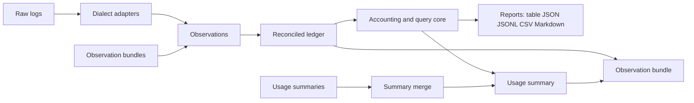

# Architecture: urollup Data Contracts

## Overview

urollup reads Claude Code, Codex and Pi session logs and produces token, cost and usage
rollups through a CLI and a local read-only web UI. The
[urollup plan](../specs/active/plan-2026-09-13-urollup-cli-and-web.md) is the entry
point: it covers goals, workflows, the CLI surface, the web UI, phases and testing.
This document holds the detailed data contracts the plan summarizes:

- source snapshots and the normalized ledger that adapters write and every report reads
- analytical identities, which let observations from different machines and exports
  merge without double counting
- accounting measures, ownership rules and the price table
- the usage summary format and its exact aggregation rules
- the observation bundle container
- contract authoring in softschema and validation in Rust

The [portable research brief](../research/research-2026-09-13-portable-agent-usage.md)
gives the public-source evidence behind these choices, including the
[log dialect survey](../research/research-2026-09-13-portable-agent-usage.md#log-dialects-and-session-linkage)
and the
[portable result merging](../research/research-2026-09-13-portable-agent-usage.md#portable-result-merging)
rationale. Terms such as observation, extent and unresolved are defined in the plan’s
[glossary](../specs/active/plan-2026-09-13-urollup-cli-and-web.md#glossary).

## Goals and Non-Goals

### Goals

- Source data is captured as close to its original form as possible, accurately and with
  evidence: native field names and values are kept beside normalized fields, and records
  no current report uses are kept rather than dropped, so later analyses never depend on
  an earlier parsing decision.
- Every logical request counts once, whatever the order or number of files, exports and
  merges it arrives through.
- Uncertainty stays visible: ambiguous ownership, unresolved overlap, unpriced tokens
  and unknown measures appear as explicit values, never as zero or as a guess.
- One summary shape describes a single session or any aggregate, and merging summaries
  is exact whenever the rules below allow, with observation bundles as the exact
  fallback.
- Contracts are versioned, validated at every read and write, and checkable by
  softschema without the Rust binary.

### Non-Goals

- Prompts, tool arguments and tool result bodies in any portable artifact.
- Provider billing reconciliation; recorded provider charges have a reserved entity but
  no tested source.
- Resource measurements (CPU, memory, I/O, network); the entity is reserved until a
  tested collector exists.
- A JSON or JSONL softschema profile; JSON is an output rendering only.

## System Context



Adapters and bundle readers produce observations with evidence references.
Reconciliation turns them into one ledger of logical entities.
The accounting core computes every report, summary and bundle from that ledger, so the
CLI, the HTTP API and the reporting skill share one set of definitions.
Summaries merge by the [exact aggregation](#exact-aggregation) rules without the ledger;
bundles re-enter reconciliation.

## Design

### Source Snapshots

Every run freezes a **snapshot manifest** recording each source file’s identity, byte
extent, fingerprint and ingestion cutoff, and reads only complete records within that
extent.

- An unfinished last line is recorded as pending, distinct from interior corruption.
- Replacement, truncation or mutation during the scan is detected and reported,
  including a path that is briefly absent while another tool rewrites it.
- A Codex `.jsonl` rollout and its `.jsonl.zst` twin with the same thread and rollout ID
  are one logical source whose representation changed, not two sources.
- Files are not snapshotted atomically together, so reports state each source’s cutoff
  and the skew across files.
- An oversized record is streamed where the adapter supports it; otherwise it is a
  coverage failure, never silently skipped.
- Decoding is lenient where records allow it: a line prefilter is only a hint, a record
  is never rejected because a nested field is null, timestamps accept any RFC 3339
  fractional precision, and every malformed, skipped or unparsable line is counted per
  source.
- Symlinks are followed only within declared roots, and links that leave them are
  reported as skipped.
- Evidence references are a source ID, byte offset and length inside the manifest.

### Capture Layers and Re-extraction

urollup captures data in layers so any later feature can rerun extraction from the most
processed layer that still holds what it needs.
Claude Code deletes transcripts after 30 days by default, so captured layers are often
the only lasting record.

| Layer | Holds | Rerun from this layer when |
| --- | --- | --- |
| 0. Original logs | Every record, including prompts and tool output | A feature needs content itself, while the logs still exist |
| 1. Captured records | Usage-relevant source records, verbatim except for stripped content | Parsing, normalization or reconciliation logic changes |
| 2. Normalized tables | Threads, relationships, requests, tool actions, provider limit observations and diagnostics, with native fields | Pricing, grouping, ownership or report logic changes |
| 3. Usage summaries | Extents and derived totals | A report needs only totals within the summary’s policy |

- **Captured records** keep every record that carries usage, identity, model, effort,
  timing, turn lifecycle, subagent or fork linkage, tool call structure and outcome, or
  provider limits. Lifecycle records include Claude `system` `compact_boundary` and
  `stop_hook_summary` records and `queue-operation` records, and Codex `task_started`,
  `task_complete` and timed `item_completed` events.
  Claude `progress` records that nest a subagent’s assistant message carry usage and are
  kept. Records with none of these, such as streaming display events, are counted in the
  manifest but not kept.
- **Stripping** follows a versioned, per-dialect strip policy.
  Keys, types, IDs, timestamps, models, usage objects, stop reasons, tool names, working
  directories and version fields stay verbatim.
  Prompt and response text, reasoning text, tool arguments, tool results, hook output,
  attachments, images, file snapshots and injected context are replaced by a stub
  recording the field’s byte length and a keyed HMAC-SHA-256 digest, so content size and
  repetition stay measurable without the content.
  Payloads that embed other messages, such as Pi `toolResult.details` and compaction
  `retainedTail`, are stubbed while the `usage` objects inside them stay verbatim as
  evidence.
- **Re-extraction:** adapters read a bundle’s captured records exactly as they read
  original logs, and each captured record keeps its original source ID, offset,
  fingerprint and dialect version.
  A later adapter or strip-policy version applies to old bundles without the logs;
  anything the strip policy removed needs layer 0.
- **Records the plan does not yet report** are still captured and normalized when their
  dialect fields are known, so features like account budgets need no new capture.

### Capture Store and Cache

Captured records are kept in a durable local **capture store**, on by default.
It preserves re-extractable usage data after agents delete their logs, and in Phase 2 it
also serves as a **capture cache** so a large log is parsed once.
A spike on 19.5 GB of real logs measured the store at about 1.7% of log size, and
uncached extraction fast enough that the cache read path can wait for Phase 2; see the
[portable research brief](../research/research-2026-09-13-portable-agent-usage.md).

- **Location:** the platform data directory, not a purgeable cache directory:
  `$XDG_DATA_HOME/urollup/captured` or `~/.local/share/urollup/captured` on Linux,
  `~/Library/Application Support/urollup/captured` on macOS, and
  `%LOCALAPPDATA%\urollup\captured` on Windows, overridden by `UROLLUP_CAPTURE_DIR`.
  Directories and files are owner-only, because captured records still hold paths and
  IDs.
- **Entries:** one entry per logical source, keyed by its `src-` ID, holding a manifest
  and zstd-compressed JSONL segments of captured records.
  The manifest records the dialect, adapter and strip-policy versions, the captured byte
  extent, the source fingerprint, the digest of the first complete record, and the
  digest of the captured extent’s final 64 KiB.
- **Phase 1 writes:** every run that reads a source captures it when the store has no
  current entry for it, or when its size, fingerprint or versions changed, by writing a
  complete replacement entry.
  An unfinished last line stays pending and is never captured.
- **Retention:** entries outlive their sources.
  When a source log is gone, runs read its captured records instead and report the
  source as `retained` with its capture time.
  When a prefix check shows a source was replaced, truncated or rewritten in place (such
  as a Codex rollout migration), the previous entry is kept as a retained version beside
  the new one, and reconciliation deduplicates their shared observations by analytical
  ID, so a rewrite that drops records never silently drops usage.
- **Phase 2 cache reads:** when versions match and the source still starts with the
  captured prefix, a run reads captured records for the captured extent and parses only
  complete records past it, appending them as a new segment.
  The default prefix check compares file identity, size and the two recorded digests;
  `--verify-cache` hashes the whole captured extent, which also catches a same-size
  mutation that leaves both digests unchanged.
- **Idempotence:** capturing the same bytes yields identical records, entries are keyed
  by source and extent, and reconciliation deduplicates by analytical ID, so repeating a
  run never adds usage.
- **Controls:** `--no-capture` neither writes nor reads the store for a run.
  In Phase 2, `--no-cache` reads original logs instead of cached records while still
  updating the store, and `--rebuild-cache` regenerates the selected sources’ entries
  from their logs. `urollup capture status` reports entries, sizes, versions and retained
  sources, and `urollup capture prune` removes entries by age, version or retained
  status.
- **Atomic writes** follow tbd `filesystem-rules` and `rust-filesystem-rules`:
  - segments and manifests are staged as owner-only `NamedTempFile`s with unique names
    in the entry directory;
  - each segment is fsynced and its digest verified before it is published with
    `persist_noclobber`;
  - the entry directory is fsynced, and the manifest is replaced last with `persist`,
    only if the manifest version the writer started from is still current;
  - an OS advisory lock per entry serializes writers, so a crash or a concurrent run
    leaves the previous consistent entry and readers never see a partial segment.
- **Equivalence:** runs with the store disabled, with retained sources, with cached
  reads and after a rebuild produce identical ledgers and reports for the same snapshot
  and policy, and CI runs the golden suite in each mode.

The capture store holds layer 1 only.
The later ledger and query cache stores layers 2 and 3 behind the same versioned keys.

### Normalized Ledger

#### Entities

| Entity | Fields and ownership |
| --- | --- |
| Source artifact | Original identity, fingerprint, dialect and dialect version, offsets, snapshot extent, capability and coverage status |
| Thread | Native thread key; source, initiator, purpose, execution environment, project and account as independent properties |
| Relationship | Spawn, fork, resume, review or other native edge, with evidence and confidence; not every relationship transfers usage ownership |
| Request/response | Native request and response IDs, ownership status with owning or candidate threads, timestamps, model with its basis (`served` when the response records it, `requested` when only the request does) and effort when observed, usage revision and its status |
| Tool action | Call ID, tool name, nested command structure, result reference, outcome, a tool interval from call to result (which includes scheduling and permission waits, so it is never called latency or execution time), bytes and characters; linked to a request only when proven |
| Provider limit observation | A usage-limit record as the source wrote it: native limit name (Codex `rate_limits` `limit_id` with its `primary` or `secondary` window, Claude `quotaLimits` or `claude-stream` `rate_limit_event` `rateLimitType`), window length when recorded, reset time, utilization with its native unit or status, plan, credit and overage fields, observation time with its basis, owning thread or request when proven, and evidence; native field names and values are kept verbatim |
| Provider charge | Cost or receipt recorded by a tested source, with currency, period or request link, account and evidence; never derived from list prices |
| Resource observation | Reserved, with no current source: CPU seconds, RSS, I/O or network, each with unit, scope, interval, collector and evidence |
| Annotation | Labels or review findings with target IDs, author, method and version, kept separate from measured facts |

Every value records whether it was observed, configured, inferred or unknown.
Model and effort belong to requests; a session’s model or effort label is a summary of
its requests.
Reasoning token counts and visible reasoning summaries are recorded fields,
not access to hidden reasoning.
Codex rollouts save only the requested model (`turn_context.model`), never the model a
server reroute served, so Codex request models are `requested`. Placeholder model names,
such as Codex `codex-auto-review` and Claude `<synthetic>`, stay as observed.

Provider limit observations need dialect care:

- Codex writes one latest snapshot per `limit_id` and repeats it in every `token_count`
  event, so identical consecutive snapshots are one observation.
  Carried-forward `plan_type`, `credits`, `individual_limit` and `spend_control_reached`
  values may be stale, and when a response reports several `limit_id` buckets only the
  last reaches the rollout.
- `claude-stream` `rate_limit_event` records hold `status`, `rateLimitType`, `resetsAt`
  in epoch seconds and overage fields, and carry no timestamp, so their observation time
  is not recorded.
- Utilization units differ by source (Codex `used_percent` is a percent, and a
  `claude-stream` `utilization`, when present, is a fraction), so values keep their
  native unit.

A source-reported cost, such as `total_cost_usd` in `claude-stream` output or the `cost`
breakdown Pi computes, is a source estimate, not a provider charge.
Pi computes `cost` from the installed model catalog, so zero can mean unpriced: a zero
source-reported cost on nonzero tokens gets a diagnostic, and a source estimate never
stands in for a list-price estimate.
No supported dialect records an actual charge, so no provider charge import is planned
until a tested receipt or billing export exists.

Agent logs do not record CPU, memory, I/O or network use.
Resource measures report unknown, never zero, until a tested collector adapter fills the
reserved resource observation entity.

#### Relationships

The discovery index and reconciliation produce these relationship edges, described in
the plan’s
[session selection](../specs/active/plan-2026-09-13-urollup-cli-and-web.md#workflows-and-session-selection):

- **Spawn:** a Claude subagent file under its parent session (including
  `subagents/workflows/`), attached to the spawning tool call through `toolUseId`, which
  can lie in another subagent; a `claude-stream` subagent message delivered inline in
  the parent stream and attached by `parent_tool_use_id`; or a Codex rollout’s
  `parent_thread_id` with its `thread_spawn`, `review`, `compact` or other subagent
  source, including `guardian_review` threads.
- **Fork:** Codex `forked_from_id`; Pi `parentSession` (legacy `branchedFrom`), resolved
  by file basename because the stored path is absolute; and Claude sessions whose copied
  entries carry another session’s `sessionId`, found during reconciliation.
  Pi files that share a header `id` without a parent field are export and import copies
  of one session, not forks.
- **Inline sidechain:** older Claude transcripts with `isSidechain` turns and no spawn
  ID become child threads with fallback identities.

Spawn edges define `descendants` scope; fork edges never do, because copied history is
deduplicated rather than owned twice.

#### Reconciliation

Adapters emit observations; reconciliation merges them into logical entities before any
aggregation:

- Repeated content blocks of one response, streamed usage updates and copied histories
  collapse into one logical request.
  Each later usage update is a new **usage revision** of that request, and the ledger
  keeps the final one with every record as evidence, or, where a dialect cannot order
  its revisions, the one its selection rule picks.
- One response repeated in several files is one logical observation with several
  evidence references.
  Forked or resumed history is not newly consumed usage.
- Cumulative counters become deltas only within a verified counter epoch; resets and
  gaps produce diagnostics.
- Failed and retried requests consume the usage they report, even without a useful
  answer.
- Proven native ownership wins.
  Ambiguous candidates are preserved rather than fabricating a unique API-call count.
- Conflicting observations keep diagnostics and follow a documented, source-specific
  resolution rule, never first-wins traversal order.
  Conflicting account attributions for one request are diagnosed, not split.
- A copy nested inside another record never counts, and usage that never reaches local
  logs, such as Codex `--ephemeral` threads, parallel guardian reviews and legacy remote
  compaction, is an unobserved coverage gap, never zero.

#### Dialect Reconciliation Rules

The source reviews summarized in the
[portable research brief](../research/research-2026-09-13-portable-agent-usage.md) set
these source-specific rules:

- **Claude Code block records:** block records of one response can disagree on
  `output_tokens`, so reconciliation selects one whole record (largest `output_tokens`,
  then last in file order, then lowest `src-` ID), adds a diagnostic when input or cache
  fields differ, and never merges fields.
- **Claude Code copies:** a record that replays a parent message is a copy owned by the
  parent, not an ambiguous key: a `progress` record nesting a subagent’s assistant
  message, a `/btw` side-question record with the parent’s `message.id` under a new
  `requestId`, and a fork-style subagent record with a parent record’s `uuid`.
- **`claude-stream`:** a capture and its transcript share `session_id` and `message.id`,
  so their requests merge by response ID.
- **Codex requests:** from `rust-v0.153.0`, each `token_usage_record` is one response,
  keyed by `response_id` and owned by its `thread_id`; responses without usage write
  none. A record whose `thread_id` differs from the file’s thread is a copy, and
  `compacted.latest_token_usage_record` is never an observation.
- **Codex counters:** older files use cumulative `token_count` events.
  A `last_token_usage` counts only when the running total advances and it has nonzero
  input or output. Identical consecutive totals add nothing, `info: null` is only a
  provider limit observation, compaction estimates and context-window-full fills (zero
  input and output with nonzero `total_tokens`) are estimate diagnostics, and a decrease
  in any cumulative component opens a new counter epoch with a diagnostic.
- **Codex copied history:** a child rollout’s own records start at
  `subagent_history_start_ordinal`, else at the first `thread_settings_applied` naming
  the child (0.152 and later).
  Otherwise it is inferred, in order, from turn IDs also present in the parent rollout,
  the last foreign `session_meta` record, and turns without their own `turn_context`,
  and the excluded usage is labeled `inferred` with a diagnostic.
  A fork or subagent continues the parent’s running total, so the child’s counters start
  from the inherited total.
  Legacy destinations also copy the parent’s records, including `token_count` events
  (and, for user forks, `token_usage_record` lines), with new write-time timestamps, so
  copied lines contribute neither usage nor times to the child; paginated forks copy
  nothing and reference the parent’s file.
- **`codex-exec`:** `turn.completed.usage` is the thread’s cumulative total: after
  `codex exec resume` it includes earlier runs, it has no `total_tokens`, it excludes
  subagents, and failed or interrupted turns report none.
  A capture whose `thread.started.thread_id` equals a discovered rollout’s
  `session_meta.id` is a check on that rollout, which owns the usage.
  Without the rollout, turn usage is the difference between consecutive totals for the
  thread, and a first total that may include earlier runs gets a diagnostic.
- **Pi:** requests key on provider and `responseId`, else on the lineage root and a
  digest of copy-invariant fields, never on a bare entry ID. Copied history in fork,
  clone and export files belongs to the parent.
  Usage nested in compaction `retainedTail`, extension `details`, and `pi-events`
  `turn_end`, `agent_end` and `compaction_end` records never counts, and in `pi-events`
  only `message_end` is final.

#### Purpose and Annotations

Purpose values record their basis; core accounting never infers them.

- **Phase 1:** `observed` purpose comes only from native fields, such as a recorded
  subagent type or a review or compaction mode.
  A request inherits its thread’s purpose unless it records its own.
- **Phase 2:** `configured` purpose comes from declared, versioned rules in the source
  manifest or query file that match recorded properties such as project, initiator or
  model. Observed values take precedence, and a disagreeing rule produces a diagnostic.

`--group-by purpose` uses only observed and configured values; all other requests form
the null group. Annotations, including downstream semantic or LLM review, never set
purpose. A query groups by an imported annotation set only when `--annotation-set` names
it, and results cite the set’s author, method and version.

### Analytical Identities

#### ID Derivation

An analytical ID derives deterministically from recorded keys, so an observation
receives the same ID on every machine and in every merge order.

- **Form:** `<prefix>-v<version>-<digest>`, such as `req-v1-` followed by 26 characters.
- **Digest:** the first 128 bits of SHA-256 over the RFC 8785 canonical JSON array of
  prefix, identity contract version, key kind and key components, encoded as lowercase
  Crockford base32.
- **Components:** native IDs enter keys verbatim and also remain separate fields.
  Namespace components are registry tokens such as `anthropic` or `codex`; unknown
  components are `null`.
- **Stored keys:** keys are stored with their IDs, so a binary can re-derive IDs under
  another supported identity version.
  Two different keys that produce one ID are an identity-collision error.
- **Fingerprints:** a fingerprint identifies bytes, not necessarily a logical session.

| Prefix | Key, in precedence order |
| --- | --- |
| `src-` | Source environment, dialect, locator, and a digest of the first complete record, so appends keep the ID; the locator is root-relative unless the dialect declares a stable one, such as a Codex rollout’s thread and rollout IDs, which survive archiving and compression |
| `thr-` | Agent namespace and native thread key, such as session ID plus subagent ID; else a digest of the thread’s first complete record |
| `req-` | Provider namespace and response ID; else provider request ID; else a native record ID or sequence number within its declared scope; else the containing `thr-` ID (the lineage root’s, for dialects whose copies lack response IDs, such as Pi) and a digest of adapter-declared revision-invariant fields |
| `act-` | Provider namespace and native tool call ID; else the owning `req-` ID and the call’s position in that response |
| `rpt-` | Report schema, normalized `QuerySpec`, snapshot identity, and adapter, reconciliation and pricing versions; never run time, host or duration |

Relationships are keyed by kind and endpoint IDs; annotations by target ID, author,
method and version.

#### Key Scope

Each adapter declares the uniqueness scope of every native ID kind, and a key includes
only that scope’s namespace components.

- Provider-issued IDs are scoped to the issuing provider, not to host, source
  environment or account, so copies of one request merge wherever they were collected.
- Account enters a key only for ID kinds unique within an account, and then as the
  stable account identifier from the source manifest, never a display alias.
- Fallback keys never use byte offsets or file-relative ordinals, which shift between
  partial exports.
- Some native IDs are unique only within a file or lineage: Pi entry IDs are 8 hex
  characters checked for collisions within one file, and a Pi session ID can repeat
  across files (a custom `--session-id`, or an export and import), so neither is a key
  on its own.

#### Identity Basis and Linking

Thread, request and action IDs record their **identity basis**:

- `native` when a native ID and every required namespace component are present
- `fallback` when a declared fallback key applies
- `ambiguous` otherwise

A key is also ambiguous when observations sharing it disagree on revision-invariant
fields, as when a gateway reuses message IDs across sessions, or when records sharing a
fallback key cannot be shown to be revisions of one request.
Either case yields a diagnostic, not a merge.
An ambiguous observation gets an artifact-local ID from its `src-` ID and record offset,
so only a re-read of the same record merges by ID; other matches become candidates.

Observations are linked by a shared native key or by **lineage** evidence, such as a
fork edge over copied history.
A linked set takes the ID from its highest-precedence key, then the lowest ID, and keeps
the other IDs as aliases, so the result depends on the set rather than on merge order.

#### Identities and Redaction

Analytical IDs are truncated digests and contain no literal names or paths.
Every key that includes a name or path also includes a high-entropy component, a native
ID or a record digest, so an ID cannot confirm a guessed path or project name.
A root-relative `src-` locator can include Claude Code and Pi project directory names,
which encode the working directory, so every locator is treated as a path.

Bundle tables carry the identity key of every row.
Summaries carry the key of each extent’s thread, but their request indexes hold IDs
only, which keeps them compact.
Both store keys in redacted form.
IDs are derived before redaction, and redaction replaces each removed key component with
the same keyed label it uses elsewhere, so redacted keys stay deterministic and
groupable. A redacted component cannot be recovered, so an ID whose key contains one
keeps its stored value and cannot be re-derived under another identity version:

| Redaction profile | Removes | IDs that cannot be re-derived |
| --- | --- | --- |
| `paths` (default) | Absolute paths, working directories and `src-` locators | `src-`, and artifact-local IDs built from it |
| `names` | Also project names, account names and account identifiers | Also any ID whose key includes an account identifier |
| `native-ids` | Also native IDs | All IDs |

Merging inputs at different identity versions requires re-derivation, so it is a
compatibility error when a needed key component is redacted.
[Redaction](#redaction) defines the labels and key handling.

### Accounting Measures

#### Measure Contracts

| Measure | Contract |
| --- | --- |
| Tokens | Separate inclusive input, uncached input, cache reads, cache writes, output, the reasoning subset of output, and provider-only categories; native semantics preserved |
| Calls | Separate observed provider requests, responses, assistant messages, synthetic events, tools, nested executions and retries |
| Money | Separate dated list-price estimate, source-reported cost estimate, recorded provider charge, configured subscription allocation, and optional local-compute estimate; exact decimal arithmetic; every amount carries a currency, and amounts in different currencies are never summed or converted |
| Pricing coverage | Priced, default-assumed and unpriced tokens and requests, each with reasons, plus the pricing basis; unknown is never free |
| Time | Session span, sum of request durations, interval-union busy time, explicit waiting, and critical path only when dependencies and timing establish it |
| Resources | Additive counters summed only over compatible scopes; memory peaks never summed; absent CPU, RSS and I/O stay unknown |
| Request sizes | Count, sum, mean, p50, p90, p95, p99, maximum, histograms and largest requests for each token category |
| Context contribution | Exact source measurements when available; estimated tokenization and byte sizes labeled separately; repeated-context indicators are not proof of waste |

Counting rules that adapters must normalize explicitly:

- Reasoning output is often a subset of output; total tokens never add both.
- Cache-read input may be included within a dialect’s native input or reported
  separately, as the research brief’s
  [usage table](../research/research-2026-09-13-portable-agent-usage.md#log-dialects-and-session-linkage)
  shows per dialect.
- When a Claude Code record has `iterations`, its top-level `message.usage` equals the
  sum of the `message` iterations and excludes `advisor_message` iterations, which
  record their own model; an advisor iteration is further model usage within the same
  request, priced at its own model’s rate.
- Claude Code’s `cache_creation` breakdown separates 5-minute and 1-hour cache writes;
  when it disagrees with `cache_creation_input_tokens`, both native values are kept with
  a diagnostic.
- A recorded total, such as Codex `total_tokens` (sometimes 0) or Pi `totalTokens`
  (provider-reported for some APIs), is recomputed from its components, and a mismatch
  is a diagnostic, never usage.
- One usage carrier can stand for zero, one or several requests: a Pi compaction entry
  can combine two summary calls and a Pi tool result’s usage is opaque, so their call
  counts are unknown rather than 1, and they record no model.
- Arithmetic on token counters is checked, and money uses exact decimals.
- Source or provider totals, such as a stream’s final `result` usage, are reconciliation
  checks, not additional rows.
  In `claude-stream`, top-level `result` usage covers the main model while `modelUsage`
  covers every model, and `total_cost_usd` is cumulative across several `result` records
  in one session.

#### Ownership and Totals

Every logical request has an **ownership status**:

- **owned:** one thread is proven to own it
- **ambiguous:** several candidate threads may own it, as when a response ID appears in
  two threads with no recorded fork or resume edge
- **unknown:** no owner evidence exists

Default totals count each logical request once, whatever its status, so grand totals
never depend on ownership resolution.
When results group by a property that differs among an ambiguous request’s candidates,
such as thread or project, the request takes the value all candidates share or else an
explicit `ambiguous` group.
Unknown values take the null group, so group rows still sum to the total.

Observations that may be one request but share no key form a **candidate set**. Totals
count the member with the strongest identity basis, then the lowest ID, and report the
other members as **unresolved** usage, which is never added to totals.

Scope selection follows the same principle:

- `--scope self` selects the chosen threads; `--scope descendants` adds their spawned
  subagent threads transitively, never fork edges.
  The selected union is deduplicated.
  The plan’s
  [session selection](../specs/active/plan-2026-09-13-urollup-cli-and-web.md#workflows-and-session-selection)
  sets `descendants` as the default for session selections and `self` for filter
  selections.
- A selection counts its owned requests and the ambiguous requests whose candidates all
  lie inside it.
- Ambiguous requests with only some candidates inside the selection form a separate
  **possible** measure, which is never added.
- A session’s own usage and its descendants’ usage are reported separately.
  Descendant totals and overlapping tags are non-additive and labeled so.

JSON request rows carry `ownership`, `owner_thread` and `owner_candidates`. Aggregate
rows carry request counts and token sums by ownership status, plus `unresolved` and
`possible` sums, which reports show with coverage.
`--strict` exits 3 when any unresolved request or extent exists.

#### Time, Grouping and Percentiles

- Timestamps are stored in UTC. Time filters use half-open intervals in a declared
  timezone.
- Token usage is attributed by a declared response-timestamp policy with a documented
  fallback; duration intervals are clipped to report windows.
- Calendar buckets are hours, days, weeks and months in the declared timezone, which
  defaults to the system timezone and is always recorded in the normalized query.
  Weeks start on Monday unless `--week-start` names another day.
- Rolling windows have a declared length and anchor, never a start taken from activity.
- Groups include time bucket, agent and dialect, account, project, session or thread,
  model, effort, purpose, tool category, and any independent thread property.
  Null is an explicit group.
- Percentiles are recomputed from observations or from mergeable histograms, never
  averaged across groups.
  Query reports compute exact percentiles under a memory limit and fail with a capacity
  diagnostic (exit 1) when it is exceeded.
  Approximate percentiles require recorded method and error metadata.

#### Price Table

Phase 1 list-price estimates use a reviewed, versioned price table compiled into the
binary. Maintainers transcribe rates from provider pricing pages, such as
[Anthropic pricing](https://platform.claude.com/docs/en/about-claude/pricing), and
record each source URL and retrieval date.

Public datasets are cross-checks, not the authority.
ccusage 20.0.20 embeds pinned snapshots of LiteLLM’s
[model price file](https://github.com/BerriAI/litellm/blob/1a183efaa1a2108aed7e1bed8d445d93bd1aa60d/model_prices_and_context_window.json)
and
[models.dev](https://github.com/anomalyco/models.dev/tree/bff41227803631c84903fcf7f486370e9fbcde86)
data, and refreshes LiteLLM prices over the network unless run offline
([pricing.rs](https://github.com/ccusage/ccusage/blob/bd7f89b469aee5635fb2e6722dd6d70f2d113ac1/rust/crates/ccusage-core/src/pricing.rs)).
Both datasets are MIT-licensed (LiteLLM outside its `enterprise/` directory), but they
hold current floating-point rates without effective dates, and models.dev has one
cache-write rate per model, so neither can reprice historical usage on its own.
A maintainer-run script may diff the table against pinned dataset snapshots to flag new
models and changed rates for review.

Table structure:

- **Table header:** schema version, table version, review date and sources.
- **Rate row:** provider; billing channel, initially the first-party API; exact model
  IDs and listed aliases; inclusive `effective_from` and optional exclusive
  `effective_until` UTC timestamps; service tier or speed; an optional input-token
  threshold for a long-context band; currency; and decimal per-million-token rates for
  uncached input, cache reads, 5-minute cache writes, 1-hour cache writes and output.
- **Modifier row:** a dated multiplier that stacks across rates, such as US-only
  inference geography.
- **Validation:** overlapping effective ranges for one match key, and any rate that is
  not an exact decimal string, are rejected.

Matching and coverage:

- A request uses the rate in effect at its timestamp, matched on model, service tier,
  context band and cache-write duration.
- A context band applies to the whole request when its inclusive input (uncached input,
  cache reads and cache writes) exceeds the band’s threshold, and the highest matching
  threshold wins.
- Models match exactly or through listed aliases, never by fuzzy prefix.
  Codex requests match their `requested` model, and placeholder names such as
  `codex-auto-review` stay unpriced.
- Reasoning tokens are priced within output, never twice.
- When a dialect does not record a dimension, pricing applies the provider’s documented
  default, such as standard tier or 5-minute cache writes, and reports those tokens as
  default-assumed. An observed but unrecognized value leaves them unpriced, and so does a
  matched row with no rate for a token category.
- Codex records service tier only in `thread_settings_applied` events, which short
  rollouts can lack; pricing never takes a tier from an agent’s configuration files.

Updates and overrides:

- Pricing never makes network requests.
- Bundled rates change only through a reviewed table update with golden repricing tests,
  shipped in a release.
- Users add or correct rates with local price files in the same schema, passed with the
  repeatable `--prices` option or set in configuration.
  Override rows take precedence over bundled rows for the dates they cover, and amounts
  they price are labeled configured rates, not list prices.
- Reports record the pricing basis: bundled table version and review date, plus each
  override file’s fingerprint.
- A staleness diagnostic appears when a report window ends more than 90 days after the
  table review date, because that release cannot know later price changes.

#### Accounts and Plans (Later)

Account-level analysis on personal and team plans builds on data captured from the start
and needs no new capture:

- The ledger keeps stable account identifiers when a source records them, and every
  provider limit observation, so usage can later roll up per account and per recorded
  window.
- A later configured **account registry** maps each account identifier to dated plan
  terms: plan name, subscription price and currency, effective dates, and any window or
  budget limits. Dates matter because accounts change plans.
- With the registry, reports can show list-price estimates beside subscription
  allocations for the same tokens, and usage against configured budgets or windows.
  The Money measure already keeps these amounts separate and never mixes them.

### Usage Summary Format

A **usage summary** is a pure-YAML softschema artifact, contract
`urollup:UsageSummary/v1`, with the same shape for one session or any aggregate of
sessions.

A summary is a list of **session extents** plus totals derived from them.
An extent summarizes the requests of one owner thread covered by one export.
Requests with ambiguous or unknown ownership form extents with a null thread and their
candidate set. A session summary holds one extent per thread, and an aggregate keeps
every extent it merged unless another extent covers it.
Writers recompute totals and derived statistics from extents; merge never reads them as
inputs.

| Field | Content |
| --- | --- |
| `softschema` | `contract` and `status: enforced`; standalone summaries omit `schema`, and a summary inside a bundle points `schema` at the bundle’s `schemas/` copy |
| `revision` | Contract revision within the major version (see [Versioning](#versioning-and-compatibility)) |
| `policy` | Identity and reconciliation versions, bucket width, histogram scheme and top-N size; inputs to a merge must agree on all of them |
| `redaction` | Profile and key fingerprint, never the key |
| `exports` | `rpt-` IDs of the exports the summary covers |
| `sessions[]` | Extents: `thread`, its redacted `key`, `parent`, `ownership`, `candidates`, `status` (`counted` or `unresolved`), `extent`, `properties`, `usage`, `sizes`, `tools`, `busy` and `top` |
| `extent` | Request count, digest of sorted request IDs with usage revisions, optional request `index`, `nonfinal` usage revisions that may still change, and first and last timestamps |
| `usage[]` | Additive counters per 15-minute UTC bucket and per price-matching dimension: model, effort, service tier and cache-write duration |
| `totals` | Derived: scope, requests and tokens by ownership, `unresolved` requests and extents, `possible` sums, list-price estimate with pricing basis and coverage, snapshot cutoff |
| `extensions` | Open map for measures not yet in the contract, carried per extent and never totaled |

Design rules:

- Usage rows use 15-minute UTC buckets, so reports can regroup them into days for every
  current UTC offset.
- Rows carry every dimension the price table matches on, so merge recomputes money under
  one pricing basis rather than adding amounts.
  A rate boundary inside a bucket is a pricing-coverage diagnostic.
- The request index costs roughly 40 bytes per request and is on by default, so
  re-exported and time-windowed summaries merge exactly.
  `--no-index` omits it for summaries that only need to merge with other sessions.
- A Markdown session report may use softschema’s `frontmatter-md` profile with the same
  payload, while large aggregates stay pure YAML, following softschema’s
  [inline-small, companion-large](https://github.com/jlevy/softschema/blob/v0.8.1/docs/softschema-guide.md#playbook-inline-frontmatter-vs-companion-data)
  guidance.
- A JSON rendering serializes the same Rust types with the same field names and
  validates against the same schema, but it is neither a softschema artifact nor a merge
  input.

#### Example: Current-Session Summary

This excerpt matches the rendered
[example report](../specs/active/plan-2026-09-13-urollup-cli-and-web.md#example-report-output)
in the plan. All IDs, names and values are synthetic, and `...` marks elisions.

```yaml
softschema:
  contract: urollup:UsageSummary/v1
  status: enforced
revision: 1
policy: {identity: 1, reconciliation: 1, bucket_minutes: 15, histogram: log2-8, top: 10}
redaction: {profile: paths, key_fingerprint: hmac-sha256-0000...}
exports: [rpt-v1-aaaa...]
sessions:
  - thread: thr-v1-p000...                 # the current session
    key: [claude, "00000000-0000-4000-8000-000000000001"]
    parent: null
    ownership: owned
    status: counted
    extent:
      requests: 148
      digest: sha256-1111...               # sorted request IDs with usage revisions
      index: [req-v1-k91x..., req-v1-0bfa..., ...]
      nonfinal: {}
      first_at: "2026-09-12T14:03:11Z"
      last_at: "2026-09-12T16:40:02Z"
    properties: {agent: claude, dialect: claude-project, project: example, account: null}
    usage:
      - {bucket: "2026-09-12T14:00:00Z", model: example-model, effort: high,
         tier: standard, cache_write: 5m, requests: 12, uncached_input: 1200,
         cache_read: 88100, cache_write_tokens: 2400, output: 4100, reasoning: 1300}
      # ...one row per bucket and price dimension
    sizes: {input_tokens: {count: 148, sum: 6402000, min: 1830, max: 176900,
            hist: [[86, 1], ..., [139, 2]]}}  # [bucket index, count]
    tools: {Bash: 58, Read: 44, Edit: 31}
    busy: [["2026-09-12T14:03:11Z", "2026-09-12T15:10:00Z"], ...]
    top: [{request: req-v1-k91x..., input_tokens: 176900}, ...]
  - thread: thr-v1-s0a0...                 # subagent A; subagent B is similar
    parent: thr-v1-p000...
    ownership: owned
    status: counted
    extent: {requests: 40, digest: sha256-2222..., index: [...], nonfinal: {}, ...}
    # ...
  - thread: null                           # requests with ambiguous ownership
    ownership: ambiguous
    candidates: [thr-v1-p000..., thr-v1-s0a0...]
    status: counted
    extent: {requests: 2, digest: sha256-4444..., index: [...], nonfinal: {}, ...}
    # ...
totals:
  scope: descendants
  requests: {owned: 210, ambiguous: 2, unknown: 0}
  tokens: {uncached_input: 41200, cache_read: 8812000, cache_write: 267200,
           output: 96400, reasoning: 31000}
  unresolved: {requests: 0, extents: 0}
  possible: {requests: 0}
  list_estimate: {currency: USD, amount: "12.34"}
  pricing: {table: example-2026.09, reviewed: "2026-09-01", priced_requests: 208,
            default_assumed_requests: 4, unpriced_requests: 0}
  snapshot_cutoff: "2026-09-12T16:40:02Z"
extensions: {}
```

#### Example: Aggregate Summary

A weekly aggregate merged from 15 summaries covering 14 sessions.
One session was exported twice, from a cloud sandbox and a local copy that both
continued after diverging, so neither extent covers the other and both stay unresolved.

```yaml
softschema:
  contract: urollup:UsageSummary/v1
  status: enforced
revision: 1
policy: {identity: 1, reconciliation: 1, bucket_minutes: 15, histogram: log2-8, top: 10}
redaction: {profile: paths, key_fingerprint: hmac-sha256-0000...}
exports: [rpt-v1-b001..., rpt-v1-b002..., ...]   # 15 exports
sessions:
  - thread: thr-v1-c001...
    ownership: owned
    status: counted
    properties: {agent: codex, dialect: codex-rollout, project: example, account: null}
    # ...extent, usage, sizes, tools, busy and top as above
  # ...more counted extents
  - thread: thr-v1-d009...                 # cloud export of the diverged session
    ownership: owned
    status: unresolved
    extent: {requests: 37, digest: sha256-5555..., index: [...], ...}
  - thread: thr-v1-d009...                 # local copy of the same session
    ownership: owned
    status: unresolved
    extent: {requests: 41, digest: sha256-6666..., index: [...], ...}
totals:
  scope: descendants
  requests: {owned: 3019, ambiguous: 5, unknown: 0}
  tokens: {uncached_input: 2105200, cache_read: 104020000, cache_write: 3625000,
           output: 1214300, reasoning: 402000}
  unresolved: {requests: 0, extents: 2}     # usage stays in the unresolved extents
  possible: {requests: 0}
  list_estimate: {currency: USD, amount: "139.35"}
  pricing: {table: example-2026.09, reviewed: "2026-09-01", priced_requests: 3010,
            default_assumed_requests: 0, unpriced_requests: 14}
extensions: {}
```

### Exact Aggregation

Summary merge decides, for each pair of extents, whether one covers the other, whether
they are disjoint, or neither.

- **Cover:** extent A covers extent B when both have the same thread and either their
  digests are equal, or A’s index contains B’s and no shared request has a newer usage
  revision in B.
- **Disjoint:** two extents are disjoint when their indexes share no request, or, when
  an index is missing, when their threads differ and every request in both is owned.
- **Merge:** collapse identical extents, remove every extent covered by another, and
  count each remaining extent that is disjoint from all the others.
  The rest are unresolved: they stay in the output with `status: unresolved`, their
  usage is reported separately rather than added to totals, and `--strict` exits 3.

The output, including its `exports` provenance, depends only on the set of uncovered
extents. Merge is therefore idempotent, commutative and associative, and merging a
summary into an aggregate that already contains it changes nothing.

Summary merge is exact for:

- different sessions whose extents are indexed or contain only owned requests
- repeated inputs, including an aggregate merged with a summary it already contains
- a later export of a growing session, or copied history in a resumed or forked
  session’s export, when the owner’s larger extent covers it
- one session split into disjoint request sets, such as consecutive half-open time
  windows

Request observations are required when:

- two extents of one session overlap without either covering the other, such as a cloud
  export and a local copy that both continued after diverging, or overlapping windows
- the larger of two nested extents has an older usage revision for a shared request,
  such as a stream finalized after the larger export was taken
- one request appears under different threads because inputs had different ownership
  evidence
- two extents of one thread have different digests and either lacks an index
- inputs use different identity versions, because request indexes hold IDs without keys
- a query needs exact percentiles over the merged requests

Merging bundles for the affected sessions reconciles their observations and writes a
covering extent.

Extents store every measure in a mergeable form:

- Token, request, tool-call and duration counters add across counted extents.
- Request-size statistics keep count, sum, minimum and maximum, which merge exactly, and
  a histogram over fixed log-linear buckets, eight per power of two and each at most
  12.5% wide, which merges by bucket-wise addition.
  Percentiles read from a merged histogram report their bucket bounds.
- Maxima merge by maximum.
  The largest-requests list merges as the top N of the union, which is exact when the
  output keeps the smallest N among its inputs.
- Busy time is the length of the union of stored busy intervals, so concurrent sessions
  are not double-counted.
  Means, distinct counts and spans are recomputed.
- Resource peaks, once a collector exists, merge by maximum only within one resource
  scope.
- `extensions` values are carried per extent and never totaled.

Inputs must agree on bucket width, histogram scheme, and identity and reconciliation
versions; otherwise merge is a compatibility error (exit 2).

### Observation Bundles

An **observation bundle** holds the request-level tables a summary was computed from,
and always contains that summary, so every command that accepts a summary also accepts a
bundle. A bundle is a plain folder named `*.urollup/` whose tables are individual
zstd-compressed JSONL files, so it can be browsed, diffed and read with `zstdcat` and
`jq`; transporting it as one file means archiving the folder, which urollup does not
read directly.

| Entry | Content |
| --- | --- |
| `manifest.yaml` | `urollup:BundleManifest/v1` artifact: contract revision, producer version, identity, reconciliation and pricing versions, redaction profile and key fingerprint, snapshot cutoffs, covered exports, and each table’s record contract, `schema_sha256`, row count, byte size and SHA-256 |
| `summary.yaml` | `urollup:UsageSummary/v1` artifact computed from the tables |
| `schemas/*.schema.yaml` | Compiled schema for every contract used, so the unpacked YAML artifacts validate with `softschema validate` and no flags |
| `tables/*.jsonl.zst` | zstd-compressed JSONL: `records` (layer 1 captured records, omitted with `--no-records`), `sources`, `threads`, `relationships`, `requests`, `limits` and `diagnostics`; `tools`, `provider_charges` and `resources` only when requested and available |

Table contents:

- Every row carries its analytical ID and redacted identity key.
- Request rows also carry ownership, usage revisions, model, effort, timestamps and
  measured token counters, so recipients can reprice and re-derive IDs without reparsing
  raw logs.
- The manifest marks omitted tables and dimensions unavailable, not empty.

Writers are deterministic, and content identity is defined over uncompressed tables:

- Each table holds one UTF-8 JSON object per line, sorted by analytical ID, compressed
  with zstd at a fixed level.
- The manifest records each table’s uncompressed SHA-256, row count and sizes, so two
  bundles with the same content compare equal even when different zstd library versions
  produced different compressed bytes.
- Bundles are published atomically: every file is written into an owner-only staging
  folder beside the destination, fsynced, verified against the manifest, and the folder
  is renamed into place once, never assembled in place and never replacing an existing
  bundle.
- A bundle records no creation time.
- Table values follow the same portable value rules as the YAML artifacts: integers stay
  within ±2^53 and money is an exact decimal string.
- Tables need no completion record, unlike streamed JSONL exports, because the manifest
  records each table’s row count and digest.

Readers open only the files the manifest lists, relative to the bundle folder, and
reject absolute or `..` paths, symbolic links, unlisted table files, missing files, and
sizes or digests that disagree with the manifest, and they bound decompressed size
before reading. A partly copied bundle therefore fails validation rather than reading as
a smaller one.

Observation merge is a set union of logical observations followed by the ledger’s
deterministic revision and ownership reconciliation, never addition of precomputed
totals. It is associative, commutative and idempotent for compatible inputs, and it
preserves conflicts and lineage when later exports correct earlier requests.
Session IDs alone are insufficient: overlapping partial exports need request and
response identities.
`merge --format bundle` requires every input to carry observations; otherwise `merge`
writes a summary.

### Redaction

Summaries and bundles never contain prompts, tool arguments or result bodies.
Redaction never affects deduplication, which uses analytical IDs.

- **`paths` (default):** absolute paths, working directories and `src-` locators become
  keyed HMAC-SHA-256 labels.
- **`names`:** also labels project and account names and account identifiers.
- **`native-ids`:** also drops native ID fields and labels native IDs inside keys.

The same key always yields the same label, so labeled properties still group across
inputs that share a key.
The manifest and summary record the profile and the key fingerprint, never the key.
Grouping by a labeled property across inputs with different key fingerprints is a
compatibility error (exit 2). [Identities and Redaction](#identities-and-redaction)
lists which IDs each profile prevents re-deriving.

### Versioning and Compatibility

- **Contract IDs:** each carries a major version that changes only for breaking changes,
  as the
  [softschema guide](https://github.com/jlevy/softschema/blob/v0.8.1/docs/softschema-guide.md#contract-ids)
  recommends.
- **Revisions:** each summary and manifest records an integer `revision` that increases
  with every additive change within a major version.
- **Readers:** a reader fully supports its known major versions at any revision up to
  its own. A field that an older revision lacks is unknown, never zero.
  A reader may display a newer revision with a diagnostic but refuses to merge or
  re-export it, because it would drop fields it does not know.
- **Compatibility errors:** unknown major versions, identity versions whose IDs cannot
  be re-derived, disagreeing merge policies and mismatched redaction keys exit 2, the
  invalid-request code in the plan’s
  [exit code table](../specs/active/plan-2026-09-13-urollup-cli-and-web.md#cli-and-report-contracts).

| Contract | Artifact | Source model |
| --- | --- | --- |
| `urollup:UsageSummary/v1` | Pure-YAML summary, standalone or in a bundle | `contracts/summary.py` |
| `urollup:BundleManifest/v1` | `manifest.yaml` in a bundle | `contracts/bundle.py` |
| Table record contracts, one per table | JSONL rows in `tables/` | `contracts/tables.py` |

### Contract Authoring and Rust Validation

Pydantic models in `contracts/` are the source of truth for every contract, with valid
and invalid fixtures in `contracts/fixtures/`. They run only through the dev-only root
uv project, which pins softschema 0.8.1; no Python ships in or runs from the binary.

1. `softschema compile` writes each model to `crates/urollup-core/schemas/` as JSON
   Schema Draft 2020-12 serialized as YAML, with `x-softschema.contract` and
   `schema_sha256`
   ([spec](https://github.com/jlevy/softschema/blob/v0.8.1/docs/softschema-spec.md#compiled-schemas)).
2. The committed schemas live inside the core crate so crates.io builds can embed them.
3. The core validates every artifact and table row it reads or writes against them, and
   `urollup schema` prints them.
4. Artifacts declare `status: enforced`, because merge must not drop fields it does not
   know. New measures start in `extensions` and move into the contract in a new revision.

Three softschema properties shape the models and the Rust reader:

- **Payloads are YAML.** softschema defines no JSON artifact profile
  ([guide](https://github.com/jlevy/softschema/blob/v0.8.1/docs/softschema-guide.md#what-softschema-is)).
  urollup’s reader applies the
  [portable value rules](https://github.com/jlevy/softschema/blob/v0.8.1/docs/softschema-spec.md#portable-yaml-values):
  it rejects duplicate keys, anchors, aliases, merge keys, tags, non-string keys and
  integers beyond ±2^53, keeps date-shaped scalars as strings, and limits nesting depth.
  Typical serde YAML deserializers expand aliases without reporting them, so the reader
  checks parser events before building values, and its tests run the portable-value
  cases from softschema’s
  [shared vectors](https://github.com/jlevy/softschema/blob/v0.8.1/tests/vectors/hardening.yaml).
  Money is an exact decimal string, and timestamps carry an explicit `pattern` because
  `format` is only an annotation.
- **Closure must be compiled.** `status: enforced` rejects undeclared properties inside
  softschema’s validator without changing the compiled schema
  ([spec](https://github.com/jlevy/softschema/blob/v0.8.1/docs/softschema-spec.md#status-values)),
  so a generic JSON Schema validator would accept them.
  Every contract object sets `extra="forbid"`, which compiles to
  `additionalProperties: false`, and `extensions` is the only open mapping.
  Models avoid composition and conditional keywords, so both validators apply one
  ordinary schema.
- **Cross-field rules live in Rust.** Pydantic validators are outside the compiled
  schema and its digest, so the Rust core checks that digests match indexes, totals
  match extents, no request is counted in two extents, and rows are sorted.
  `urollup validate` runs these checks along with schema validation.

`make contracts-check` calls a tested script, `scripts/check_contracts.py`, rather than
Makefile shell loops, and CI runs the same target.
An inline `! softschema validate "$f"` passes when uv cannot find softschema or a glob
matches nothing, so the script:

- runs `uv run --frozen softschema compile <model> --contract <id> --out <schema>
  --check` for every contract, including each table record contract
- requires non-empty valid and invalid fixture lists
- requires `softschema validate` to accept every valid fixture and to reject every
  invalid fixture with a validation verdict, treating a tool failure as a gate failure
- runs `uv run --frozen pytest contracts`, which checks table-row fixtures through
  `softschema.validate_values`

A committed stale-schema probe proves the gate fails.
Rust tests require urollup’s verdict to match softschema’s on every fixture, and require
golden summaries and manifests written by urollup to pass `softschema validate` and
`softschema repair --check` unchanged.

## Trade-offs and Alternatives

### Decision: Summary and Bundle as Two Artifacts

**Chosen approach:** one contract family with two artifacts, a compact summary and an
observation bundle that contains it.

**Alternatives considered:**

- One YAML artifact with request tables: observation tables grow with request count and
  suit compressed line-oriented rows, not YAML.
- Bundles only: a summary is the compact output a workflow attaches to a PR, and most
  merges are exact without observations.

**Rationale:** softschema defines YAML artifact profiles but no JSON or JSONL profile,
so tables are validated row by row against their record contracts, while the summary
stays a self-validating softschema artifact.

### Decision: Bundle Folder of zstd Tables

**Chosen approach:** a plain `*.urollup/` folder holding YAML artifacts and individually
zstd-compressed JSONL tables, confirmed 2026-09-14.

**Alternatives considered:**

- Zip archive of the same files: its entries would be stored uncompressed because the
  tables are already zstd-compressed, so it adds a wrapper, zip-writing code and archive
  path checks without saving space.
- zstd tarball: one file, but no random access to the manifest.
- SQLite: requires a database engine and is not byte-deterministic.
- Parquet: adds a columnar stack that JSON Schema cannot check.

**Rationale:** a folder is simpler to write, inspect and diff, needs no archive code,
matches the capture store layout, and keeps atomic publication (staging folder and one
rename) and integrity (manifest digests over uncompressed tables).
When one downloadable file is needed, such as a cloud artifact, the folder is archived
for transport and unpacked before reading; an optional single-file archive layer can be
added on top of the folder later without changing the format.
Browsing tools such as MetaBrowser already open zstd-compressed JSON files directly.

### Decision: Enforced Status with an Extensions Map

**Chosen approach:** `status: enforced` with closed objects and one open `extensions`
map.

**Alternatives considered:**

- `permissive` status: a merge would silently drop undeclared fields it cannot total.

**Rationale:** closure makes unknown fields a validation error, and `extensions` gives
new measures a place to stabilize before they join the contract in a new revision.

## Security Considerations

- **No content:** portable artifacts never contain prompts, tool arguments or result
  bodies, and default redaction labels paths.
- **No reversible IDs:** analytical IDs are digests over keys that include high-entropy
  components, so they cannot confirm a guessed path or name.
- **Hostile input:** YAML readers enforce portable value rules on parser events, and
  bundle readers reject unsafe entry paths, links, duplicates, digest mismatches and
  oversized decompression.
- **Redaction keys:** artifacts record only a key fingerprint.

The web server’s token, host and origin checks and evidence reads are in the plan’s
[Web UI](../specs/active/plan-2026-09-13-urollup-cli-and-web.md#web-ui) section.

## Operational Concerns

- **Validation cost:** every artifact and table row is validated at read and write, so
  the plan’s benchmarks include bundle export and merge.
- **Scaling:** the request index adds roughly 40 bytes per request to a summary.
  Bundles grow with request count and are compressed; exact percentiles over merged
  requests need bundles and a memory budget.

## Open Questions

Proposed decisions for these contracts are collected with the plan’s other decisions in
[Decisions to Confirm and Open Questions](../specs/active/plan-2026-09-13-urollup-cli-and-web.md#decisions-to-confirm-and-open-questions).

- Where does the redaction HMAC key live, and how do machines that must group labeled
  properties together share it?

## References

- [urollup plan](../specs/active/plan-2026-09-13-urollup-cli-and-web.md)
- [Portable research brief](../research/research-2026-09-13-portable-agent-usage.md)
- [Rust CLI engineering baseline](../research/research-2026-09-13-rust-cli-engineering-baseline.md)
- [softschema 0.8.1 specification](https://github.com/jlevy/softschema/blob/v0.8.1/docs/softschema-spec.md)
  and [guide](https://github.com/jlevy/softschema/blob/v0.8.1/docs/softschema-guide.md)
- [RFC 8785: JSON Canonicalization Scheme](https://www.rfc-editor.org/rfc/rfc8785)
- [DDSketch](https://arxiv.org/abs/1908.10693), for mergeable log-bucket histograms

<!-- This document follows common-doc-guidelines.md.
See github.com/jlevy/practical-prose and review guidelines before editing.
-->
