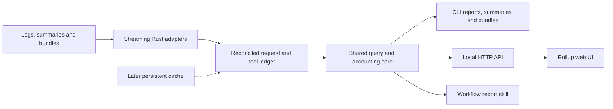

# Feature: urollup, a Rust Agent Usage CLI and Rollup Web UI

## Overview

urollup is a standalone Rust executable that reads Claude Code, Codex and Pi session
logs and produces trustworthy token, cost and usage rollups, request-size analyses and
session reports through a CLI and a local read-only web UI. It covers ccusage’s usage
reports and the agentfdr investigation features that matter for retrospective analysis,
without a live session Board, process steering or agent launcher.
Both interfaces call one accounting and query engine.
The first release computes reports from a snapshot of the logs with no persistent cache;
a later phase adds idempotent incremental caching behind the same contracts.
The product, crate and command are named `urollup`, developed in
[jlevy/urollup](https://github.com/jlevy/urollup).

The
[portable research brief](../../research/research-2026-09-13-portable-agent-usage.md)
owns public-source comparisons, dialect evidence and the case for mergeable results.
The
[Rust CLI engineering baseline](../../research/research-2026-09-13-rust-cli-engineering-baseline.md)
justifies the project conventions, and the
[data contracts architecture doc](../../architecture/arch-2026-09-13-urollup-data-contracts.md)
holds the contracts this plan summarizes.
None of these documents contains private session data.

## Goals

- Fast local analysis of Claude Code and Codex logs, in both persistent and
  captured-stream dialects, behind an extensible adapter interface, with Pi support
  following the first validated slice.
- A zero-argument summary of the current Claude Code or Codex session, explicit
  multi-session selection, disk-wide discovery, and parent-to-subagent session trees.
- Daily, weekly, monthly, session, project, account, model and effort reports covering
  ccusage’s calendar and session views, plus usage by provider-recorded usage window,
  with token and cache breakdowns, price estimates and machine-readable exports.
- Request-level sizes, distributions, tool activity, model and effort attribution, and
  source-linked evidence that explain aggregate numbers.
- One set of filters, accounting definitions and report contracts for agents, humans,
  workflows and the browser.
- Explicit coverage and unknown values for unsupported events, missing prices, ambiguous
  ownership, incomplete logs and absent resource measurements.
- Compact Markdown reports and mergeable YAML usage summaries that a workflow can attach
  to a PR.

## Non-Goals

- Board views, process status registries, tmux integration, approve and deny controls,
  agent launchers, or changes to an agent’s configuration.
- An LLM dependency for parsing or standard reports; semantic review is optional and
  downstream, with its own provenance and usage.
- Reconstructing private model reasoning or unavailable server-side context.
- Measuring CPU, memory, disk I/O or network use.
  Agent logs do not record these, and resource measures stay unknown until a tested
  collector adapter exists.
- A hosted service, account authentication or automatic cloud-log synchronization in the
  initial releases.
- Binary or flag compatibility with ccusage or agentfdr.
  Parity is a measured feature matrix, not a promise to reproduce their accounting bugs
  or labels.

## Background

Agent logs are easy to overcount.
Claude Code writes one API response as several transcript records, Codex records
cumulative counters, and resumed, forked and subagent sessions copy history into other
files. The research brief’s
[synthetic double-counting example](../../research/research-2026-09-13-portable-agent-usage.md#synthetic-double-counting-example)
shows a naive sum reporting four requests where one occurred.
Existing tools choose their own deduplication keys, scopes and price sources, so their
totals cannot be compared, and a totals-only export cannot be merged safely with an
overlapping one.

urollup adopts the research brief’s adapter and accounting boundaries: the Rust core
owns accounting, and other viewers consume its versioned reports.
Validated format knowledge and fixtures from existing tools are reused with license
review and attribution.

### Glossary

| Term | Meaning |
| --- | --- |
| **Dialect** | One log format written by one agent, such as `claude-project` or `codex-exec`; each adapter reads one dialect |
| **Snapshot** | The frozen set of source files and byte extents that one run reads |
| **Observation** | One source record’s claim about a request, thread or tool action, with a reference to its evidence; several observations of one request reconcile into one logical request |
| **Revision** | A *usage revision* is one version of a request’s usage as streamed updates arrive, and the ledger keeps the final one; a *contract revision* is an integer that increases with each additive change to a contract within a major version |
| **Lineage** | Evidence that observations descend from others, such as a fork edge over copied history or a later export that corrects an earlier one |
| **Scope** | Whether a session selection counts only the selected threads (`self`) or also their spawned subagent threads, transitively (`descendants`) |
| **Owned, ambiguous and unknown request** | A request’s ownership status: one proven owner thread, several candidate threads, or no owner evidence; each counts once in grand totals |
| **Unresolved** | Usage that may duplicate counted usage but cannot be proven the same or distinct, such as extra members of a candidate set or summary extents that overlap without either covering the other; reported separately, never added to totals |
| **Possible** | Usage of ambiguous requests with only some candidate threads inside a selection; reported beside the selection’s totals, never added |
| **Extent** | The part of a summary that describes one owner thread’s requests in one export, with a digest and an optional request index that let merges detect cover and overlap |
| **Summary** | A usage summary: a pure-YAML softschema artifact of extents and derived totals, with one shape for a session or any aggregate |
| **Bundle** | An observation bundle: a zip archive of request-level tables plus the summary computed from them, used when summaries alone cannot merge exactly |

## Design

### End-to-end flow



The Cargo workspace has two crates.
`crates/urollup-core` is the library for ingestion, reconciliation, querying and report
contracts, with no CLI, HTTP or async-runtime dependencies.
`crates/urollup` is the executable with the CLI and HTTP adapters; it uses the core as
an ordinary dependency, so neither adapter can reach core internals.
Agent adapters stay core modules registered at compile time until a real dependency or
release boundary justifies another crate.
Built web assets are embedded, so users install one binary, and the frontend renders
server-calculated results rather than computing authoritative totals.

### Project setup and engineering conventions

urollup adopts the
[Rust CLI engineering baseline](../../research/research-2026-09-13-rust-cli-engineering-baseline.md#recommendations),
which combines fdu’s gates and supply-chain policy with flowmark-rs’s release channels
and gives the reason for each choice.
Its lint floor, CI job list and first-party package list are not repeated here.
The choices that shape this plan:

- **Workspace and toolchain:** the two crates above, Edition 2024, resolver 3,
  `rust-version = "1.85"`, an exact `rust-toolchain.toml` pin shared with CI, and a
  release profile that keeps unwinding so a panicking `serve` handler does not end the
  process. The license is MIT.
- **Lints and CLI process:** a denied pedantic clippy floor; `clippy::panic` denied in
  the core and `clippy::arithmetic_side_effects` in token counter and money modules.
  `main` returns `ExitCode` from a `run` function with injected stdout and stderr
  writers, color appears only on a terminal, and nothing prompts.
- **Tests and gates:** `insta` snapshots, `proptest` laws and tryscript CLI goldens in
  `tests/golden/`. `make check`, not a justfile, is the local gate and runs what CI
  runs; `make fix` formats with rustfmt, taplo and flowmark.
  Workflows use read-only permissions, SHA-pinned actions and `--locked`.
- **Supply chain:** a 14-day release cool-off for crates, npm and PyPI packages, actions
  and toolchains, with first-party packages exempt from release age only.
  Every `deny.toml` ignore names a bead and a removal condition.
- **Dev tooling already in place:** the root dev-only uv project (`pyproject.toml` and
  `uv.lock`) pins `softschema==0.8.1` with `exclude-newer = "14 days"` and a softschema
  exemption, and `softschema skill --install` wrote the project skill in
  `.agents/skills/` and `.claude/skills/`, regenerated rather than edited when the pin
  changes.
- **Dev tooling to add:** pytest and flowmark-rs in the uv project, a `package.json` for
  tryscript and frontend tools, and `bench/`, whose generator and harness are
  unit-tested Python standard-library programs run through uv.
- **Embedded files:** schemas compiled from `contracts/` are committed under
  `crates/urollup-core/schemas/`, and the web bundle and skill text under
  `crates/urollup/assets/`, with drift checks, so installing the crate never needs Node,
  uv or Python.

### Workflows and session selection

The research brief’s
[common workflows](../../research/research-2026-09-13-portable-agent-usage.md#common-workflows)
are a current-session summary, selected multi-session rollups, a disk-wide inventory and
the session hierarchy.
They share one selection model: report commands render a selection, and `export` writes
it as one [usage summary](#portable-summaries-bundles-and-cloud-skills) or one per
session. Every reading command accepts these flags, which compile into the `QuerySpec`:

| Flag | Selects |
| --- | --- |
| `--current` | The session running the command, detected as described below |
| `--hook-input <file\|->` | The session named by Claude Code or Codex hook input JSON |
| `--session <selector>` | A session by native ID, `thr-` ID or transcript path; repeatable |
| `--sessions-from <file>` | Session selectors, one per line |
| `--latest` | The most recently active session for the working directory, by heuristic |
| `--all` | Every discovered session on all dates |
| `--agent claude\|codex\|pi` | Sessions written by one agent; repeatable |
| `--since`, `--until`, `--timezone` | Usage inside a half-open interval |
| `--whole-sessions` | All usage of every session with usage inside the interval |
| `--project <name>`, `--cwd <path>` | Sessions by logical project or recorded working directory |
| `--source <path>`, `--no-default-sources` | Extra roots, logs, summaries or bundles, and whether default roots are read |
| `--scope self\|descendants` | Whether selected sessions bring their subagent trees |

- Different flags intersect, and repeated values of one flag form a union.
  Each command’s default selection is in the [command table](#cli-and-report-contracts);
  given only `--source`, session commands select every session in those sources.
- Time filters clip a session’s usage to the interval unless `--whole-sessions` is set.
- `--scope` defaults to `descendants` for session selections (`--current`,
  `--hook-input`, `--session`, `--sessions-from` and `--latest`), because subagents do a
  session’s work, and to `self` for filter selections, which already match subagent
  threads. Reports show own and descendant usage separately.
- Claude Code deletes transcripts after `cleanupPeriodDays`, 30 by default
  ([sessions](https://code.claude.com/docs/en/sessions#where-transcripts-are-stored)),
  so `sources` reports each root’s earliest retained record, and longer history needs
  exported summaries or bundles.

`--current` never guesses.
It uses the research brief’s
[current-session signals](../../research/research-2026-09-13-portable-agent-usage.md#current-session-signals)
in this order:

1. **Hook input:** `--hook-input` reads `agent_transcript_path` on subagent stop events,
   otherwise `transcript_path`, checked against `session_id`.
2. **Agent environment:** `CLAUDE_CODE_SESSION_ID` for Claude Code, `CODEX_THREAD_ID`
   for Codex (with `CODEX_SESSION_ID` as the root), and `PI_SESSION_FILE`, else
   `PI_SESSION_ID`, for Pi; `--agent` limits which variables count.
3. **No fallback:** exit 2, suggesting `--session`, `--latest` or `--all`.

Tools inherit their parent agent’s environment, so an agent started inside another
exposes both agents’ variables; without `--agent`, that exits 2 naming each agent,
variable and choosing flag.
IDs resolve by searching every root: Claude `<root>/*/<id>.jsonl`, preferring the
project whose recorded `cwd` matches (two matches exit 2, none exits 1 listing the
roots); Codex `rollout-*-<thread-id>.jsonl` or `.jsonl.zst` in `sessions/` and
`archived_sessions/`, where several files are one thread; and Pi’s `PI_SESSION_FILE`.
Inside a Claude Code subagent the variable names the parent, so only hook input or
`--session` selects a subagent alone.
Transcripts are flushed asynchronously, so a current-session summary reports its
snapshot cutoff and usually omits the in-flight request.

`--latest` is the only heuristic and never runs implicitly.
It picks the session whose latest record’s `cwd` equals the working directory, explains
the choice on stderr, and exits 2 when another session for that directory was active
within 10 minutes, because concurrent sessions, worktrees, resumes, forks and cloud
sandboxes defeat the guess.

Session hierarchy comes from a **discovery index**, built before reconciliation from
only thread-identifying data: Claude transcript paths and subagent `.meta.json` files,
each Codex rollout’s first `session_meta` record, and each Pi session header.
It covers every root and date, because Codex subagents can start in later date
directories and descendants can have usage outside the interval.
A crawler builds a forest of spawn, fork and inline-sidechain
[relationship edges](../../architecture/arch-2026-09-13-urollup-data-contracts.md#relationships);
`--scope descendants` follows spawn edges transitively and never fork edges, whose
copied history the ledger already deduplicates.
`urollup tree` shows each node’s agent, dialect, source kind, depth, and own and
descendant totals. A thread with an undiscovered parent becomes a root with an orphan
diagnostic, and an edge that would close a cycle is dropped with a diagnostic.

### Sources and snapshot boundary

A **source manifest** declares roots and artifacts, dialect hints, source environment,
project mappings, and each known account’s stable identifier with an optional display
alias. The research brief’s
[dialect survey](../../research/research-2026-09-13-portable-agent-usage.md#log-dialects-and-session-linkage)
gives each dialect’s fields, counters and linkage.

| Agent | Dialect | Definition | Default discovery |
| --- | --- | --- | --- |
| Claude Code | `claude-project` | Session and subagent transcripts under Claude Code’s config directory | Yes |
| Claude Code | `claude-stream` | Saved `claude -p --output-format stream-json` output | No |
| Codex | `codex-rollout` | Thread rollouts, plain or zstd-compressed, active or archived | Yes |
| Codex | `codex-exec` | Saved `codex exec --json` output | No |
| Pi | `pi-session` | Tree-structured session files written by the `pi` coding agent | Yes, once validated |
| Pi | `pi-events` | Saved `pi --mode json` output | No |

| Agent | Default roots | Native variable honored | urollup override |
| --- | --- | --- | --- |
| Claude Code | `~/.claude/projects`, and `~/.config/claude/projects` when present | `CLAUDE_CONFIG_DIR`, reading its `projects/` | `UROLLUP_CLAUDE_CONFIG_DIRS` |
| Codex | `~/.codex/sessions` and `~/.codex/archived_sessions` | `CODEX_HOME` | `UROLLUP_CODEX_HOMES` |
| Pi | `~/.pi/agent/sessions` | `PI_CODING_AGENT_SESSION_DIR`, else `PI_CODING_AGENT_DIR` plus `sessions/` | `UROLLUP_PI_SESSION_DIRS` |

- Captured streams have no standard location, so they enter only through `--source` or a
  manifest, with the dialect detected from the first records or given by a hint.
- The urollup override wins, then the native variable, then the defaults.
  Overrides list paths joined by the platform path separator.
  `--source` adds roots or artifacts; `--no-default-sources` removes defaults and
  variables. A missing default root is skipped, and a missing root named by a flag or
  variable exits 1. Locations no variable describes, such as Pi’s `--session-dir`, need
  `--source`.
- Project identity comes from recorded `cwd` fields, never from decoding Claude Code or
  Pi project directory names, which encode paths lossily; worktrees map to a configured
  logical project and keep their original `cwd`.
- Accounts are attributed explicitly or unknown, never guessed from model or
  subscription. Imported local or cloud exports are ordinary manifested artifacts, and no
  cloud export format is claimed without a test.

Every run freezes a
[snapshot manifest](../../architecture/arch-2026-09-13-urollup-data-contracts.md#source-snapshots)
and reads only complete records inside it, reporting pending tails, corruption, mid-scan
changes and per-source cutoffs rather than silently skipping data.

### Ledger, identities and accounting

The architecture doc defines the contracts behind every report:

- **[Normalized ledger](../../architecture/arch-2026-09-13-urollup-data-contracts.md#normalized-ledger):**
  reconciliation turns observations into logical requests before any aggregation,
  collapsing repeated blocks, streamed updates, cumulative counters and copied
  histories. Conflicts follow documented rules rather than traversal order, and observed,
  configured, inferred and unknown values stay distinct.
  Purpose comes from native fields in Phase 1 and declared rules in Phase 2, never from
  annotations.
- **[Analytical identities](../../architecture/arch-2026-09-13-urollup-data-contracts.md#analytical-identities):**
  IDs are digests of recorded keys, so an observation gets the same ID on every machine
  and in every merge order.
  Provider-issued IDs are scoped to the provider only, and a shared key whose
  observations disagree is ambiguous.
- **[Accounting measures](../../architecture/arch-2026-09-13-urollup-data-contracts.md#accounting-measures):**
  tokens, calls, money, time, resources and sizes stay separate.
  Owned, ambiguous and unknown requests each count once in grand totals, and ambiguous
  requests with only some candidates selected are reported as `possible`.
- **[Price table](../../architecture/arch-2026-09-13-urollup-data-contracts.md#price-table):**
  a reviewed, dated table compiled into the binary from provider pricing pages, with
  LiteLLM and models.dev as cross-checks only.
  Models match exactly or by listed alias, assumed defaults are labeled, pricing never
  uses the network, `--prices` files override rates, and a staleness diagnostic appears
  when a report window ends more than 90 days after the table review.

Calendar buckets use the declared timezone, and weeks start on Monday unless
`--week-start` names another day.
A **usage window** is a provider limit period recorded by a source; urollup never infers
reset windows from activity gaps.
Codex rollouts record `rate_limits.primary` and `secondary` with `window_minutes`,
`resets_at` and `used_percent`, defining the window that ends at each reset.
Claude transcripts sometimes carry an undocumented `quotaLimits` entry with a limit type
and `resetsAt` but no length, so a Claude window needs a configured length and is
labeled configured.
`windows` groups usage by limit and window, shows the latest recorded
utilization, and reports usage outside every recorded window as uncovered.

ccusage `blocks` parity is out of scope: its 5-hour blocks start at the UTC hour of the
first activity after the previous block ends
([blocks.rs](https://github.com/ccusage/ccusage/blob/bd7f89b469aee5635fb2e6722dd6d70f2d113ac1/rust/crates/ccusage/src/blocks.rs)),
so they estimate a subscription window rather than observe one.
The feature matrix lists `blocks` as intentionally unsupported; a later compatibility
view would be labeled an estimate and never feed totals, checks or window reports.
Forecasts and calibrated budgets are labeled estimates too.

### CLI and report contracts

| Command | Output | Default selection | Phase |
| --- | --- | --- | --- |
| `sources` | Roots, dialects, coverage and earliest retained records | `--all` | 1 |
| `sessions` | One row per session | `--all` | 1 |
| `daily`, `weekly`, `monthly` | Calendar rollups | `--all` | 1 |
| `windows` | Usage by provider-recorded usage window | `--all` | 1 |
| `report` | Session report: totals, breakdowns, sizes, tools and limitations | `--current` | 1 |
| `requests`, `tools` | Request rows with sizes and ownership; tool and command totals | `--current` | 1 |
| `tree` | Session hierarchy with own and descendant totals | `--current` | 1 |
| `export` | Usage summary or observation bundle | `--current` | 1 |
| `merge` | Merged summary or bundle | `--source` inputs only | 1 |
| `validate`, `schema` | Artifact validation; compiled contract schemas | Named files or contracts | 1 |
| `compare` | Differences between two saved JSON reports | `--baseline`, `--candidate` | 2 |
| `check` | Thresholds and coverage for a saved query | `--query` | 2 |
| `serve` | Local read-only web UI | `--all` | 2 |

```bash
urollup report --hook-input - --format markdown
urollup weekly --agent claude --week-start sunday --group-by model
urollup monthly --group-by account,model,effort --format json
urollup requests --session THREAD --sort input_tokens --limit 25
urollup check --query review-query.json --max-input-tokens 200000 --require-priced
urollup serve --project example --open
```

- **Queries:** every command compiles to a versioned `QuerySpec` of sources, snapshot,
  selection, time range, timezone, filters, grouping, scope, measures, ordering,
  pagination and pricing policy, including `--prices` files; `--query <file>` reruns a
  saved one. `--group-by` covers project, account, model, effort, purpose and tool views,
  and `--annotation-set <file>` (Phase 2) adds a named annotation set.
- **Formats:** terminal tables, JSON, JSONL, CSV and Markdown, plus `summary` and
  `bundle` for `export` and `merge`. JSON results carry schema version, normalized
  query, source coverage, diagnostics, pricing version, aggregate rows and stable
  evidence references.
  JSON and CSV rows have no session extents, so they are never merge inputs.
- **Streams and completeness:** stdout carries only the requested format, and
  diagnostics, progress and logs go to stderr.
  A JSON document is written only after the query completes, a JSONL export ends with a
  completion record, and `--output` files and bundles are published atomically.
  Cancellation writes no document or completion record and publishes no file.
- **Coverage:** partial data is explicit even when a query succeeds.
  `--strict` exits 3 on any coverage gap, including nonzero unresolved usage, and
  `--require-priced` exits 3 when any tokens are unpriced.
- **Content:** a report covers scope, totals, model, effort and cache breakdowns, cost
  coverage, request-size outliers, major tool categories, time definitions and
  limitations. It omits raw prompts, tool arguments and absolute private paths unless
  detailed evidence is requested, and producing a report never publishes it.
  The reporting skill invokes the CLI and explains evidence, never recalculating.

| Exit | Meaning |
| --- | --- |
| 0 | Complete success, including non-strict results whose coverage fields report gaps |
| 1 | Runtime failure: unreadable requested source, I/O or write failure, capacity limit, internal error |
| 2 | Invalid invocation or request: usage error, invalid `QuerySpec`, ambiguous or undetected session, or incompatible input such as an unsupported contract or identity version |
| 3 | A required coverage condition is unmet, such as `--strict` or `--require-priced` |
| 4 | A `check` threshold is exceeded |
| 130 | Interrupted |

The first failing stage decides the code: request validation, execution, coverage, then
thresholds. A consumer closing stdout after the work completed is success.

#### Example report output

These mocks show the Markdown format with synthetic IDs, names and values.
The architecture doc shows the matching
[summary YAML](../../architecture/arch-2026-09-13-urollup-data-contracts.md#example-current-session-summary).

**`urollup report --format markdown`**, run inside a Claude Code session:

Session `thr-v1-p000…` (project `example`) with 2 subagents, scope `descendants`,
snapshot cutoff 2026-09-12T16:40:02Z; the in-flight request is not included.

| Thread | Requests | Input tokens | Output tokens |
| --- | ---: | ---: | ---: |
| Session (self) | 148 | 6,402,000 | 61,900 |
| Subagent A | 40 | 1,901,300 | 22,100 |
| Subagent B | 22 | 780,600 | 11,000 |
| Ambiguous: self or subagent A | 2 | 36,500 | 1,400 |
| **Total** | **212** | **9,120,400** | **96,400** |

- **Tokens:** input is 41,200 uncached, 8,812,000 cache reads and 267,200 cache writes;
  output includes 31,000 reasoning tokens.
- **Cost:** USD 12.34 list-price estimate (table `example-2026.09`, reviewed
  2026-09-01); 208 requests priced, 4 default-assumed, 0 unpriced.
- **Sizes, time and tools:** input p50 38,100, p90 96,000, p99 171,200, max 180,400;
  span 2h 37m, busy 2h 12m; Bash 84, Read 61, Edit 40 calls.
- **Coverage:** 210 owned, 2 ambiguous, 0 unknown requests; no unresolved usage.

**`urollup weekly --source team.usage.yaml --no-default-sources --timezone UTC --group-by agent,model --format markdown`**,
where `team.usage.yaml` merged 15 summaries covering 14 sessions:

Week of 2026-09-07 (weeks start on Monday), UTC.

| Agent | Model | Requests | Input tokens | Output tokens | List estimate |
| --- | --- | ---: | ---: | ---: | ---: |
| Claude Code | example-model | 1,904 | 71,300,200 | 812,000 | USD 98.10 |
| Codex | example-model-b | 1,106 | 37,840,000 | 397,100 | USD 41.25 |
| Codex | example-model-c | 14 | 610,000 | 5,200 | Unpriced |
| **Total** |  | **3,024** | **109,750,200** | **1,214,300** | **USD 139.35 and unpriced** |

- **Coverage:** 3,019 owned, 5 ambiguous, 0 unknown requests; `example-model-c` has no
  rate.
- **Unresolved:** one session’s cloud export (37 requests) and local copy (41 requests)
  diverged, so neither is in the totals; merging their bundles resolves them.
- **Sizes:** input p50 30,720–32,768 and p90 122,880–131,072 (histogram bucket bounds),
  max 198,300.

### Portable summaries, bundles and cloud skills

Raw JSON and JSONL logs, compressed logs, usage summaries and observation bundles all
enter the same reconciliation pipeline and can be mixed.
Database input is deferred to Phase 3: no external usage database has a tested adapter,
and urollup has no store until the persistent cache exists.
Phase 3 may then read a consistent read-only snapshot of that store; any external
database needs a named, tested adapter.

Workflow outputs use one contract family with two artifacts, free of prompts, tool
arguments and result bodies: a
[usage summary](../../architecture/arch-2026-09-13-urollup-data-contracts.md#usage-summary-format)
and an
[observation bundle](../../architecture/arch-2026-09-13-urollup-data-contracts.md#observation-bundles),
a deterministic `*.urollup.zip` archive of JSONL request tables plus the summary
computed from them. Every command that accepts a summary also accepts a bundle.
Both declare `status: enforced` with an `extensions` map, validate against schemas that
softschema compiles from Pydantic models, and apply a `--redact paths|names|native-ids`
[redaction](../../architecture/arch-2026-09-13-urollup-data-contracts.md#redaction)
profile, `paths` by default.

```bash
urollup export --all --per-session --format summary --output-dir summaries
urollup merge --source summaries --output team.usage.yaml
urollup export --source ./logs --format bundle --output cloud.urollup.zip
urollup merge --source local.urollup.zip --source cloud.urollup.zip --format bundle --output all.urollup.zip
urollup daily --source all.urollup.zip --no-default-sources --group-by account,project,model
urollup validate team.usage.yaml all.urollup.zip
```

`export --format summary` writes one summary with one extent per thread, and
`--per-session --output-dir` writes one per selected top-level session with its
descendants under the selected scope.
`merge` reads only its `--source` inputs and never adds precomputed totals.
Bundle merge unions observations and reruns reconciliation; `--format bundle` requires
every input to carry observations, and otherwise `merge` writes a summary.
Summary merge drops covered extents and adds only disjoint ones under the
[exact aggregation](../../architecture/arch-2026-09-13-urollup-data-contracts.md#exact-aggregation)
rules, leaving overlapping extents unresolved until their bundles merge.
Both are associative, commutative and idempotent for compatible inputs, and incompatible
inputs exit 2.

The same skill runs locally or in Claude Code Cloud: it locates accessible logs, runs a
pinned compatible binary, exports a bundle and optional Markdown summary, and returns
the artifact for download and a later local `merge`. It obtains the binary in the
baseline’s
[sandbox acquisition order](../../research/research-2026-09-13-rust-cli-engineering-baseline.md#sandbox-binary-acquisition),
from an installed compatible `urollup` through a digest-pinned GitHub Release archive,
PyPI, crates.io and pre-provisioned binaries, and reports the path used.
If every path fails or logs are unavailable, it returns an explicit unsupported result
and never uses an unpinned runner, `latest`, a branch build or the visible chat.
Direct cloud synchronization is a separate future integration.

### Web UI

The same binary serves a loopback-only read API and embedded assets through the CLI’s
`QuerySpec` and serializers, with report download and a copyable equivalent CLI command,
and no Board routes, agent controls, process registry reads or credential discovery.
The frontend source lives in `web/`, and its built bundle is committed under
`crates/urollup/assets/web/` with a drift check.
Screens cover scope and coverage, calendar rollups, project, account, model and effort
comparison, session and descendant breakdown, request distribution and largest calls,
tool totals, and request detail linked to source evidence; drill-down preserves filters.
Badges beside affected numbers mark unknown prices, partial coverage, ambiguous
ownership, unresolved and `possible` usage, and non-additive groups, linked to metric
definitions. Rendering and pagination are bounded, transcripts load only on explicit
evidence requests, and an agentfdr-style timeline is optional later.

Loopback binding alone does not protect usage data: any open web page can send requests
to a local port, and DNS rebinding can let it read the responses.
`urollup serve` always applies these controls against web pages and other local OS users
(same-user processes can already read the logs), following the
[Jupyter Server host check](https://github.com/jupyter-server/jupyter_server/blob/67aca0c1703b3aa42bbbcb35e05c2b5bf2304c3f/jupyter_server/serverapp.py#L1352-L1364)
and
[MCP transport security rules](https://modelcontextprotocol.io/specification/2025-06-18/basic/transports#security-warning):

- **Binding:** only `127.0.0.1`, with no other address in the first release, on an
  OS-assigned port unless `--port` pins one, which fails if taken; the port is not a
  secret.
- **Token:** a 256-bit per-launch token, printed as the only stdout line,
  `http://127.0.0.1:<port>/#token=<token>`, so it never reaches request lines, `Referer`
  headers or logs. The UI moves it to `sessionStorage`, clears the fragment, and sends
  `Authorization: Bearer <token>` on every API request; the server compares it in
  constant time and sets no cookies.
  Static assets load without the token, every API route requires it, and `--open` uses a
  user-only
  [redirect file](https://github.com/jupyter-server/jupyter_server/blob/67aca0c1703b3aa42bbbcb35e05c2b5bf2304c3f/jupyter_server/serverapp.py#L1402-L1409),
  keeping the token out of process arguments.
- **Requests:** 403 unless `Host` is exactly `127.0.0.1:<port>` or `localhost:<port>`,
  and 403 when a present `Origin` is foreign or `null` or a present `Sec-Fetch-Site` is
  neither `same-origin` nor `none`. Reads use GET; snapshot refresh, the only POST,
  requires `Content-Type: application/json` and runs one rebuild at a time.
  No CORS headers or JSONP, and `OPTIONS` gets 403.
- **Responses:** API responses set `Content-Type: application/json`,
  `X-Content-Type-Options: nosniff`, `Cache-Control: no-store` and
  `Cross-Origin-Resource-Policy: same-origin`; pages set a `Content-Security-Policy` of
  `default-src 'self'; frame-ancestors 'none'` and `Referrer-Policy: no-referrer`.
- **Evidence:** requests name a source ID, offset and length in the snapshot manifest,
  never a path; the server verifies file identity and fingerprint, returns a
  stale-evidence diagnostic for changed files, caps bytes, and the UI renders evidence
  as inert text.

### Execution and caching

The uncached engine uses buffered streaming reads, lightweight dialect decoding, bounded
parallelism across files, deterministic merges and compact typed records, and keeps
source offsets instead of in-memory transcript copies.
Discovery skips a file only when manifest metadata proves it cannot contribute, even as
fork ancestry or a later usage revision, and filters apply to reconciled requests.
Runs have explicit memory and worker limits and record scan bytes, records per second,
phase timings, peak RSS and output size.
A ledger or exact percentile over its memory budget spills to an ephemeral external-sort
store, and past that store’s limit the run exits 1 with a capacity diagnostic rather
than report a partial total.
A `serve` process answers repeated queries from an immutable in-memory snapshot that
refresh replaces atomically, and reports name the snapshot they used.

The Phase 3 persistent cache has versioned boundaries designed now.
Observations are keyed by source content revision and adapter and schema version,
reconciliation by observation identities and policy version, and prices and queries
separately (including filters, timezone, identity mapping and coverage policy), so a
price update never reparses logs.
Import is an upsert: append-only files persist complete-line offsets and parser state,
resuming verifies the prior prefix, truncation, replacement, mutation or a parser
upgrade invalidates the affected contribution, and late usage updates retract old
contributions first.
Storage needs transactional publication, consistent concurrent reads, crash recovery and
migrations; removing a source removes its contribution on refresh, and retained
snapshots stay explicitly historical.
Cached and uncached results must match for one snapshot and policy, excluding runtime
metadata.

## Implementation Plan

### Phase 1: Accounting core and useful uncached CLI

- [ ] Scaffold the repository to the engineering baseline: workspace, toolchain pin,
  lint and format configuration, `make check` and `make fix`, CI workflows, supply-chain
  policy, the npm dev project, pytest and flowmark-rs in the uv project, `bench/` and
  `AGENTS.md` routes; prove each gate fails on a committed violation.
- [ ] Freeze public sanitized fixtures, including the research brief’s double-counting
  cases, and a consented representative corpus manifest.
- [ ] Implement analytical identities, the normalized ledger, reconciliation, ownership
  status and coverage, with collision detection and re-derivation from stored keys.
- [ ] Implement the `claude-project`, `claude-stream`, `codex-rollout` and `codex-exec`
  adapters with default discovery, override variables, snapshot manifests and source
  links; document unsupported fields and the agent versions each fixture covers.
- [ ] Implement the selection flags, `--current` detection, `--latest`, the discovery
  index, and the hierarchy crawler behind `tree` and `--scope descendants`.
- [ ] Author the `UsageSummary`, `BundleManifest` and table record contracts with
  fixtures, `scripts/check_contracts.py` and `make contracts-check`; implement summary
  and bundle readers and writers with redaction, mixed raw, summary and bundle input,
  and overlap-safe `merge`, `validate` and `schema`, before any totals-only output.
- [ ] Add the reviewed price table, `--prices` overrides, staleness diagnostics and
  golden repricing tests.
- [ ] Add `sources`, `sessions`, `daily`, `weekly`, `monthly`, `windows`, `report`,
  `requests`, `tools` and `export` with project, account, model, effort and observed
  purpose grouping, request sizes, deterministic output in every format, query files,
  `--strict` and `--require-priced`.
- [ ] Build the benchmark generator, harness and CI jobs, record the first
  reference-laptop results, and measure summary size with the request index on the
  representative corpus.
- [ ] Establish the feature matrix against pinned ccusage and agentfdr, explaining
  disagreements from source records rather than treating either as an oracle.

### Phase 2: Web UI, workflow reports and broader evidence

- [ ] Add `serve`: the read-only HTTP API and embedded UI over the same snapshots and
  query engine, with its security controls and coverage badges.
- [ ] Add the CLI-backed reporting skill, `compare` and `check`.
- [ ] Run the cloud smoke test covering log visibility, reachable hosts, the binary
  acquisition path, execution, artifact retrieval, local merge and overlapping
  re-export; document unsupported environments.
- [ ] Validate the `pi-session` and `pi-events` adapters, and imported multi-account and
  cloud-export fixtures, individually.
- [ ] Add configured purpose rules and `--annotation-set` imports with provenance;
  semantic review stays downstream of accounting.

### Phase 3: Idempotent persistent cache

- [ ] Choose storage after benchmarks expose access patterns; transactional embedded
  storage is the design direction, not a dependency decision made here.
- [ ] Handle append, replacement, deletion and late usage updates, with independently
  versioned pricing.
- [ ] Accept a read-only snapshot of urollup’s own store as input, tested for
  equivalence with raw, summary and bundle input.
- [ ] Prove cached and uncached equivalence, crash recovery, invalidation and concurrent
  reads.

## Testing Strategy

- **Accounting:** golden fixtures and conservation and property tests cover streaming
  updates, synthetic messages, repeated imports, request IDs spanning files, forked
  history, modern Codex ownership, ordinal gaps, nested tool calls, counter resets,
  timezone and DST boundaries, model and effort switches, unknown prices, malformed and
  oversized lines, and partial tails.
  Conflicting sources yield deterministic diagnostics, never whichever record a worker
  finished first.
- **Identities:** a session copied under different roots and hosts, merged in any order,
  keeps identical IDs; stored keys re-derive IDs under another identity version, and a
  redacted component makes that exit 2; an injected digest collision raises an
  identity-collision error; a gateway reusing message IDs across sessions yields
  ambiguous keys, not merges.
- **Merge:** `proptest` checks traversal-order invariance and merge associativity,
  commutativity and idempotence, and one selection yields identical report data from raw
  logs, merged summaries and merged bundles.
  Unresolved-overlap cases (diverged exports, overlapping windows, an older usage
  revision in the larger extent, differing ownership evidence, missing indexes, mixed
  identity versions) never add usage, make `--strict` exit 3, and resolve when bundles
  merge. Partial candidate selections appear only as `possible`.
- **Contracts:** golden summaries and manifests pass `softschema validate` and
  `softschema repair --check`, and readers reject portable-value violations and unsafe
  zip entries.
- **Surfaces:** CLI and HTTP return identical report data for one query and snapshot,
  and Markdown, CSV and the UI derive from it.
  CLI goldens cover exit codes, JSONL completion records, and `--current` with nested
  agents, concurrent sessions in one directory, worktrees, forks, archived rollouts and
  orphaned subagents. Browser tests exercise filters, exports and badges, and hostile log
  text and quoted arguments are never executed.
- **Web security:** raw HTTP requests with an attacker hostname, wrong port, missing
  `Host`, foreign or `null` `Origin`, cross-site `Sec-Fetch-Site` or `OPTIONS` get 403
  and no data; missing, malformed or wrong tokens get 401; no response has
  `Access-Control-Allow-*`. Tests check required headers, per-launch tokens, and that
  the token appears only in the stdout URL line and redirect file.
  Evidence tests cover unknown IDs, out-of-extent or overflowing offsets, path-like and
  percent-encoded IDs, changed files and the byte cap, and a browser test confirms a
  second local origin cannot read responses and evidence HTML renders inert.

Performance gates are proposed targets, not measured claims; correctness comes first,
and targets change here only with recorded results.

| Target | Corpus | Measured commands | Proposed gate |
| --- | --- | --- | --- |
| Small CLI report | `bench-small`, about 64 MiB | `daily` and `report --session`, end to end | Median wall time under 1 s |
| Standard rollups | `bench-1g`, 1 GiB | `daily`, `monthly --group-by account,model,effort` and `sessions` | Median under 10 s; peak RSS under 512 MiB |
| Resident queries | `bench-1g` loaded by `urollup serve` | Fixed UI query set over HTTP after the snapshot is ready | p95 server latency under 200 ms per query |

- **Corpora:** a seeded generator expands sanitized fixture templates and writes a
  manifest of bytes, files, sessions, requests and dialect mix.
  Bytes split evenly between `claude-project` and `codex-rollout`, with streamed
  updates, repeated blocks, subagent and forked threads, cumulative counters, partial
  tails, unpriced models and one oversized record; `bench-1g` scales distinct sessions,
  since copies reconcile away.
  The consented corpus recalibrates the mix, recording only aggregate size, mix and
  timings.
- **Machines:** absolute gates run on a reference Apple silicon laptop with at least 10
  cores, 16 GiB RAM and an internal SSD, on AC power and otherwise idle; a replacement
  reruns the previous release first.
  `bench-pr` builds each pull request and its merge base on one `ubuntu-24.04` runner
  ([4 vCPUs, 16 GB](https://docs.github.com/en/actions/reference/runners/github-hosted-runners))
  and alternates their runs on `bench-small`; `bench-scheduled` compares `main` with the
  latest release tag on `bench-1g`.
- **Harness:** release binaries run as subprocesses, 3 warmup and 10 measured runs per
  command on a warm filesystem cache (cold runs recorded, not gated), with peak RSS from
  `getrusage`; resident queries use 5 warmup and 50 measured requests.
  Each run writes a JSON record of build, machine, corpus, command, run counts, cache
  state, timings, peak RSS and throughput; reference-laptop records are committed under
  `bench/results/` for each release.
- **Regressions:** a pull request that raises median wall time or peak RSS on
  `bench-small` by more than 10% merges only with a fix or accepted justification; a
  scheduled `bench-1g` regression over 10% gets a bead resolved before the next release;
  and a release missing a reference-laptop gate ships only with the target revised from
  recorded results. Request exports and exact percentiles declare separate memory costs.

## Rollout Plan

urollup is a standalone product with no dependency on a consuming repository.
It first runs in shadow mode against retained logs and existing reports, which stay in
use until supported reports are validated.
Binaries with the embedded UI are published only after fixture, packaged-binary,
feature-matrix and Testing Strategy release checks pass, and dependencies are pinned
under the supply-chain policy as crates and frontend tools are chosen.

Release mechanics follow the baseline’s
[targets, channels and versioning](../../research/research-2026-09-13-rust-cli-engineering-baseline.md#targets-channels-and-versioning):

- **Targets:** static musl Linux x86_64 and arm64, macOS arm64 and x86_64, and Windows
  x86_64, each built and smoke-tested on a native runner.
  The musl build is benchmarked before choosing a global allocator; Windows arm64 waits
  for demand.
- **Channels:** one `release.yml` publishes from a protected `release` environment to
  GitHub Release archives with `SHA256SUMS` (the channel the cloud skill pins),
  crates.io `urollup-core` and `urollup` in one invocation, and PyPI binary wheels.
  Registries use trusted publishing, except a short-lived scoped token for the first
  crates.io upload. A dispatch dry run skips only upload, and reruns skip identical
  artifacts and fail on different bytes under one version.
  Homebrew, npm and cargo-binstall wait for demand.
  `urollup` and `urollup-core` were unregistered on crates.io and PyPI on 2026-09-13.
- **Verification:** `--locked` builds from the tagged commit, with a build-provenance
  attestation for every archive and wheel; no GPG or minisign signature.
- **Versioning:** SemVer from `[workspace.package] version`, checked against the tag by
  `build.rs`. Before 1.0, a minor release may change CLI or JSON contracts; report,
  bundle, query and identity contracts carry their own versions, recorded in
  `CHANGELOG.md`.

## Decisions to Confirm and Open Questions

Confirmed decisions:

| Decision | Choice | Confirmed |
| --- | --- | --- |
| License | MIT, matching fdu and flowmark-rs; `LICENSE` is in the repository | 2026-09-13 |

These proposed decisions are reflected in the design; each needs maintainer
confirmation.

| Decision | Recommendation | Where decided |
| --- | --- | --- |
| Name | `urollup` for the product, crate and command; `urollup` and `urollup-core` were unregistered on crates.io and PyPI on 2026-09-13 | [Rollout Plan](#rollout-plan) |
| Provider ID scope | Provider-issued IDs are scoped to the provider only, not to host or account | [Key Scope](../../architecture/arch-2026-09-13-urollup-data-contracts.md#key-scope) |
| Conflicting shared keys | A shared key whose observations disagree is ambiguous, never merged | [Identity Basis and Linking](../../architecture/arch-2026-09-13-urollup-data-contracts.md#identity-basis-and-linking) |
| Ownership in totals | Owned, ambiguous and unknown requests each count once in grand totals; partial candidate selections are reported as `possible` | [Ownership and Totals](../../architecture/arch-2026-09-13-urollup-data-contracts.md#ownership-and-totals) |
| Purpose | Native fields in Phase 1, configured rules in Phase 2; annotations never set purpose | [Purpose and Annotations](../../architecture/arch-2026-09-13-urollup-data-contracts.md#purpose-and-annotations) |
| Resources and charges | Defer resource collection; keep provider charges a separate entity with no import phase item until a tested receipt or billing export exists | [Entities](../../architecture/arch-2026-09-13-urollup-data-contracts.md#entities) |
| Identity keys and redaction | Bundles carry every row’s identity key and summaries each thread’s, redacted with keyed HMAC labels; redacted components block re-derivation | [Identities and Redaction](../../architecture/arch-2026-09-13-urollup-data-contracts.md#identities-and-redaction) |
| Pricing | Reviewed price table built into the binary from provider pages; LiteLLM and models.dev as cross-checks; exact model match, labeled defaults, no network, `--prices` overrides, staleness warning after 90 days | [Price Table](../../architecture/arch-2026-09-13-urollup-data-contracts.md#price-table) |
| Web server | `127.0.0.1` on an OS-assigned port; per-launch token in the URL fragment, sent as a Bearer header; Host, Origin and Sec-Fetch-Site checks; no CORS; redirect file for `--open` | [Web UI](#web-ui) |
| Benchmarks | Seeded synthetic corpora of about 64 MiB and 1 GiB; reference Apple silicon laptop with at least 10 cores and 16 GiB; CI against the merge base on `ubuntu-24.04`; 10% regression policy, with scheduled regressions resolved before release | [Testing Strategy](#testing-strategy) |
| Summary and bundle | Two artifacts in one contract family; bundles are deterministic zip files | [Trade-offs and Alternatives](../../architecture/arch-2026-09-13-urollup-data-contracts.md#trade-offs-and-alternatives) |
| Request index | On by default, with `--no-index`; measure summary size on the representative corpus before the first release | [Usage Summary Format](../../architecture/arch-2026-09-13-urollup-data-contracts.md#usage-summary-format) |
| Contract status | `enforced`, with an `extensions` map for new measures | [Enforced Status](../../architecture/arch-2026-09-13-urollup-data-contracts.md#decision-enforced-status-with-an-extensions-map) |
| Time buckets | 15-minute UTC buckets in summaries; calendar weeks start on Monday | [Usage Summary Format](../../architecture/arch-2026-09-13-urollup-data-contracts.md#usage-summary-format) |
| JSON | An output rendering only, never a softschema artifact or merge input | [CLI and report contracts](#cli-and-report-contracts) |
| Database input | Deferred to Phase 3, starting with urollup’s own store | [Portable summaries, bundles and cloud skills](#portable-summaries-bundles-and-cloud-skills) |
| Engineering baseline | `make check` rather than a justfile; insta and proptest; checked arithmetic enforced by lint; Python benchmark tooling run through uv | [Project setup and engineering conventions](#project-setup-and-engineering-conventions) |
| Dev tooling | softschema 0.8.1 pinned in the root uv project with a 14-day cool-off and first-party exemption (already in place); web bundle committed under `crates/urollup/assets/web/` | [Project setup and engineering conventions](#project-setup-and-engineering-conventions) |
| Contract gate | A tested `scripts/check_contracts.py`, not Makefile shell loops | [Contract Authoring and Rust Validation](../../architecture/arch-2026-09-13-urollup-data-contracts.md#contract-authoring-and-rust-validation) |
| Exit codes | 0, 1, 2, 3, 4 and 130; compatibility errors use 2 | [CLI and report contracts](#cli-and-report-contracts) |
| Release scope | No Homebrew, npm, cargo-binstall or Windows arm64 at first; no GPG or minisign signing | [Rollout Plan](#rollout-plan) |
| Current-session detection | `--hook-input`, then agent environment variables, else exit 2; `--latest` is guarded and never implicit | [Workflows and session selection](#workflows-and-session-selection) |
| Selection defaults | Session commands default to `--current` and calendar and inventory commands to `--all`; session selections default to `--scope descendants` | [Workflows and session selection](#workflows-and-session-selection) |
| Dialects and discovery | Dialect IDs `claude-project`, `claude-stream`, `codex-rollout`, `codex-exec`, `pi-session` and `pi-events`; `UROLLUP_*` override variables | [Sources and snapshot boundary](#sources-and-snapshot-boundary) |
| ccusage `blocks` | Out of scope, listed as intentionally unsupported | [Ledger, identities and accounting](#ledger-identities-and-accounting) |
| CLI surface | Add `tree`, `weekly`, `windows`, `--per-session`, `--whole-sessions`, `--sessions-from` and `--annotation-set`; one `--source` flag for every input, with no `--input` | [CLI and report contracts](#cli-and-report-contracts) |
| Strict mode | `--strict` exits 3 on any coverage gap, including nonzero unresolved usage | [CLI and report contracts](#cli-and-report-contracts) |

Open questions:

- Which tested cloud export formats are available locally, and what account lineage
  evidence survives export?
  Adapter coverage follows evidence rather than vendor names.
- Which pricing bases should follow first-party list prices: Bedrock and Google Cloud
  rates, negotiated discounts, or subscription plan allocations?
  Would an opt-in price-table download ever justify its network and supply-chain cost?
- Which account receipts or billing exports are stable enough to reconcile estimates
  with recorded provider charges?
- Should `--timezone` default to the system timezone or to UTC?
- Where does the redaction HMAC key live, and how do machines that must group labeled
  properties together share it?

## References

- [Portable research brief](../../research/research-2026-09-13-portable-agent-usage.md)
- [Rust CLI engineering baseline](../../research/research-2026-09-13-rust-cli-engineering-baseline.md)
- [urollup data contracts](../../architecture/arch-2026-09-13-urollup-data-contracts.md)
- [fdu](https://github.com/jlevy/fdu) and
  [flowmark-rs](https://github.com/jlevy/flowmark-rs), the reference Rust repositories
  for the baseline
- [Agentfdr](https://github.com/kamihork/agentfdr)
- [ccusage](https://github.com/ccusage/ccusage)

<!-- This document follows common-doc-guidelines.md.
See github.com/jlevy/practical-prose and review guidelines before editing.
-->
