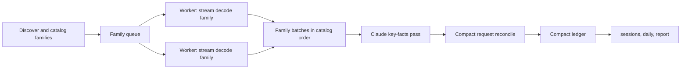

# Feature: Scalable Whole-History Ingestion

## Overview

urollup must report on the whole local history by default.
On the maintainer’s machine that history is about 2.7 GB of Claude Code logs in 2,920
files and 19 GB of Codex rollouts in 9,900 files (12 GB active and 7 GB archived, the
archive reached through a symlink), and Codex grows by up to about 1 GB a day.
The engine at the start of this plan could not read it: two unguarded runs grew a single
process past 20 GB and stalled the machine, and the temporary 512 MiB input guard that
followed made `urollup sessions`, `daily` and `report --all` refuse the default corpus.
The guard prevented a crash; it did not make urollup usable.

This plan replaces the ingestion and reconciliation data model rather than tuning it.
Families of related sources decode in parallel into compact typed rows, one global pass
reconciles those rows, and reports read a compact ledger.
Peak memory then depends on the number of usage-bearing records, at a few hundred bytes
each, and never on raw log bytes.
The design was drafted from measurements and then reviewed in two rounds by an
independent architecture review, whose findings are incorporated here.

The [governing PR review](../../reviews/review-2026-09-19-pr-stack-and-memory.md) tracks
stabilization findings, validation evidence and remaining merge conditions.
The implementation stack is now merged at main `4c55617`; historical measurements below
describe their named revisions, not acceptance of the merged head.
Representative performance and full-history QA remain open.
The [usage-analysis workflow plan](plan-2026-09-20-usage-analysis-workflow.md) owns
multi-view reuse and G5. Decode improvements here and avoiding repeated decoding there
are complementary; neither substitutes for the other’s acceptance tests.

## Goals

- Whole-history `sessions`, `daily` and `report --all` succeed on the maintainer’s
  corpus with no input-size refusal.
- Peak physical footprint is independent of raw log bytes and stays at or below 512 MiB
  for that corpus; the original estimate of about 300 MB was not achieved.
- Whole-history wall time is at most 25 seconds after Phase 1 and at most 10 seconds
  after Phase 2 on the reference laptop (Apple M1 Pro, 10 cores, 32 GiB).
- Output is byte-identical for any worker count and invariant under source file
  renaming.
- Accounting semantics are preserved and proven against the current engine on every
  fixture, except for the documented changes under
  [Semantic Changes](#semantic-changes).
- A manual end-to-end QA playbook validates whole-history, per-project and per-session
  results on this machine’s real corpus.

## Non-Goals

- Spill to disk or external sort.
  The row budget bounds admitted observations; it does not guarantee that an arbitrary
  corpus fits process memory.
  Record density and retained payloads must be measured.
- A `--since` or `--project` filter, the capture cache or incremental reads.
  Whole history in seconds removes the need for this milestone, and time filters remain
  query-time features.
- Candidate-token sets, lineage links, tool actions, gaps and account attribution, none
  of which any adapter produces today.
  They return with their first real producer.

## Background

### Incidents

On 2026-09-16 a QA run of `urollup daily --all` over the default corpus reached roughly
40 GB and restarted the Codex desktop app.
Minutes later, an agent’s `tbd create` description contained a backtick-quoted
`urollup daily --all`; shell command substitution ran the globally installed binary over
the same corpus, which reached a 23.2 GB footprint in 79 seconds.
The
[milestone 0.1 QA report](../../qa/qa-report-2026-09-16-milestone-0.1.md#crash-investigation)
records the evidence.

### Measurements

A temporary in-process probe recorded physical footprint, including compressed pages, at
phase boundaries on real-log slices that fit under the guard:

| Slice | Input | Records decoded | Observations | Requests | Peak footprint | Wall |
| --- | ---: | ---: | ---: | ---: | ---: | ---: |
| One Claude project | 451 MiB | 56,011 | 55,995 | 27,670 | 534 MiB | 2.8 s |
| One Codex day | 447 MiB | 17,752 | 7,231 | 7,210 | 192 MiB | 2.2 s |

On the Claude slice, decoded records held 60 MiB, building observations raised the
footprint to 258 MiB (about 3.5 KB per observation), reconciliation peaked at 534 MiB,
and the returned result retained about 228 MiB (about 8 KB per request).
The Codex result retained about 120 MiB for 7,210 requests and 1,009 limit observations.
Extrapolated, the whole corpus needs more than 7 GB and about 90 seconds on one thread.

The earlier
[throughput spike](../../research/research-2026-09-13-portable-agent-usage.md#local-log-volume-and-throughput)
read about 11.4 GiB of the same kind of logs in 6.7 seconds on 10 threads at 110–190 MiB
peak RSS, using a byte prefilter and borrowed typed parsing.
The workload is feasible; the engine’s data model is the problem.

### Root Causes

- **Everything is retained before it is reduced.** Both adapters keep a decoded record
  for every usage line of every source (`claude_project.rs` pushes into one
  `Vec<ParsedRecord>`; `codex_rollout.rs` retains `ParsedSource.records` with each
  record’s `serde_json::Value`), then build all observations, then reconcile, with each
  stage’s full output alive at once.
- **Rows are string-heavy.** `RequestObservation` carries an owned dialect string,
  `ScopedKey` vectors, invariant and candidate maps; `Request` carries `StoredIdentity`
  strings, aliases, every revision, and `EvidenceRef` vectors that each clone a
  source-ID string. The identity registry and link graph key maps by string.
- **Limit observations are materialized before they collapse.** Codex clones the whole
  `rate_limits` object per window, and consecutive duplicates are removed only after
  every row exists.
- **Every line is parsed into a full JSON DOM,** including message content that
  accounting never reads.
- **Diagnostics are one row per occurrence,** which yields tens of thousands of rows on
  a real corpus.

### Cross-Family Coupling and an Ordering Bug

Codex families, the connected components of rollout header links, partition cleanly.
Claude semantics are partly global:

- `normalize` builds `message_owners` and `uuid_owners` over all sessions and derives
  `ambiguous_messages` globally (`claude_project.rs:489-513`), which switches a
  message’s key from provider scope to session scope.
- A resumed session creates a `Thread` for the foreign session and a Fork edge to it
  (`claude_project.rs:515-529`).

Because of this coupling, per-family reconciliation followed by global deduplication was
rejected.

The owner maps are also built first-wins in discovery order, and only forced copies are
excluded.
When a resuming session’s file sorts before the original, the replay claims the
uuid and the original request becomes a copy.
Renaming only the resuming session file in two fixtures reproduces lost usage:
`gateway-message-id-reuse` drops from 3 owned requests and 192 tokens to 1 owned plus 1
ambiguous and 140 tokens, and `brief-double-counting` drops from 40,603 to 40,015
tokens. Session files are named by UUID, so real results depend on random name order.
This is bead `uro-sn1e`.

## Design

### Approach

Decode per family, in parallel, into compact rows; reconcile once, globally, over the
compact rows; query the compact ledger.



1. **Discover and catalog.** The existing catalog groups sources into families: a Claude
   session with its subagents, and a Codex link-connected component.
   The 512 MiB guard and `ensure_discovery_capacity` are removed.
2. **Decode families on bounded workers.** Workers default to
   `min(available_parallelism, 8)` with a `UROLLUP_JOBS` override and pull families in
   catalog order with a small in-flight window.
   Each source is read in one streaming pass with a reused line buffer; no decoded
   record outlives its line.
   All family-local logic stays in the decoder: Codex cumulative counters, epochs,
   copied history, turn contexts and fork detection, and Claude inline sidechains,
   tool-owner spawn edges and progress nesting.
   Claude reads the main transcript before its subagents; Codex reads root rollouts
   before children. The Codex choice between direct token records and cumulative counters
   is a whole-file property, so the decoder runs both state machines in the pass and
   keeps one at the end of the file.
   Limit observations collapse consecutive duplicates while streaming, per source.
   A worker emits a `FamilyBatch` of manifest entries, threads, relationships,
   observations, collapsed limit rows, aggregated diagnostics and coverage counters.
3. **Assemble globally, on one thread.** Batches concatenate in catalog order.
   A source table assigns each source a `u32` and a canonical rank.
   Thread and relationship reconciliation run as today over about 11,000 rows.
   The Claude key-facts pass builds hash maps from message and uuid digests to
   `(thread, canonical position)` over original-eligible records only, excluding forced
   copies and session-mismatch replays, which fixes the ordering bug.
   It also builds the per-message model sets that decide `ambiguous_messages`, then
   finalizes each Claude observation’s key choice, role and owner.
4. **Reconcile requests compactly.** Observations sort by canonical evidence position.
   An index-based union-find groups observations that share a key digest.
   A group whose observations disagree on the model splits into artifact-local requests
   that form a candidate set.
   Each group builds one `Req`, and the observations are consumed group by group and
   then freed.
5. **Query the compact ledger.** `accounting::totals`, `query` and `SessionIndex` read
   `Req` and compact thread rows.
   `SessionIndex::add` uses a source-to-thread map instead of scanning sources per
   thread.

### Compact Data Structures

These are as-built shell sizes and compile-time bounds, excluding owned allocations.
The original proposal used 72 B measures and observation/request bounds of 256 B.

| Type | Representation | Size or bound |
| --- | --- | ---: |
| `EvidenceRef` | source index, length and offset | 16 B |
| `Measures` | eight compact counters and presence mask; full-width overflow values interned | 36 B, including `Option` |
| `RequestObservation` | compact observations with optional owned payloads | ≤ 224 B |
| `Request` | compact request and evidence references | ≤ 216 B |
| `ProviderLimitObservation` | compact fields and references to interned native text | ≤ 128 B |
| `Option<NativeSequence>` | presence tag and eight big-endian bytes, preserving all `u64` values | 9 B |

Per-source string tables are released with their source data.
Names, native limit text and overflow-measure patterns use process-lifetime intern
tables; their heap storage is additional to these row sizes.
Evidence arrays, strings, maps and allocator overhead also remain outside the shell
bounds.
Repeated ingestion or a long-lived server needs separate cardinality and lifetime
measurements.

Key digests are the existing identity contract: workers write RFC 8785 canonical JSON
into a reused buffer and hash it with SHA-256, and a property test pins the helper to
`IdentityKey::derive_id` so stored IDs never change.
Grouping uses the 128-bit ID; a group whose 64-bit checks disagree is a collision and
fails with an identity error, replacing the request identity registry.
Reports print no `req-` IDs, so public ID text is derived only where needed.

### Memory Model

The original model estimated about 300 MB peak and 170 MB during queries for the
reference corpus, using 230 B per Claude observation, 150 B per Codex observation and
230 B per request. Its 100 GB Codex extrapolation was about 700 MB. These were design
estimates, not measured acceptance results; the dated measurements in
[Progress](#progress) show the higher observed footprint.
No fresh private-corpus benchmark is recorded here.

The reader reuses bounded line buffers.
A shared admission counter per agent reserves retained observation rows during decode,
including pending representations; exceeding it cancels further work and reports a
capacity error. Reconciliation retains a second ceiling check before request
construction. The default byte budget is 25% of physical RAM, with a 2 GiB fallback when
the default host query fails.
`--max-ram` (or `UROLLUP_MAX_RAM`) accepts a byte size or percentage; `--max-rows`
supplies an exact row count.
The flag overrides the environment value, and when a RAM budget and row count are both
supplied, the smaller ceiling wins.
Explicit byte/row limits avoid host probing.
An explicitly requested percentage fails if physical RAM is unknown; only the default
uses the fallback. Native RAM queries do not impose a container allowance.

The byte budget is divided by `size_of::<RequestObservation>()`. At 224 B, 8 GiB admits
about 38 million row shells, but that arithmetic says nothing about whether their
payloads and final ledger fit in memory.
Payloads, intern tables, request construction, source/thread tables and the other
agent’s retained ledger are additional.
The budget is not a process RSS or physical-footprint limit.
The CLI capacity diagnostic names the row count and budget and suggests narrower
`--source` roots with `--no-default-sources`.

Acceptance still requires exact-head measurements of `sessions`, `daily` and `report`,
with corpus type/density, worker count and machine load recorded.
Keep sampled watchdog RSS, OS maximum RSS and macOS physical footprint distinct.
The historical tables below retain their original conditions and must not be relabeled
as current-head evidence.

Admission reserves a shared per-agent slot during decoding before retaining each
request-bearing record, including pending usage and copies that normalization may
subsequently discard.
Completed workers keep their reservations until ingestion ends.
The first refused slot cancels the invocation and reports the ceiling plus one, a lower
bound rather than a full-input count.
Capacity failure takes precedence once that shared budget is exhausted.
Successful reads and ordinary source failures retain their existing ordering guarantees.
The ceiling bounds these rows, not total process memory: line buffers, metadata,
interned values, auxiliary ledger tables and the other agent’s ledger also consume
memory.

### Parallelism and Determinism

Family batches are slotted by catalog index, and every global step sorts by canonical
position or ID. Output is byte-identical for one or eight workers, and tests enforce it.

### Diagnostics

Diagnostics aggregate per code during decoding and assembly: `count` sums occurrences,
`detail` is the first occurrence’s detail in canonical order, and up to three sample
evidence references stay in the ledger.
`DiagnosticSummary` keeps its shape, so `REPORT_SCHEMA_VERSION` does not change.

### Removed From the Engine

The following have no producer today and are removed until one exists:
`candidate_tokens` and their union, `LineageLink` and `links`,
`OwnerEvidence::Candidates`, `tool_actions`, `gaps`, account attribution beyond the
report’s `unknown` bucket, `Request.aliases`, `native_request_id` and
`native_response_id`, `TokenUsage.native`, per-revision usage, `model_usage` entries
that duplicate the primary usage (advisor components stay), and the request identity
registry and string link graph.

As implemented, candidate tokens, candidate owners, account attribution, native request
and response IDs, native usage maps, per-revision usage and the request identity
registry are removed.
`LineageLink` and `links`, `tool_actions`, `gaps` and request aliases remain, because
they cost no memory without a producer; threads and tool actions keep their string
identity registry, and candidate sets keep a small string link graph over split requests
only.

Kept: reread deduplication, the conflicting-shared-key split, owner and model conflict
diagnostics, Claude block-conflict detection computed while building requests, candidate
sets from splits, compact limit observations, coverage counters, and thread and
relationship reconciliation.

### Semantic Changes

- Claude owner maps use canonical order over original-eligible records.
  This fixes lost and misattributed usage from resumed sessions; design §3.4 is updated.
- The request-key collision guard is agreement of 192 digest bits instead of a string
  registry.
- Diagnostics are aggregated per code with samples.
- The ledger keeps the selected revision and all evidence references, but not native
  counter maps or every revision’s usage.

### CLI and Output Changes

No flags change. The input-size error disappears, `UROLLUP_JOBS` sets the worker count,
and `UROLLUP_STATS=1` prints phase timings, row counts and workers to stderr.
Report JSON keeps its schema version; `sessions` rows gain an additive `session` field
with the native session ID, and diagnostic rows change where fixtures emit repeated
codes.

`UROLLUP_STATS` parses like `UROLLUP_JOBS`: unset, empty or `0` disables it, `1` enables
it, and any other value is a usage error.
Each measurement is one `stats:` line of `key=value` pairs, written to stderr after the
command runs and before its output or error.
This is a whole-history `sessions --all` run on 2026-09-17 (`UROLLUP_JOBS` unset, on a
loaded machine):

```text
stats: workers=8
stats: phase=discovery seconds=5.485
stats: phase=claude_ingest seconds=3.825
stats: phase=codex_ingest seconds=7.466
stats: phase=session_index seconds=1.046
stats: phase=query_render seconds=0.096
stats: agent=claude sources=1686 observations=393175 requests=181231 limit_observations=332 diagnostics=96
stats: agent=codex sources=8831 observations=288086 requests=287038 limit_observations=82397 diagnostics=818
stats: total seconds=17.986
```

A failed command prints only the phases it finished.
The lines hold phase names, wall times and counts, never paths, IDs or model names, so
QA reports may quote them.

## Implementation Plan

### Phase 1: Whole History Works

- [x] Fix the Claude owner-map ordering bug (`uro-sn1e`) in the current engine, with
  renamed-file cases for `gateway-message-id-reuse` and `brief-double-counting`.
- [x] Compact `RequestObservation` and `Request` in place, with digest identities,
  streaming limit collapse and per-code diagnostics.
  There is no second engine, no separate `Obs`/`Req` types, and no projection oracle.
- [x] Decode sources on bounded workers with `UROLLUP_JOBS`, with worker-count and
  Claude file-rename invariance tests.
- [x] Remove the 512 MiB guard and the read budgets it required; add a compact-row
  ceiling and `UROLLUP_STATS`. The ceiling is now 25% of physical RAM by default
  (`--max-ram` / `--max-rows` / `UROLLUP_MAX_RAM`), falling back to 2 GiB when RAM
  cannot be read (`uro-zw87`).
- [x] Add the native session ID as an additive `session` field on `sessions` rows, so
  whole-history results join to ccusage in one pass.
- [x] Update CLI goldens and `scripts/check-e2e-results.mjs` for aggregated diagnostics.
- [x] Observe usage-bearing Codex rollouts on the decode worker so their record vectors
  never join (`uro-ecol`). Peak after that step is 861 MiB.
- [x] Decode Claude usage-bearing lines without `parse_record` (`uro-q1ik`). `UsageBody`
  streams accounting fields; `quotaLimits` is the only `Value`, and only for that
  object. Peak after that step is 835 MiB.
- [x] Type Codex `rate_limits` without a `Map<String, Value>` (`uro-g7pi`).
  `RateLimitsSeed` reduces the object to `DecodedLimits` (name, windows, compact native
  JSON). Two release `sessions --all` runs after that step peaked at 844 MiB (864,176
  KiB, 23.4 s) and 868 MiB (889,232 KiB, 24.9 s). Row counts match `uro-q1ik`. Removing
  the Codex `Value` map did not cut the peak.
- [x] Compact `EvidenceRef` to a 16-byte source index (`uro-as4a`). `RequestObservation`
  is 264 bytes. A release `sessions --all` after that step peaked at 875 MiB (896,016
  KiB) in 26.5 s. Same row counts.
  The 16-byte ref did not meet 512 MiB.
- [x] Bound reused worker line buffers (`uro-1sm8`). After each line, capacity above 256
  KiB is released. A release `sessions --all` after that step peaked at 793 MiB (811,568
  KiB) in 20.3 s.
- [ ] Meet the 512 MiB whole-history peak (`uro-n1cp`, now waiting on Phase 2). A
  two-pass Claude re-decode (`uro-l3fw`) peaked at 929–946 MiB and was reverted.
  Shell-field shrinks are exhausted (`uro-o5c0` reverted).
  Codex intern-lifetime reorder (`uro-mxyh`) raised the peak and was reverted.
  Compact Codex limit rows (`uro-4h93`) interned names, windows and native JSON.
  `KeyGraph` stores each ID once (`uro-t8ws`). Packing observation keys to nodes
  (`uro-73al`) relocated IDs into a join-time table and did not lower peak; reverted.
  Field and ID relocation have run out.
  Tail-consume after grouping was not implemented: the peak holds every shell before
  Requests are reserved, and `shrink_to_fit` of that remainder reallocs while the table
  is still live. The 512 cut queue is empty.
  The 512 MiB gate now lives on Phase 2 (`uro-zrr0`). `uro-l0gd` recorded the standing
  remasure and is closed.

Acceptance: `make check` passes; whole-history `sessions`, `daily` and `report --all` on
the maintainer’s corpus exit 0 in at most 25 seconds at no more than 512 MiB peak
footprint; one and eight workers give identical JSON.

### Phase 2: Fast Decode and Scale Gates

- [ ] Meet 512 MiB and 10 s on the leftover typed-decode / allocator path (`uro-zrr0`).
  Phase 1 row compaction is exhausted; do not start more shell-field cuts.
- [x] Write Codex `CompactJson` numbers without `Value` (`uro-nuhn`); quiet WH rose to
  685 MiB / 21.3 s; reverted.
- [ ] Check Claude usage numbers without `Value::from` (`uro-nzo1`).
- [ ] Parse Claude sidecars without `Value`; confine `parse_record` to tests
  (`uro-a3fo`).
- [x] Measure a process allocator for whole-history RSS (`uro-96vw`); quiet WH rose to
  834 MiB / 19.0 s and Codex-only to 676 MiB / 15.3 s; reverted.
- [ ] Cut whole-history wall time to at most 10 seconds (`uro-lsaz`). Profile
  (2026-09-19): Codex ingest is 74% of quiet WH 18.2 s; remaining worker time is kernel
  read and `Line::read`.
- [x] Skip the full JSON walk on Codex lines the type prefilter rejects (`uro-s5vb`);
  quiet WH rose to 650 MiB / 20.7 s and Codex-only to 583 MiB / 15.3 s; reverted.
  Contract held in tests; wall did not fall.
- [x] Enlarge the sequential read window (`uro-h6iw`); 1 MiB `BufReader` left quiet WH
  at 635 MiB / 21.2 s and Codex-only at 602 MiB / 13.7 s; WH wall and Codex peak rose;
  reverted.
- [ ] Clear leftover `Value` helpers off the decode path (`uro-6gwt`) after the
  file-level children above.
- [x] Add a streaming synthetic corpus generator that writes families from fixture
  templates into a temporary directory under a byte cap, with part of Codex
  zstd-compressed.
- [x] Add CI scale tests: a raw-bytes independence test (identical usage records with
  heavily padded content differ by less than 64 MiB peak), a footprint extrapolation
  bound, and `daily --all` on the generated corpus under the watchdog at 512 MiB in
  `make test`.

Acceptance: outputs are byte-identical to Phase 1; whole history takes at most 10
seconds; the scale gates pass in CI.

### Phase 3: Acceptance and Cleanup

- [x] Replace the per-session urollup invocations in `tests/parity/local_diff.py` with
  one whole-history run joined on the native `session` field.
- [ ] Execute the
  [full-history QA playbook](../../../../tests/qa/full-history-rollup.qa.md) on this
  machine and commit a privacy-safe dated QA report (`uro-ky6c`).
- [ ] Update any leftover wording in design §3.4 and §8.3, the main implementation plan
  and the README after that report.

Acceptance: the QA playbook passes, and milestone 0.1 local acceptance is recorded
without an input-size limitation.

### Progress

Implementation compacts the existing engine in place rather than building a second
engine beside it. The [Approach](#approach) above describes the original design; the
engine as built differs in three ways.
Workers decode individual sources, heaviest first, and results merge in discovery order,
rather than decoding families into a `FamilyBatch`. There are no separate `Obs` and
`Req` types: `RequestObservation` and `Request` themselves became compact rows.
The Claude owner rule is computed in the adapter’s normalization pass rather than a
separate key-facts pass.
File-rename invariance is tested for Claude session files; Codex thread identity comes
from the rollout name, so renaming a rollout is not an invariant.
Each step keeps fixture, snapshot, golden, fixture-result and parity gates green, and
its release build is compared back to back with the previous build on real-log slices:
report, daily and sessions JSON must be identical apart from live sessions that append
between the two runs.
The steps so far:

- Fix the owner-map ordering bug (`af5f012`) before any rewrite.
- Store analytical IDs as 17-byte digests, drop native usage maps and stored revisions,
  and reconcile requests by 192-bit key digest instead of a string registry.
- Decode Codex records into typed rows, collapse limit snapshots while streaming, and
  skip irrelevant Codex lines with a byte prefilter.
- Reconcile without copying observations: an index-based union-find over key digests,
  groups built by sorting indices, observation heap released per group, and requests in
  a sorted vector.
- Decode sources on bounded parallel workers with `UROLLUP_JOBS`.
- Aggregate diagnostics per code, add the `session` field, and join local parity in one
  pass.
- Keep observation keys and invariants inline, and remove candidate tokens, candidate
  owners and account attribution.
- Remove the input guard and the read budgets, add the reconciliation capacity ceiling,
  and add `UROLLUP_STATS`.

Whole-history measurements on 2026-09-16 used a local build with the input guard raised,
under the RSS watchdog, on the maintainer’s corpus:

| Input | Requests | Earlier result | Latest measurement |
| --- | ---: | --- | --- |
| Codex 2026-07, 1.6 GB | 68,921 | refused by the guard | 160 MiB, 1.5 s (`cf9b704`) |
| Codex 2026-09, 8.4 GB | 139,375 | refused by the guard | 306 MiB, 6.5 s (`cf9b704`) |
| All Claude projects, 2.8 GB | 176,634 | 1,386 MiB, 14.3 s (`1924d8f`) | 860 MiB, 11 s (`e9fe862`) |
| Claude projects and active Codex sessions, without the 7 GB archive | 461,049 | above 20 GB (milestone 0.1 engine) | 963–1,028 MiB, 22–24 s (`9f290e6`) |
| Default whole history, including the Codex archive, `sessions --all` | 802,790 | 1,136–1,146 MiB, 23–30 s (`c332aba`) | 653 MiB (668384 KiB) / 17.3 s after `uro-t8ws` (repeat 661 MiB; Codex-only quiet 586 MiB / 13.2 s). `uro-lsaz` remasure: WH 648 MiB / 18.2 s, Codex-only 573 MiB / 14.3 s. `uro-4h93` was 670/583; `uro-24ua` was 768/614 |

Whole history completes.
Compacting the Claude adapter’s decoded records and owner maps (`8bd7580`) cut the full
Claude corpus from 860 MiB to about 395 MiB. The 1.14 GB whole-history peak was not row
math (about 477 MB of observations plus requests): the CLI held a full Claude `Ingested`
while Codex ingested.
`Ingested::release_discovery` indexes and drops discovery tables after the first
dialect, and Codex ingests first (`uro-brar`). Claude per-record message and request IDs
are interned (`uro-hw2q`). Usage-bearing Codex rollouts are observed on the decode
worker so their record vectors never join (`uro-ecol`); observation slots are reserved
only for usage, compacted, and token-count lines.
A release `sessions --all` on 2026-09-19 after reverting a two-pass Claude re-decode
peaked at 804 MiB (823,632 KiB) in 22.1 s: 612,561 Codex observations and 413,742 Claude
observations, same row counts as `uro-ecol`. After `uro-1sm8` the same corpus was 793
MiB in 20.3 s. The two-pass cut (`uro-l3fw`) re-decoded Claude after owner-map rows and
peaked at 929–946 MiB (even a sequential second pass was 908 MiB), so that approach was
reverted. `Request.records` is now an inline `RecordRefs` (`uro-cbsg`); a loaded A/B
against `Box<[EvidenceRef]>` stayed in the 827–852 vs 840 MiB band, so that bead was
canceled. `reconcile_input` then reserved the full Claude observation vector (about 104
MiB at 264 B each) while every `ParsedRecord` chunk was still alive; reserving per chunk
after earlier records drop (`uro-mxcp`) brought a loaded run to 796 MiB (815,008 KiB).
Wall time on that run was 81 s at load 117–193 and is not the quiet 22 s baseline.
Claude ingest still runs beside the Codex ledger (611,314 `Request` rows).
Merging Claude sources as the discovery-order prefix completed (`uro-h0fw`) peaked at
830–854 MiB and was reverted: in-flight decode sat beside the growing corpus.
`Strings::freeze` (`uro-yvn1`) drops each source’s intern map after decode; that bead
was canceled because dialect-split measurement showed the peak is Codex ingest (760 MiB
alone vs Claude 357 MiB). `codex_rollout.rs` then reserved the full observation `Vec`
(about 154 MiB at 264 B) while every worker result still held its rows; reserving per
rollout (`uro-3y9m`) cut Codex-only to 650 MiB and whole history to 647–770 MiB (one 855
MiB loaded outlier).
A quieter remasure of that tree was Codex-only 659 MiB (674416 KiB) / 13.7 s and whole
history 786 MiB (804512 KiB) / 18.8 s. Dropping `KeyGraph` after grouping (`uro-kvrb`)
did not lower peak (Codex-only 669 MiB / 18.1 s; whole history 818 MiB / 20.2 s) and was
reverted: peak is still ingest plus the observation and request tables, not the KeyGraph
overlap. Per-rollout `shrink_to_fit` after observe (`uro-ibij`) raised Codex-only to 731
MiB (748512 KiB) / 18.5 s and whole history to 828 MiB (848112 KiB) / 24.9 s; realloc of
each rollout table added allocator slack and was reverted.
One inline key slot (`uro-b3gg`) raised Codex-only to 725 MiB (742672 KiB) / 14.1 s and
whole history to 800 MiB (818960 KiB) / 18.2 s; Claude observations often carry two keys
and spill, and was reverted.
`UROLLUP_JOBS=1` on the restored tree was 720 MiB (737920 KiB) / 57 s, worse than eight
workers.
Per-rollout observation chunks dropped after each home chunk (`uro-08oj`) raised
whole history to 927–958 MiB (949728–980896 KiB) and was reverted: grouping still holds
every shell, so the Request overlap was not the peak.
Compact `Measures` (`uro-7w0u`) stores counters that fit in `u32` inline and interns
overflow above `u32::MAX`. `Option<Measures>` fell from 72 B to 36 B, the observation
shell from 264 B to 232 B, and `Request` from 248 B to 216 B. Quiet remasure: Codex-only
645 MiB (660064 KiB) / 14.0 s and whole history 770 MiB (788704 KiB) / 18.1 s. Packing
The original `sequence` cut (`uro-24ua`) stored `n + 1` in an 8 B
`Option<NativeSequence>`. Audit fix R3 replaces it with a 9 B full-domain representation
without increasing the 224 B observation shell; the following A/B measurements describe
the original cut. The shell is 224 B. A same-session A/B against `uro-7w0u` was
Codex-only 614 MiB (628608 KiB) / 14.5 s versus 631 MiB (646416 KiB), and whole history
768 MiB (786656 KiB) / 17.5 s versus 778 MiB (797008 KiB). Dropping the unused key-spill
pointer (`uro-o5c0`) kept two inline slots and interned a 3+ tail.
The shell compiled at 216 B and tests stayed green.
Peak did not fall: a same-session A/B was whole history 786 MiB (805072 KiB) versus 733
MiB (750480 KiB) for `uro-24ua` at the same load, and other `uro-o5c0` WH samples were
752–759 MiB against the standing 768 MiB. Codex-only swung 576–688 MiB in the same 50 ms
watchdog band as `uro-24ua` (614–690 MiB). The cut was reverted.
Further 8 B shell-field shrinks cannot close 512 MiB. Codex-only after `uro-24ua` is
already 614 MiB; grouping-resident shells plus requests are about 269 MiB (612k × 224 B
and 611k × 216 B), so about 345 MiB of that peak is intern tables still live through
observe, `KeyGraph` during grouping, 138k limit rows and allocator slack.
`SessionIndex` is built after each ingest and is not the Codex-only peak; on whole
history it sits beside Claude ingest.
Observing every Pending rollout before concatenating Observed shells (`uro-mxyh`) raised
Codex-only to 774–836 MiB (792832–855760 KiB) and whole history to 799–857 MiB
(817968–878176 KiB). `Interner` lookup maps already drop in `finish` before observe;
holding every Observed shell while materializing Pending observations increased the
overlap. The cut was reverted.
Interning those rows (`uro-4h93`) stores `limit_name`, `window` and native JSON as
`Name` (8 B each; `ProviderLimitObservation` ≤128 B). Quiet remasure: Codex-only 583 MiB
(596784 KiB) / 14.3 s (loaded sample 631 MiB) and whole history 670 MiB (686192 KiB) /
18.0 s (repeat 668.5 MiB / 17.9 s). Row counts match `uro-24ua`. Grouping-resident
shells plus requests are about 257 MiB (612k × 224 B and 611k × 216 B); compact limit
rows are about 17 MiB (137k × ≤128 B). `KeyGraph` (`uro-t8ws`) now stores each
`AnalyticalId` once (`ids`) and looks up through an open-addressed table of `u32`
indices.
Quiet remasure: Codex-only 586 MiB (600336 KiB) / 13.2 s (loaded sample 630 MiB)
and whole history 653 MiB (668384 KiB) / 17.3 s (repeat 661 MiB / 18.6 s). Row counts
match `uro-4h93`. Packing those IDs to `KeyGraph` nodes (`uro-73al`) was tried three
ways (join-time `HashMap` intern, join-time `KeyGraph`, concat pending IDs then pack at
reconcile).
Quiet whole-history peaks were 682, 657 and 661 MiB; none fell below 653. The
IDs are already live in every grouping shell; moving them out adds a second table beside
the shells. Reverted.
The remaining Codex-only gap to 512 MiB is about 74 MiB; whole history still misses by
about 141 MiB. Field and ID relocation have run out.
A post-grouping tail-consume (`truncate` plus `shrink_to_fit` so processed shells are a
suffix) was not attempted: grouping is the peak (every `RequestObservation` is live
before any `Request` is reserved), so freeing a suffix happens after that peak;
`shrink_to_fit` on the live remainder reallocates the still-resident prefix and has
already raised RSS (`uro-ibij`, large-remainder shrink).
That cut is not `uro-08oj` (per-rollout chunks during ingest), but it cannot return the
grouping resident set.
The 512 cut queue is empty.
Next path is Phase 2 typed decode / allocator (`uro-zrr0`), not another shell field or
key-table move.

After the guard was removed, a release build ran `sessions --all` over the Claude
projects and active Codex sessions, without the archive, on 2026-09-17 under a 2 GiB
watchdog on a loaded machine: it exited 0 at 878 MiB peak RSS in 18.6 s over 468,269
requests. The `UROLLUP_STATS` example under
[CLI and Output Changes](#cli-and-output-changes) is that run.

### Remaining Work

`uro-t8ws` stored each `KeyGraph` ID once; standing peak is Codex-only 586 MiB / WH 653
MiB. Field and ID relocation have run out.
Leftover open Phase 1 children that will not land were canceled (`uro-cbsg`, `uro-yvn1`,
`uro-l3fw`, `uro-h0fw`, `uro-vsdu`, `uro-kvrb`, `uro-ibij`, `uro-b3gg`, `uro-08oj`). Do
not resume boxing, `N=1` keys, `shrink_to` of a large remainder, chunked consume,
intern-lifetime observe reorder, packing keys off the shell, two-pass Claude, or
prefix-merge. Tail-consume after grouping was judged unable to return RSS and was not
filed. `uro-l0gd` is closed as the dated remasure (Codex-only 586 MiB / WH 653 MiB).
`uro-n1cp` is not closable and now depends on `uro-zrr0`. The 512 MiB gate and the 10 s
target live on Phase 2.

1. **Phase 1 (`uro-n1cp`), 512 MiB.**

| Bead | Files and functions | Why |
| --- | --- | --- |
| `uro-q1ik` (done) | `claude_project/line.rs` `UsageBody`; `claude_project.rs` `SourceDecoder::decode` | Claude usage lines no longer call `parse_record`. Peak stayed in the 835–868 MiB band. |
| `uro-g7pi` (done) | `codex_rollout/line.rs` `DecodedLimits`, `RateLimitsSeed`, `CompactJson`; `codex_rollout.rs` `rate_limits` | Codex `rate_limits` is compact native JSON. Peak 844–868 MiB; not the remaining gap. |
| `uro-as4a` (done) | `sources/evidence.rs` `EvidenceRef` and `SourceTable`; `ReconcileInput` / `Ledger`; adapters stamp local index 0 then intern in `AnalyticalId` order | 40 B → 16 B. Peak 875 MiB. Custom `Ord` is source, offset, length. |
| `uro-l3fw` (canceled; two-pass reverted) | `claude_project.rs` two-pass ingest | Re-decode after owner-map rows peaked at 929–946 MiB. Single-pass observe restored. |
| `uro-1sm8` (done) | `sources/reader.rs` `Scan::run`, `shrink_line_buffer`, `ReadOptions::RETAINED_LINE_CAPACITY` | After each line, capacity above 256 KiB is released. Peak 793 MiB. |
| `uro-cbsg` (canceled; implemented, peak did not fall) | `entities.rs` `RecordRefs` on `Request.records`; `reconcile.rs` builder `collect` | One-ref case is inline. Loaded A/B 827–852 vs Box 840 MiB; quiet baseline was 804 MiB. Peak did not clearly fall. |
| `uro-mxcp` (done) | `claude_project.rs` `reconcile_input` | Observation `Vec` reserved per `RecordChunk` after earlier records drop. Loaded peak 796 MiB. |
| `uro-h0fw` (canceled; prefix-merge reverted) | `sources/parallel.rs` `try_read_in_parallel_prefix`; `claude_project.rs` `CorpusMerger` | Prefix absorb while workers still decoded peaked at 830–854 MiB. Single-pass join restored. |
| `uro-yvn1` (canceled; implemented, peak is Codex) | `claude_project.rs` `Strings::freeze`, `decode_source` | Intern `HashMap` dropped after each source decodes. Peak is Codex (760 MiB alone). |
| `uro-3y9m` (done) | `codex_rollout.rs` `normalize` | Observation `Vec` reserved per rollout after worker results move. Codex-only 650 MiB; whole history 647–770 MiB. |
| `uro-vsdu` (canceled; boxing reverted) | `reconcile.rs` request-building loop | Boxing each shell at emit raised Codex-only to 699 MiB. Tail-consume after grouping was not filed: peak is all shells before Requests are reserved; `shrink_to_fit` of the live remainder reallocs. |
| `uro-kvrb` (canceled; drop-after-group reverted) | `reconcile.rs` after `order.sort_unstable_by`, `build_request` | Dropping `KeyGraph` after grouping did not lower peak (Codex-only 669 MiB; WH 818 MiB). |
| `uro-ibij` (canceled; shrink_to_fit reverted) | `codex_rollout.rs` `observe_to_observed` | Per-rollout `shrink_to_fit` raised Codex-only to 731 MiB and WH to 828 MiB. |
| `uro-b3gg` (canceled; one-inline-key reverted) | `reconcile.rs` `RequestObservation.keys` | `InlineList<DerivedKey, 1>` raised Codex-only to 725 MiB and WH to 800 MiB. Claude often has two keys. |
| `uro-08oj` (canceled; chunked consume reverted) | `reconcile.rs` `request_chunks`; `codex_rollout.rs` `normalize` | Per-rollout tables dropped after each home chunk. Codex-only 652–677 MiB; WH 927–958 MiB. Grouping still holds every shell. Reverted. |
| `uro-7w0u` (done) | `tokens.rs` `Measures`; `RequestObservation.usage` | Counters that fit in `u32` stay inline; overflow interns once. Shell 264→232 B. Codex-only 645 MiB; WH 770 MiB. |
| `uro-24ua` (done) | `reconcile.rs` `NativeSequence`; `RequestObservation.sequence` | `Option<u64>` 16 B → 8 B. Shell 232→224 B. Paired A/B: Codex-only 614 MiB; WH 768 MiB. |
| `uro-o5c0` (canceled; spill drop reverted) | `reconcile.rs` `RequestObservation.keys`; `observation_keys.rs` | Two inline slots plus interned 3+ tail compiled at 216 B. Paired WH 786 vs 733 MiB; other samples in the 752–768 band. Reverted. Field shrinks exhausted. |
| `uro-mxyh` (canceled; observe-Pending-first reverted) | `codex_rollout.rs` `Interner::finish`, `normalize`, `observe_to_observed` | Lookup maps already drop at decode finish. Observing all Pending while holding every Observed shell raised Codex-only to 774–836 MiB and WH to 799–857 MiB. |
| `uro-4h93` (done) | `entities.rs` `ProviderLimitObservation`; `names.rs`; adapters `append_limits`; `reconcile.rs` limit keys | Names, windows and native JSON interned as `Name`. Row ≤128 B. Codex-only 583 MiB; WH 670 MiB. |
| `uro-t8ws` (done) | `reconcile.rs` `KeyGraph`; `identity.rs` `AnalyticalId::table_hash` | IDs stored once in `ids`; open-addressed `u32` slots. Do not drop after grouping. Codex-only 586 MiB; WH 653 MiB. |
| `uro-73al` (canceled; pack-to-nodes reverted) | `reconcile.rs` `RequestObservation.keys`, `resolve_identities` | Packed keys to a node index (two inline slots kept). Join-time intern, join-time `KeyGraph`, and concat-then-pack all left WH at 657–682 MiB vs 653 standing. IDs already live in the shells. Reverted. |
| `uro-l0gd` (done; remasure only) | privacy-safe `sessions --all` | Dated numbers: Codex-only 586 MiB (600336 KiB) / 13.2 s; WH 653 MiB (668384 KiB) / 17.3 s (repeat 661 / 18.6). Does not close `uro-n1cp`. |

2. **Phase 2 (`uro-zrr0`) owns 512 MiB and 10 s.**

| Bead | Files and functions | Why |
| --- | --- | --- |
| `uro-nuhn` (canceled; no-Value numbers reverted) | `codex_rollout/line.rs` `CompactJson` `visit_i64`/`u64`/`f64` | Writing primitives without `Value` left quiet WH at 685 MiB / 21.3 s vs 653 / 17.3. Reverted. |
| `uro-nzo1` (open) | `claude_project/line.rs` `UnsignedAt`, `unsigned` | Usage-line number checks still wrap `Value::from`. |
| `uro-a3fo` (open) | `claude_project.rs` `read_subagent_meta`; `sources/decode.rs` `parse_record` | Sidecar is a `Value`; `parse_record` still builds a document. |
| `uro-96vw` (canceled; mimalloc reverted) | `crates/urollup` `mimalloc` 0.1.52 | Quiet WH 834 MiB (853568 KiB) / 19.0 s vs 653 / 17.3; Codex-only 676 MiB (692016 KiB) / 15.3 s vs 586 / 13.2. Slack is not the system allocator. Reverted. |
| `uro-lsaz` (open; profile recorded) | `cli.rs` phases; sampling profile | Quiet remasure WH 648 MiB / 18.2 s, Codex-only 573 MiB / 14.3 s (standing band 653 / 17.3 and 586 / 13.2). `codex_ingest` 13.5 s of WH. Remaining worker time after `uro-s5vb` revert is kernel read (~40%) and `Line::read`. |
| `uro-s5vb` (canceled; zero-copy accept reverted) | `sources/json.rs` `accept`; `decode.rs` `validate_record` | In-place scanner matched `parse_record` in tests (malformed contract held) but quiet WH 650 MiB (665712 KiB) / 20.7 s vs 648 / 18.2 and Codex-only 583 MiB (596928 KiB) / 15.3 s vs 573 / 14.3. Reverted. |
| `uro-h6iw` (canceled; 1 MiB window reverted) | `reader.rs` `reader_for` | 128 KiB → 1 MiB `BufReader`. Quiet WH 635 MiB (649696 KiB) / 21.2 s vs 648 / 18.2; Codex-only 602 MiB (616160 KiB) / 13.7 s vs 573 / 14.3. WH wall and Codex peak rose. `posix_fadvise` not added (`unsafe` denied; Darwin no-ops it). Reverted. |
| `uro-6gwt` (open) | leftover `Value` umbrella | Blocked on `uro-nzo1` and `uro-a3fo`. |

3. **Phase 3 (`uro-ky6c`).** Run the full-history QA playbook and record a privacy-safe
   report. The one-pass local parity join already landed.
   There is no second engine to delete.

Milestone 0.1 G1 (`uro-d36a`) waits on Phase 2 (`uro-zrr0`), which owns the 512 MiB
gate. Independent review of the published stack (`uro-nncx`) is parallel and does not
block this work. Publishing (`uro-30ef`) waits on the 0.1 epic.

## Testing Strategy

- **Equivalence:** each compaction step keeps fixture, snapshot, golden, fixture-result
  and parity gates green, and is compared back to back with the previous release build
  on real-log slices.
- **Properties:** worker-count identity is tested on every fixture; Claude session-file
  rename invariance is tested.
  There is no second engine or projection oracle.
- **Existing gates:** fixtures, snapshots (regenerated once for compact shapes), CLI
  goldens, fixture results and ccusage parity pass; the parity ledger does not change.
- **Scale:** size assertions, the synthetic generator, raw-bytes independence and the
  watchdog gate in Phase 2.
- **Manual acceptance:** the full-history QA playbook on the real corpus, including
  cross-checks against pinned ccusage 20.0.20 and a hand-summed session.

## Rollout Plan

Each phase lands as a stacked pull request with `make check` green.
The input-size guard is already gone on this branch; Phase 1 still has to meet the 512
MiB peak. Reinstall the developer binary after each phase.
The 0.1.0 release waits for Phase 3.

## Open Questions

Each has a recommended default that implementation follows unless the maintainer decides
otherwise.

- Should diagnostics aggregate per code with samples?
  Default: yes.
- Is 192-bit digest agreement an acceptable request-key collision guard?
  Default: yes.
- Should the ledger keep every revision’s usage (about 27 MB) or only the selected
  revision? Default: selected only.
- Should archived zstd Codex history be read by default?
  Default: yes.
- Is `min(available_parallelism, 8)` the right worker default?
  Default: yes, with `UROLLUP_JOBS`.

## References

- [urollup design](../../../urollup-design.md) §3 reconciliation, §4.2 ownership and
  §8.3 uncached engine
- [Milestone 0.1 implementation plan](plan-2026-09-13-urollup-cli-and-web.md)
- [Milestone 0.1 QA report](../../qa/qa-report-2026-09-16-milestone-0.1.md)
- [Portable agent usage research](../../research/research-2026-09-13-portable-agent-usage.md)
  on local log volume and throughput
- [Full-history QA playbook](../../../../tests/qa/full-history-rollup.qa.md)
- Beads `uro-o6x5` (scalable whole-history ingestion), `uro-n1cp` (Phase 1, 512 MiB),
  `uro-as4a` / `uro-l3fw` / `uro-1sm8` (remaining 512 cuts), `uro-zrr0` (Phase 2, 10 s),
  and `uro-sn1e` (owner-map ordering bug)

<!-- This document follows common-doc-guidelines.md.
See github.com/jlevy/practical-prose and review guidelines before editing.
-->
