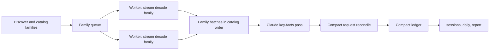

# Feature: Scalable Whole-History Ingestion

## Overview

urollup must report on the whole local history by default.
On the maintainer’s machine that history is about 2.7 GB of Claude Code logs in 2,920
files and 19 GB of Codex rollouts in 9,900 files (12 GB active and 7 GB archived, the
archive reached through a symlink), and Codex grows by up to about 1 GB a day.
The milestone 0.1 engine cannot read it: two unguarded runs grew a single process past
20 GB and stalled the machine, and the temporary 512 MiB input guard that followed made
`urollup sessions`, `daily` and `report --all` refuse the default corpus.
The guard prevented a crash; it did not make urollup usable.

This plan replaces the ingestion and reconciliation data model rather than tuning it.
Families of related sources decode in parallel into compact typed rows, one global pass
reconciles those rows, and reports read a compact ledger.
Peak memory then depends on the number of usage-bearing records, at a few hundred bytes
each, and never on raw log bytes.
The design was drafted from measurements and then reviewed in two rounds by an
independent architecture review, whose findings are incorporated here.

## Goals

- Whole-history `sessions`, `daily` and `report --all` succeed on the maintainer’s
  corpus with no input-size refusal.
- Peak physical footprint is independent of raw log bytes and stays at or below 512 MiB
  for that corpus, with about 300 MB expected.
- Whole-history wall time is at most 25 seconds after Phase 1 and at most 10 seconds
  after Phase 2 on the reference laptop (Apple M1 Pro, 10 cores, 32 GiB).
- Output is byte-identical for any worker count and invariant under source file
  renaming.
- Accounting semantics are preserved and proven against the current engine on every
  fixture, except for the documented changes under
  [Semantic Changes](#semantic-changes).
- A manual end-to-end QA playbook validates whole-history, per-project and per-session
  results on this machine’s real corpus.

## Non-Goals

- Spill to disk or external sort.
  At the measured ratios a 2 GiB compact-row ceiling covers roughly 8 million
  observations, hundreds of gigabytes of Codex logs.
- A user-facing memory-budget flag.
- A `--since` or `--project` filter, the capture cache or incremental reads.
  Whole history in seconds removes the need for this milestone, and time filters remain
  query-time features.
- Candidate-token sets, lineage links, tool actions, gaps and account attribution, none
  of which any adapter produces today.
  They return with their first real producer.

## Background

### Incidents

On 2026-09-16 a QA run of `urollup daily --all` over the default corpus reached roughly
40 GB and restarted the Codex desktop app.
Minutes later, an agent’s `tbd create` description contained a backtick-quoted
`urollup daily --all`; shell command substitution ran the globally installed binary over
the same corpus, which reached a 23.2 GB footprint in 79 seconds.
The
[milestone 0.1 QA report](../../qa/qa-report-2026-09-16-milestone-0.1.md#crash-investigation)
records the evidence.

### Measurements

A temporary in-process probe recorded physical footprint, including compressed pages, at
phase boundaries on real-log slices that fit under the guard:

| Slice | Input | Records decoded | Observations | Requests | Peak footprint | Wall |
| --- | ---: | ---: | ---: | ---: | ---: | ---: |
| One Claude project | 451 MiB | 56,011 | 55,995 | 27,670 | 534 MiB | 2.8 s |
| One Codex day | 447 MiB | 17,752 | 7,231 | 7,210 | 192 MiB | 2.2 s |

On the Claude slice, decoded records held 60 MiB, building observations raised the
footprint to 258 MiB (about 3.5 KB per observation), reconciliation peaked at 534 MiB,
and the returned result retained about 228 MiB (about 8 KB per request).
The Codex result retained about 120 MiB for 7,210 requests and 1,009 limit observations.
Extrapolated, the whole corpus needs more than 7 GB and about 90 seconds on one thread.

The earlier
[throughput spike](../../research/research-2026-09-13-portable-agent-usage.md#local-log-volume-and-throughput)
read about 11.4 GiB of the same kind of logs in 6.7 seconds on 10 threads at 110–190 MiB
peak RSS, using a byte prefilter and borrowed typed parsing.
The workload is feasible; the engine’s data model is the problem.

### Root Causes

- **Everything is retained before it is reduced.** Both adapters keep a decoded record
  for every usage line of every source (`claude_project.rs` pushes into one
  `Vec<ParsedRecord>`; `codex_rollout.rs` retains `ParsedSource.records` with each
  record’s `serde_json::Value`), then build all observations, then reconcile, with each
  stage’s full output alive at once.
- **Rows are string-heavy.** `RequestObservation` carries an owned dialect string,
  `ScopedKey` vectors, invariant and candidate maps; `Request` carries `StoredIdentity`
  strings, aliases, every revision, and `EvidenceRef` vectors that each clone a
  source-ID string. The identity registry and link graph key maps by string.
- **Limit observations are materialized before they collapse.** Codex clones the whole
  `rate_limits` object per window, and consecutive duplicates are removed only after
  every row exists.
- **Every line is parsed into a full JSON DOM,** including message content that
  accounting never reads.
- **Diagnostics are one row per occurrence,** which yields tens of thousands of rows on
  a real corpus.

### Cross-Family Coupling and an Ordering Bug

Codex families, the connected components of rollout header links, partition cleanly.
Claude semantics are partly global:

- `normalize` builds `message_owners` and `uuid_owners` over all sessions and derives
  `ambiguous_messages` globally (`claude_project.rs:489-513`), which switches a
  message’s key from provider scope to session scope.
- A resumed session creates a `Thread` for the foreign session and a Fork edge to it
  (`claude_project.rs:515-529`).

Because of this coupling, per-family reconciliation followed by global deduplication was
rejected.

The owner maps are also built first-wins in discovery order, and only forced copies are
excluded.
When a resuming session’s file sorts before the original, the replay claims the
uuid and the original request becomes a copy.
Renaming only the resuming session file in two fixtures reproduces lost usage:
`gateway-message-id-reuse` drops from 3 owned requests and 192 tokens to 1 owned plus 1
ambiguous and 140 tokens, and `brief-double-counting` drops from 40,603 to 40,015
tokens. Session files are named by UUID, so real results depend on random name order.
This is bead `uro-sn1e`.

## Design

### Approach

Decode per family, in parallel, into compact rows; reconcile once, globally, over the
compact rows; query the compact ledger.



1. **Discover and catalog.** The existing catalog groups sources into families: a Claude
   session with its subagents, and a Codex link-connected component.
   The 512 MiB guard and `ensure_discovery_capacity` are removed.
2. **Decode families on bounded workers.** Workers default to
   `min(available_parallelism, 8)` with a `UROLLUP_JOBS` override and pull families in
   catalog order with a small in-flight window.
   Each source is read in one streaming pass with a reused line buffer; no decoded
   record outlives its line.
   All family-local logic stays in the decoder: Codex cumulative counters, epochs,
   copied history, turn contexts and fork detection, and Claude inline sidechains,
   tool-owner spawn edges and progress nesting.
   Claude reads the main transcript before its subagents; Codex reads root rollouts
   before children. The Codex choice between direct token records and cumulative counters
   is a whole-file property, so the decoder runs both state machines in the pass and
   keeps one at the end of the file.
   Limit observations collapse consecutive duplicates while streaming, per source.
   A worker emits a `FamilyBatch` of manifest entries, threads, relationships,
   observations, collapsed limit rows, aggregated diagnostics and coverage counters.
3. **Assemble globally, on one thread.** Batches concatenate in catalog order.
   A source table assigns each source a `u32` and a canonical rank.
   Thread and relationship reconciliation run as today over about 11,000 rows.
   The Claude key-facts pass builds hash maps from message and uuid digests to
   `(thread, canonical position)` over original-eligible records only, excluding forced
   copies and session-mismatch replays, which fixes the ordering bug.
   It also builds the per-message model sets that decide `ambiguous_messages`, then
   finalizes each Claude observation’s key choice, role and owner.
4. **Reconcile requests compactly.** Observations sort by canonical evidence position.
   An index-based union-find groups observations that share a key digest.
   A group whose observations disagree on the model splits into artifact-local requests
   that form a candidate set.
   Each group builds one `Req`, and the observations are consumed group by group and
   then freed.
5. **Query the compact ledger.** `accounting::totals`, `query` and `SessionIndex` read
   `Req` and compact thread rows.
   `SessionIndex::add` uses a source-to-thread map instead of scanning sources per
   thread.

### Compact Data Structures

Sizes are approximate and guarded by `const` assertions.

| Type | Contents | Size |
| --- | --- | ---: |
| `Evidence` | source `u32`, length `u32`, offset `u64` | 16 B |
| `KeyDigest` | SHA-256 bytes 0–15 as `u128` ID, bytes 16–23 as a check, kind, precedence, basis | 32 B |
| `Measures` | eight `u64` token measures with a presence mask | 72 B |
| `Obs` | evidence, one or two key digests, measures, timestamp, sequence, thread, interned model and effort, role and owner flags, uuid digest, optional advisor components and message ID | ≤ 256 B |
| `Req` | ID digest and basis, counting, ownership, first and last seen, interned model and effort, measures, selected evidence, evidence range, copy count, advisor components | ≤ 256 B |
| `LimitRow` | evidence, owner IDs, interned name and window, native fields as compact JSON text | about 250 B |

Every evidence reference is kept in a flat side table, about 10 MB for the corpus.
Models, efforts and native thread IDs are interned per corpus.

Key digests are the existing identity contract: workers write RFC 8785 canonical JSON
into a reused buffer and hash it with SHA-256, and a property test pins the helper to
`IdentityKey::derive_id` so stored IDs never change.
Grouping uses the 128-bit ID; a group whose 64-bit checks disagree is a collision and
fails with an identity error, replacing the request identity registry.
Reports print no `req-` IDs, so public ID text is derived only where needed.

### Memory Model

Peak footprint is roughly 230 B per Claude observation, 150 B per Codex observation, 230
B per request, 16 B per evidence reference, about 1 KB per source, about 500 B per
thread, and one line buffer plus pending rows per worker.
For the maintainer’s corpus that is about 300 MB, reached while observations and
requests coexist during request construction, and about 170 MB during queries.
A 100 GB Codex corpus would peak at about 700 MB.

Raw bytes never accumulate: skipped lines allocate nothing, the reader buffer is per
source, and limits collapse while streaming.
An internal ceiling of 2 GiB of compact rows exits 1 with a capacity diagnostic that
names the row count and suggests `--source`; it is a safety net, not a budget users
tune. `reconcile` checks it before building any request: `MAX_OBSERVATIONS` is 2 GiB
divided by the size of one request observation row, so the ceiling follows the row type
as it shrinks, and each agent’s reconciliation is checked on its own.
At a 448 B row the ceiling is 4,793,490 observations; whole history has about 680,000.
The CLI reports `N request observations exceed the reconciliation capacity of M compact
rows (2 GiB); pass narrower --source roots with --no-default-sources`.

### Parallelism and Determinism

Family batches are slotted by catalog index, and every global step sorts by canonical
position or ID. Output is byte-identical for one or eight workers, and tests enforce it.

### Diagnostics

Diagnostics aggregate per code during decoding and assembly: `count` sums occurrences,
`detail` is the first occurrence’s detail in canonical order, and up to three sample
evidence references stay in the ledger.
`DiagnosticSummary` keeps its shape, so `REPORT_SCHEMA_VERSION` does not change.

### Removed From the Engine

The following have no producer today and are removed until one exists:
`candidate_tokens` and their union, `LineageLink` and `links`,
`OwnerEvidence::Candidates`, `tool_actions`, `gaps`, account attribution beyond the
report’s `unknown` bucket, `Request.aliases`, `native_request_id` and
`native_response_id`, `TokenUsage.native`, per-revision usage, `model_usage` entries
that duplicate the primary usage (advisor components stay), and the request identity
registry and string link graph.

Kept: reread deduplication, the conflicting-shared-key split, owner and model conflict
diagnostics, Claude block-conflict detection computed while building requests, candidate
sets from splits, compact limit observations, coverage counters, and thread and
relationship reconciliation.

### Semantic Changes

- Claude owner maps use canonical order over original-eligible records.
  This fixes lost and misattributed usage from resumed sessions; design §3.4 is updated.
- The request-key collision guard is agreement of 192 digest bits instead of a string
  registry.
- Diagnostics are aggregated per code with samples.
- The ledger keeps the selected revision and all evidence references, but not native
  counter maps or every revision’s usage.

### CLI and Output Changes

No flags change. The input-size error disappears, `UROLLUP_JOBS` sets the worker count,
and `UROLLUP_STATS=1` prints phase timings, row counts and workers to stderr.
Report JSON keeps its schema version; `sessions` rows gain an additive `session` field
with the native session ID, and diagnostic rows change where fixtures emit repeated
codes.

`UROLLUP_STATS` parses like `UROLLUP_JOBS`: unset, empty or `0` disables it, `1` enables
it, and any other value is a usage error.
Each measurement is one `stats:` line of `key=value` pairs, written to stderr after the
command runs and before its output or error.
This is a whole-history `sessions --all` run on 2026-09-17 (`UROLLUP_JOBS` unset, on a
loaded machine):

```text
stats: workers=8
stats: phase=discovery seconds=5.485
stats: phase=claude_ingest seconds=3.825
stats: phase=codex_ingest seconds=7.466
stats: phase=session_index seconds=1.046
stats: phase=query_render seconds=0.096
stats: agent=claude sources=1686 observations=393175 requests=181231 limit_observations=332 diagnostics=96
stats: agent=codex sources=8831 observations=288086 requests=287038 limit_observations=82397 diagnostics=818
stats: total seconds=17.986
```

A failed command prints only the phases it finished.
The lines hold phase names, wall times and counts, never paths, IDs or model names, so
QA reports may quote them.

## Implementation Plan

### Phase 1: Whole History Works

- [x] Fix the Claude owner-map ordering bug (`uro-sn1e`) in the current engine, with
  renamed-file cases for `gateway-message-id-reuse` and `brief-double-counting`, so the
  oracle is correct before the rewrite.
- [ ] Add a projection oracle test comparing the current engine with the new one on all
  fixture cases: totals, per-thread owned totals, counting classes, ownership, selected
  evidence, limit counts and diagnostic occurrence sums.
- [ ] Introduce `Evidence`, `KeyDigest`, `Measures`, `Obs`, `Req`, `LimitRow` and
  interning tables with size assertions, and the canonical-JSON digest helper pinned to
  `IdentityKey::derive_id`.
- [ ] Convert both adapters to streaming per-family decoders that emit `FamilyBatch`,
  still parsing with `serde_json::Value`, with streaming limit collapse and per-code
  diagnostics.
- [ ] Implement global assembly: source table, thread and relationship reconcile, the
  Claude key-facts pass and compact request reconciliation.
- [ ] Port `accounting::totals`, `query` and `SessionIndex` to the compact ledger.
- [x] Add the bounded family worker pool and `UROLLUP_JOBS`, with worker-count and
  file-rename invariance tests.
- [x] Remove the 512 MiB guard and the read budgets it required; add the 2 GiB
  compact-row ceiling and `UROLLUP_STATS`.
- [x] Add the native session ID as an additive `session` field on `sessions` rows, so
  whole-history results join to ccusage in one pass.
- [x] Update CLI goldens and `scripts/check-e2e-results.mjs` for aggregated diagnostics.

Acceptance: `make check` passes; whole-history `sessions`, `daily` and `report --all` on
the maintainer’s corpus exit 0 in at most 25 seconds at no more than 512 MiB peak
footprint; one and eight workers give identical JSON.

### Phase 2: Fast Decode and Scale Gates

- [ ] Replace `Value` decoding on the hot path with borrowed typed structs (`Cow<str>`
  with `#[serde(borrow)]`, small `{type, id}` content blocks) and `memmem` prefilters;
  keep `Value` only for `quotaLimits` and `rate_limits` lines.
- [x] Add a streaming synthetic corpus generator that writes families from fixture
  templates into a temporary directory under a byte cap, with part of Codex
  zstd-compressed.
- [x] Add CI scale tests: a raw-bytes independence test (identical usage records with
  heavily padded content differ by less than 64 MiB peak), a footprint extrapolation
  bound, and `daily --all` on the generated corpus under the watchdog at 512 MiB in
  `make test`.

Acceptance: outputs are byte-identical to Phase 1; whole history takes at most 10
seconds; the scale gates pass in CI.

### Phase 3: Acceptance and Cleanup

- [x] Replace the per-session urollup invocations in `tests/parity/local_diff.py` with
  one whole-history run joined on the native `session` field.
- [ ] Execute the
  [full-history QA playbook](../../../../tests/qa/full-history-rollup.qa.md) on this
  machine and commit a privacy-safe dated QA report.
- [ ] Update design §3.4 and §8.3, the main implementation plan and the README status.
- [ ] Delete the old engine and the projection oracle once the QA report is accepted.

Acceptance: the QA playbook passes, and milestone 0.1 local acceptance is recorded
without an input-size limitation.

### Progress

Implementation compacts the existing engine in place rather than building a second
engine beside it. Each step keeps fixture, snapshot, golden, fixture-result and parity
gates green, and its release build is compared back to back with the previous build on
real-log slices: report, daily and sessions JSON must be identical apart from live
sessions that append between the two runs.
The steps so far:

- Fix the owner-map ordering bug (`af5f012`) before any rewrite.
- Store analytical IDs as 17-byte digests, drop native usage maps and stored revisions,
  and reconcile requests by 192-bit key digest instead of a string registry.
- Decode Codex records into typed rows, collapse limit snapshots while streaming, and
  skip irrelevant Codex lines with a byte prefilter.
- Reconcile without copying observations: an index-based union-find over key digests,
  groups built by sorting indices, observation heap released per group, and requests in
  a sorted vector.
- Decode sources on bounded parallel workers with `UROLLUP_JOBS`.
- Aggregate diagnostics per code, add the `session` field, and join local parity in one
  pass.
- Keep observation keys and invariants inline, and remove candidate tokens, candidate
  owners and account attribution.
- Remove the input guard and the read budgets, add the reconciliation capacity ceiling,
  and add `UROLLUP_STATS`.

Whole-history measurements on 2026-09-16 used a local build with the input guard raised,
under the RSS watchdog, on the maintainer’s corpus:

| Input | Requests | Earlier result | Latest measurement |
| --- | ---: | --- | --- |
| Codex 2026-07, 1.6 GB | 68,921 | refused by the guard | 160 MiB, 1.5 s (`cf9b704`) |
| Codex 2026-09, 8.4 GB | 139,375 | refused by the guard | 306 MiB, 6.5 s (`cf9b704`) |
| All Claude projects, 2.8 GB | 176,634 | 1,386 MiB, 14.3 s (`1924d8f`) | 860 MiB, 11 s (`e9fe862`) |
| Claude projects and active Codex sessions, without the 7 GB archive | 461,049 | above 20 GB (milestone 0.1 engine) | 963–1,028 MiB, 22–24 s (`9f290e6`) |
| Default whole history, including the Codex archive, `sessions --all` | 789,000 | above 20 GB (milestone 0.1 engine) | 1,136–1,146 MiB, 23–30 s on a loaded machine (`c332aba`) |

Whole history now completes within the Phase 1 time target.
Compacting the Claude adapter’s decoded records and owner maps (`8bd7580`) cut the full
Claude corpus from 860 MiB to about 395 MiB. Measurements before 2026-09-17 used
`--source ~/.codex/sessions` and so left out the archived Codex history, which holds
320,000 more observations; with it, the default whole history has about 394,000 Claude
and 609,000 Codex observations and peaks at about 1.14 GB, over twice the 512 MiB goal.
Codex observations are nearly one per request, so row size sets that peak; compacting
Codex decoded records and the observation and request rows is in progress.

After the guard was removed, a release build ran `sessions --all` over the Claude
projects and active Codex sessions, without the archive, on 2026-09-17 under a 2 GiB
watchdog on a loaded machine: it exited 0 at 878 MiB peak RSS in 18.6 s over 468,269
requests. The `UROLLUP_STATS` example under
[CLI and Output Changes](#cli-and-output-changes) is that run.

## Testing Strategy

- **Oracle equivalence:** the projection test compares engines on every fixture until
  Phase 3.
- **Properties:** proptest generates multi-family corpora with Claude resumed sessions,
  uuid replays, gateway message-ID reuse, progress nesting and Codex forks with copied
  token records and legacy counters; results must match the oracle and be invariant
  under file renaming and worker count.
- **Existing gates:** fixtures, snapshots (regenerated once for compact shapes), CLI
  goldens, fixture results and ccusage parity pass; the parity ledger does not change.
- **Scale:** size assertions, the synthetic generator, raw-bytes independence and the
  watchdog gate in Phase 2.
- **Manual acceptance:** the full-history QA playbook on the real corpus, including
  cross-checks against pinned ccusage 20.0.20 and a hand-summed session.

## Rollout Plan

Each phase lands as a stacked pull request with `make check` green.
Phase 1 removes the guard and makes the default commands usable; the developer binary is
reinstalled after each phase, and the 0.1.0 release waits for Phase 3.

## Open Questions

Each has a recommended default that implementation follows unless the maintainer decides
otherwise.

- Should diagnostics aggregate per code with samples?
  Default: yes.
- Is 192-bit digest agreement an acceptable request-key collision guard?
  Default: yes.
- Should the ledger keep every revision’s usage (about 27 MB) or only the selected
  revision? Default: selected only.
- Should archived zstd Codex history be read by default?
  Default: yes.
- Is `min(available_parallelism, 8)` the right worker default?
  Default: yes, with `UROLLUP_JOBS`.

## References

- [urollup design](../../../urollup-design.md) §3 reconciliation, §4.2 ownership and
  §8.3 uncached engine
- [Milestone 0.1 implementation plan](plan-2026-09-13-urollup-cli-and-web.md)
- [Milestone 0.1 QA report](../../qa/qa-report-2026-09-16-milestone-0.1.md)
- [Portable agent usage research](../../research/research-2026-09-13-portable-agent-usage.md)
  on local log volume and throughput
- [Full-history QA playbook](../../../../tests/qa/full-history-rollup.qa.md)
- Beads `uro-o6x5` (stream or spill all-log aggregation) and `uro-sn1e` (owner-map
  ordering bug)

<!-- This document follows common-doc-guidelines.md.
See github.com/jlevy/practical-prose and review guidelines before editing.
-->
