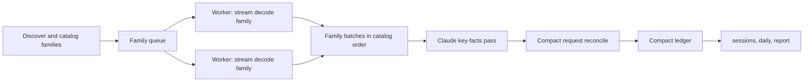

# Feature: Scalable Whole-History Ingestion

## Overview

urollup must report on the whole local history by default.
On the maintainer’s machine that history is about 2.7 GB of Claude Code logs in 2,920
files and 19 GB of Codex rollouts in 9,900 files (12 GB active and 7 GB archived, the
archive reached through a symlink), and Codex grows by up to about 1 GB a day.
The engine at the start of this plan could not read it: two unguarded runs grew a single
process past 20 GB and stalled the machine, and the temporary 512 MiB input guard that
followed made `urollup sessions`, `daily` and `report --all` refuse the default corpus.
The guard prevented a crash; it did not make urollup usable.

This plan replaces the ingestion and reconciliation data model rather than tuning it.
Families of related sources decode in parallel into compact typed rows, one global pass
reconciles those rows, and reports read a compact ledger.
Peak memory depends primarily on usage-bearing records and retained identity state.
Raw transcript bytes are streamed; record density, payload cardinality and
reconciliation overhead determine how much history fits in memory.
The design was drafted from measurements and then reviewed in two rounds by an
independent architecture review, whose findings are incorporated here.

The [governing PR review](../../reviews/review-2026-09-19-pr-stack-and-memory.md) tracks
stabilization findings, validation evidence and remaining merge conditions.
The implementation stack is now merged at main `4c55617`; historical measurements below
describe their named revisions, not acceptance of the merged head.
Representative performance and full-history QA remain open.
The accounting correction under `uro-kpbp` handles paginated inherited prefixes without
foreign session headers, including copies whose parent identity is missing.
Copy-only usage stays excluded from counted totals; whether it should also make coverage
incomplete is the open decision `uro-xpd0`. Synthetic fork tests and exploratory
real-history runs exercise the correction; accepted-head QA and process-wide memory
admission remain release requirements.
The [usage-analysis workflow plan](plan-2026-09-20-usage-analysis-workflow.md) owns
multi-view reuse and G5. Decode improvements here and avoiding repeated decoding there
are complementary; neither substitutes for the other’s acceptance tests.

## Goals

- Whole-history `sessions`, `daily` and `report --all` succeed on the maintainer’s
  corpus with no input-size refusal.
- Whole-process memory remains manageable on the reference laptop (Apple M1 Pro, 10
  cores, 32 GiB), with the measurable envelope below.
- Demonstrate linear retained-state growth and a conservative projection for 100 GiB
  histories at representative record densities; raw input may exceed physical RAM.
- Record throughput and phase timings and investigate regressions against equivalent
  workloads. There is no fixed whole-history wall-time threshold.
- Output is byte-identical for any worker count and invariant under source file
  renaming. Whether a run near the memory budget refuses does not depend on the worker
  count either, except that at budgets of at least 9 × 8 × `H` × `b` (about 2–3 GiB at
  the placeholders) an explicit `UROLLUP_JOBS` above 8 charges more worker slots
  ([Admission Determinism](#admission-determinism)).
- Accounting semantics are preserved and proven against the current engine on every
  fixture, except for the documented changes under
  [Semantic Changes](#semantic-changes).
- A manual end-to-end QA playbook validates whole-history, per-project and per-session
  results on this machine’s real corpus.

## Non-Goals

- Automatic spill or external sort in milestone 0.1. Dense histories that exceed the
  validated memory budget must fail early and clearly.
  Completing those histories through hybrid spill is tracked in `uro-924y`.
- A `--since` or `--project` filter, the capture cache or incremental reads.
  Reusable artifacts and incremental caching have existing owners in `uro-6kwn` and
  `uro-xm48`; they avoid repeated decode but do not replace memory-safety acceptance.
- Candidate-token sets, lineage links, tool actions, gaps and account attribution, none
  of which any adapter produces today.
  They return with their first real producer.

## Accepted Scale and Memory Policy: 2026-09-27

The maintainer approved replacing the representative 512 MiB and 10-second release gates
with practical memory and scale acceptance.
Those old thresholds are retired, not achieved.
The dated experiments below remain useful evidence for avoiding ineffective changes.
Fixed limits on small synthetic CI workloads remain regression checks.

Milestone 0.1 keeps the compact in-memory reconciliation path.
Phase 2 (`uro-zrr0`) requires all of the following before G1 and release acceptance:

| Check | Acceptance |
| --- | --- |
| Reference history | Release `sessions`, `daily` and `report` complete with correct output, normal machine memory pressure and peak physical footprint no greater than 25% of physical RAM (8 GiB on the reference laptop). Measure complete invocations, including both agents, reconciliation and rendering. |
| Observation scaling | Measure at least three increasing unique-observation counts for Claude-heavy, Codex-heavy and mixed histories. Include distinct IDs, high-cardinality limit payloads and long session families. The measured envelope must be consistent with linear retained-state growth; explain any departure before acceptance. |
| Raw-byte independence | At fixed observations and accounting metadata, padding ignored transcript content changes peak memory by less than the existing 64 MiB regression allowance. Prove streaming of input larger than an enforced process allowance using synthetic logs and bounded generation. |
| 100 GiB operating envelope | Use measured observation density and an upper linear envelope across measured counts, with an explicit margin for uncertainty, to project each command at 100 GiB. The projection must fit within 25% of reference-machine RAM. Label this a projection until a full-size run is measured; a single footprint/raw-byte ratio is insufficient. |
| Capacity safety | One conservative invocation-wide budget covers both agent ledgers and peak construction overlap. Dense over-budget inputs fail before exhausting memory, with an actionable error and no partial successful report. Low-budget, high-cardinality and combined-agent tests demonstrate the boundary. |
| Correctness and regressions | Fixture accounting, one/eight-worker output equality on a reproducible input boundary, and existing synthetic CI gates pass. Record wall time, throughput, worker count, load and cache state; investigate regressions against equivalent workloads under the main plan’s regression policy. |

G1 and the complete accounting/parity QA playbook follow this Phase 2 gate and remain
separate Phase 3 release requirements.

Physical footprint, OS maximum RSS and sampled watchdog RSS are different metrics.
Use physical footprint for macOS acceptance and record RSS separately; a watchdog is a
last-resort test kill switch, not proof of the runtime budget.
Select its limit with machine headroom before a run, and stop on warning or critical
memory pressure. A watchdog kill fails acceptance.
For other platforms, document the available peak metric and any enforcement limits.

`uro-6pi8` owns process-wide admission, `uro-z1h1` owns scale proofs, and `uro-erqo`
owns representative accepted-head evidence.
The current per-agent row-shell ceiling does not satisfy the capacity-safety check.
Reserve for pending rows, variable payloads, intern tables, source/thread metadata,
worker buffers, key graphs, request construction and already retained ledgers, with
headroom for allocator overhead.
Account for process/container allowances where available, and document fallback and
explicit overrides. Preserve `--max-rows` as a separate row ceiling and document the
change in `--max-ram` semantics when implementation lands.

Input bytes can exceed RAM because transcript content is streamed.
Completion when the retained reconciliation state itself exceeds the budget is a
separate follow-up (`uro-924y`): keep the in-memory path and spill compact partitioned
or sorted runs when needed.
The design must preserve global ownership and identity links across partitions, exact
accounting and ordering, while bounding merge memory and handling disk-full,
cancellation, privacy and cleanup.
No spill implementation is claimed by this decision.

Keep private-corpus captures and derived measurements local unless their publication is
separately authorized.
Public evidence uses synthetic or sanitized corpora.
Record local evidence outside disposable scratch; shared beads may record completion
status without copying private values.

## Background

### Incidents

On 2026-09-16 a QA run of `urollup daily --all` over the default corpus reached roughly
40 GB and restarted the Codex desktop app.
Minutes later, an agent’s `tbd create` description contained a backtick-quoted
`urollup daily --all`; shell command substitution ran the globally installed binary over
the same corpus, which reached a 23.2 GB footprint in 79 seconds.
The
[milestone 0.1 QA report](../../qa/qa-report-2026-09-16-milestone-0.1.md#crash-investigation)
records the evidence.

### Measurements

A temporary in-process probe recorded physical footprint, including compressed pages, at
phase boundaries on real-log slices that fit under the guard:

| Slice | Input | Records decoded | Observations | Requests | Peak footprint | Wall |
| --- | ---: | ---: | ---: | ---: | ---: | ---: |
| One Claude project | 451 MiB | 56,011 | 55,995 | 27,670 | 534 MiB | 2.8 s |
| One Codex day | 447 MiB | 17,752 | 7,231 | 7,210 | 192 MiB | 2.2 s |

On the Claude slice, decoded records held 60 MiB, building observations raised the
footprint to 258 MiB (about 3.5 KB per observation), reconciliation peaked at 534 MiB,
and the returned result retained about 228 MiB (about 8 KB per request).
The Codex result retained about 120 MiB for 7,210 requests and 1,009 limit observations.
Extrapolated, the whole corpus needs more than 7 GB and about 90 seconds on one thread.

The earlier
[throughput spike](../../research/research-2026-09-13-portable-agent-usage.md#local-log-volume-and-throughput)
read about 11.4 GiB of the same kind of logs in 6.7 seconds on 10 threads at 110–190 MiB
peak RSS, using a byte prefilter and borrowed typed parsing.
The workload is feasible; the engine’s data model is the problem.

### Root Causes

- **Everything is retained before it is reduced.** Both adapters keep a decoded record
  for every usage line of every source (`claude_project.rs` pushes into one
  `Vec<ParsedRecord>`; `codex_rollout.rs` retains `ParsedSource.records` with each
  record’s `serde_json::Value`), then build all observations, then reconcile, with each
  stage’s full output alive at once.
- **Rows are string-heavy.** `RequestObservation` carries an owned dialect string,
  `ScopedKey` vectors, invariant and candidate maps; `Request` carries `StoredIdentity`
  strings, aliases, every revision, and `EvidenceRef` vectors that each clone a
  source-ID string. The identity registry and link graph key maps by string.
- **Limit observations are materialized before they collapse.** Codex clones the whole
  `rate_limits` object per window, and consecutive duplicates are removed only after
  every row exists.
- **Every line is parsed into a full JSON DOM,** including message content that
  accounting never reads.
- **Diagnostics are one row per occurrence,** which yields tens of thousands of rows on
  a real corpus.

### Cross-Family Coupling and an Ordering Bug

Codex families, the connected components of rollout header links, partition cleanly.
Claude semantics are partly global:

- `normalize` builds `message_owners` and `uuid_owners` over all sessions and derives
  `ambiguous_messages` globally (`claude_project.rs:489-513`), which switches a
  message’s key from provider scope to session scope.
- A resumed session creates a `Thread` for the foreign session and a Fork edge to it
  (`claude_project.rs:515-529`).

Because of this coupling, per-family reconciliation followed by global deduplication was
rejected.

The owner maps are also built first-wins in discovery order, and only forced copies are
excluded.
When a resuming session’s file sorts before the original, the replay claims the
uuid and the original request becomes a copy.
Renaming only the resuming session file in two fixtures reproduces lost usage:
`gateway-message-id-reuse` drops from 3 owned requests and 192 tokens to 1 owned plus 1
ambiguous and 140 tokens, and `brief-double-counting` drops from 40,603 to 40,015
tokens. Session files are named by UUID, so real results depend on random name order.
This is bead `uro-sn1e`.

## Design

### Approach

Decode per family, in parallel, into compact rows; reconcile once, globally, over the
compact rows; query the compact ledger.


```mermaid
flowchart LR
  D[Discover and catalog families] --> Q[Family queue]
  Q --> W1[Worker: stream decode family]
  Q --> W2[Worker: stream decode family]
  W1 --> B[Family batches in catalog order]
  W2 --> B
  B --> K[Claude key-facts pass]
  K --> R[Compact request reconcile]
  R --> L[Compact ledger]
  L --> O[sessions, daily, report]
```

1. **Discover and catalog.** The existing catalog groups sources into families: a Claude
   session with its subagents, and a Codex link-connected component.
   The 512 MiB guard and `ensure_discovery_capacity` are removed.
2. **Decode families on bounded workers.** Workers default to
   `min(available_parallelism, 8)` with a `UROLLUP_JOBS` override and pull families in
   catalog order with a small in-flight window.
   Each source is read in one streaming pass with a reused line buffer; no decoded
   record outlives its line.
   All family-local logic stays in the decoder: Codex cumulative counters, epochs,
   copied history, turn contexts and fork detection, and Claude inline sidechains,
   tool-owner spawn edges and progress nesting.
   Claude reads the main transcript before its subagents; Codex reads root rollouts
   before children. The Codex choice between direct token records and cumulative counters
   is a whole-file property, so the decoder runs both state machines in the pass and
   keeps one at the end of the file.
   Limit observations collapse consecutive duplicates while streaming, per source.
   A worker emits a `FamilyBatch` of manifest entries, threads, relationships,
   observations, collapsed limit rows, aggregated diagnostics and coverage counters.
3. **Assemble globally, on one thread.** Batches concatenate in catalog order.
   A source table assigns each source a `u32` and a canonical rank.
   Thread and relationship reconciliation run as today over about 11,000 rows.
   The Claude key-facts pass builds hash maps from message and uuid digests to
   `(thread, canonical position)` over original-eligible records only, excluding forced
   copies and session-mismatch replays, which fixes the ordering bug.
   It also builds the per-message model sets that decide `ambiguous_messages`, then
   finalizes each Claude observation’s key choice, role and owner.
4. **Reconcile requests compactly.** Observations sort by canonical evidence position.
   An index-based union-find groups observations that share a key digest.
   A group whose observations disagree on the model splits into artifact-local requests
   that form a candidate set.
   Each group builds one `Req`, and the observations are consumed group by group and
   then freed.
5. **Query the compact ledger.** `accounting::totals`, `query` and `SessionIndex` read
   `Req` and compact thread rows.
   `SessionIndex::add` uses a source-to-thread map instead of scanning sources per
   thread.

### Compact Data Structures

These are as-built shell sizes and compile-time bounds, excluding owned allocations.
The original proposal used 72 B measures and observation/request bounds of 256 B.

| Type | Representation | Size or bound |
| --- | --- | ---: |
| `EvidenceRef` | source index, length and offset | 16 B |
| `Measures` | eight compact counters and presence mask; full-width overflow values interned | 36 B, including `Option` |
| `RequestObservation` | compact observations with optional owned payloads | ≤ 224 B |
| `Request` | compact request and evidence references | ≤ 216 B |
| `ProviderLimitObservation` | compact fields and references to interned native text | ≤ 128 B |
| `Option<NativeSequence>` | presence tag and eight big-endian bytes, preserving all `u64` values | 9 B |

Per-source string tables are released with their source data.
Names, native limit text and overflow-measure patterns use process-lifetime intern
tables; their heap storage is additional to these row sizes.
Evidence arrays, strings, maps and allocator overhead also remain outside the shell
bounds.
Repeated ingestion or a long-lived server needs separate cardinality and lifetime
measurements.

Key digests are the existing identity contract: workers write RFC 8785 canonical JSON
into a reused buffer and hash it with SHA-256, and a property test pins the helper to
`IdentityKey::derive_id` so stored IDs never change.
Grouping uses the 128-bit ID; a group whose 64-bit checks disagree is a collision and
fails with an identity error, replacing the request identity registry.
Reports print no `req-` IDs, so public ID text is derived only where needed.

### Memory Model

The original model estimated about 300 MB peak and 170 MB during queries for the
reference corpus, using 230 B per Claude observation, 150 B per Codex observation and
230 B per request. Its 100 GB Codex extrapolation was about 700 MB. These were design
estimates, not measured acceptance results; the dated measurements in
[Progress](#progress) show the higher observed footprint.
Private-corpus evidence is retained locally; this document records no new private
measurements.

The reader reuses bounded line buffers.
A shared admission counter per agent reserves retained observation rows during decode,
including pending representations; exceeding it cancels further work and reports a
capacity error. Reconciliation retains a second ceiling check before request
construction. The default byte budget is 25% of physical RAM, with a 2 GiB fallback when
the default host query fails.
`--max-ram` (or `UROLLUP_MAX_RAM`) accepts a byte size or percentage; `--max-rows`
supplies an exact row count.
The flag overrides the environment value, and when a RAM budget and row count are both
supplied, the smaller ceiling wins.
Explicit byte/row limits avoid host probing.
An explicitly requested percentage fails if physical RAM is unknown; only the default
uses the fallback. Native RAM queries do not impose a container allowance.

The byte budget is divided by `size_of::<RequestObservation>()`. At 224 B, 8 GiB admits
about 38 million row shells, but that arithmetic says nothing about whether their
payloads and final ledger fit in memory.
Payloads, intern tables, request construction, source/thread tables and the other
agent’s retained ledger are additional.
The budget is not a process RSS or physical-footprint limit.
The CLI capacity diagnostic names the row count and budget and suggests narrower
`--source` roots with `--no-default-sources`.

Acceptance still requires exact-head measurements of `sessions`, `daily` and `report`,
with corpus type/density, worker count and machine load recorded.
Keep sampled watchdog RSS, OS maximum RSS and macOS physical footprint distinct.
The historical tables below retain their original conditions and must not be relabeled
as current-head evidence.

Admission reserves a shared per-agent slot during decoding before retaining each
request-bearing record, including pending usage and copies that normalization may
subsequently discard.
Completed workers keep their reservations until ingestion ends.
The first refused slot cancels the invocation and reports the ceiling plus one, a lower
bound rather than a full-input count.
Capacity failure takes precedence once that shared budget is exhausted.
Successful reads and ordinary source failures retain their existing ordering guarantees.
The ceiling bounds these rows, not total process memory: line buffers, metadata,
interned values, auxiliary ledger tables and the other agent’s ledger also consume
memory.

### Process-Wide Admission (uro-6pi8)

**Status:** design accepted (2026-10-09); slices 1 to 3 (budget source, ledger, and
model and harness) implemented, with only the row ceiling wired into ingestion.
[Implementation Notes](#implementation-notes) records choices the slices made where this
design left room. The maintainer settled the policy [decisions](#decisions) on
2026-10-09. Values marked *guess* are placeholders that the
[slices](#implementation-slices) measure or calibrate; *derived* values follow from type
sizes and growth patterns in the current code.

One byte ledger per invocation replaces the per-agent row-shell ceiling described under
[Memory Model](#memory-model).
Each component that holds memory is charged an upper bound of the heap bytes urollup
requests for it, before the allocation, and the invocation refuses as soon as the
charged total with headroom would exceed the budget.
The ledger bounds an estimate; it does not cap RSS or physical footprint, and a sampled
watchdog stays a test backstop.
[Validation](#validation-with-uro-z1h1) ties the estimate to measured footprint.

#### Budget Check

An invocation proceeds while, at every phase,

```text
F + H × (A_workers + A_large + E) ≤ B
```

- `B` is the budget ([Budget Source](#budget-source-and-flag-semantics)).
- `F` is the process baseline: binary, runtime, timezone data and C-library state.
  It is 1.25 × the larger of the macOS peak footprint and the Linux maximum RSS of a
  `report` over the smallest fixture (*guess* 16 MiB until measured).
  `H` does not multiply `F`.
- `A_workers` and `A_large` are the worker slots and the large-record permit
  ([Admission Determinism](#admission-determinism)).
- `E` is the modeled heap of the current phase: committed state plus the current agent’s
  charges.
- `H` covers allocator size-class rounding, memory the allocator keeps after frees, and
  pages that footprint or RSS count but urollup never requested.
  It applies to every charge, including zstd’s C allocations, whose requested size the
  worker slot charges explicitly.
  It is a *guess* of 1.5 until calibration.
- `F` and `H` are single code constants: the largest calibrated values across the
  allocators of the shipped binaries ([Validation](#validation-with-uro-z1h1)). `H` is
  an exact ratio with denominator 1,000, and `H × (A_workers + A_large + E)` rounds up.
  `H_cal` is the measured ratio that calibration derives `H` from; the two differ by the
  1.2 margin and the 1.1 floor.

Every charge follows one costing rule, so the numbers below come from code rather than
choice. Each term is an upper bound that a unit test checks against a counting allocator
for every count up to a few thousand:

- An allocation of `n` bytes costs `round_up(n, 16) + 16`.
- A vector that grows by doubling costs 3 × its elements, counting no fewer elements
  than the standard minimum capacity (8 of one byte, 4 of 2–1,024 bytes, otherwise 1),
  plus the allocation overhead of both buffers: when capacity `C` doubles, the old `C`
  and new `2C` buffers are both live, and `shrink_to_fit` has the same bound.
  A vector sized once costs one allocation of its capacity.
- A hash map or set costs its hashbrown table: 4 buckets below 4 entries, 8 below 8, and
  otherwise the next power of two at or above 8/7 × the entries, each bucket an entry
  plus one control byte, plus 16 control bytes; while it resizes, the half-size previous
  table is also live. A push site charges 3.5 × (entry + 1) per entry and, once per map,
  12 × (entry + 1) + 96 bytes, which bounds the table at every count.
- A B-tree map or set costs one node per five entries plus the root, because every
  non-root node of the standard B-tree holds at least five of its eleven entries; each
  node costs an internal node’s allocation.
  A push site charges the larger of 2.5 × entry and a fifth of a node per entry, plus
  one node per map.
- A stable sort (`sort`, `sort_by`, `sort_by_key`) of `n` elements of `s` bytes
  allocates up to `max(⌈n/2⌉, min(n, 8 MB / s), 48)` elements of scratch while it runs
  (the standard driftsort; scratch of 4 KiB or less stays on the stack), so it costs
  `allocation(max(n, 48) × s)`. A phase estimate includes the largest sort scratch the
  phase runs. `sort_unstable` allocates nothing, and `sort_by_cached_key` costs its
  vector of key and index pairs.

#### Reservation Model

| Component | Charged per | Charge | Basis | Held until |
| --- | --- | --- | --- | --- |
| Baseline `F` | invocation | measured | measured constant | exit |
| Discovery metadata | discovered source, catalog entry, Codex locator thread | struct plus owned path and string bytes of `DiscoveredSource`, `CatalogSource` and the thread-ID map | derived | that agent’s ingest returns |
| Coordinating slot | invocation | one worker slot `b` for the peeks that read sources on the coordinating thread: Codex catalog links for `--session` and `--source` classification | derived | the discovery checkpoint |
| Worker slot (`A_workers`) | slot | 128 KiB read buffer (`sources::reader::decode`); 256 KiB retained line (`ReadOptions::RETAINED_LINE_CAPACITY`); 16 MiB for line-buffer capacity up to 4 MiB, the line need `4 × C′` ([line buffers](#admission-determinism)), which also covers each Claude subagent’s `.meta.json` sidecar (read with `read_to_end` up to 1 MiB and parsed after the scan drops its line buffer); a 640 KiB document allowance for a `quotaLimits` document; 2 MiB thread stack; the join’s `done` vector at its minimum capacity, 12 × the `(index, result)` pair plus two allocations; when discovery found a `.zst` source, the frame loop’s decoder for an 8 MiB window (zstd 1.5.7’s `ZSTD_estimateDStreamSize` formula) plus its `ZSTD_DStreamInSize()` input buffer of 131,075 B, about 8.6 MiB; when it found a gzip source, flate2’s 32 KiB input buffer and miniz_oxide’s `InflateState` (a 32 KiB dictionary and decoding tables), charged as 80 KiB | derived; the 4 MiB, 8 MiB and 640 KiB thresholds are *guesses* | the agent’s decode ends |
| Large-record permit (`A_large`) | invocation | the largest need its holder has held at once: `4 × C′` for a line buffer whose capacity `C′` passes 4 MiB (256 MiB at `ReadOptions::DEFAULT_MAX_RECORD_BYTES`), plus the decoder for a zstd window above 8 MiB (about 129 MiB at zstd’s default limit, `ZSTD_WINDOWLOG_LIMIT_DEFAULT`), plus the running cost of a `quotaLimits` document past 640 KiB | derived | the agent’s decode ends |
| Decoded record | every retained record, request-bearing or not, including Codex rollouts pending for `normalize` and Claude copies and replays | 3 × its size: Claude ≤ 200 B, Codex 80 B (size assertions) | derived | Codex: its rollout is observed; Claude: its chunk is consumed by `reconcile_input` |
| Request structure (κ) | request-bearing record | the dialect’s largest per-record total over its later phases ([κ by dialect](#request-structure-by-dialect)) | derived | the retained ledger is committed |
| Source and thread rows | read source; thread; relationship; Codex `normalize` thread entry; Claude sidechain run | each source’s result at its deep size, charged before the worker returns it: its `ManifestEntry` (three owned strings, the path, a `StoredIdentity` with its kind and four key texts, and the twin, failure and change vectors), its `SourceArtifact` row and its thread and relationship rows; for each thread, a reserve for the `IndexedSession` the session index builds from the same strings; 3 × the size of the worker’s `(index, result)` pair, for the copies the join makes (the worker’s doubling `done` vector, then `results` beside `values`, then `values` beside the unzipped vectors); Codex `normalize`’s per-thread map entries and Claude’s inline-thread entries, charged where they are pushed | derived | the retained ledger is committed; the index reserve until the session-index checkpoint |
| Record payloads | allocation | exact bytes by the costing rule: per-source strings (Claude `Arc<str>`, vector slot and map entry; Codex 3 × text, 8 B end offset and map entry), Claude extras and tool-use digests, Codex usage counts, distinct rate-limit snapshots and session metadata, spilled keys, `model_usage` and invariants | derived | construction ends, or with the retained ledger |
| Limit row | provider limit observation | 3 × 128 B as built, or 128 B input plus its sort-cache tuple plus 128 B output during limit reconciliation, whichever is larger | derived | retained ledger |
| Diagnostic | occurrence | `Diagnostic`, its detail text and 16 B per evidence reference | derived | compaction; retained ones stay |
| Process interns | new distinct `Name`; new overflow `Measures` pattern | text allocation, leaked reference and B-tree entry; 72 B row in a vector plus its map key | derived from `names.rs` and `tokens.rs` | exit |
| Retained ledger | agent | deep size of `Ingested` after finalize, which replaces that agent’s decode and construction charges | computed | exit; discovery tables leave at `release_discovery` |
| Query reserve | request in a retained ledger | 48 B: at most one selected-request item and one request-size value per counted request, which a query may collect (`report` collects both), each 8 B at 3 × | derived | the query checkpoint |
| Session index | indexed thread | deep size of its `IndexedSession` | derived | exit |
| Query | selected request; selected session, day or group row | 48 B per selected request, plus the document cost per row | derived per request; per row *guess* until measured | exit |
| Render | rendered byte | 3 × the output buffer, charged as it grows | derived | exit |

Claude builds a `quotaLimits` object with a counting visitor that charges each node at
the costing rule before allocating it, and skips a value that is not an object without
building anything. A document uses the slot’s 640 KiB allowance while its running cost
fits it, and the allowance holds any document built from up to 4 KiB of text: the
densest, one-entry objects nested in each other, costs one B-tree leaf (632 B, 656 B by
the costing rule) per 5 bytes of text, about 131 ×. Past 640 KiB the visitor takes the
permit. `quota_limits` then builds a sorted view of the object and re-serializes it as
`native`; the view is charged first by the B-tree rule for its top-level entries, and
the text at the length a counting serializer reports, written once into a buffer of
exactly that capacity.

#### Request Structure by Dialect

κ is the largest of these per-record totals.
The key bound counts the key-graph nodes one observation can add, including the
artifact-local key of a split part; a unit test on each adapter’s observation builder
asserts it.

| Phase | Per request-bearing record | Codex | Claude |
| --- | --- | --- | --- |
| Construction | the observation (224 B) at 3 × while `normalize` or `reconcile_input` appends it; for Claude, owner state (owner and uuid map entries, the eligibility vector and the ambiguity map) and the eligibility vector’s stable-sort scratch (16 B per record) | 672 B | 672 B plus owner state and 16 B |
| Grouping | the observation, at its length: Codex’s `normalize` and, from slice 6, Claude’s `reconcile_input` shrink the observation vector before grouping, within the construction charge; per key, a key-graph node (30 B in three vectors at 3 ×, 16 B of slots at 1.5 ×) and one alias; 12 B of grouping order; the request (216 B) × 33/32 as presized; one evidence reference | key bound 1 | key bound 3 |
| Finalize | the request at 3 × (vector, sorted copy and shrink in `Requests::from_unsorted`) plus an 8 B permutation | 656 B | 656 B |
| Retained and query | the retained request (216 B and its references) plus the 48 B query reserve | about 0.3 KB | about 0.3 KB |
| κ | the largest phase | indicatively 0.7 KB | indicatively 1.0–1.1 KB |

The model closes two gaps in today’s admission, which retains but never charges Claude
`<synthetic>` records without a request ID and Codex session-meta, turn-context,
settings and zero-usage token-count records (`decode_with_admission` in both adapters).
`--max-rows` keeps counting request-bearing rows only.

#### Phases and Checkpoints

An invocation runs these phases in order: discovery of both agents; Codex decode,
construction (`normalize`), grouping (`reconcile_with_capacity`) and finalize
(`Requests::from_unsorted`, limit reconciliation, diagnostic compaction); the Codex
session index and `release_discovery`; the same for Claude, with the Codex ledger
committed; then query and render.

- **Discovery checkpoint:** before each agent’s decode, a checkpoint charges that
  agent’s worker slots; before Codex decode it also releases the coordinating slot.
- **Decode** runs on parallel workers.
  Before a record is pushed, it is charged its decoded size, κ when it bears a request,
  its payload allocations, its limit rows and any new process intern.
  Before a worker returns a source’s result, it charges the source and thread rows,
  including each thread’s index reserve.
  Because κ and those rows cover each record’s, source’s and thread’s share of every
  later phase through the session index, and of the query’s per-request working set,
  decode refuses as soon as the admitted records could not complete reconciliation, the
  session index and that working set, without reading the rest of the input.
  Day and group rows and rendered bytes, which no decode count bounds, can still refuse
  at query, after both ingests.
- **Checkpoints** run on the coordinating thread before each agent’s decode,
  construction, grouping, finalize, each session index and query.
  Each recomputes the phase estimate from exact counts, including the source and thread
  rows and the largest sort scratch the phase runs, replacing the forward charges, and
  refuses before the phase allocates.
  Growth inside a single-threaded phase that counts cannot predict (split keys,
  diagnostics, aliases, multi-record references) is charged where it is pushed.
- **Commit** after finalize releases the agent’s decode and construction charges and
  holds its retained ledger at its deep size, plus the query reserve for its requests
  and the index reserve for its threads.
  The session-index checkpoint replaces the index reserve with the index’s deep size.
  Worker slots and the permit are released at the construction checkpoint, when decode
  ends.
- **Query** replaces both query reserves with the exact count of selected requests and
  rows at its checkpoint.
  Rendering charges each growth of its output buffer before it grows, under the
  single-threaded rule above.

#### Admission Determinism

- Charges depend only on the input (record sizes, string bytes and distinct interned
  texts), never on capacity reached through timing.
- Within a parallel phase, charges never decrease, and release and commit happen only at
  checkpoints, after workers join.
  Charges are read-modify-write operations on one counter, so they are totally ordered.
  A charge is refused exactly when the running total would pass the budget, which
  happens if and only if the phase’s final total exceeds it, whatever the worker count
  or scheduling. Workers stop at their next record, as `Admission::stopped` does today.
- The process `Name` and overflow tables charge an insert only when it is new.
  `intern` and `intern_overflow` charge a new text under their table’s lock, before
  allocating it. A refused charge sets the stop flag, inserts nothing and returns a
  placeholder, so `Name::new` stays infallible; every phase checks the stop flag before
  it returns, so the capacity error wins and no result holding a placeholder is used.
  Which thread inserts first varies, but the total is the size of the distinct texts.
  Threshold tests run the binary, because tests in one process share these tables.
- **Worker slots:** `slots = clamp(⌊B / (8 × H × b)⌋, 1, max(8, UROLLUP_JOBS))`, where
  `b` is one slot’s charge, and decode runs on `min(workers, slots)` threads.
  The charge depends on the budget and on an explicit `UROLLUP_JOBS` above 8, never on
  the default worker count or on one to eight workers.
  Fewer threads never change output.
  An explicit `UROLLUP_JOBS` above 8 is therefore part of the input once
  `⌊B / (8 × H × b)⌋` passes 8, at budgets of at least 9 × 8 × `H` × `b` (2.0 GiB with
  plain slots and 2.9 GiB with zstd slots at the placeholders): at 8 GiB,
  `UROLLUP_JOBS=16` charges up to eight more slots, so a history near the threshold can
  succeed with 8 jobs and refuse with 16. Below that budget it changes nothing.
  Every slot is the same size for both agents; the 640 KiB `quotaLimits` allowance,
  which only Claude uses, keeps one `b` and one floor.
- **Large-record permit:** one worker at a time may grow a line buffer’s capacity past 4
  MiB, decode a zstd frame whose window exceeds 8 MiB, or build a `quotaLimits` document
  past 640 KiB; the others wait for it, and a waiting worker also watches the stop flag
  and returns when it is set.
  The permit is re-entrant for its holder, whose need is the sum of what it holds, such
  as a long line inside a wide frame.
  The holder keeps the permit until its need is gone: a line once its buffer is shrunk
  back to the retained capacity or dropped, after the visitor returns; a wide frame when
  its decoder drops; a document when it drops.
  Its charge is the largest need any holder has held at once, so the final charge is the
  input’s largest need in any order.
- **Line buffers:** both thresholds apply to a line buffer’s capacity, not to the line’s
  length. A line buffer starts at the 256 KiB retained capacity and grows only by
  doubling, to `C′ = min(2 × C, max_record_bytes)` from capacity `C`, with
  `reserve_exact`. A read appends at most one 128 KiB read-buffer chunk, so one doubling
  always suffices, and capacity never passes `max_record_bytes`. A line of capacity `C′`
  needs `4 × C′`, the larger of growth and parsing.
  Growing from `C` holds the old and new buffers, `C + C′`. Parsing holds the buffer
  plus serde_json’s scratch `Vec`, into which `SliceRead` copies every escaped string,
  including strings a lenient visitor skips; scratch grows by doubling, so it stays
  within 3 × the longest escaped string while it grows and 2 × afterwards, and the
  copies visitors keep share the line’s bytes, so the total stays within `4 × C′`. A
  probe measured up to 3.48 × `C′` for a long string whose first escape comes late.
  The slot’s 16 MiB line allowance is that need at `C′` = 4 MiB. Past 4 MiB, `read_line`
  takes the permit with the need before it grows (256 MiB at the default 64 MiB limit),
  and the scan shrinks the buffer and releases the permit once the visitor returns.
- **zstd frames:** the reader decodes zstd through its own frame loop over zstd’s
  streaming decoder (`zstd::stream::raw::Decoder`) rather than
  `zstd::stream::read::Decoder`, reading compressed bytes through its own input buffer
  of `ZSTD_DStreamInSize()` (131,075 B). Before the decoder sees a frame, the loop
  parses the frame header from that buffer (RFC 8878 §3.1.1.1: the magic number, the
  frame header descriptor and the window descriptor, or the content size of a
  single-segment frame).
  The window size includes the descriptor’s mantissa, so a 9 MiB window is not read as 8
  MiB. A window of up to 8 MiB decodes in the slot’s decoder, opened with
  `window_log_max(23)`. A window above 8 MiB and up to 2^27 takes the permit first,
  charged that window’s decoder, and decodes that one frame with a second decoder opened
  with `window_log_max(27)`, zstd’s default limit, which is dropped when the frame ends.
  A window above 2^27 decodes with `window_log_max(27)` and fails as it does today, a
  `CorruptCompressedData` failure with zstd’s message, so no decoder error has to be
  told apart from damage.
  A header the loop cannot parse (a bad magic number, a reserved bit, or a header cut
  off at the end of the file) goes to the slot’s decoder unchanged, so its failure kind
  and message stay as today.
  Skippable frames are skipped, as today.
  A decoder’s size comes from zstd 1.5.7’s `ZSTD_estimateDStreamSize` formula, computed
  in Rust because zstd-sys exposes that function only behind its `experimental` feature;
  the harness pins it with `ZSTD_sizeof_DCtx`.
- **No rereads:** a wide frame is detected before it decodes, so nothing is reread, no
  visitor is reset, no charge or row reservation is made twice, and `--max-rows` stays
  exact on a file whose later frame is wide.
- **One decoder constructor:** `reader::decode`, which takes the admission handle, is
  the only way to open a decoder, so the scan, `first_record_of` (twin and change
  checks) and `peek` (Codex catalog links and `--source` classification) all apply the
  frame loop, the line-buffer rule and the permit.
  `first_record_of` runs on the worker after `scan_file` drops the scan’s reader, so it
  uses that worker’s slot.
  `peek` runs on the coordinating thread under the coordinating slot.
  The catalog and classification peeks read lines with the reader’s `read_line` rather
  than `read_until`, and parse only the fields they use (`type` and the four link
  pointers) with a lenient visitor that is exact with respect to parsing a
  `serde_json::Value`, as the adapters’ line parsers are, so they build no document.
- A successful run’s output is unchanged: admission decides only whether the run
  proceeds and on how many threads.
  A wide-window file keeps its catalog links, twin checks and classification.
- Refusal text names the phase, agent and budget, plus an exact estimate at checkpoints.
  When a source read error coincides with a decode refusal, which one is reported may
  vary, as it may today; success versus failure does not.
  When `--max-rows` and the byte budget are both exceeded, either may be named.

#### Budget Source and Flag Semantics

- **Effective memory** `M` is the smallest discoverable of physical RAM (`hw.memsize`,
  `/proc/meminfo` or `GlobalMemoryStatusEx`, as today) and, on Linux, three allowances.
  These are the cgroup v2 `memory.max` and `memory.high` of the process cgroup and each
  ancestor, located through `/proc/self/cgroup` and `/proc/self/mountinfo` (`max` means
  none); the cgroup v1 `hierarchical_memory_limit` from `memory.stat` (values at or
  above physical RAM mean none); and the soft `Max address space` and `Max data size`
  limits in `/proc/self/limits`. Unreadable or malformed files are ignored.
  The two rlimits count reserved virtual memory (thread stacks, allocator arenas and
  untouched capacity), not footprint, so a test checks that a budget of 25% of them
  refuses cleanly rather than aborting ([Admission Tests](#admission-tests)). macOS and
  Windows use physical RAM in 0.1; Windows job-object limits are a follow-up
  (`uro-wt8f`). Available or free memory is never used, because it changes between runs.
- **Default:** `B` is 25% of `M`, or 2 GiB when `M` is unknown, as today.
- **`--max-ram`** and `UROLLUP_MAX_RAM` keep their syntax and precedence.
  A size sets `B` exactly without probing the host; `P%` takes P% of `M` and fails as a
  usage error when `M` is unknown.
  The value now means the whole-process estimated peak rather than per-agent row shells,
  so the same value admits several times fewer observations (indicatively 1.5–4.2 KB per
  request-bearing record with payloads at `H` = 1.5, against 224 B; see
  [Indicative Estimates](#indicative-estimates)). No version has been published, so the
  change lands in slice 7, with every description of the row ceiling that slice lists,
  without an alias.
- **`--max-rows N`** stays an exact per-agent ceiling on request-bearing observations
  with its current message.
  Both limits apply: `--max-rows` alone no longer replaces the byte budget, and the
  stricter-wins conversion goes away.
- **Labels** name the source, such as `25% of 32 GiB physical RAM (8 GiB)`,
  `25% of the 4 GiB cgroup limit (1 GiB)`, `--max-ram 6G` or
  `2 GiB fallback (physical RAM unknown)`. A size prints in whole binary units when
  exact and otherwise to one decimal of the largest unit that fits, so a label built
  from Linux `MemTotal` reads `25% of 31.3 GiB physical RAM (7.8 GiB)`. Budgets and
  allowances round down; estimates round up.
- **Floors:** a budget below `F + H × b` for one plain worker slot refuses before
  discovery; with the placeholder values that floor is about 45 MiB. When discovery
  finds a `.zst` or gzip source, the coordinating slot adds that decoder before any is
  built, so a budget below the larger floor (about 57 MiB with zstd) refuses then, with
  the same message.

#### Refusal Behavior

A refusal exits 1, the capacity-limit class of design §6.5, and writes nothing to
stdout: `execute` returns rendered output only after the query checkpoint, as it does
today. stderr carries one line, such as:

```text
error: estimated memory for reconciling Codex requests (9.4 GiB) exceeds the budget of 25% of 32 GiB physical RAM (8 GiB); raise --max-ram (to at least 30%), select fewer sessions with --session, or pass narrower --source roots with --no-default-sources
```

- The estimate is `F + H × E`, the quantity compared with `B`, rounded up, so the
  printed estimate always exceeds the printed budget.
- The `--max-ram` hint names the smallest whole percent of `M` that covers the estimate.
  It names no value when `M` is unknown or the estimate exceeds `M`.
- A decode refusal reads `while reading Codex rollouts`, gives no estimate and names no
  value, since the input is only partly read.

`UROLLUP_STATS=1` adds `stats: memory budget=… source=… slots=…` and, for each completed
decode and checkpoint, `stats: memory phase=… estimate=… measured=…`, numbers only.
`estimate` is the bracketed heap term `A_workers + A_large + E`, followed by its
components: `records=` (decoded records), `kappa=`, `payloads=`, `limits=` (limit rows,
with `snapshots=` counting distinct limit snapshots), `interns=`, `sources=` (source and
thread rows), `reserves=` (query and index reserves) and `slots=` (worker slots and the
permit). `uro-z1h1` and `uro-erqo` read each *guessed* input from these, and the values
from the reference corpus stay local.
`measured` is the footprint at that point where the platform publishes it: macOS
`phys_footprint`, Linux `VmRSS` and `VmHWM`, and Windows `PeakWorkingSetSize`. Each is a
read-only OS query in the scoped-`unsafe` form `hw.memsize` already uses, and measured
values never enter a refusal decision.

#### Admission Tests

- **Budget source:** fixture `/proc` and cgroup trees cover v2 numeric values, `max`,
  nested minimums and `memory.high`; v1 hierarchical limits and the unlimited sentinel;
  `/proc/self/limits`; and malformed files.
  A percent without RAM fails.
  `explicit_capacity_does_not_probe_physical_memory` splits in two: an explicit
  `--max-ram` size still never probes, and `--max-rows` alone now probes, because it
  keeps the default byte budget (Decision 3).
- **Ledger:** concurrent charges never pass the budget (extending today’s admission
  test); checkpoints release and commit; refusal text is fixed per phase.
- **Model bound:** an integration-test binary with a counting global allocator asserts,
  with one worker (`UROLLUP_JOBS=1`), that live Rust heap above its starting level stays
  within `E` plus the Rust-heap part of the slots in use, during decode and at every
  checkpoint. That part is the read buffers, retained lines, line-buffer capacity, gzip
  state and zstd’s input buffer; thread stacks, zstd’s C state and unused line allowance
  are left out. It runs on every fixture and on generated corpora in which `E` is at
  least 10 × that slot term, for each agent and both.
  The allocator counts every `realloc`, moved or not, as a new allocation made before
  the old block is freed, so it checks the doubling charges, and it tracks the largest
  value of live heap minus the ledger’s current `E` at every allocation, so a transient
  early in a phase cannot hide under the phase’s final `E`. A second run uses eight
  workers with eight slots in the slot term, which exercises the join’s per-worker
  `done` vectors and `results` slots; a unit test checks `try_read_in_parallel`’s peak
  against the join charge, counting each worker’s `done` vector at its minimum capacity.
  Slot components are tested separately.
  Lines of 3.9 MiB and 63 MiB, each with one long string whose first escape comes late,
  with and without a kept copy, are read by `read_line` and parsed through
  `validate_record` and both adapters’ line parsers, and stay within `4 × C′`. A Claude
  subagent’s 1 MiB `.meta.json` sidecar stays within the line allowance.
  Each decoder’s Rust heap stays within its charge, and zstd’s C state within its charge
  by `ZSTD_sizeof_DCtx`. Its `unsafe` stays in that binary under the lint policy, and it
  adds no dependency.
- **Permit:** eight workers read sources that each hold a 5 MiB line; the counting
  allocator sees at most one line buffer above 4 MiB live at any time.
  A worker waiting for the permit returns when another worker’s refusal sets the stop
  flag.
- **Combined agents:** a generated corpus in which each agent fits a chosen budget alone
  and both together do not refuses during Claude decode or at a Claude checkpoint, with
  exit 1 and empty stdout.
- **High cardinality:** distinct rate-limit payloads on every token count, many models,
  aliases and long session families refuse at a budget whose row-shell count would have
  admitted them.
- **Dense records:** an unpadded corpus and its padded twin with the same records print
  identical estimate lines while lines stay below 4 MiB. A 5 MiB line and an oversized
  65 MiB line exercise the permit, and so does a `quotaLimits` object of more than 4 KiB
  of text.
- **Low budget:** a budget below the plain floor refuses before discovery, and one
  between the plain and zstd floors refuses when discovery finds a `.zst` source.
  A fixture completes on one worker (`stats: workers=1`) at its one-slot threshold `T`
  and refuses at `T` − 1.
- **Worker determinism:** for each case, the implementation’s own threshold function
  computes `T` from a success run’s largest heap term.
  Budgets `T` and `T` − 1 produce byte-identical stdout, exit status and stderr, from
  runs without `UROLLUP_STATS`, under `UROLLUP_JOBS=1` and `8` across repeated runs, and
  `T` − 1 refuses whenever it leaves the slot count unchanged.
  A unit test of the slot function covers budgets on both sides of 9 × 8 × `H` × `b`,
  and the integration test asserts that `UROLLUP_JOBS=16` changes nothing below that
  budget. A generated corpus near the 16-slot budget runs only if CI can afford it.
- **Exact output:** goldens, fixture results and one/eight-worker identity stay
  unchanged at the default budget; new goldens pin exit 1 and empty stdout for refusals.
- **zstd frames:** generated frames with window logs from 10 to 27, single- and
  multi-segment, decode to the same output as their plain twins.
  A two-frame file whose second frame declares a 16 MiB window decodes in one pass, with
  `--max-rows` exact at its row count.
  A 2^28 window fails as `CorruptCompressedData`, as today.
  A 9 MiB window descriptor (exponent 13, mantissa 1) takes the permit.
  Files with a bad magic number or a header cut off at the end of the file fail with the
  same kind and message as today.
  Catalog peeks, twin checks and `--source` classification of wide-window files match
  their plain twins.
- **Virtual-memory limits:** on Linux, both the musl release archive and the glibc build
  run under `ulimit -v` and, in a separate run, `ulimit -d`, each at 512 MiB, 1 GiB and
  2 GiB. Each must complete a fixture and refuse a dense corpus with exit 1 and empty
  stdout, never aborting on a failed allocation; glibc’s per-thread arenas, which each
  map a 64 MiB heap, are the case to watch.
  Each allocator’s result is recorded here, and if one aborts, these limits take a
  smaller share of `M` for it.

#### Validation With uro-z1h1

- The model-bound test proves the estimate covers requested Rust-heap bytes, and the
  harness checks zstd’s C state against its charge.
  Footprint adds allocator behavior on both, which `H` must cover.
- Each `uro-z1h1` run records the estimate lines beside the measured peak (macOS
  physical footprint, Linux maximum RSS, Windows the larger of `PeakWorkingSetSize` and
  `PeakPagefileUsage`) for its three observation counts of Claude-heavy, Codex-heavy and
  mixed corpora, with one and eight workers.
  With each run’s largest estimate line, `H_cal` for an allocator is the largest
  `(measured − F) / estimate` over its runs.
  `H` becomes `max(1.1, 1.2 × H_cal)` for the largest allocator’s `H_cal`, rounded up to
  a thousandth, and `F` the largest allocator’s baseline: code constants whose
  provenance (allocator, target, toolchain, runner and per-allocator values) this plan
  records. Every run must fall within `F + H × estimate`; a run that does not blocks
  acceptance until the missing component is modeled.
- The model is linear in counts by construction.
  A measured slope above the model’s slope times `H`, or curvature, points to an
  unmodeled component.
- **100 GiB envelope:** the largest observation count the model admits at 8 GiB for the
  reference mix must exceed the count `uro-z1h1` projects at 100 GiB from its upper
  linear envelope with margin.
  Admission then keeps such a history within 25% of RAM through the calibrated bound;
  the result stays labeled a projection.
  The check compares the model’s estimate with the budget, not measured footprint, so it
  can fail through the model’s conservatism while the footprint fits
  ([Indicative Estimates](#indicative-estimates)).
- **Streaming:** a padded synthetic input larger than an explicit `--max-ram` completes,
  with the watchdog at that allowance as the backstop.
- **Early refusal:** a dense synthetic input above `--max-ram` refuses during decode,
  before a watchdog at 1.1 × the allowance fires, with empty stdout.
- `uro-erqo`’s reference-history runs record estimate and footprint at the default
  budget; those values stay local.

`H` covers allocator rounding and retention, which differ by allocator, so each
allocator of a shipped binary calibrates on its own job.
`aarch64` musl and Intel macOS share their allocator’s constants.

| Allocator | Shipped targets | Calibrated on |
| --- | --- | --- |
| glibc malloc | Linux manylinux wheels | the CI `scale` job on `ubuntu-24.04` (`x86_64-unknown-linux-gnu`) |
| musl malloc | `x86_64-` and `aarch64-unknown-linux-musl` archives | a CI `scale` job on `ubuntu-24.04` that builds `x86_64-unknown-linux-musl` |
| macOS libmalloc | `aarch64-` and `x86_64-apple-darwin` | the CI `scale` job on `macos-15`, and `uro-z1h1` and `uro-erqo` runs on the reference laptop |
| Windows heap | `x86_64-pc-windows-msvc` | a CI `scale` job on the Windows runner, measuring through `GetProcessMemoryInfo` |

#### Indicative Estimates

This is arithmetic on derived charges and *guessed* inputs, not a measurement;
`uro-z1h1` replaces it.
The inputs, per request-bearing record and before `H`, are:

- **Codex during decode:** 1.0–1.55 KB: the decoded record (240 B), κ (about 0.7 KB),
  0.1–0.4 KB of other payloads and source and thread rows (*guess*), and 0–1 retained
  records that bear no request, such as turn contexts and zero-usage token counts, at
  240 B each (*guess*).
- **Distinct limit snapshots:** 0 or 1 per Codex request-bearing record.
  A token count whose `rate_limits` differ from the previous one adds two limit rows,
  one per window, and interns the snapshot text as a `Name` until exit.
  At 300–360 B of text, that is about 1.25 KB during decode (two 384 B rows and a
  0.45–0.5 KB intern) and 0.75 KB retained (two 128 B rows and the intern).
  The transient `Arc<RateLimits>` is left out.
- **Claude during decode:** 1.8–2.1 KB: the decoded record (600 B), κ (about 1.1 KB) and
  the same 0.1–0.4 KB.
- **Codex retained ledger while Claude decodes:** 0.3–0.5 KB per request (*guess*),
  including the query and index reserves, plus 0.75 KB per snapshot.
- **Worker slots:** 221 MiB for eight Codex slots with zstd and gzip decoders, and 152
  MiB for eight plain Claude slots.
  `F` is 16 MiB.

The historical whole-history counts in [Progress](#progress) are 612,561 Codex and
413,742 Claude observations from about 21.7 GB of logs.
Scaling them to 100 GiB in proportion to bytes multiplies both by 4.95; growth in Codex
alone, the agent that grows fastest ([Overview](#overview)), multiplies Codex by 5.51
and leaves Claude unchanged.

The table gives the whole-process estimate `F + H × (A_workers + E)` at `H` = 1.5 for
each decode phase, from the lower guesses to the upper ones.
Break-even `H` is the largest `H` at which the larger phase fits 8 GiB, rounded down,
from the upper guesses to the lower ones.
Break-even `H_cal` is the largest `H_cal` whose `H = max(1.1, 1.2 × H_cal)` fits; *none*
means the break-even `H` is below the 1.1 floor, so no calibration result fits.

| Corpus | Snapshots per Codex record | Codex decode | Claude decode | Break-even `H` | Break-even `H_cal` |
| --- | --- | --- | --- | --- | --- |
| Historical | 0 | 1.2–1.7 GiB | 1.5–1.9 GiB | 6.4–7.8 | 5.3–6.5 |
| Historical | 1 | 2.3–2.7 GiB | 2.2–2.5 GiB | 4.4–5.3 | 3.6–4.4 |
| 100 GiB, proportional | 0 | 4.6–6.9 GiB | 6.7–8.4 GiB | 1.43–1.80 | 1.19–1.50 |
| 100 GiB, proportional | 1 | 9.9–12.2 GiB | 9.8–11.5 GiB | 0.98–1.21 | none–1.01 |
| 100 GiB, Codex growth | 0 | 5.1–7.7 GiB | 2.7–3.8 GiB | 1.56–2.37 | 1.30–1.98 |
| 100 GiB, Codex growth | 1 | 11.0–13.5 GiB | 6.2–7.4 GiB | 0.88–1.09 | none |

With the Codex ledger held, Claude decode is the peak unless Codex alone grows or
snapshots are dense.

**The 100 GiB policy risk.** The accepted policy’s 100 GiB envelope is at risk from the
model’s conservatism, not from measured memory.
Without snapshots, the upper guesses with proportional growth need `H` ≤ 1.43, that is
`H_cal` ≤ 1.19. If every Codex request-bearing record carries a new limit snapshot, the
upper guesses need `H` below the 1.1 floor, so they fail whatever `H_cal` comes out.
Meanwhile the same historical counts peaked at 653 MiB after `uro-t8ws`
([Progress](#progress)), an earlier head’s measurement, about 2.4–2.9 × below the
1.5–1.9 GiB estimated here: admission could refuse a history whose real footprint fits.
`uro-z1h1` evidence decides it, with values from the reference corpus kept local:

- per-record charged bytes by component, from the stats components;
- the distinct-snapshot and limit-row rate per request-bearing record at reference
  density;
- `H_cal` per allocator;
- the model-admitted count at 8 GiB against the upper-envelope count projected at 100
  GiB.

If the check fails, the remedy is tighter charges in the slices, not a change to the
four maintainer decisions.
For example, the model can charge per-source record and observation vectors once rather
than at 3 ×, by presizing or shrinking them before they are charged, and charge retained
limit rows at their final size.

#### Decisions

The maintainer decided 1, 2, 4 and 5 on 2026-10-09. Decisions 3 and 6 are engineering
choices adopted with them; a slice that finds a reason to change either records it here.

1. **Default base: 25% of effective memory `M`**, the smallest of physical RAM and the
   cgroup and rlimit allowances.
   Rejected: 25% of physical RAM capped by the container allowance.
   Consequence: a 4 GiB container gets 1 GiB, and one rule applies everywhere.
2. **`--max-ram` is redefined in place** as the whole-process budget, with no alias,
   since nothing is published.
   Rejected: a new flag with `--max-ram` deprecated.
   Consequence: a scripted value admits several times fewer observations; help and
   README say so.
3. **`--max-rows` is an independent per-agent ceiling** that never lifts the byte
   budget. Rejected: `--max-rows` alone replacing the default budget.
   Consequence: lifting memory protection requires `--max-ram`, which names the risk.
4. **No unlimited switch.** An explicit `--max-ram` size, even one above `M`, or `100%`
   is honored, and `UROLLUP_STATS` reports it.
   Rejected: `--no-memory-limit`, and refusing sizes above `M`. Consequence: one
   auditable control; a deliberate over-commit stays possible, but an accidental
   unbounded run like the 2026-09-16 incidents does not.
5. **Upper bounds everywhere, and refusal rather than a warning**, with `H` = 1.5 until
   calibration replaces it.
   Rejected: warning and continuing when only guessed components exceed the budget.
   Consequence: false refusals near the boundary are possible before calibration; the
   indicative estimate for the historical whole-history counts is 1.5–2.7 GiB, far
   inside 8 GiB ([Indicative Estimates](#indicative-estimates)).
6. **Worker slots charged for `max(8, UROLLUP_JOBS)` workers**, fewer under small
   budgets, and one large-record permit for lines above 4 MiB, zstd windows above 8 MiB
   and `quotaLimits` documents above 640 KiB. Rejected: charging every worker for a 64
   MiB line and a 128 MiB window, about 3 GiB at eight workers.
   Consequence: rare large lines decode one at a time.

#### Implementation Slices

Each slice keeps `make check` green.
Until slice 7 the CLI passes an unlimited ledger, so today’s row ceiling stays the
user-visible behavior.

1. **Budget source.** Effective-memory discovery (cgroup v2 and v1, `/proc/self/limits`)
   and source-naming labels in `ledger::capacity`, unit-tested on fixture trees.
2. **Ledger.** A process-wide `MemoryAdmission` with one monotone charge counter, the
   stop flag, checkpoint commit and release, worker slots and a structured capacity
   error. The per-agent row counter moves inside it for `--max-rows`.
3. **Model and harness.** Per-unit charges from `size_of` and the costing rule, with its
   minimum-capacity, table, node and sort-scratch terms; κ per dialect, including the
   query reserve and Claude’s eligibility sort; the `4 × C′` line need; phase estimates;
   deep size for metadata and source-result types; the counting-allocator test binary,
   tracking live heap minus `E` at every allocation; and measured `F`, decoder and query
   constants. It reports bound violations and wires nothing into ingestion.
4. **Readers and workers.** One decoder constructor taking the admission handle, used by
   the scan, `first_record_of` and `peek`; worker slots for the `try_read_in_parallel`
   callers and the coordinating slot; doubling line-buffer growth, with the permit past
   4 MiB; the re-entrant permit, released when its need is gone, with waiters that watch
   the stop flag; the zstd frame loop with its own input buffer, exact window sizes and
   per-frame window check; source and thread row charges, with the join’s copies.
   Tests: generated long-line, wide-window, wide-second-frame, 9 MiB-descriptor,
   bad-magic and truncated-header sources; 3.9 MiB and 63 MiB lines parsed through
   `validate_record` and both line parsers; the Claude sidecar read; the eight-worker
   permit test; and the eight-worker join.
5. **Codex.** Decode charges for every retained record, strings, counts, limit
   snapshots, worker-built observations, new `Name` and overflow inserts (charged inside
   `intern` and `intern_overflow`, which return a placeholder when refused) and
   diagnostics; `normalize`’s per-thread maps; checkpoints in `normalize` and
   reconciliation; commit; high-cardinality and threshold tests; and the failing decode
   bound for Codex in the model-bound test.
6. **Claude.** The same for every retained record, per-source strings, tool uses,
   extras, inline threads, the merge and owner state, and `quotaLimits`, skipped without
   a document when it is not an object and built by a counting visitor when it is.
   `reconcile_input` shrinks its observation vector before grouping.
   The model-bound test gains the failing decode bound for Claude.
   Slices 5 and 6 are independent of each other.
7. **CLI and semantics.** Discovery, catalog, session-index and query checkpoints, with
   catalog and classification peaks read through the reader under the coordinating slot
   and parsed without documents; agent ordering, commit, and the query and index
   reserves; rendering charged as it grows; the `--max-ram` and `--max-rows` semantics;
   refusal text and stats lines, with estimate components and measured footprint per
   checkpoint; goldens; combined-agent, dense-record, low-budget, slot-function and
   virtual-memory-limit tests, the last on both the musl and glibc builds.
   The byte-to-row conversion (`rows_for_budget`, `FALLBACK_MAX_OBSERVATIONS`,
   `MAX_OBSERVATIONS`) is removed.
   Every current-state description of the per-agent row ceiling changes with it: help,
   README, design §8.3 (whose Determinism item gains the `UROLLUP_JOBS` exception), the
   AGENTS.md status, this plan’s Memory Model, the scalable-ingestion status in
   `plan-2026-09-13-urollup-cli-and-web.md`, the scale measurement guide
   (`docs/project/qa/scale-measurement.md`), and the docstrings of
   `scripts/measure-scale.py` and `scripts/check-scale.py`.
8. **Calibration.** `measure-scale.py` and `check-scale.py` capture estimate lines
   beside measured peaks and check measured ≤ `F + H × estimate` on the CI synthetic
   workloads, with musl and Windows `scale` jobs beside the glibc and macOS ones.
   `H` and `F` are set from that matrix, and the full matrix and representative runs
   pass to `uro-z1h1` and `uro-erqo`.

#### Implementation Notes

Choices made while implementing, where this design left room:

- **Budget source (slice 1).** `ledger::capacity::effective_memory_under` takes the
  filesystem root, so fixture trees test it on every platform, and `effective_memory`
  itself runs in a test on every CI platform.
  On Linux it must be physical RAM unless an allowance is found, every allowance found
  must be positive, and where the whole `cgroup2` hierarchy is mounted the real `/proc`
  files must locate the process’s own cgroup directory; elsewhere it must be physical
  RAM. A cgroup is located through every `cgroup2`, or v1 `memory`, mount whose root
  contains the path in `/proc/self/cgroup`, and the smallest readable limit under any of
  them counts, so a duplicate, overmounted or bind mount listed first hides nothing; a
  path outside every mount root, as in some cgroup namespaces, is not located and
  contributes nothing.
  The v2 walk reads `memory.max` and `memory.high` from the process cgroup up to and
  including each mount point.
  `/proc/self/cgroup`, `mountinfo`, `limits` and `memory.stat` are read as bytes and
  decoded line by line: a line that is not UTF-8 is dropped alone, rather than decoded
  with replacement characters that could name a different cgroup.
  A v1 `hierarchical_memory_limit` at or above 2^62 is the kernel sentinel and counts as
  no limit even when physical RAM is unknown.
  Physical RAM wins a tie, then the first smallest allowance, so the label is stable.
  Labels add `the 3 GiB cgroup memory.high limit`, `the 8 GiB address-space limit` and
  `the 8 GiB data-size limit` to the forms under
  [Budget Source](#budget-source-and-flag-semantics), and sizes that are not whole units
  print one decimal. `format_memory` takes the rounding direction: budgets and allowances
  round down (`25% of 15.5 GiB physical RAM (3.8 GiB)` for 15.57 GiB), and estimates and
  floors round up, so an estimate one byte over its budget prints above it; a size that
  rounds up to 1024 of a unit prints as `1.0` of the next.
  `MemoryBudget` keeps the `EffectiveMemory` a percent or the default was taken from
  (none for an explicit size or the fallback), from which slice 7 computes the refusal
  hint. A percent without a known size is the new
  `RamBudgetError::UnknownEffectiveMemory`, whose text no longer suggests `--max-rows`;
  the row-ceiling error text is unchanged until slice 7.
- **Ledger (slice 2).** `ledger::admission::MemoryAdmission` keeps `E` in one atomic
  counter whose limit is `⌊(B − F) / H⌋`, with `H` an exact ratio (3/2), so the check
  needs no floating point.
  Three lifetimes share the counter: holds (`Hold::Discovery`, `Hold::Ledger` per agent
  and `Hold::SessionIndex`); charges until exit, for process interns; and the current
  phase’s charges. Three transitions change it, each in one read-modify-write that moves
  `E` to `E − released + held` and refuses only when that final total passes the limit,
  whatever the order of the holds it raises and lowers; a refused transition changes
  nothing. `checkpoint(phase, estimate, holds)` replaces the phase’s charges with its
  exact estimate and sets holds in the same move, as the session-index and query
  checkpoints need; `hold(changes)` sets holds and keeps the phase’s charges; and
  `commit(agent, retained)` releases the agent’s phase charges and discovery hold and
  holds its ledger. All three run only on the coordinating thread after workers join, as
  [Admission Determinism](#admission-determinism) requires: a hold changed while workers
  charge would make refusal depend on whether a charge lands before or after it, and a
  charge made during a checkpoint belongs to no defined phase.
  The single read-modify-write is defense in depth: a transition that breaks this
  contract still loses no charge, and a test changes holds while workers charge and
  intern. Under a budget, a debug assertion in `checkpoint` and `commit` checks that `E`
  covers every hold and charge until exit; `hold` is not checked, since a worker’s
  intern charge can reach `E` before the until-exit total.
  A checkpoint also resets the large-record permit’s high-water charge, which is how the
  permit and worker slots are released when decode ends.
  `charge_large_record` keeps only that high-water charge; holding the permit,
  re-entrance for its holder, release once a need is gone, and waiting that watches the
  stop flag are slice 4’s. `Phase` carries its agent (`Phase::Decode(Agent::Codex)`), so
  a refusal cannot pair a phase with a missing or meaningless agent.
  The design’s discovery checkpoint, before each agent’s decode, is
  `checkpoint(Phase::Decode(agent), slots, …)`, so its refusal and every refused worker
  charge in that decode read `reading Codex rollouts`; `Phase::Discovery` is the initial
  phase, for the charges and holds made while cataloging, and reads `cataloging
  discovered sources`. A refused charge names the phase of the last checkpoint, and
  after a commit, `finalizing the Codex ledger`. A refused transition prints `F + H × E`
  for the total it refused.
  Every refusal advises `raise --max-ram, select fewer sessions with --session, or pass
  narrower --source roots with --no-default-sources`, naming no value; slice 7 adds the
  smallest whole percent of `M` that covers a checkpoint estimate, from the budget’s
  `EffectiveMemory`. A budget below `F + H × b` refuses with
  `the memory budget of … is below the … minimum for the process baseline and one
  decoding worker; raise --max-ram`; `ensure_floor` checks one slot size, so slice 7
  calls it before discovery with the plain slot and again when discovery finds a
  compressed source. A budget below `F` admits nothing: `ensure_floor` refuses it for any
  slot size, and every charge and transition refuses it with the memory refusal.
  An unlimited ledger never refuses bytes; `E` saturates instead, and stays saturated
  through hold changes until a checkpoint or commit recomputes it, since its true value
  is then unknown. Each `charge` names a `Component` (records, κ, payloads, limits,
  interns, sources, reserves or slots, the stats line’s components), so slices 4 to 6
  add no call-site change for statistics; the ledger keeps a running total per component
  (`charged_by`), and slice 7’s stats line takes each phase’s difference and adds the
  checkpoint estimate’s components, which the caller computes from the cost model.
  `charge_until_exit` counts as interns and the permit as slots.
  The largest `E` is recorded at transitions, since only charges move `E` between them
  and charges only add, so `charge` is one compare-and-swap loop plus one per-component
  add; it no longer updates a shared maximum.
  A test runs a two-agent invocation with every transition kind at one to eight workers
  and checks that a successful run’s largest `E` is its exact threshold, as a heap limit
  and as `F + H × largest`. The charge, reservation and permit methods are
  `#[must_use]`. The adapters’ row admission now runs on a `MemoryAdmission` with an
  unlimited byte budget and the row ceiling, one per ingest call; public ingest
  signatures and the CLI are unchanged, and a row refusal still converts to
  `ReconcileError::CapacityExceeded`, so its message is the same, which a test pins.
  Memory refusals reach callers as the new `AdapterError::Capacity`.
- **Cost model (slice 3).** `ledger::admission::model` implements the costing rule with
  three refinements, each an upper bound the unit tests check.
  The 3 × vector rule applies to at least the standard minimum capacity (eight one-byte
  or four small elements) and adds both buffers’ allocation costs.
  A hash table costs its hashbrown bucket count at 7/8 load plus the half-size table
  live while it resizes; the per-entry 3.5 × (entry + 1) bounds it only with a per-map
  base of 12 × (entry + 1) + 96 bytes, because small tables are less than 7/8 full.
  A B-tree costs one node per five entries plus the root, since every non-root node of
  the standard B-tree holds at least five; its per-entry charge is the larger of the
  design’s 2.5 × entry and a fifth of a node, because 2.5 × alone undercounts entries
  under about 110 bytes, such as an ID-to-ID map.
  At current row sizes (224 B observation, 216 B request, 30 B key node and 16 B of
  slots), κ is 672 bytes for Codex, where construction (3 × 224) dominates grouping
  (654) and finalize (656), and 1,058 for Claude, construction plus 386 bytes of owner
  and ambiguity state, with grouping at 980. The key bound is 1 for Codex, whose
  observations carry one key and no invariant, and 3 for Claude, two keys plus a split
  part’s artifact-local key; unit tests on each adapter’s observation builders assert
  both. Grouping charges the request vector as presized, 33/32 of a request, and per
  observation one evidence slot and one alias per key; parts that conflicting keys split
  past the presized capacity are charged where they are pushed (`split_growth`), and a
  group’s scratch by its size (`group_scratch`). Decoded records cost 3 × 176 bytes for
  Claude and 3 × 80 for Codex, a limit row 320 bytes.
  The query has a per-request part the reservation table omits: `selected_requests` and
  `size_summary` each hold an 8-byte item per counted request, so the model charges 48
  bytes per request beside 1 KiB per row, 64 KiB fixed and 3 × the rendered bytes.
  `DeepSize` gives the retained heap of `Ingested`, `Ledger`, `SessionIndex`,
  `Discovery`, `ReconcileInput` and their parts, counting exact capacities for vectors,
  strings and boxes and the model’s bound for maps.
  Interned names and overflow patterns are left out of deep size and counted by
  `names::interned_bytes` and `tokens::overflow_interned_bytes`, the charge slice 5
  makes at each new insert.
  `construction_estimate` exists for slices 5 and 6 but is not yet verified, since
  construction cannot be measured from outside the adapters.
- **Harness and measured constants (slice 3).**
  `crates/urollup-core/tests/memory_model.rs` runs without libtest and counts live heap
  by the costing rule, holding both buffers through a moving reallocation; its `unsafe`
  is the allocator, under a scoped `#[expect(unsafe_code)]`, and the lint policy is
  unchanged. It fails when measured heap exceeds what the model can estimate from outside
  ingestion: the retained ledger is 92–99% of its deep size on every fixture and
  generated corpus at one and eight workers; reconciliation of 1,000 and 8,000 synthetic
  observations peaks at 69–70% (Codex) and 44% (Claude) of the larger of the grouping
  and finalize estimates, and retains 88–89% of its deep size; the report, daily and
  sessions documents use 13–45% of the query estimate; and each decoder’s Rust heap is
  within its slot components.
  It reports, without failing, each ingest’s peak beside the forward estimate it can
  compute after the fact, which omits payloads and worker slots: 1.11 MB against 1.53 MB
  for a generated Claude corpus of 800 records and 0.61 MB against 0.95 MB for a Codex
  one, with 2 KiB-padded twins within 0.5 KB of the unpadded peaks.
  On the small fixtures the peak (up to 0.41 MB at eight workers) is the 128 KiB read
  buffers, which the worker slots cover and the forward estimate leaves out.
  Measured constants: `F` is 5 MiB, 1.25 × the 3,375,104-byte maximum RSS of a release
  `report` over the smallest fixture on the reference macOS laptop, rounded up (its peak
  physical footprint was 1,409,336 bytes); Linux maximum RSS is not measured, so the
  macOS RSS stands in for it until calibration.
  zstd 1.5.7 reports a 95,968-byte decoder context (`ZSTD_CONTEXT` is 96 KiB) and
  8,877,856 bytes once an 8 MiB-window frame starts, plus the zstd crate’s 131,075-byte
  Rust input buffer: about 8.6 MiB, as designed.
  `flate2`’s gzip decoder holds 76,368 bytes beside the read buffer, so `GZIP_DECODER`
  is 80 KiB rather than the guessed 64 KiB, and the boxed reader adds up to 512 bytes.
  A scan of a 3.5 MiB line peaked at 6,422,848 bytes, 1.5 × the 4 MiB slot line capacity
  plus the read buffer, inside the slot’s 10 MiB line allowance.
  A sessions document costs about 112 bytes per row beyond its per-request and rendering
  terms, well inside the 1 KiB row charge.

### Parallelism and Determinism

Family batches are slotted by catalog index, and every global step sorts by canonical
position or ID. Output is byte-identical for one or eight workers, and tests enforce it.

### Diagnostics

Diagnostics aggregate per code during decoding and assembly: `count` sums occurrences,
`detail` is the first occurrence’s detail in canonical order, and up to three sample
evidence references stay in the ledger.
`DiagnosticSummary` keeps its shape, so `REPORT_SCHEMA_VERSION` does not change.

### Removed From the Engine

The following have no producer today and are removed until one exists:
`candidate_tokens` and their union, `LineageLink` and `links`,
`OwnerEvidence::Candidates`, `tool_actions`, `gaps`, account attribution beyond the
report’s `unknown` bucket, `Request.aliases`, `native_request_id` and
`native_response_id`, `TokenUsage.native`, per-revision usage, `model_usage` entries
that duplicate the primary usage (advisor components stay), and the request identity
registry and string link graph.

As implemented, candidate tokens, candidate owners, account attribution, native request
and response IDs, native usage maps, per-revision usage and the request identity
registry are removed.
`LineageLink` and `links`, `tool_actions`, `gaps` and request aliases remain, because
they cost no memory without a producer; threads and tool actions keep their string
identity registry, and candidate sets keep a small string link graph over split requests
only.

Kept: reread deduplication, the conflicting-shared-key split, owner and model conflict
diagnostics, Claude block-conflict detection computed while building requests, candidate
sets from splits, compact limit observations, coverage counters, and thread and
relationship reconciliation.

### Semantic Changes

- Claude owner maps use canonical order over original-eligible records.
  This fixes lost and misattributed usage from resumed sessions; design §3.4 is updated.
- The request-key collision guard is agreement of 192 digest bits instead of a string
  registry.
- Diagnostics are aggregated per code with samples.
- The ledger keeps the selected revision and all evidence references, but not native
  counter maps or every revision’s usage.

### CLI and Output Changes

No flags change. The input-size error disappears, `UROLLUP_JOBS` sets the worker count,
and `UROLLUP_STATS=1` prints phase timings, row counts and workers to stderr.
Report JSON keeps its schema version; `sessions` rows gain an additive `session` field
with the native session ID, and diagnostic rows change where fixtures emit repeated
codes.

`UROLLUP_STATS` parses like `UROLLUP_JOBS`: unset, empty or `0` disables it, `1` enables
it, and any other value is a usage error.
Each measurement is one `stats:` line of `key=value` pairs, written to stderr after the
command runs and before its output or error.
This is a whole-history `sessions --all` run on 2026-09-17 (`UROLLUP_JOBS` unset, on a
loaded machine):

```text
stats: workers=8
stats: phase=discovery seconds=5.485
stats: phase=claude_ingest seconds=3.825
stats: phase=codex_ingest seconds=7.466
stats: phase=session_index seconds=1.046
stats: phase=query_render seconds=0.096
stats: agent=claude sources=1686 observations=393175 requests=181231 limit_observations=332 diagnostics=96
stats: agent=codex sources=8831 observations=288086 requests=287038 limit_observations=82397 diagnostics=818
stats: total seconds=17.986
```

A failed command prints only the phases it finished.
The lines hold phase names, wall times and counts, never paths, IDs or model names.
Quoting private-corpus values in a shared QA report still requires publication
authorization.

## Implementation Plan

### Phase 1: Whole History Works

- [x] Fix the Claude owner-map ordering bug (`uro-sn1e`) in the current engine, with
  renamed-file cases for `gateway-message-id-reuse` and `brief-double-counting`.
- [x] Compact `RequestObservation` and `Request` in place, with digest identities,
  streaming limit collapse and per-code diagnostics.
  There is no second engine, no separate `Obs`/`Req` types, and no projection oracle.
- [x] Decode sources on bounded workers with `UROLLUP_JOBS`, with worker-count and
  Claude file-rename invariance tests.
- [x] Remove the 512 MiB guard and the read budgets it required; add a compact-row
  ceiling and `UROLLUP_STATS`. The ceiling is now 25% of physical RAM by default
  (`--max-ram` / `--max-rows` / `UROLLUP_MAX_RAM`), falling back to 2 GiB when RAM
  cannot be read (`uro-zw87`).
- [x] Add the native session ID as an additive `session` field on `sessions` rows, so
  whole-history results join to ccusage in one pass.
- [x] Update CLI goldens and `scripts/check-e2e-results.mjs` for aggregated diagnostics.
- [x] Observe usage-bearing Codex rollouts on the decode worker so their record vectors
  never join (`uro-ecol`). Peak after that step is 861 MiB.
- [x] Decode Claude usage-bearing lines without `parse_record` (`uro-q1ik`). `UsageBody`
  streams accounting fields; `quotaLimits` is the only `Value`, and only for that
  object. Peak after that step is 835 MiB.
- [x] Type Codex `rate_limits` without a `Map<String, Value>` (`uro-g7pi`).
  `RateLimitsSeed` reduces the object to `DecodedLimits` (name, windows, compact native
  JSON). Two release `sessions --all` runs after that step peaked at 844 MiB (864,176
  KiB, 23.4 s) and 868 MiB (889,232 KiB, 24.9 s). Row counts match `uro-q1ik`. Removing
  the Codex `Value` map did not cut the peak.
- [x] Compact `EvidenceRef` to a 16-byte source index (`uro-as4a`). `RequestObservation`
  is 264 bytes. A release `sessions --all` after that step peaked at 875 MiB (896,016
  KiB) in 26.5 s. Same row counts.
  The 16-byte ref did not meet 512 MiB.
- [x] Bound reused worker line buffers (`uro-1sm8`). After each line, capacity above 256
  KiB is released. A release `sessions --all` after that step peaked at 793 MiB (811,568
  KiB) in 20.3 s.
- [ ] Complete acceptance under the revised Phase 2 gate (`uro-n1cp` waits on
  `uro-zrr0`). The following experiments targeted the retired 512 MiB goal.
  A two-pass Claude re-decode (`uro-l3fw`) peaked at 929–946 MiB and was reverted.
  Shell-field shrinks are exhausted (`uro-o5c0` reverted).
  Codex intern-lifetime reorder (`uro-mxyh`) raised the peak and was reverted.
  Compact Codex limit rows (`uro-4h93`) interned names, windows and native JSON.
  `KeyGraph` stores each ID once (`uro-t8ws`). Packing observation keys to nodes
  (`uro-73al`) relocated IDs into a join-time table and did not lower peak; reverted.
  Field and ID relocation have run out.
  Tail-consume after grouping was not implemented: the peak holds every shell before
  Requests are reserved, and `shrink_to_fit` of that remainder reallocs while the table
  is still live. Do not reopen these cuts solely to reach the retired target.
  `uro-l0gd` recorded the standing remeasurement and is closed.

Acceptance: `make check` passes; whole-history commands and one/eight-worker identity
meet the [accepted policy](#accepted-scale-and-memory-policy-2026-09-27).

### Phase 2: Process-Wide Safety and Scale Gates

- [ ] Enforce conservative process-wide admission (`uro-6pi8`), as designed in
  [Process-Wide Admission](#process-wide-admission-uro-6pi8).
- [ ] Prove density scaling, raw-byte independence and the projected 100 GiB envelope
  (`uro-z1h1`); record representative evidence (`uro-erqo`).
- [ ] Accept the complete revised policy (`uro-zrr0`). Phase 1 row compaction is
  exhausted; further optimization requires a measured benefit.
- [x] Write Codex `CompactJson` numbers without `Value` (`uro-nuhn`); quiet WH rose to
  685 MiB / 21.3 s; reverted.
- [ ] Follow-up only: check Claude usage numbers without `Value::from` (`uro-nzo1`, held
  pending a different measured hypothesis).
- [x] Parse Claude sidecars without `Value`; confine `parse_record` to tests
  (`uro-a3fo`).
- [x] Measure a process allocator for whole-history RSS (`uro-96vw`); quiet WH rose to
  834 MiB / 19.0 s and Codex-only to 676 MiB / 15.3 s; reverted.
- [ ] Follow-up only: profile and improve decode throughput (`uro-lsaz`). Profile
  (2026-09-19): Codex ingest is 74% of quiet WH 18.2 s; remaining worker time is kernel
  read and `Line::read`.
- [x] Skip the full JSON walk on Codex lines the type prefilter rejects (`uro-s5vb`);
  quiet WH rose to 650 MiB / 20.7 s and Codex-only to 583 MiB / 15.3 s; reverted.
  Contract held in tests; wall did not fall.
- [x] Enlarge the sequential read window (`uro-h6iw`); 1 MiB `BufReader` left quiet WH
  at 635 MiB / 21.2 s and Codex-only at 602 MiB / 13.7 s; WH wall and Codex peak rose;
  reverted.
- [ ] Follow-up only: clear leftover `Value` helpers off the decode path (`uro-6gwt`)
  after the file-level children above, when measurements justify the change.
- [x] Add a streaming synthetic corpus generator that writes families from fixture
  templates into a temporary directory under a byte cap, with part of Codex
  zstd-compressed.
- [x] Add CI scale tests: a raw-bytes independence test (identical usage records with
  heavily padded content differ by less than 64 MiB peak), a footprint extrapolation
  bound, and `daily --all` on the generated corpus under the watchdog at 512 MiB in
  `make test`.

Acceptance: outputs preserve Phase 1 accounting; all checks in the accepted policy pass.
Hybrid spill (`uro-924y`) is a follow-up and does not block 0.1.

### Phase 3: Acceptance and Cleanup

- [x] Replace the per-session urollup invocations in `tests/parity/local_diff.py` with
  one whole-history run joined on the native `session` field.
- [ ] Execute the
  [full-history QA playbook](../../../../tests/qa/full-history-rollup.qa.md) on this
  machine and retain a dated QA report (`uro-ky6c`); publish only authorized evidence.
- [ ] Update any leftover wording in design §3.4 and §8.3, the main implementation plan
  and the README after that report.

Acceptance: the QA playbook passes, and milestone 0.1 local acceptance is recorded
without an input-size limitation.

### Progress

The dated experiments and old acceptance language in this section are historical.
The [2026-09-27 policy](#accepted-scale-and-memory-policy-2026-09-27) governs current
release work; no historical 512 MiB or 10-second gate remains active.

Implementation compacts the existing engine in place rather than building a second
engine beside it. The [Approach](#approach) above describes the original design; the
engine as built differs in three ways.
Workers decode individual sources, heaviest first, and results merge in discovery order,
rather than decoding families into a `FamilyBatch`. There are no separate `Obs` and
`Req` types: `RequestObservation` and `Request` themselves became compact rows.
The Claude owner rule is computed in the adapter’s normalization pass rather than a
separate key-facts pass.
File-rename invariance is tested for Claude session files; Codex thread identity comes
from the rollout name, so renaming a rollout is not an invariant.
Each step keeps fixture, snapshot, golden, fixture-result and parity gates green, and
its release build is compared back to back with the previous build on real-log slices:
report, daily and sessions JSON must be identical apart from live sessions that append
between the two runs.
The steps so far:

- Fix the owner-map ordering bug (`af5f012`) before any rewrite.
- Store analytical IDs as 17-byte digests, drop native usage maps and stored revisions,
  and reconcile requests by 192-bit key digest instead of a string registry.
- Decode Codex records into typed rows, collapse limit snapshots while streaming, and
  skip irrelevant Codex lines with a byte prefilter.
- Reconcile without copying observations: an index-based union-find over key digests,
  groups built by sorting indices, observation heap released per group, and requests in
  a sorted vector.
- Decode sources on bounded parallel workers with `UROLLUP_JOBS`.
- Aggregate diagnostics per code, add the `session` field, and join local parity in one
  pass.
- Keep observation keys and invariants inline, and remove candidate tokens, candidate
  owners and account attribution.
- Remove the input guard and the read budgets, add the reconciliation capacity ceiling,
  and add `UROLLUP_STATS`.

Whole-history measurements on 2026-09-16 used a local build with the input guard raised,
under the RSS watchdog, on the maintainer’s corpus:

| Input | Requests | Earlier result | Latest measurement |
| --- | ---: | --- | --- |
| Codex 2026-07, 1.6 GB | 68,921 | refused by the guard | 160 MiB, 1.5 s (`cf9b704`) |
| Codex 2026-09, 8.4 GB | 139,375 | refused by the guard | 306 MiB, 6.5 s (`cf9b704`) |
| All Claude projects, 2.8 GB | 176,634 | 1,386 MiB, 14.3 s (`1924d8f`) | 860 MiB, 11 s (`e9fe862`) |
| Claude projects and active Codex sessions, without the 7 GB archive | 461,049 | above 20 GB (milestone 0.1 engine) | 963–1,028 MiB, 22–24 s (`9f290e6`) |
| Default whole history, including the Codex archive, `sessions --all` | 802,790 | 1,136–1,146 MiB, 23–30 s (`c332aba`) | 653 MiB (668384 KiB) / 17.3 s after `uro-t8ws` (repeat 661 MiB; Codex-only quiet 586 MiB / 13.2 s). `uro-lsaz` remasure: WH 648 MiB / 18.2 s, Codex-only 573 MiB / 14.3 s. `uro-4h93` was 670/583; `uro-24ua` was 768/614 |

Whole history completes.
Compacting the Claude adapter’s decoded records and owner maps (`8bd7580`) cut the full
Claude corpus from 860 MiB to about 395 MiB. The 1.14 GB whole-history peak was not row
math (about 477 MB of observations plus requests): the CLI held a full Claude `Ingested`
while Codex ingested.
`Ingested::release_discovery` indexes and drops discovery tables after the first
dialect, and Codex ingests first (`uro-brar`). Claude per-record message and request IDs
are interned (`uro-hw2q`). Usage-bearing Codex rollouts are observed on the decode
worker so their record vectors never join (`uro-ecol`); observation slots are reserved
only for usage, compacted, and token-count lines.
A release `sessions --all` on 2026-09-19 after reverting a two-pass Claude re-decode
peaked at 804 MiB (823,632 KiB) in 22.1 s: 612,561 Codex observations and 413,742 Claude
observations, same row counts as `uro-ecol`. After `uro-1sm8` the same corpus was 793
MiB in 20.3 s. The two-pass cut (`uro-l3fw`) re-decoded Claude after owner-map rows and
peaked at 929–946 MiB (even a sequential second pass was 908 MiB), so that approach was
reverted. `Request.records` is now an inline `RecordRefs` (`uro-cbsg`); a loaded A/B
against `Box<[EvidenceRef]>` stayed in the 827–852 vs 840 MiB band, so that bead was
canceled. `reconcile_input` then reserved the full Claude observation vector (about 104
MiB at 264 B each) while every `ParsedRecord` chunk was still alive; reserving per chunk
after earlier records drop (`uro-mxcp`) brought a loaded run to 796 MiB (815,008 KiB).
Wall time on that run was 81 s at load 117–193 and is not the quiet 22 s baseline.
Claude ingest still runs beside the Codex ledger (611,314 `Request` rows).
Merging Claude sources as the discovery-order prefix completed (`uro-h0fw`) peaked at
830–854 MiB and was reverted: in-flight decode sat beside the growing corpus.
`Strings::freeze` (`uro-yvn1`) drops each source’s intern map after decode; that bead
was canceled because dialect-split measurement showed the peak is Codex ingest (760 MiB
alone vs Claude 357 MiB). `codex_rollout.rs` then reserved the full observation `Vec`
(about 154 MiB at 264 B) while every worker result still held its rows; reserving per
rollout (`uro-3y9m`) cut Codex-only to 650 MiB and whole history to 647–770 MiB (one 855
MiB loaded outlier).
A quieter remasure of that tree was Codex-only 659 MiB (674416 KiB) / 13.7 s and whole
history 786 MiB (804512 KiB) / 18.8 s. Dropping `KeyGraph` after grouping (`uro-kvrb`)
did not lower peak (Codex-only 669 MiB / 18.1 s; whole history 818 MiB / 20.2 s) and was
reverted: peak is still ingest plus the observation and request tables, not the KeyGraph
overlap. Per-rollout `shrink_to_fit` after observe (`uro-ibij`) raised Codex-only to 731
MiB (748512 KiB) / 18.5 s and whole history to 828 MiB (848112 KiB) / 24.9 s; realloc of
each rollout table added allocator slack and was reverted.
One inline key slot (`uro-b3gg`) raised Codex-only to 725 MiB (742672 KiB) / 14.1 s and
whole history to 800 MiB (818960 KiB) / 18.2 s; Claude observations often carry two keys
and spill, and was reverted.
`UROLLUP_JOBS=1` on the restored tree was 720 MiB (737920 KiB) / 57 s, worse than eight
workers.
Per-rollout observation chunks dropped after each home chunk (`uro-08oj`) raised
whole history to 927–958 MiB (949728–980896 KiB) and was reverted: grouping still holds
every shell, so the Request overlap was not the peak.
Compact `Measures` (`uro-7w0u`) stores counters that fit in `u32` inline and interns
overflow above `u32::MAX`. `Option<Measures>` fell from 72 B to 36 B, the observation
shell from 264 B to 232 B, and `Request` from 248 B to 216 B. Quiet remasure: Codex-only
645 MiB (660064 KiB) / 14.0 s and whole history 770 MiB (788704 KiB) / 18.1 s. Packing
The original `sequence` cut (`uro-24ua`) stored `n + 1` in an 8 B
`Option<NativeSequence>`. Audit fix R3 replaces it with a 9 B full-domain representation
without increasing the 224 B observation shell; the following A/B measurements describe
the original cut. The shell is 224 B. A same-session A/B against `uro-7w0u` was
Codex-only 614 MiB (628608 KiB) / 14.5 s versus 631 MiB (646416 KiB), and whole history
768 MiB (786656 KiB) / 17.5 s versus 778 MiB (797008 KiB). Dropping the unused key-spill
pointer (`uro-o5c0`) kept two inline slots and interned a 3+ tail.
The shell compiled at 216 B and tests stayed green.
Peak did not fall: a same-session A/B was whole history 786 MiB (805072 KiB) versus 733
MiB (750480 KiB) for `uro-24ua` at the same load, and other `uro-o5c0` WH samples were
752–759 MiB against the standing 768 MiB. Codex-only swung 576–688 MiB in the same 50 ms
watchdog band as `uro-24ua` (614–690 MiB). The cut was reverted.
Further 8 B shell-field shrinks cannot close 512 MiB. Codex-only after `uro-24ua` is
already 614 MiB; grouping-resident shells plus requests are about 269 MiB (612k × 224 B
and 611k × 216 B), so about 345 MiB of that peak is intern tables still live through
observe, `KeyGraph` during grouping, 138k limit rows and allocator slack.
`SessionIndex` is built after each ingest and is not the Codex-only peak; on whole
history it sits beside Claude ingest.
Observing every Pending rollout before concatenating Observed shells (`uro-mxyh`) raised
Codex-only to 774–836 MiB (792832–855760 KiB) and whole history to 799–857 MiB
(817968–878176 KiB). `Interner` lookup maps already drop in `finish` before observe;
holding every Observed shell while materializing Pending observations increased the
overlap. The cut was reverted.
Interning those rows (`uro-4h93`) stores `limit_name`, `window` and native JSON as
`Name` (8 B each; `ProviderLimitObservation` ≤128 B). Quiet remasure: Codex-only 583 MiB
(596784 KiB) / 14.3 s (loaded sample 631 MiB) and whole history 670 MiB (686192 KiB) /
18.0 s (repeat 668.5 MiB / 17.9 s). Row counts match `uro-24ua`. Grouping-resident
shells plus requests are about 257 MiB (612k × 224 B and 611k × 216 B); compact limit
rows are about 17 MiB (137k × ≤128 B). `KeyGraph` (`uro-t8ws`) now stores each
`AnalyticalId` once (`ids`) and looks up through an open-addressed table of `u32`
indices.
Quiet remasure: Codex-only 586 MiB (600336 KiB) / 13.2 s (loaded sample 630 MiB)
and whole history 653 MiB (668384 KiB) / 17.3 s (repeat 661 MiB / 18.6 s). Row counts
match `uro-4h93`. Packing those IDs to `KeyGraph` nodes (`uro-73al`) was tried three
ways (join-time `HashMap` intern, join-time `KeyGraph`, concat pending IDs then pack at
reconcile).
Quiet whole-history peaks were 682, 657 and 661 MiB; none fell below 653. The
IDs are already live in every grouping shell; moving them out adds a second table beside
the shells. Reverted.
The remaining Codex-only gap to 512 MiB is about 74 MiB; whole history still misses by
about 141 MiB. Field and ID relocation have run out.
A post-grouping tail-consume (`truncate` plus `shrink_to_fit` so processed shells are a
suffix) was not attempted: grouping is the peak (every `RequestObservation` is live
before any `Request` is reserved), so freeing a suffix happens after that peak;
`shrink_to_fit` on the live remainder reallocates the still-resident prefix and has
already raised RSS (`uro-ibij`, large-remainder shrink).
That cut is not `uro-08oj` (per-rollout chunks during ingest), but it cannot return the
grouping resident set.
The 512 cut queue is empty.
Next path is Phase 2 typed decode / allocator (`uro-zrr0`), not another shell field or
key-table move.

After the guard was removed, a release build ran `sessions --all` over the Claude
projects and active Codex sessions, without the archive, on 2026-09-17 under a 2 GiB
watchdog on a loaded machine: it exited 0 at 878 MiB peak RSS in 18.6 s over 468,269
requests. The `UROLLUP_STATS` example under
[CLI and Output Changes](#cli-and-output-changes) is that run.

### Remaining Work

`uro-t8ws` stored each `KeyGraph` ID once; standing peak is Codex-only 586 MiB / WH 653
MiB. Field and ID relocation have run out.
Leftover open Phase 1 children that will not land were canceled (`uro-cbsg`, `uro-yvn1`,
`uro-l3fw`, `uro-h0fw`, `uro-vsdu`, `uro-kvrb`, `uro-ibij`, `uro-b3gg`, `uro-08oj`). Do
not resume boxing, `N=1` keys, `shrink_to` of a large remainder, chunked consume,
intern-lifetime observe reorder, packing keys off the shell, two-pass Claude, or
prefix-merge. Tail-consume after grouping was judged unable to return RSS and was not
filed. `uro-l0gd` is closed as the dated remasure (Codex-only 586 MiB / WH 653 MiB).
`uro-n1cp` is not closable and now depends on `uro-zrr0`. Phase 2 owned the 512 MiB gate
and the 10 s target until the 2026-09-27 policy retired them.

1. **Phase 1 (`uro-n1cp`), 512 MiB.**

| Bead | Files and functions | Why |
| --- | --- | --- |
| `uro-q1ik` (done) | `claude_project/line.rs` `UsageBody`; `claude_project.rs` `SourceDecoder::decode` | Claude usage lines no longer call `parse_record`. Peak stayed in the 835–868 MiB band. |
| `uro-g7pi` (done) | `codex_rollout/line.rs` `DecodedLimits`, `RateLimitsSeed`, `CompactJson`; `codex_rollout.rs` `rate_limits` | Codex `rate_limits` is compact native JSON. Peak 844–868 MiB; not the remaining gap. |
| `uro-as4a` (done) | `sources/evidence.rs` `EvidenceRef` and `SourceTable`; `ReconcileInput` / `Ledger`; adapters stamp local index 0 then intern in `AnalyticalId` order | 40 B → 16 B. Peak 875 MiB. Custom `Ord` is source, offset, length. |
| `uro-l3fw` (canceled; two-pass reverted) | `claude_project.rs` two-pass ingest | Re-decode after owner-map rows peaked at 929–946 MiB. Single-pass observe restored. |
| `uro-1sm8` (done) | `sources/reader.rs` `Scan::run`, `shrink_line_buffer`, `ReadOptions::RETAINED_LINE_CAPACITY` | After each line, capacity above 256 KiB is released. Peak 793 MiB. |
| `uro-cbsg` (canceled; implemented, peak did not fall) | `entities.rs` `RecordRefs` on `Request.records`; `reconcile.rs` builder `collect` | One-ref case is inline. Loaded A/B 827–852 vs Box 840 MiB; quiet baseline was 804 MiB. Peak did not clearly fall. |
| `uro-mxcp` (done) | `claude_project.rs` `reconcile_input` | Observation `Vec` reserved per `RecordChunk` after earlier records drop. Loaded peak 796 MiB. |
| `uro-h0fw` (canceled; prefix-merge reverted) | `sources/parallel.rs` `try_read_in_parallel_prefix`; `claude_project.rs` `CorpusMerger` | Prefix absorb while workers still decoded peaked at 830–854 MiB. Single-pass join restored. |
| `uro-yvn1` (canceled; implemented, peak is Codex) | `claude_project.rs` `Strings::freeze`, `decode_source` | Intern `HashMap` dropped after each source decodes. Peak is Codex (760 MiB alone). |
| `uro-3y9m` (done) | `codex_rollout.rs` `normalize` | Observation `Vec` reserved per rollout after worker results move. Codex-only 650 MiB; whole history 647–770 MiB. |
| `uro-vsdu` (canceled; boxing reverted) | `reconcile.rs` request-building loop | Boxing each shell at emit raised Codex-only to 699 MiB. Tail-consume after grouping was not filed: peak is all shells before Requests are reserved; `shrink_to_fit` of the live remainder reallocs. |
| `uro-kvrb` (canceled; drop-after-group reverted) | `reconcile.rs` after `order.sort_unstable_by`, `build_request` | Dropping `KeyGraph` after grouping did not lower peak (Codex-only 669 MiB; WH 818 MiB). |
| `uro-ibij` (canceled; shrink_to_fit reverted) | `codex_rollout.rs` `observe_to_observed` | Per-rollout `shrink_to_fit` raised Codex-only to 731 MiB and WH to 828 MiB. |
| `uro-b3gg` (canceled; one-inline-key reverted) | `reconcile.rs` `RequestObservation.keys` | `InlineList<DerivedKey, 1>` raised Codex-only to 725 MiB and WH to 800 MiB. Claude often has two keys. |
| `uro-08oj` (canceled; chunked consume reverted) | `reconcile.rs` `request_chunks`; `codex_rollout.rs` `normalize` | Per-rollout tables dropped after each home chunk. Codex-only 652–677 MiB; WH 927–958 MiB. Grouping still holds every shell. Reverted. |
| `uro-7w0u` (done) | `tokens.rs` `Measures`; `RequestObservation.usage` | Counters that fit in `u32` stay inline; overflow interns once. Shell 264→232 B. Codex-only 645 MiB; WH 770 MiB. |
| `uro-24ua` (done) | `reconcile.rs` `NativeSequence`; `RequestObservation.sequence` | `Option<u64>` 16 B → 8 B. Shell 232→224 B. Paired A/B: Codex-only 614 MiB; WH 768 MiB. |
| `uro-o5c0` (canceled; spill drop reverted) | `reconcile.rs` `RequestObservation.keys`; `observation_keys.rs` | Two inline slots plus interned 3+ tail compiled at 216 B. Paired WH 786 vs 733 MiB; other samples in the 752–768 band. Reverted. Field shrinks exhausted. |
| `uro-mxyh` (canceled; observe-Pending-first reverted) | `codex_rollout.rs` `Interner::finish`, `normalize`, `observe_to_observed` | Lookup maps already drop at decode finish. Observing all Pending while holding every Observed shell raised Codex-only to 774–836 MiB and WH to 799–857 MiB. |
| `uro-4h93` (done) | `entities.rs` `ProviderLimitObservation`; `names.rs`; adapters `append_limits`; `reconcile.rs` limit keys | Names, windows and native JSON interned as `Name`. Row ≤128 B. Codex-only 583 MiB; WH 670 MiB. |
| `uro-t8ws` (done) | `reconcile.rs` `KeyGraph`; `identity.rs` `AnalyticalId::table_hash` | IDs stored once in `ids`; open-addressed `u32` slots. Do not drop after grouping. Codex-only 586 MiB; WH 653 MiB. |
| `uro-73al` (canceled; pack-to-nodes reverted) | `reconcile.rs` `RequestObservation.keys`, `resolve_identities` | Packed keys to a node index (two inline slots kept). Join-time intern, join-time `KeyGraph`, and concat-then-pack all left WH at 657–682 MiB vs 653 standing. IDs already live in the shells. Reverted. |
| `uro-l0gd` (done; remasure only) | privacy-safe `sessions --all` | Dated numbers: Codex-only 586 MiB (600336 KiB) / 13.2 s; WH 653 MiB (668384 KiB) / 17.3 s (repeat 661 / 18.6). Does not close `uro-n1cp`. |

2. **Phase 2 (`uro-zrr0`), which owned 512 MiB and 10 s until 2026-09-27.**

| Bead | Files and functions | Why |
| --- | --- | --- |
| `uro-nuhn` (canceled; no-Value numbers reverted) | `codex_rollout/line.rs` `CompactJson` `visit_i64`/`u64`/`f64` | Writing primitives without `Value` left quiet WH at 685 MiB / 21.3 s vs 653 / 17.3. Reverted. |
| `uro-nzo1` (open) | `claude_project/line.rs` `UnsignedAt`, `unsigned` | Usage-line number checks still wrap `Value::from`. |
| `uro-a3fo` (done) | `claude_project.rs` `read_subagent_meta`; `sources/decode.rs` `parse_record` | Typed sidecar fields replace the `Value`; `parse_record` is test-only. No whole-history performance result is claimed. |
| `uro-96vw` (canceled; mimalloc reverted) | `crates/urollup` `mimalloc` 0.1.52 | Quiet WH 834 MiB (853568 KiB) / 19.0 s vs 653 / 17.3; Codex-only 676 MiB (692016 KiB) / 15.3 s vs 586 / 13.2. Slack is not the system allocator. Reverted. |
| `uro-lsaz` (open; profile recorded) | `cli.rs` phases; sampling profile | Quiet remasure WH 648 MiB / 18.2 s, Codex-only 573 MiB / 14.3 s (standing band 653 / 17.3 and 586 / 13.2). `codex_ingest` 13.5 s of WH. Remaining worker time after `uro-s5vb` revert is kernel read (~40%) and `Line::read`. |
| `uro-s5vb` (canceled; zero-copy accept reverted) | `sources/json.rs` `accept`; `decode.rs` `validate_record` | In-place scanner matched `parse_record` in tests (malformed contract held) but quiet WH 650 MiB (665712 KiB) / 20.7 s vs 648 / 18.2 and Codex-only 583 MiB (596928 KiB) / 15.3 s vs 573 / 14.3. Reverted. |
| `uro-h6iw` (canceled; 1 MiB window reverted) | `reader.rs` `reader_for` | 128 KiB → 1 MiB `BufReader`. Quiet WH 635 MiB (649696 KiB) / 21.2 s vs 648 / 18.2; Codex-only 602 MiB (616160 KiB) / 13.7 s vs 573 / 14.3. WH wall and Codex peak rose. `posix_fadvise` not added (`unsafe` denied; Darwin no-ops it). Reverted. |
| `uro-6gwt` (open) | leftover `Value` umbrella | Blocked on `uro-nzo1`; `uro-a3fo` is done. |

3. **Phase 3 (`uro-ky6c`).** Run the full-history QA playbook and record a privacy-safe
   report. The one-pass local parity join already landed.
   There is no second engine to delete.

Milestone 0.1 G1 (`uro-d36a`) waits on Phase 2 (`uro-zrr0`) under the
[accepted policy](#accepted-scale-and-memory-policy-2026-09-27) and on the
[open correctness fixes](plan-2026-09-16-first-release-publishing.md#open-correctness-fixes).
Independent review of the published stack (`uro-nncx`) is complete.
Publishing (`uro-30ef`) waits on the 0.1 epic.

## Testing Strategy

- **Equivalence:** each compaction step keeps fixture, snapshot, golden, fixture-result
  and parity gates green, and is compared back to back with the previous release build
  on real-log slices.
- **Properties:** worker-count identity is tested on every fixture; Claude session-file
  rename invariance is tested.
  There is no second engine or projection oracle.
- **Existing gates:** fixtures, snapshots (regenerated once for compact shapes), CLI
  goldens, fixture results and ccusage parity pass; the parity ledger does not change.
- **Scale:** size assertions, the synthetic generator, raw-bytes independence and the
  watchdog gate in Phase 2.
- **Manual acceptance:** the full-history QA playbook on the real corpus, including
  cross-checks against pinned ccusage 20.0.20 and a hand-summed session.

## Rollout Plan

Each phase lands as a stacked pull request with `make check` green.
The input-size guard is gone; process-wide safety and scale acceptance remain open.
Reinstall the developer binary after each implementation phase.
The 0.1.0 release waits for the revised Phase 2 gate and Phase 3 QA.

## Open Questions

Each has a recommended default that implementation follows unless the maintainer decides
otherwise.

- Should diagnostics aggregate per code with samples?
  Default: yes.
- Is 192-bit digest agreement an acceptable request-key collision guard?
  Default: yes.
- Should the ledger keep every revision’s usage (about 27 MB) or only the selected
  revision? Default: selected only.
- Should archived zstd Codex history be read by default?
  Default: yes.
- Is `min(available_parallelism, 8)` the right worker default?
  Default: yes, with `UROLLUP_JOBS`.

## References

- [urollup design](../../../urollup-design.md) §3 reconciliation, §4.2 ownership and
  §8.3 uncached engine
- [Milestone 0.1 implementation plan](plan-2026-09-13-urollup-cli-and-web.md)
- [Milestone 0.1 QA report](../../qa/qa-report-2026-09-16-milestone-0.1.md)
- [Portable agent usage research](../../research/research-2026-09-13-portable-agent-usage.md)
  on local log volume and throughput
- [Full-history QA playbook](../../../../tests/qa/full-history-rollup.qa.md)
- Beads `uro-o6x5` (scalable ingestion), `uro-zrr0` (release scale acceptance),
  `uro-6pi8` (process-wide safety), `uro-z1h1` (density scaling), `uro-erqo`
  (representative evidence), and `uro-924y` (hybrid spill follow-up)

<!-- This document follows common-doc-guidelines.md.
See github.com/jlevy/practical-prose and review guidelines before editing.
-->
