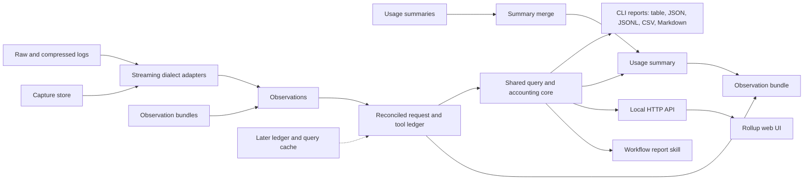

# urollup Design Specification

Trustworthy token, cost and usage rollups from Claude Code, Codex and Pi session logs.

**Author:** Joshua Levy (github.com/jlevy) and various LLMs

**Status**: Living design; each section labels confirmed and candidate behavior

**First drafted**: 2026-09-13

**Last updated**: 2026-09-15

Sections 1 to 8 and each item in §9 carry a **Status:** line.
**Confirmed** marks settled design that awaits no §9 decision; where a maintainer
decision applies, the line cites it from [§10.1](#101-design-decisions).
**Candidate** marks behavior that is proposed and reflected in the design but pending
maintainer confirmation in
[§9](#9-cross-cutting-candidate-decisions-and-open-questions), **Later** marks behavior
designed now for a future phase, the queued items in [§9.2](#92-queued-review-decisions)
are **Candidate, queued** (proposed but not yet reflected in the design), and the
questions in [§9.3](#93-open-questions) are **Open**. Phases and milestones are defined
in the
[implementation plan](project/specs/active/plan-2026-09-13-urollup-cli-and-web.md).

* * *

## Table of Contents

- [1. Introduction](#1-introduction)
  - [1.1 What urollup Is](#11-what-urollup-is)
  - [1.2 Why urollup Exists](#12-why-urollup-exists)
  - [1.3 Design Goals](#13-design-goals)
  - [1.4 Design Principles](#14-design-principles)
  - [1.5 Non-Goals](#15-non-goals)
  - [1.6 Layer Overview](#16-layer-overview)
- [2. Sources and Capture Layer](#2-sources-and-capture-layer)
  - [2.1 Dialects and Discovery](#21-dialects-and-discovery)
    - [Source Manifest](#source-manifest)
    - [Projects and Accounts](#projects-and-accounts)
  - [2.2 Snapshot Boundary](#22-snapshot-boundary)
  - [2.3 Capture Layers and Re-extraction](#23-capture-layers-and-re-extraction)
  - [2.4 Capture and Export Strip Policies](#24-capture-and-export-strip-policies)
  - [2.5 Capture Store and Cache](#25-capture-store-and-cache)
  - [2.6 Harness Captures](#26-harness-captures)
- [3. Ledger and Identity Layer](#3-ledger-and-identity-layer)
  - [3.1 Entities](#31-entities)
  - [3.2 Relationships and the Discovery Index](#32-relationships-and-the-discovery-index)
  - [3.3 Reconciliation](#33-reconciliation)
  - [3.4 Dialect Reconciliation Rules](#34-dialect-reconciliation-rules)
  - [3.5 Purpose and Annotations](#35-purpose-and-annotations)
  - [3.6 Analytical Identities](#36-analytical-identities)
    - [ID Derivation](#id-derivation)
    - [Key Scope](#key-scope)
    - [Identity Basis and Linking](#identity-basis-and-linking)
    - [Identities and Redaction](#identities-and-redaction)
- [4. Accounting Layer](#4-accounting-layer)
  - [4.1 Measure Contracts](#41-measure-contracts)
  - [4.2 Ownership and Totals](#42-ownership-and-totals)
  - [4.3 Time, Grouping and Percentiles](#43-time-grouping-and-percentiles)
  - [4.4 Usage Windows](#44-usage-windows)
  - [4.5 Price Table](#45-price-table)
  - [4.6 Accounts and Plans (Later)](#46-accounts-and-plans-later)
- [5. Artifact Layer](#5-artifact-layer)
  - [5.1 Portable Inputs and Artifacts](#51-portable-inputs-and-artifacts)
  - [5.2 Usage Summary Format](#52-usage-summary-format)
    - [Example: Current-Session Summary](#example-current-session-summary)
    - [Example: Aggregate Summary](#example-aggregate-summary)
  - [5.3 Exact Aggregation](#53-exact-aggregation)
  - [5.4 Observation Bundles](#54-observation-bundles)
  - [5.5 Redaction](#55-redaction)
  - [5.6 Versioning and Compatibility](#56-versioning-and-compatibility)
  - [5.7 Contract Authoring and Validation](#57-contract-authoring-and-validation)
- [6. CLI Layer](#6-cli-layer)
  - [6.1 Workflows and Session Selection](#61-workflows-and-session-selection)
  - [6.2 Current-Session Detection](#62-current-session-detection)
  - [6.3 Commands](#63-commands)
  - [6.4 Queries, Output Formats and Streams](#64-queries-output-formats-and-streams)
  - [6.5 Exit Codes](#65-exit-codes)
  - [6.6 Report Content and Examples](#66-report-content-and-examples)
    - [Example: Session Report](#example-session-report)
    - [Example: Weekly Rollup from Merged Summaries](#example-weekly-rollup-from-merged-summaries)
  - [6.7 Reporting Skill and Cloud Workflow](#67-reporting-skill-and-cloud-workflow)
- [7. Serving Layer (Optional)](#7-serving-layer-optional)
  - [7.1 The serve Feature](#71-the-serve-feature)
  - [7.2 Web UI](#72-web-ui)
  - [7.3 Security Controls](#73-security-controls)
- [8. Implementation Notes](#8-implementation-notes)
  - [8.1 Workspace and Crate Structure](#81-workspace-and-crate-structure)
  - [8.2 Engineering Conventions](#82-engineering-conventions)
  - [8.3 Execution and Performance](#83-execution-and-performance)
    - [Uncached Engine](#uncached-engine)
    - [Capture Cache](#capture-cache)
    - [Ledger and Query Cache (Later)](#ledger-and-query-cache-later)
  - [8.4 Security Considerations](#84-security-considerations)
  - [8.5 Operational Concerns](#85-operational-concerns)
- [9. Cross-Cutting Candidate Decisions and Open Questions](#9-cross-cutting-candidate-decisions-and-open-questions)
  - [9.1 Candidate Decisions](#91-candidate-decisions)
  - [9.2 Queued Review Decisions](#92-queued-review-decisions)
  - [9.3 Open Questions](#93-open-questions)
- [10. Appendices](#10-appendices)
  - [10.1 Design Decisions](#101-design-decisions)
  - [10.2 Future Enhancements](#102-future-enhancements)
  - [10.3 Glossary](#103-glossary)
  - [10.4 Flag Index](#104-flag-index)
  - [10.5 Research and References](#105-research-and-references)

* * *

## 1. Introduction

### 1.1 What urollup Is

**Status:** Confirmed.

**urollup (usage rollup) is a standalone Rust executable that produces trustworthy
token, cost and usage rollups from coding-agent session logs.**

It reads Claude Code, Codex and Pi session logs and produces rollups, request-size
analyses and session reports through a CLI and an optional local read-only web UI. It
covers ccusage’s usage reports and the agentfdr investigation features that matter for
retrospective analysis, without a live session Board, process steering or agent
launcher. The product, crate and command are named `urollup`, developed in
[jlevy/urollup](https://github.com/jlevy/urollup) under the MIT license.

Both interfaces call one accounting and query engine.
Following the research brief’s adapter and accounting boundaries, the Rust core owns
accounting, and every other viewer, including the web UI and the reporting skill,
consumes its versioned reports.
Reports compute from a snapshot of the logs and a durable
[capture store](#25-capture-store-and-cache) of compact captured records that outlives
deleted logs; Phase 2 also reads that store as a cache, and Phase 3 adds a ledger and
query cache behind the same contracts.

The design has these parts:

- source snapshots and dialect adapters that capture source records with evidence
  ([§2](#2-sources-and-capture-layer))
- a normalized ledger that adapters write and every report reads, keyed by analytical
  identities that let observations from different machines and exports merge without
  double counting ([§3](#3-ledger-and-identity-layer))
- accounting measures, ownership rules and the price table ([§4](#4-accounting-layer))
- the usage summary format and its exact aggregation rules, the observation bundle
  container, and contract authoring in softschema with validation in Rust
  ([§5](#5-artifact-layer))
- the CLI and the optional web UI over the same query engine ([§6](#6-cli-layer) and
  [§7](#7-serving-layer-optional))

Validated format knowledge and fixtures from existing tools are reused with license
review and attribution ([Decision 3](#decision-3-code-reuse-and-licensing)). Terms such
as observation, extent and unresolved are defined in the [glossary](#103-glossary).

### 1.2 Why urollup Exists

**Status:** Confirmed.

Agent logs are easy to overcount.
Claude Code writes one API response as several transcript records, Codex records
cumulative counters, and resumed, forked and subagent sessions copy history into other
files. The research brief’s
[synthetic double-counting example](project/research/research-2026-09-13-portable-agent-usage.md#synthetic-double-counting-example)
shows a naive sum reporting four requests where one occurred.
Existing tools choose their own deduplication keys, scopes and price sources, so their
totals cannot be compared, and a totals-only export cannot be merged safely with an
overlapping one.

The research brief’s
[survey of existing implementations](project/research/research-2026-09-13-portable-agent-usage.md#existing-implementations)
treats them as behavioral baselines and sources of portable code, not accounting
authorities:

- **ccusage** (release 20.0.20) supplies the usage-reporting model, but its commands
  deduplicate with different keys, it drops a Claude record’s usage when the line holds
  a nested null field, it reads neither `token_usage_record` nor `rate_limits` nor
  `.jsonl.zst` files, and it prices with fuzzy model matching, floating-point money and
  LiteLLM rates fetched at runtime, showing unpriced tokens as cost 0 in JSON.
- **agentfdr** (0.8.0) supplies reports, search, anomaly heuristics and a session
  viewer, but it under-reports Claude input when a request has several `iterations`,
  adds every repeated Codex `token_count` event, deduplicates nothing across files,
  omits subagent files while counting resumed copies twice, and matches prices by
  regular expression.

The [squares code review](project/research/research-2026-09-14-squares-code-review.md)
and the
[metaproc and qm review](project/research/research-2026-09-14-metaproc-code-review.md)
add evidence from maintainer-owned rollup scripts and agent harnesses, including
counting defects confirmed with synthetic probes and captured-stream dialect behavior.
urollup therefore reconciles observations into logical requests before any aggregation,
keeps unknown values explicit, and exports results that merge exactly.

### 1.3 Design Goals

**Status:** Confirmed.

| Requirement | Solution |
| --- | --- |
| Later analyses never depend on an earlier parsing decision | Capture source records close to their original form, with native fields beside normalized fields and records no current report uses ([§2.3](#23-capture-layers-and-re-extraction)) |
| Usage data survives agents deleting their logs | A default-on, owner-only capture store at about 1.7% of log size ([§2.5](#25-capture-store-and-cache)) |
| Fast local analysis of Claude Code and Codex logs in persistent and captured-stream dialects, with Pi following the first validated slice | Streaming Rust adapters behind an extensible adapter interface, uncached first ([§2.1](#21-dialects-and-discovery), [§8.3](#83-execution-and-performance)) |
| A zero-argument summary of the current Claude Code or Codex session, explicit multi-session selection, disk-wide discovery and parent-to-subagent session trees | One selection model over a discovery index, with `--current`, `--session`, `--all` and `--scope` ([§6.1](#61-workflows-and-session-selection), [§3.2](#32-relationships-and-the-discovery-index)) |
| Daily, weekly, monthly, session, project, account, model and effort reports covering ccusage’s calendar and session views, plus usage by provider-recorded usage window | Calendar and grouped rollups, and a `windows` report over provider limit observations ([§6.3](#63-commands), [§4.4](#44-usage-windows)) |
| Token and cache breakdowns, price estimates and machine-readable exports | Separate measure contracts, a reviewed price table, and JSON, JSONL, CSV and Markdown output ([§4.1](#41-measure-contracts), [§4.5](#45-price-table), [§6.4](#64-queries-output-formats-and-streams)) |
| Request-level sizes, distributions, tool activity, model and effort attribution, and source-linked evidence that explain aggregate numbers | Request rows with sizes and ownership, mergeable histograms, and evidence references into the snapshot ([§4.1](#41-measure-contracts), [§2.2](#22-snapshot-boundary)) |
| One set of filters, accounting definitions and report contracts for agents, humans, workflows and the browser | Every surface compiles to one versioned `QuerySpec` over one core ([§6.4](#64-queries-output-formats-and-streams), [§7.1](#71-the-serve-feature)) |
| Every logical request counts once, whatever the order or number of files, exports and merges it arrives through | Reconciliation before aggregation, and analytical IDs derived from recorded keys ([§3.3](#33-reconciliation), [§3.6](#36-analytical-identities)) |
| Uncertainty stays visible: unsupported events, missing prices, ambiguous ownership, unresolved overlap, incomplete logs and absent resource measurements | Explicit coverage fields and `unknown`, `ambiguous`, `unresolved` and `possible` values, never zero or a guess ([§4.2](#42-ownership-and-totals), [§6.4](#64-queries-output-formats-and-streams)) |
| Compact Markdown reports and mergeable YAML usage summaries that a workflow can attach to a PR | One summary shape for a session or any aggregate, exact merge whenever the rules allow, and observation bundles as the exact fallback ([§5.2](#52-usage-summary-format), [§5.3](#53-exact-aggregation), [§5.4](#54-observation-bundles)) |
| Contracts are versioned, validated at every read and write, and checkable by softschema without the Rust binary | Pydantic contract models compiled by softschema and mirrored by typed serde structs ([§5.6](#56-versioning-and-compatibility), [§5.7](#57-contract-authoring-and-validation)) |

### 1.4 Design Principles

**Status:** Confirmed.

1. **Capture first, analyze later.** Record source data as close to its original form as
   possible, accurately and with evidence, so later analyses need no new parsing
   decisions. Native field names and values are preserved beside normalized fields, and
   data that no current report uses, such as provider limit records, is still kept
   ([Decision 6](#decision-6-data-capture-principle)).

2. **Unknown is never zero.** Missing prices, unobserved usage, absent resource
   measurements and fields an older contract revision lacks are reported as unknown or
   as coverage gaps, never as zero or as a guess.

3. **Count each request once and merge exactly.** Reconciliation collapses repeated
   blocks, streamed updates, cumulative counters and copied histories before
   aggregation. Merges never add precomputed totals, and overlap that cannot be proven to
   be the same or distinct stays unresolved rather than added.

4. **Never guess the current session.** `--current` uses only hook input and agent
   environment variables, and `--latest`, the only heuristic, is guarded and never runs
   implicitly ([Decision 12](#decision-12-current-session-detection)).

5. **A standalone engine with optional serving.** Rollups, summaries, bundles and checks
   are complete without any server; `serve` is a deletable feature over the same public
   query API the CLI uses ([Decision 21](#decision-21-serving-separability)).

6. **Privacy by default.** Portable artifacts never contain prompts, tool arguments or
   result bodies, exports keep values only under an allow-list, default redaction
   removes paths, and the capture store is owner-only.

### 1.5 Non-Goals

**Status:** Confirmed.

- Board views, process status registries, tmux integration, approve and deny controls,
  agent launchers, or changes to an agent’s configuration.
- An LLM dependency for parsing or standard reports; semantic review is optional and
  downstream, with its own provenance and usage.
- Reconstructing private model reasoning or unavailable server-side context.
- Measuring CPU, memory, disk I/O or network use.
  Agent logs do not record these, so the resource observation entity is reserved and
  resource measures stay unknown until a tested collector adapter exists.
- Provider billing reconciliation; recorded provider charges have a reserved entity but
  no tested source.
- Prompts, tool arguments and tool result bodies in any portable artifact.
- A JSON or JSONL softschema profile; JSON is an output rendering only.
- A hosted service, account authentication or automatic cloud-log synchronization in the
  initial releases.
- Usage kept only in a harness’s own database, such as the third-party qm harness, which
  turns native agent logs off.
  qm is out of scope; it informs possible future workflows and is a source of MIT code
  to borrow with attribution.
- A dependency on metaproc or any other harness.
  Harnesses that capture agent streams are read through urollup’s own captured-stream
  adapters, and a harness that deletes native agent logs is fixed in that harness rather
  than worked around here.
- Binary or flag compatibility with ccusage or agentfdr.
  Parity is a measured feature matrix, not a promise to reproduce their accounting bugs
  or labels.

### 1.6 Layer Overview

**Status:** Confirmed; the ledger and query cache is Later.

urollup has six design layers, each a section of this document.
They are distinct from the numbered data
[capture layers](#23-capture-layers-and-re-extraction) that record how far a record has
been processed.

| Layer | Section | Responsibility |
| --- | --- | --- |
| Sources and capture | [§2](#2-sources-and-capture-layer) | Dialect discovery, snapshot manifests, captured records and the capture store |
| Ledger and identity | [§3](#3-ledger-and-identity-layer) | Entities, relationships, reconciliation and analytical IDs |
| Accounting | [§4](#4-accounting-layer) | Measures, ownership, time, usage windows and prices |
| Artifacts | [§5](#5-artifact-layer) | Usage summaries, observation bundles, redaction and contracts |
| CLI | [§6](#6-cli-layer) | Session selection, commands, output formats, exit codes and the reporting skill |
| Serving (optional) | [§7](#7-serving-layer-optional) | `urollup serve`, the local HTTP API and the web UI |



Adapters and bundle readers produce observations with evidence references, and adapters
read captured records exactly as they read original logs.
Reconciliation turns observations into one ledger of logical entities.
The accounting core computes every report, summary and bundle from that ledger, so the
CLI, the HTTP API and the reporting skill share one set of definitions.
Summaries merge by the [exact aggregation](#53-exact-aggregation) rules without the
ledger; bundles re-enter reconciliation.

* * *

## 2. Sources and Capture Layer

### 2.1 Dialects and Discovery

**Status:** Confirmed, except the dialect IDs and `UROLLUP_*` override variables, which
are Candidate ([§9.1](#dialect-ids-and-override-variables)); the Pi adapters are Later
(Phase 2).

A **dialect** is one log format written by one agent, and each adapter reads one
dialect. The research brief’s
[dialect survey](project/research/research-2026-09-13-portable-agent-usage.md#log-dialects-and-session-linkage)
gives each dialect’s fields, counters and linkage.

| Agent | Dialect | Definition | Default discovery |
| --- | --- | --- | --- |
| Claude Code | `claude-project` | Session and subagent transcripts under Claude Code’s config directory | Yes |
| Claude Code | `claude-stream` | Saved `claude -p --output-format stream-json` output | No |
| Codex | `codex-rollout` | Thread rollouts, plain or zstd-compressed, active or archived | Yes |
| Codex | `codex-exec` | Saved `codex exec --json` output | No |
| Pi | `pi-session` | Tree-structured session files written by the `pi` coding agent | Yes, once validated |
| Pi | `pi-events` | Saved `pi --mode json` output | No |

| Agent | Default roots | Native variable honored | urollup override |
| --- | --- | --- | --- |
| Claude Code | `~/.claude/projects`, and `$XDG_CONFIG_HOME/claude/projects` (default `~/.config/claude/projects`) when present | `CLAUDE_CONFIG_DIR`, reading its `projects/` | `UROLLUP_CLAUDE_CONFIG_DIRS` |
| Codex | `~/.codex/sessions` and `~/.codex/archived_sessions` | `CODEX_HOME` | `UROLLUP_CODEX_HOMES` |
| Pi | `~/.pi/agent/sessions` | `PI_CODING_AGENT_SESSION_DIR`, else `PI_CODING_AGENT_DIR` plus `sessions/` | `UROLLUP_PI_SESSION_DIRS` |

- **Captured streams** have no standard location, so they enter only through `--source`
  or a manifest, with the dialect detected from the first records or given by a hint.
  Harness run directories are described in [§2.6](#26-harness-captures).
- **Precedence:** the urollup override wins, then the native variable, then the
  defaults. Overrides list paths joined by the platform path separator.
  `--source` adds roots or artifacts; a directory it names is walked, and each file or
  `*.urollup/` folder is identified by content, a dialect from its first records or an
  artifact from its contract header; `--no-default-sources` removes defaults and
  variables. A missing default root is skipped, and a missing root named by a flag or
  variable exits 1. Locations no variable describes, such as Pi’s `--session-dir` or a
  Pi `settings.json` `sessionDir` (flat directories that mix working directories), need
  `--source`.
- **Codex file names:** Codex names rollout files and date directories in local time,
  adds files to a thread on revert or paginated fork, and renames files into flat
  `archived_sessions/` on archive, so times come from records and Codex sources are
  identified by thread and rollout ID rather than path.
- **Retention:** Claude Code deletes transcripts after `cleanupPeriodDays`, 30 by
  default
  ([sessions](https://code.claude.com/docs/en/sessions#where-transcripts-are-stored)),
  so `sources` reports each root’s earliest retained record, and longer history needs
  the capture store or exported summaries or bundles.
- **Unobserved usage:** usage that never reaches local logs, such as Codex `--ephemeral`
  threads, parallel guardian reviews and legacy remote compaction, is reported as an
  unobserved coverage gap, never zero.
- **Unsupported formats:** Pi RPC transcripts and Pi’s experimental v4 session store are
  not supported dialects until tested.

#### Source Manifest

A **source manifest** declares roots and artifacts, dialect hints, source environment,
project mappings, and each known account’s stable identifier with an optional display
alias. It is a YAML file validated by the `urollup:SourceManifest/v1` softschema
contract, read from `--sources-file`, else from `sources.yaml` in the platform config
directory: `$XDG_CONFIG_HOME/urollup/` (default `~/.config/urollup/`) on Linux,
`~/Library/Application Support/urollup/` on macOS and `%APPDATA%\urollup\` on Windows.
Price overrides use the same directory ([§4.5](#45-price-table)). Roots a manifest
declares are part of default discovery, so the capture store preserves them like other
default roots, while individual artifacts it lists are treated like `--source` inputs
([Decision 9](#decision-9-capture-scope)).

#### Projects and Accounts

- Project identity comes from recorded fields, never from decoding Claude Code or Pi
  project directory names, which encode paths lossily.
  A thread’s `project` is a plain name, never a path: the manifest’s project mapping
  when one matches (so worktrees map to one logical project and keep their original
  `cwd`), else the git top-level directory basename when the dialect records it, else
  the basename of the recorded `cwd`.
- Accounts are attributed explicitly or unknown, never guessed from model or
  subscription. Imported local or cloud exports are ordinary manifested artifacts, and no
  cloud export format is claimed without a test.

### 2.2 Snapshot Boundary

**Status:** Confirmed.

Every run freezes a **snapshot manifest** recording each source file’s identity, byte
extent, fingerprint and ingestion cutoff, and reads only complete records within that
extent. It reports pending tails, corruption, mid-scan changes and per-source cutoffs
rather than silently skipping data.

- An unfinished last line is recorded as pending, distinct from interior corruption.
- Replacement, truncation or mutation during the scan is detected and reported,
  including a path that is briefly absent while another tool rewrites it.
- A Codex `.jsonl` rollout and its `.jsonl.zst` twin with the same thread and rollout ID
  are one logical source whose representation changed, not two sources.
- Files are not snapshotted atomically together, so reports state each source’s cutoff
  and the skew across files.
- An oversized record is streamed where the adapter supports it; otherwise it is a
  coverage failure, never silently skipped.
- Decoding is lenient where records allow it: a line prefilter is only a hint, a record
  is never rejected because a nested field is null, timestamps accept any RFC 3339
  fractional precision, and every malformed, skipped or unparsable line is counted per
  source.
- Symlinks are followed only within declared roots, and links that leave them are
  reported as skipped.
- Discovery skips a file only when manifest metadata proves it cannot contribute, even
  as fork ancestry or a later usage revision, and filters apply to reconciled requests.
- Evidence references are a source ID, byte offset and length inside the manifest.

### 2.3 Capture Layers and Re-extraction

**Status:** Confirmed ([Decision 6](#decision-6-data-capture-principle)).

urollup captures data in layers so any later feature can rerun extraction from the most
processed layer that still holds what it needs.
Claude Code deletes transcripts after 30 days by default, so captured layers are often
the only lasting record.

| Layer | Holds | Rerun from this layer when |
| --- | --- | --- |
| 0. Original logs | Every record, including prompts and tool output | A feature needs content itself, while the logs still exist |
| 1. Captured records | Usage-relevant source records, verbatim except for fields their strip policy stubs | Parsing, normalization or reconciliation logic changes |
| 2. Normalized tables | Threads, relationships, requests, tool actions, provider limit observations and diagnostics, with native fields | Pricing, grouping, ownership or report logic changes |
| 3. Usage summaries | Extents and derived totals | A report needs only totals within the summary’s policy |

- **Captured records** keep every record that carries usage, identity, model, effort,
  timing, turn lifecycle, subagent or fork linkage, tool call structure and outcome, or
  provider limits. Lifecycle records include Claude `system` `compact_boundary` and
  `stop_hook_summary` records and `queue-operation` records, and Codex `task_started`,
  `task_complete` and timed `item_completed` events.
  Claude `progress` records that nest a subagent’s assistant message carry usage and are
  kept. Records with none of these, such as streaming display events, are counted in the
  manifest but not kept.
- **Stripping** follows the capture and export policies in
  [§2.4](#24-capture-and-export-strip-policies).
- **Re-extraction:** adapters read captured records from the store or a bundle exactly
  as they read original logs, and each captured record keeps its original source ID,
  offset, fingerprint and dialect version.
  A later adapter version applies to old captured records without the logs.
  A field the capture policy stubbed needs layer 0, and a field the export policy
  stubbed needs the capture store or layer 0.
- **Records no report uses yet** are still captured and normalized when their dialect
  fields are known, so features like account budgets
  ([§4.6](#46-accounts-and-plans-later)) need no new capture.

The [capture store](#25-capture-store-and-cache) holds layer 1 only.
The later [ledger and query cache](#ledger-and-query-cache-later) stores layers 2 and 3
behind the same versioned keys.

### 2.4 Capture and Export Strip Policies

**Status:** Confirmed ([Decision 7](#decision-7-captured-records-and-strip-policies)).

Stripping follows two versioned, per-dialect policies, because the local store must
support re-extraction while portable artifacts leave the machine:

- The **capture policy** applies to the local, owner-only
  [capture store](#25-capture-store-and-cache).
  Known content fields (prompt and response text, reasoning text, tool arguments and
  results, hook output, attachments, images, file snapshots and injected context) become
  stubs recording the field’s byte length and a keyed HMAC-SHA-256 digest under a random
  key kept owner-only in the store, so content size and repetition stay measurable
  without the content.
  Payloads that embed other messages, such as Pi `toolResult.details` and compaction
  `retainedTail`, are stubbed while the `usage` objects inside them stay verbatim as
  evidence. Values under keys the policy does not recognize stay verbatim, so extraction
  can be rerun for newly discovered fields, and each capture reports those keys per
  dialect version as a diagnostic.
- The **export policy** applies to summaries and bundles, including a bundle’s `records`
  table, and is a strict allow-list.
  Only enumerated keys and paths keep values: types, IDs, timestamps, models, usage
  objects, stop reasons, tool names, limit fields and version fields, with path-like
  fields following the [redaction](#55-redaction) profile.
  Every other string, array or object value becomes a `{type, bytes}` stub, whatever its
  length, so text under a key that a new agent release adds never reaches an export.

A structural command summary computed before tool arguments are stubbed is a queued
review decision ([§9.2](#structural-command-summary)).

### 2.5 Capture Store and Cache

**Status:** Confirmed ([Decision 8](#decision-8-capture-store-and-cache) and
[Decision 9](#decision-9-capture-scope)); cache reads are Later (Phase 2).

Captured records are kept in a durable local **capture store**, on by default.
It preserves re-extractable usage data after agents delete their logs, so usage survives
Claude Code’s 30-day transcript cleanup, and in Phase 2 it also serves as a **capture
cache** so a large log is parsed once.
A spike on 19.5 GB of real logs measured the store at about 1.7% of log size and showed
uncached extraction is fast enough for Phase 1 (about 3 s for 30 days and 7 s for all
history on 10 cores), so the cache read path can wait for Phase 2; see the research
brief’s
[local log volume and throughput](project/research/research-2026-09-13-portable-agent-usage.md#local-log-volume-and-throughput)
findings and the [log throughput spike](../explorations/log-throughput/README.md).

- **Location:** the platform data directory, not a purgeable cache directory:
  `$XDG_DATA_HOME/urollup/captured` or `~/.local/share/urollup/captured` on Linux,
  `~/Library/Application Support/urollup/captured` on macOS, and
  `%LOCALAPPDATA%\urollup\captured` on Windows, overridden by `UROLLUP_CAPTURE_DIR`.
  Directories and files are owner-only, because captured records still hold paths, IDs
  and values under unrecognized keys.
- **Entries:** one entry per logical source, keyed by its `src-` ID, holding a manifest
  and zstd-compressed JSONL segments of captured records.
  The manifest records the dialect, adapter and capture policy versions, the captured
  byte extent, the source fingerprint, the digest of the first complete record, and the
  digest of the captured extent’s final 64 KiB. The default **prefix check** compares
  file identity, size and these two digests to decide whether a source still starts with
  its captured prefix.
- **Scope:** capture applies only to sources found by default discovery, the user’s own
  agent logs, which includes roots declared in the [source manifest](#source-manifest).
  Raw logs passed with `--source`, and individual artifacts listed in the manifest, are
  read but captured only with `--capture`, and summaries and bundles are never captured.
- **Phase 1 writes:** a run captures an in-scope source when the store has no current
  entry for it, or when its size, fingerprint or versions changed, by writing a complete
  atomic replacement entry.
  It captures only sources idle, meaning unmodified, for at least `--capture-idle` (5
  minutes by default), so `report --current` and hook-driven reports never pay capture
  cost for the active transcript; a later run captures it once idle.
  An unfinished last line stays pending and is never captured.
- **Unwritable store:** when the store cannot be created or written, such as under a
  read-only home in a sandbox, the run continues without capture and emits a diagnostic
  rather than exiting 1.
- **Retention:** entries outlive their sources.
  When a source log is gone, runs read its captured records instead and report the
  source as `retained` with its capture time; until the Phase 2 cache, runs read
  captured records only for such sources.
  When the prefix check shows a source was replaced, truncated or rewritten in place,
  the previous entry is kept as a retained version.
  A rewrite that changes the source’s first complete record, such as a Codex rollout
  migration or a Pi v1 or v2 file rewritten on load, yields a new `src-` ID, and the old
  entry becomes `retained` under its own ID. Runs read both, reconciliation deduplicates
  their shared observations by analytical ID, and `capture status` links old and new
  entries by thread, so a rewrite that drops records never silently drops usage.
  Usage of Codex rolled-back turns that a migration drops keeps counting through the
  retained entry, because failed and retried requests consume the usage they report.
- **Phase 2 cache reads:** when versions match and the source still starts with the
  captured prefix, a run reads captured records for the captured extent and parses only
  complete records past it, appending them as a new segment.
  `--verify-cache` replaces the default prefix check with a hash of the whole captured
  extent, which also catches a same-size mutation that leaves both digests unchanged.
- **Idempotence:** capturing the same bytes yields identical records, entries are keyed
  by source and record their captured extent, and reconciliation deduplicates by
  analytical ID, so repeating a run never adds usage.
- **Controls:** `--no-capture` neither writes nor reads the store for a run, `--capture`
  also captures raw logs passed with `--source` or listed as manifest artifacts, and
  `--capture-idle` sets the idle threshold.
  In Phase 2, `--no-cache` reads original logs instead of cached records while still
  updating the store, and `--rebuild-cache` regenerates the selected sources’ entries
  from their logs. `urollup capture status` reports entries, sizes, versions and retained
  sources, with rewritten sources linked by thread, and `urollup capture prune` removes
  entries by age, version or retained status.
- **Atomic writes** follow tbd `filesystem-rules` and `rust-filesystem-rules`:
  - segments and manifests are staged as owner-only `NamedTempFile`s with unique names
    in the entry directory;
  - each segment is fsynced and its digest verified before it is published with
    `persist_noclobber`;
  - the entry directory is fsynced (a no-op on Windows), and the manifest is replaced
    last with `persist`, only if the manifest version the writer started from is still
    current;
  - an OS advisory lock per entry serializes writers, so a crash or a concurrent run
    leaves the previous consistent entry and readers never see a partial segment.
- **Equivalence:** runs with the store disabled, with retained sources, with cached
  reads and after a rebuild produce identical ledgers and reports for the same snapshot
  and policy, and CI runs the golden suite in each mode.

### 2.6 Harness Captures

**Status:** Confirmed ([Decision 4](#decision-4-harness-logs-through-urollup-adapters)
and [Decision 5](#decision-5-qm-out-of-scope)).

- urollup reads harness-captured agent streams (`claude-stream`, `codex-exec` and
  `pi-events`) directly through its own adapters, with no metaproc dependency.
  metaproc’s log-processing code is ported into those Rust adapters with provenance
  ([§8.1](#81-workspace-and-crate-structure)), so metaproc may later depend on them.
- A metaproc run directory holds captured streams under `.logs/tasks/` and, from
  metaproc `32cde09`, preserved native logs under `.logs/native/` (Codex
  `<session-stem>.codex-sessions/` rollouts and Claude `<session-stem>.claude-projects/`
  transcripts). Both are discovered by content under `--source`, and a preserved rollout
  owns the usage that its `codex-exec` capture only checks.
- A `codex-exec` capture whose `thread.started.thread_id` names a discovered rollout is
  a capture of that thread: the rollout owns the usage, and the capture’s cumulative
  `turn.completed.usage` totals are a reconciliation check.
  A `claude-stream` capture merges with its transcript by response ID.
  [§3.4](#34-dialect-reconciliation-rules) gives both rules in full.
- Harness bugs that delete native agent logs are tracked and fixed in the harness.
- Usage kept only in a harness’s own database, such as qm’s, is out of scope.

Capture metadata that harnesses might write beside captured streams is a queued review
decision ([§9.2](#capture-metadata-for-captured-streams)).

* * *

## 3. Ledger and Identity Layer

### 3.1 Entities

**Status:** Confirmed, except resource observations and provider charges, which are
Candidate ([§9.1](#resources-and-charges)).

The normalized ledger holds these entities, which adapters write and every report reads:

| Entity | Fields and ownership |
| --- | --- |
| Source artifact | Original identity, fingerprint, dialect and dialect version, offsets, snapshot extent, capability and coverage status |
| Thread | Native thread key; source, initiator, purpose, execution environment, project and account as independent properties |
| Relationship | Spawn, fork, resume, review or other native edge, with evidence and confidence; not every relationship transfers usage ownership |
| Request/response | Native request and response IDs, ownership status with owning or candidate threads, timestamps, model with its basis (`served` when the response records it, `requested` when only the request does) and effort when observed, usage revision and its status |
| Tool action | Call ID, tool name, nested command structure, result reference, outcome, a tool interval from call to result (which includes scheduling and permission waits, so it is never called latency or execution time), bytes and characters; linked to a request only when proven |
| Provider limit observation | A usage-limit record as the source wrote it: native limit name (Codex `rate_limits` `limit_id` with its `primary` or `secondary` window, Claude `quotaLimits` or `claude-stream` `rate_limit_event` `rateLimitType`), window length when recorded, reset time, utilization with its native unit or status, plan, credit and overage fields, observation time with its basis, owning thread or request when proven, and evidence; native field names and values are kept verbatim |
| Provider charge | Cost or receipt recorded by a tested source, with currency, period or request link, account and evidence; never derived from list prices |
| Resource observation | Reserved, with no current source: CPU seconds, RSS, I/O or network, each with unit, scope, interval, collector and evidence |
| Annotation | Labels or review findings with target IDs, author, method and version, kept separate from measured facts |

Every value records whether it was observed, configured, inferred or unknown.
Model and effort belong to requests; a session’s model or effort label is a summary of
its requests.
Reasoning token counts and visible reasoning summaries are recorded fields,
not access to hidden reasoning.
Codex rollouts save only the requested model (`turn_context.model`), never the model a
server reroute served, so Codex request models are `requested`. Placeholder model names,
such as Codex `codex-auto-review` and Claude `<synthetic>`, stay as observed.

Provider limit observations feed the Phase 2 `windows` report
([§4.4](#44-usage-windows)) and need dialect care:

- Codex writes one latest snapshot per `limit_id` and repeats it in every `token_count`
  event, so identical consecutive snapshots are one observation.
  Carried-forward `plan_type`, `credits`, `individual_limit` and `spend_control_reached`
  values may be stale, and when a response reports several `limit_id` buckets only the
  last reaches the rollout.
- `claude-stream` `rate_limit_event` records hold `status`, `rateLimitType`, `resetsAt`
  in epoch seconds and overage fields, and carry no timestamp, so their observation time
  is not recorded.
- Utilization units differ by source (Codex `used_percent` is a percent, and a
  `claude-stream` `utilization`, when present, is a fraction), so values keep their
  native unit.

A source-reported cost, such as `total_cost_usd` in `claude-stream` output or the `cost`
breakdown Pi computes, is a source estimate, not a provider charge.
Pi computes `cost` from the installed model catalog, so zero can mean unpriced: a zero
source-reported cost on nonzero tokens gets a diagnostic, and a source estimate never
stands in for a list-price estimate.
No supported dialect records an actual charge, so no provider charge import is planned
until a tested receipt or billing export exists.

Agent logs do not record CPU, memory, I/O or network use.
Resource measures report unknown, never zero, until a tested collector adapter fills the
reserved resource observation entity.

### 3.2 Relationships and the Discovery Index

**Status:** Confirmed.

Session hierarchy comes from a **discovery index**, built before reconciliation from
only thread-identifying data: Claude transcript paths and subagent `.meta.json` files,
including those under `subagents/workflows/`, each Codex rollout’s first `session_meta`
record, and each Pi session header.
It covers every root and date, because Codex subagents can start in later date
directories and descendants can have usage outside the interval.

The discovery index and reconciliation produce these relationship edges:

- **Spawn:** a Claude subagent file under its parent session (including
  `subagents/workflows/`), attached to the spawning tool call through `toolUseId`, which
  can lie in another subagent; a `claude-stream` subagent message delivered inline in
  the parent stream and attached by `parent_tool_use_id`; or a Codex rollout’s
  `parent_thread_id` with its `thread_spawn`, `review`, `compact` or other subagent
  source, including `guardian_review` threads.
- **Fork:** Codex `forked_from_id`; Pi `parentSession` (legacy `branchedFrom`), resolved
  by file basename because the stored path is absolute; and Claude sessions whose copied
  entries carry another session’s `sessionId`, found during reconciliation.
  Pi files that share a header `id` without a parent field are export and import copies
  of one session, not forks.
- **Inline sidechain:** older Claude transcripts with `isSidechain` turns and no spawn
  ID become child threads with fallback identities.

A crawler builds a forest of spawn, fork and inline-sidechain edges.
Spawn edges define `descendants` scope ([§4.2](#42-ownership-and-totals)) and fork edges
never do, because copied history is deduplicated rather than owned twice.
`urollup tree` shows each node’s agent, dialect, source kind, depth, and own and
descendant totals. A thread with an undiscovered parent becomes a root with an orphan
diagnostic, and an edge that would close a cycle is dropped with a diagnostic.

### 3.3 Reconciliation

**Status:** Confirmed.

Adapters emit observations; reconciliation merges them into logical entities before any
aggregation, collapsing repeated blocks, streamed updates, cumulative counters and
copied histories:

- Repeated content blocks of one response, streamed usage updates and copied histories
  collapse into one logical request.
  Each later usage update is a new **usage revision** of that request, and the ledger
  keeps the final one with every record as evidence, or, where a dialect cannot order
  its revisions, the one its selection rule picks.
- One response repeated in several files is one logical observation with several
  evidence references.
  Forked or resumed history is not newly consumed usage.
- Cumulative counters become deltas only within a verified counter epoch; resets and
  gaps produce diagnostics.
- Failed and retried requests consume the usage they report, even without a useful
  answer.
- Proven native ownership wins.
  Ambiguous candidates are preserved rather than fabricating a unique API-call count.
- Conflicting observations keep diagnostics and follow a documented, source-specific
  resolution rule, never first-wins traversal order.
  Conflicting account attributions for one request are diagnosed, not split.
- Observed, configured, inferred and unknown values stay distinct.
- A copy nested inside another record never counts, and usage that never reaches local
  logs is an unobserved coverage gap, never zero ([§2.1](#21-dialects-and-discovery)).

Observation bundles re-enter this reconciliation when they merge
([§5.4](#54-observation-bundles)).

### 3.4 Dialect Reconciliation Rules

**Status:** Confirmed.

The source reviews summarized in the
[portable research brief](project/research/research-2026-09-13-portable-agent-usage.md)
set these source-specific rules:

- **Claude Code block records:** block records of one response can disagree on
  `output_tokens`, so reconciliation selects one whole record (largest `output_tokens`,
  then last in file order, then lowest `src-` ID), adds a diagnostic when input or cache
  fields differ, and never merges fields.
- **Claude Code copies:** a record that replays a parent message is a copy owned by the
  parent, not an ambiguous key: a `progress` record nesting a subagent’s assistant
  message, a `/btw` side-question record with the parent’s `message.id` under a new
  `requestId`, and a fork-style subagent record with a parent record’s `uuid`.
- **`claude-stream`:** a capture and its transcript share `session_id` and `message.id`,
  so their requests merge by response ID.
- **Codex requests:** from `rust-v0.153.0`, each `token_usage_record` is one response,
  keyed by `response_id` and owned by its `thread_id`; responses without usage write
  none. A record whose `thread_id` differs from the file’s thread is a copy, and
  `compacted.latest_token_usage_record` is never an observation.
- **Codex counters:** older files use cumulative `token_count` events.
  A `last_token_usage` counts only when the running total advances and it has nonzero
  input or output. Identical consecutive totals add nothing, `info: null` is only a
  provider limit observation, compaction estimates and context-window-full fills (zero
  input and output with nonzero `total_tokens`) are estimate diagnostics, and a decrease
  in any cumulative component opens a new counter epoch with a diagnostic.
- **Codex copied history:** a child rollout’s own records start at
  `subagent_history_start_ordinal`, else at the first `thread_settings_applied` naming
  the child (0.152 and later).
  Otherwise it is inferred, in order, from turn IDs also present in the parent rollout,
  the last foreign `session_meta` record, and turns without their own `turn_context`,
  and the excluded usage is labeled `inferred` with a diagnostic.
  A fork or subagent continues the parent’s running total, so the child’s counters start
  from the inherited total.
  Legacy destinations also copy the parent’s records, including `token_count` events
  (and, for user forks, `token_usage_record` lines), with new write-time timestamps, so
  copied lines contribute neither usage nor times to the child; paginated forks copy
  nothing and reference the parent’s file.
- **`codex-exec`:** `turn.completed.usage` is the thread’s cumulative total: after
  `codex exec resume` it includes earlier runs, it has no `total_tokens`, it excludes
  subagents, and failed or interrupted turns report none.
  A capture whose `thread.started.thread_id` equals a discovered rollout’s
  `session_meta.id` is a check on that rollout, which owns the usage.
  Without the rollout, turn usage is the difference between consecutive totals for the
  thread, and a first total that may include earlier runs gets a diagnostic.
- **Pi:** requests key on provider and `responseId`, else on the lineage root and a
  digest of copy-invariant fields, never on a bare entry ID. Copied history in fork,
  clone and export files belongs to the parent.
  Usage nested in compaction `retainedTail`, extension `details`, and `pi-events`
  `turn_end`, `agent_end` and `compaction_end` records never counts, and in `pi-events`
  only `message_end` is final.

### 3.5 Purpose and Annotations

**Status:** Candidate ([§9.1](#purpose-sources)); configured purpose and annotation sets
are Later (Phase 2).

Purpose values record their basis; core accounting never infers them.

- **Phase 1:** `observed` purpose comes only from native fields, such as a recorded
  subagent type or a review or compaction mode.
  A request inherits its thread’s purpose unless it records its own.
- **Phase 2:** `configured` purpose comes from declared, versioned rules in the source
  manifest or query file that match recorded properties such as project, initiator or
  model. Observed values take precedence, and a disagreeing rule produces a diagnostic.

`--group-by purpose` uses only observed and configured values; all other requests form
the null group. Annotations, including downstream semantic or LLM review, never set
purpose. A query groups by an imported annotation set only when `--annotation-set` names
it, and results cite the set’s author, method and version.

### 3.6 Analytical Identities

**Status:** Confirmed, except provider ID scope and conflicting shared keys, which are
Candidate ([§9.1](#provider-id-scope) and [§9.1](#conflicting-shared-keys)).

#### ID Derivation

An analytical ID derives deterministically from recorded keys, so an observation
receives the same ID on every machine and in every merge order.

- **Form:** `<prefix>-v<version>-<digest>`, such as `req-v1-` followed by 26 characters.
- **Digest:** the first 128 bits of SHA-256 over the RFC 8785 canonical JSON array of
  prefix, identity contract version, key kind and key components, encoded as lowercase
  Crockford base32.
- **Components:** native IDs enter keys verbatim and also remain separate fields.
  Namespace components are registry tokens such as `anthropic` or `codex`; unknown
  components are `null`.
- **Stored keys:** keys are stored with their IDs, so a binary can re-derive IDs under
  another supported identity version.
  Two different keys that produce one ID are an identity-collision error.
- **Fingerprints:** a fingerprint identifies bytes, not necessarily a logical session.

| Prefix | Key, in precedence order |
| --- | --- |
| `src-` | Source environment, dialect, locator, and a digest of the first complete record, so appends keep the ID; the locator is root-relative unless the dialect declares a stable one, such as a Codex rollout’s thread and rollout IDs, which survive archiving and compression |
| `thr-` | Agent namespace and native thread key, such as session ID plus subagent ID; else a digest of the thread’s first complete record |
| `req-` | Provider namespace and response ID; else provider request ID; else a native record ID or sequence number within its declared scope; else the containing `thr-` ID (the lineage root’s, for dialects whose copies lack response IDs, such as Pi) and a digest of adapter-declared revision-invariant fields |
| `act-` | Provider namespace and native tool call ID; else the owning `req-` ID and the call’s position in that response |
| `rpt-` | Report schema, normalized `QuerySpec`, snapshot identity, and adapter, reconciliation and pricing versions; never run time, host or duration |

Relationships are keyed by kind and endpoint IDs; annotations by target ID, author,
method and version.

#### Key Scope

Each adapter declares the uniqueness scope of every native ID kind, and a key includes
only that scope’s namespace components.

- Provider-issued IDs are scoped to the issuing provider, not to host, source
  environment or account, so copies of one request merge wherever they were collected
  (Candidate, [§9.1](#provider-id-scope)).
- Account enters a key only for ID kinds unique within an account, and then as the
  stable account identifier from the source manifest, never a display alias.
- Fallback keys never use byte offsets or file-relative ordinals, which shift between
  partial exports.
- Some native IDs are unique only within a file or lineage: Pi entry IDs are 8 hex
  characters checked for collisions within one file, and a Pi session ID can repeat
  across files (a custom `--session-id`, or an export and import), so neither is a key
  on its own.

#### Identity Basis and Linking

Thread, request and action IDs record their **identity basis**:

- `native` when a native ID and every required namespace component are present
- `fallback` when a declared fallback key applies
- `ambiguous` otherwise

A key is also ambiguous when observations sharing it disagree on revision-invariant
fields, as when a gateway reuses message IDs across sessions, or when records sharing a
fallback key cannot be shown to be revisions of one request (Candidate,
[§9.1](#conflicting-shared-keys)). Either case yields a diagnostic, not a merge.
An ambiguous observation gets an artifact-local ID from its `src-` ID and record offset,
so only a re-read of the same record merges by ID; other matches become candidates.

Observations are linked by a shared native key or by **lineage** evidence, such as a
fork edge over copied history.
A linked set takes the ID from its highest-precedence key, then the lowest ID, and keeps
the other IDs as aliases, so the result depends on the set rather than on merge order.

#### Identities and Redaction

Analytical IDs are truncated digests and contain no literal names or paths.
Every key that includes a name or path also includes a high-entropy component, a native
ID or a record digest, so an ID cannot confirm a guessed path or project name.
A root-relative `src-` locator can include Claude Code and Pi project directory names,
which encode the working directory, so root-relative locators are path-shaped.
Declared stable locators, such as a Codex rollout’s thread and rollout IDs, are not.

Bundle tables carry the identity key of every row.
Summaries carry the key of each extent’s thread, but their request indexes hold IDs
only, which keeps them compact.
Both store keys in redacted form.
IDs are derived before redaction, so redaction never changes an ID. The default profile
replaces a removed key component with a fixed `redacted` marker, and the opt-in profiles
replace it with the same keyed label they use elsewhere, so redacted keys stay
deterministic. A redacted component cannot be recovered, so an ID whose key contains one
keeps its stored value and cannot be re-derived under another identity version:

| Redaction profile | Removes | IDs that cannot be re-derived |
| --- | --- | --- |
| `paths` (default) | Absolute paths, working directories and path-shaped locators | `src-` IDs with path-shaped locators, and artifact-local IDs built from them |
| `names` | Also project names, account aliases and account identifiers | Also any ID whose key includes an account identifier |
| `native-ids` | Also native IDs | All IDs |

Merging inputs at different identity versions requires re-derivation, so it is a
compatibility error when a needed key component is redacted.
[§5.5](#55-redaction) defines the labels and key handling.

* * *

## 4. Accounting Layer

### 4.1 Measure Contracts

**Status:** Confirmed.

Tokens, calls, money, time, resources and sizes stay separate measures:

| Measure | Contract |
| --- | --- |
| Tokens | Separate inclusive input, uncached input, cache reads, cache writes, output, the reasoning subset of output, and provider-only categories; native semantics preserved |
| Calls | Separate observed provider requests, responses, assistant messages, synthetic events, tools, nested executions and retries |
| Money | Separate dated list-price estimate, source-reported cost estimate, recorded provider charge, configured subscription allocation, and optional local-compute estimate; exact decimal arithmetic; every amount carries a currency, and amounts in different currencies are never summed or converted |
| Pricing coverage | Priced, default-assumed and unpriced tokens and requests, each with reasons, plus the pricing basis; unknown is never free |
| Time | Session span, sum of request durations, interval-union busy time, explicit waiting, and critical path only when dependencies and timing establish it |
| Resources | Additive counters summed only over compatible scopes; memory peaks never summed; absent CPU, RSS and I/O stay unknown |
| Request sizes | Count, sum, mean, p50, p90, p95, p99, maximum, histograms and largest requests for each token category |
| Context contribution | Exact source measurements when available; estimated tokenization and byte sizes labeled separately; repeated-context indicators are not proof of waste |

Counting rules that adapters must normalize explicitly:

- Reasoning output is often a subset of output; total tokens never add both.
- Cache-read input may be included within a dialect’s native input or reported
  separately, as the research brief’s
  [usage table](project/research/research-2026-09-13-portable-agent-usage.md#log-dialects-and-session-linkage)
  shows per dialect.
- When a Claude Code record has `iterations`, its top-level `message.usage` equals the
  sum of the `message` iterations and excludes `advisor_message` iterations, which
  record their own model; an advisor iteration is further model usage within the same
  request, priced at its own model’s rate.
- Claude Code’s `cache_creation` breakdown separates 5-minute and 1-hour cache writes;
  when it disagrees with `cache_creation_input_tokens`, both native values are kept with
  a diagnostic.
- A recorded total, such as Codex `total_tokens` (sometimes 0) or Pi `totalTokens`
  (provider-reported for some APIs), is recomputed from its components, and a mismatch
  is a diagnostic, never usage.
- One usage carrier can stand for zero, one or several requests: a Pi compaction entry
  can combine two summary calls and a Pi tool result’s usage is opaque, so their call
  counts are unknown rather than 1, and they record no model.
- Arithmetic on token counters is checked, and money uses exact decimals.
- Source or provider totals, such as a stream’s final `result` usage, are reconciliation
  checks, not additional rows.
  In `claude-stream`, top-level `result` usage covers the main model while `modelUsage`
  covers every model, and `total_cost_usd` is cumulative across several `result` records
  in one session.

An `unitemized` measure for source totals that exceed reconciled requests, and extended
time measures, are queued review decisions ([§9.2](#unitemized-usage) and
[§9.2](#extended-time-measures)).

### 4.2 Ownership and Totals

**Status:** Candidate ([§9.1](#ownership-in-totals)); scope defaults are Confirmed
([Decision 13](#decision-13-selection-defaults)).

Every logical request has an **ownership status**:

- **owned:** one thread is proven to own it
- **ambiguous:** several candidate threads may own it, as when a response ID appears in
  two threads with no recorded fork or resume edge
- **unknown:** no owner evidence exists

Default totals count each logical request once, whatever its status, so grand totals
never depend on ownership resolution.
When results group by a property that differs among an ambiguous request’s candidates,
such as thread or project, the request takes the value all candidates share or else an
explicit `ambiguous` group.
Unknown values take the null group, so group rows still sum to the total.

Observations that may be one request but share no key form a **candidate set**. Totals
count the member with the strongest identity basis, then the lowest ID, and report the
other members as **unresolved** usage, which is never added to totals.

Scope selection follows the same principle:

- `--scope self` selects the chosen threads; `--scope descendants` adds their spawned
  subagent threads transitively, never fork edges.
  The selected union is deduplicated.
  [§6.1](#61-workflows-and-session-selection) sets `descendants` as the default for
  session selections and `self` for filter selections.
- A selection counts its owned requests and the ambiguous requests whose candidates all
  lie inside it.
- Ambiguous requests with only some candidates inside the selection form a separate
  **possible** measure, which is never added.
- A session’s own usage and its descendants’ usage are reported separately.
  Descendant totals and overlapping tags are non-additive and labeled so.

JSON request rows carry `ownership`, `owner_thread` and `owner_candidates`. Aggregate
rows carry request counts and token sums by ownership status, plus `unresolved` and
`possible` sums, which reports show with coverage.
`--strict` exits 3 when any unresolved request or extent exists
([§6.4](#64-queries-output-formats-and-streams)).

### 4.3 Time, Grouping and Percentiles

**Status:** Confirmed ([Decision 11](#decision-11-time-handling)).

- Timestamps are stored in UTC. Time filters use half-open intervals in a declared
  timezone.
- Token usage is attributed by a declared response-timestamp policy with a documented
  fallback; duration intervals are clipped to report windows.
- Calendar buckets are hours, days, weeks and months in the timezone that `--timezone`
  declares, which defaults to the system timezone.
  Reports name the zone, and the normalized `QuerySpec` always records it.
  Weeks start on Monday unless `--week-start` names another day.
  Summaries store 15-minute UTC buckets ([§5.2](#52-usage-summary-format)).
- Rolling windows have a declared length and anchor, never a start taken from activity.
- Groups include time bucket, agent and dialect, account, project, session or thread,
  model, effort, purpose, tool category, and any independent thread property.
  Null is an explicit group.
- Percentiles are recomputed from observations or from mergeable histograms, never
  averaged across groups.
  Query reports compute exact percentiles under the memory budget in
  [§8.3](#uncached-engine), and approximate percentiles require recorded method and
  error metadata.

Branch and agent-path grouping and inferred timestamps for records without one are
queued review decisions ([§9.2](#branch-and-agent-grouping) and
[§9.2](#inferred-timestamps)).

### 4.4 Usage Windows

**Status:** Confirmed ([Decision 10](#decision-10-recorded-usage-windows)); the
`windows` report is Later (Phase 2).

A **usage window** is a provider limit period recorded by a source; urollup never infers
reset windows from activity gaps.

- **Codex:** rollouts record `rate_limits.primary` and `secondary` with
  `window_minutes`, `resets_at` and `used_percent`, defining the window that ends at
  each reset; each snapshot names a `limit_id`, may carry `plan_type` and `credits`, and
  repeats in every `token_count` event.
- **Claude Code:** transcripts sometimes carry an undocumented `quotaLimits` entry with
  a limit type and `resetsAt` but no length, and saved `claude-stream` output carries
  `rate_limit_event` records with `rateLimitType`, `status`, `resetsAt` and overage
  fields but no timestamp, so a Claude window needs a configured length and is labeled
  configured.
- **Units:** utilization keeps its native unit ([§3.1](#31-entities)).

Phase 1 adapters keep every limit record as a
[provider limit observation](#31-entities), so no window data is lost before a report
uses it. The Phase 2 `windows` report groups usage by limit and window, shows the latest
recorded utilization, and reports usage outside every recorded window as uncovered.
Limits are shared with surfaces whose usage never reaches local logs, such as web chat
and other machines, so only a provider-recorded `used_percent` measures a window’s
consumption; local token totals within a window are labeled partial.

ccusage `blocks` parity is out of scope: its 5-hour blocks start at the UTC hour of the
first activity after the previous block ends
([blocks.rs](https://github.com/ccusage/ccusage/blob/bd7f89b469aee5635fb2e6722dd6d70f2d113ac1/rust/crates/ccusage/src/blocks.rs)),
so they estimate a subscription window rather than observe one.
The feature matrix lists `blocks` as intentionally unsupported; a later compatibility
view would be labeled an estimate and never feed totals, checks or window reports.
Forecasts and calibrated budgets are labeled estimates too.

### 4.5 Price Table

**Status:** Candidate ([§9.1](#pricing-policy)).

Phase 1 list-price estimates use a reviewed, versioned price table compiled into the
binary. Maintainers transcribe rates from provider pricing pages, such as
[Anthropic pricing](https://platform.claude.com/docs/en/about-claude/pricing), and
record each source URL and retrieval date.

Public datasets are cross-checks, not the authority.
ccusage 20.0.20 embeds pinned snapshots of LiteLLM’s
[model price file](https://github.com/BerriAI/litellm/blob/1a183efaa1a2108aed7e1bed8d445d93bd1aa60d/model_prices_and_context_window.json)
and
[models.dev](https://github.com/anomalyco/models.dev/tree/bff41227803631c84903fcf7f486370e9fbcde86)
data, and refreshes LiteLLM prices over the network unless run offline
([pricing.rs](https://github.com/ccusage/ccusage/blob/bd7f89b469aee5635fb2e6722dd6d70f2d113ac1/rust/crates/ccusage-core/src/pricing.rs)).
Both datasets are MIT-licensed (LiteLLM outside its `enterprise/` directory), but they
hold current floating-point rates without effective dates, and models.dev has one
cache-write rate per model, so neither can reprice historical usage on its own.
A maintainer-run script may diff the table against pinned dataset snapshots to flag new
models and changed rates for review.

Table structure:

- **Table header:** schema version, table version, review date and sources.
- **Rate row:** provider; billing channel, initially the first-party API; exact model
  IDs and listed aliases; inclusive `effective_from` and optional exclusive
  `effective_until` UTC timestamps; service tier or speed; an optional input-token
  threshold for a long-context band; currency; and decimal per-million-token rates for
  uncached input, cache reads, 5-minute cache writes, 1-hour cache writes and output.
- **Modifier row:** a dated multiplier that stacks across rates, such as US-only
  inference geography.
- **Validation:** overlapping effective ranges for one match key, and any rate that is
  not an exact decimal string, are rejected.

Matching and coverage:

- A request uses the rate in effect at its timestamp, matched on model, service tier,
  context band and cache-write duration.
- A context band applies to the whole request when its inclusive input (uncached input,
  cache reads and cache writes) exceeds the band’s threshold, and the highest matching
  threshold wins.
- Models match exactly or through listed aliases, never by fuzzy prefix.
  Codex requests match their `requested` model, and placeholder names such as
  `codex-auto-review` stay unpriced.
- Reasoning tokens are priced within output, never twice.
- When a dialect does not record a dimension, pricing applies the provider’s documented
  default, such as standard tier or 5-minute cache writes, and reports those tokens as
  default-assumed. An observed but unrecognized value leaves them unpriced, and so does a
  matched row with no rate for a token category.
- Codex records service tier only in `thread_settings_applied` events, which short
  rollouts can lack; pricing never takes a tier from an agent’s configuration files.

Updates and overrides:

- Pricing never makes network requests.
- Bundled rates change only through a reviewed table update with golden repricing tests,
  shipped in a release.
- Users add or correct rates with YAML price files under the same
  `urollup:PriceTable/v1` contract, passed with the repeatable `--prices` option or,
  when none is passed, read from `prices.yaml` in the platform config directory named in
  [§2.1](#source-manifest).
  Override rows take precedence over bundled rows for the dates they cover, overlapping
  override rows across files are rejected like overlaps within one table, and amounts
  they price are labeled configured rates, not list prices.
- Reports record the pricing basis: bundled table version and review date, plus each
  override file’s fingerprint.
- A staleness diagnostic appears when a report window ends more than 90 days after the
  table review date, because that release cannot know later price changes.

### 4.6 Accounts and Plans (Later)

**Status:** Later.

Account-level analysis on personal and team plans builds on data captured from the start
and needs no new capture:

- The ledger keeps stable account identifiers when a source records them, and every
  provider limit observation, so usage can later roll up per account and per recorded
  window.
- A later configured **account registry** maps each account identifier to dated plan
  terms: plan name, subscription price and currency, effective dates, and any window or
  budget limits. Dates matter because accounts change plans.
- With the registry, reports can show list-price estimates beside subscription
  allocations for the same tokens, and usage against configured budgets or windows.
  The Money measure already keeps these amounts separate and never mixes them.

Organization or quota-group identifiers per account are a queued review decision
([§9.2](#organization-and-quota-groups-per-account)).

* * *

## 5. Artifact Layer

### 5.1 Portable Inputs and Artifacts

**Status:** Confirmed ([Decision 15](#decision-15-json-as-an-output-rendering),
[Decision 16](#decision-16-summary-and-bundle-artifacts) and
[Decision 20](#decision-20-database-input-in-phase-3)); the `--per-session` export flag
is Candidate ([§9.1](#cli-surface)); database input is Later (Phase 3).

Raw JSON and JSONL logs, compressed logs, usage summaries and observation bundles all
enter the same reconciliation pipeline and can be mixed.
Database input is deferred to Phase 3: no external usage database has a tested adapter,
and urollup has no ledger store of its own until the persistent
[ledger and query cache](#ledger-and-query-cache-later) exists.
Phase 3 may then read a consistent read-only snapshot of that store; any external
database needs a named, tested adapter.

Workflow outputs use one contract family with two artifacts, free of prompts, tool
arguments and result bodies:

- a [usage summary](#52-usage-summary-format), a compact pure-YAML `*.usage.yaml`
  softschema artifact
- an [observation bundle](#54-observation-bundles), a deterministic `*.urollup/` folder
  of zstd-compressed JSONL tables plus the summary computed from them

Every command that accepts a summary also accepts a bundle.
Bundles include [captured records](#23-capture-layers-and-re-extraction) by default, so
extraction can be rerun after the original logs are deleted; `--no-records` omits them.
Exports apply the strict per-dialect
[export policy](#24-capture-and-export-strip-policies).
Both artifacts declare `status: enforced` with an `extensions` map, validate against
schemas that softschema compiles from Pydantic models
([§5.7](#57-contract-authoring-and-validation)), and apply a
`--redact paths|names|native-ids` [redaction](#55-redaction) profile.
JSON and CSV report rows have no session extents, so they are never merge inputs.

```bash
# On the laptop
urollup export --all --per-session --format summary --output-dir summaries
urollup merge --source summaries --output team.usage.yaml
urollup export --all --format bundle --output local.urollup
# In a cloud sandbox, then download cloud.urollup to the laptop
urollup export --source ./logs --format bundle --output cloud.urollup
# On the laptop; both bundles use the default paths profile
urollup merge --source local.urollup --source cloud.urollup --format bundle --output all.urollup
urollup daily --source all.urollup --no-default-sources --group-by account,project,model
urollup validate team.usage.yaml all.urollup
```

- **Export:** `export --format summary` writes one summary with one extent per thread,
  and `--per-session --output-dir` writes one per selected top-level session with its
  descendants under the selected scope.
- **Merge:** `merge` reads only its `--source` inputs and never adds precomputed totals.
  Bundle merge unions observations and reruns reconciliation; `--format bundle` requires
  every input to carry observations, and otherwise `merge` writes a summary.
  Summary merge drops covered extents and adds only disjoint ones under the
  [exact aggregation](#53-exact-aggregation) rules, leaving overlapping extents
  unresolved until their bundles merge.
  Both are associative, commutative and idempotent for compatible inputs, and
  incompatible inputs exit 2.

### 5.2 Usage Summary Format

**Status:** Confirmed ([Decision 16](#decision-16-summary-and-bundle-artifacts) and
[Decision 17](#decision-17-request-index-on-by-default)).

A **usage summary** is a pure-YAML softschema artifact, contract
`urollup:UsageSummary/v1`, with the same shape for one session or any aggregate of
sessions.

A summary is a list of **session extents** plus totals derived from them.
An extent summarizes the requests of one owner thread covered by one export.
Requests with ambiguous or unknown ownership form extents with a null thread and their
candidate set. A session summary holds one extent per thread, and an aggregate keeps
every extent it merged unless another extent covers it.
Writers recompute totals and derived statistics from extents; merge never reads them as
inputs.

| Field | Content |
| --- | --- |
| `softschema` | `contract` and `status: enforced`; standalone summaries omit `schema`, and a summary inside a bundle points `schema` at the bundle’s `schemas/` copy |
| `revision` | Contract revision within the major version (see [§5.6](#56-versioning-and-compatibility)) |
| `policy` | Identity and reconciliation versions, bucket width, histogram scheme and top-N size; inputs to a merge must agree on all of them |
| `redaction` | Profile, and the key fingerprint for opt-in profiles (`null` under `paths`); never the key |
| `exports` | `rpt-` IDs of the exports the summary covers |
| `sessions[]` | Extents: `thread`, its redacted `key`, `parent`, `ownership`, `candidates`, `status` (`counted` or `unresolved`), `extent`, `properties`, `usage`, `sizes`, `tools`, `busy` and `top` |
| `extent` | Request count; digest of the sorted request IDs and the `nonfinal` map; optional request `index`; `nonfinal`, a map from request ID to usage revision for each request whose usage may still change; and first and last timestamps |
| `usage[]` | Additive counters per 15-minute UTC bucket and per pricing dimension: model, effort, service tier, cache-write duration, the context band as the long-context threshold in force for the model at export and whether the row’s requests exceeded it (`null` when the table had no band for the model), and which of tier and cache-write duration were default-assumed rather than observed |
| `totals` | Derived: scope, requests and tokens by ownership, `unresolved` (candidate-set members counted as unresolved in [§4.2](#42-ownership-and-totals), and the number of unresolved extents, whose usage stays inside those extents), `possible` sums, list-price estimate with pricing basis and coverage, snapshot cutoff |
| `extensions` | Open map for measures not yet in the contract, carried per extent and never totaled |

Design rules:

- Usage rows use 15-minute UTC buckets, so reports can regroup them into days for every
  current UTC offset. On summary input, `--since` and `--until` clip to bucket
  boundaries: a row counts when its bucket starts inside the interval, so consecutive
  windows still partition the rows, and a bound that is not on a boundary gets a
  precision diagnostic naming the effective interval.
- Rows carry every dimension the price table matches on, so merge recomputes money under
  one pricing basis rather than adding amounts.
  The context band is decided per request ([§4.5](#45-price-table)), so a row records
  the threshold in force at export and whether its requests exceeded it.
  Repricing is exact when the new table’s threshold equals the recorded one, or when the
  row is below a recorded threshold no higher than the new one; otherwise it is a
  pricing-coverage diagnostic, as is a rate boundary inside a bucket.
  Rows also record which dimensions were default-assumed, so the pricing coverage in
  `totals` recomputes from extents.
- The request index costs roughly 40 bytes per request and is on by default, so
  re-exported and time-windowed summaries merge exactly.
  `--no-index` omits it for summaries that only need to merge with other sessions.
  Without an index, merge cannot see a request that two exports attribute to different
  owner threads ([§5.3](#53-exact-aggregation)), so `--no-index` is safe only for inputs
  that cannot share a request.
- A Markdown session report may use softschema’s `frontmatter-md` profile with the same
  payload, while large aggregates stay pure YAML, following softschema’s
  [inline-small, companion-large](https://github.com/jlevy/softschema/blob/v0.8.1/docs/softschema-guide.md#playbook-inline-frontmatter-vs-companion-data)
  guidance.
- A JSON rendering serializes the same Rust types with the same field names and
  validates against the same schema, but it is neither a softschema artifact nor a merge
  input.

#### Example: Current-Session Summary

This excerpt matches the rendered [session report example](#example-session-report).
All IDs, names and values are synthetic, and `...` marks elisions.

```yaml
softschema:
  contract: urollup:UsageSummary/v1
  status: enforced
revision: 1
policy: {identity: 1, reconciliation: 1, bucket_minutes: 15, histogram: log2-8, top: 10}
redaction: {profile: paths, key_fingerprint: null}
exports: [rpt-v1-aaaa...]
sessions:
  - thread: thr-v1-p000...                 # the current session
    key: [claude, "00000000-0000-4000-8000-000000000001"]
    parent: null
    ownership: owned
    status: counted
    extent:
      requests: 148
      digest: sha256-1111...               # sorted request IDs and nonfinal map
      index: [req-v1-k91x..., req-v1-0bfa..., ...]
      nonfinal: {}                         # every request's usage is final
      first_at: "2026-09-12T14:03:11Z"
      last_at: "2026-09-12T16:40:02Z"
    properties: {agent: claude, dialect: claude-project, project: example, account: null}
    usage:
      - {bucket: "2026-09-12T14:00:00Z", model: example-model, effort: high,
         tier: standard, cache_write: 5m, band: {threshold: 200000, above: false},
         assumed: [], requests: 12, uncached_input: 1200, cache_read: 88100,
         cache_write_tokens: 2400, output: 4100, reasoning: 1300}
      # ...one row per bucket and pricing dimension; band records the long-context
      # threshold in force at export and whether the row exceeded it, and assumed
      # lists default-assumed dimensions
    sizes: {input_tokens: {count: 148, sum: 6402000, min: 1830, max: 176900,
            hist: [[86, 1], ..., [139, 2]]}}  # [bucket index, count]
    tools: {Bash: 58, Read: 44, Edit: 31}
    busy: [["2026-09-12T14:03:11Z", "2026-09-12T15:10:00Z"], ...]
    top: [{request: req-v1-k91x..., input_tokens: 176900}, ...]
  - thread: thr-v1-s0a0...                 # subagent A; subagent B is similar
    parent: thr-v1-p000...
    ownership: owned
    status: counted
    extent: {requests: 40, digest: sha256-2222..., index: [...], nonfinal: {}, ...}
    # ...
  - thread: null                           # requests with ambiguous ownership
    ownership: ambiguous
    candidates: [thr-v1-p000..., thr-v1-s0a0...]
    status: counted
    extent: {requests: 2, digest: sha256-4444..., index: [...], nonfinal: {}, ...}
    # ...
totals:
  scope: descendants
  requests: {owned: 210, ambiguous: 2, unknown: 0}
  tokens: {uncached_input: 41200, cache_read: 8812000, cache_write: 267200,
           output: 96400, reasoning: 31000}
  unresolved: {requests: 0, extents: 0}
  possible: {requests: 0}
  list_estimate: {currency: USD, amount: "12.34"}
  pricing: {table: example-2026.09, reviewed: "2026-09-01", priced_requests: 208,
            default_assumed_requests: 4, unpriced_requests: 0}
  snapshot_cutoff: "2026-09-12T16:40:02Z"
extensions: {}
```

#### Example: Aggregate Summary

A weekly aggregate merged from 15 summaries covering 14 sessions, matching the rendered
[weekly rollup example](#example-weekly-rollup-from-merged-summaries).
One session was exported twice, from a cloud sandbox and a local copy that both
continued after diverging, so neither extent covers the other and both stay unresolved.

```yaml
softschema:
  contract: urollup:UsageSummary/v1
  status: enforced
revision: 1
policy: {identity: 1, reconciliation: 1, bucket_minutes: 15, histogram: log2-8, top: 10}
redaction: {profile: paths, key_fingerprint: null}
exports: [rpt-v1-b001..., rpt-v1-b002..., ...]   # 15 exports
sessions:
  - thread: thr-v1-c001...
    ownership: owned
    status: counted
    properties: {agent: codex, dialect: codex-rollout, project: example, account: null}
    # ...extent, usage, sizes, tools, busy and top as above
  # ...more counted extents
  - thread: thr-v1-d009...                 # cloud export of the diverged session
    ownership: owned
    status: unresolved
    extent: {requests: 37, digest: sha256-5555..., index: [...], ...}
  - thread: thr-v1-d009...                 # local copy of the same session
    ownership: owned
    status: unresolved
    extent: {requests: 41, digest: sha256-6666..., index: [...], ...}
totals:
  scope: descendants
  requests: {owned: 3019, ambiguous: 5, unknown: 0}
  tokens: {uncached_input: 2105200, cache_read: 104020000, cache_write: 3625000,
           output: 1214300, reasoning: 402000}
  unresolved: {requests: 0, extents: 2}     # no candidate-set members; 78 requests stay in the 2 extents
  possible: {requests: 0}
  list_estimate: {currency: USD, amount: "139.35"}
  pricing: {table: example-2026.09, reviewed: "2026-09-01", priced_requests: 3010,
            default_assumed_requests: 0, unpriced_requests: 14}
extensions: {}
```

### 5.3 Exact Aggregation

**Status:** Confirmed.

Summary merge decides, for each pair of extents, whether one covers the other, whether
they are disjoint, or neither.
Two extents have the **same thread** when their owner threads are equal, or when both
have a null thread (ambiguous or unknown ownership) and equal candidate sets.
A request absent from an extent’s `nonfinal` map has its final usage revision; two final
revisions are equal by definition, and a final revision is newer than any nonfinal one.

- **Cover:** extent A covers extent B when both have the same thread and either their
  digests are equal, or A’s index contains B’s and no shared request listed in either
  extent’s `nonfinal` map has a newer usage revision in B than in A.
- **Disjoint:** two extents are disjoint when their indexes share no request, or, when
  an index is missing, when they do not have the same thread and every request in both
  is owned, so a null-thread extent without an index is never disjoint from another.
- **Merge:** collapse identical extents, remove every extent covered by another, and
  count each remaining extent that is disjoint from all the others.
  The rest are unresolved: they stay in the output with `status: unresolved`, their
  usage is reported separately rather than added to totals, and `--strict` exits 3.

The output, including its `exports` provenance, depends only on the set of uncovered
extents. Merge is therefore idempotent, commutative and associative, and merging a
summary into an aggregate that already contains it changes nothing.

Summary merge is exact for:

- different sessions whose extents are indexed or contain only owned requests
- repeated inputs, including an aggregate merged with a summary it already contains
- a later export of a growing session, or copied history in a resumed or forked
  session’s export, when the owner’s larger extent covers it
- one session split into disjoint request sets, such as consecutive half-open time
  windows

Request observations are required when:

- two extents of one session overlap without either covering the other, such as a cloud
  export and a local copy that both continued after diverging, or overlapping windows
- the larger of two nested extents has an older usage revision for a shared request,
  such as a stream finalized after the larger export was taken
- one request appears under different threads because inputs had different ownership
  evidence; an index exposes this, and without one the extents count as disjoint
- two extents of one thread have different digests and either lacks an index
- inputs use different identity versions, because request indexes hold IDs without keys
- a query needs exact percentiles over the merged requests

Merging bundles for the affected sessions reconciles their observations and writes a
covering extent.

Extents store every measure in a mergeable form:

- Token, request, tool-call and duration counters add across counted extents.
- Request-size statistics keep count, sum, minimum and maximum, which merge exactly, and
  a histogram over fixed log-linear buckets, eight per power of two and each at most
  12.5% wide, which merges by bucket-wise addition.
  Percentiles read from a merged histogram report their bucket bounds.
- Maxima merge by maximum.
  The largest-requests list merges as the top N of the union, which is exact when the
  output keeps the smallest N among its inputs.
- Busy time is the length of the union of stored busy intervals, so concurrent sessions
  are not double-counted.
  Means, distinct counts and spans are recomputed.
- Resource peaks, once a collector exists, merge by maximum only within one resource
  scope.
- `extensions` values are carried per extent and never totaled.

Inputs must agree on bucket width, histogram scheme, and identity and reconciliation
versions; otherwise merge is a compatibility error (exit 2).

### 5.4 Observation Bundles

**Status:** Confirmed ([Decision 16](#decision-16-summary-and-bundle-artifacts)).

An **observation bundle** holds the request-level tables a summary was computed from,
and always contains that summary, so every command that accepts a summary also accepts a
bundle. A bundle is a plain folder named `*.urollup/` whose tables are individual
zstd-compressed JSONL files, so it can be browsed, diffed and read with `zstdcat` and
`jq`; transporting it as one file means archiving the folder, which urollup does not
read directly.

| Entry | Content |
| --- | --- |
| `manifest.yaml` | `urollup:BundleManifest/v1` artifact: contract revision, producer version, identity, reconciliation, pricing and export policy versions, redaction profile and key fingerprint, snapshot cutoffs, covered exports, and each table’s record contract, `schema_sha256`, row count, byte size and SHA-256 |
| `summary.yaml` | `urollup:UsageSummary/v1` artifact computed from the tables |
| `schemas/*.schema.yaml` | Compiled schema for every contract used, so the unpacked YAML artifacts validate with `softschema validate` and no flags |
| `tables/*.jsonl.zst` | zstd-compressed JSONL: `records` (layer 1 captured records under the export policy, omitted with `--no-records`), `sources`, `threads`, `relationships`, `requests`, `limits` and `diagnostics`; `tools`, `provider_charges` and `resources` only when requested and available |

Table contents:

- Every row carries its analytical ID and redacted identity key.
- Request rows also carry ownership, usage revisions, model, effort, timestamps and
  measured token counters, so recipients can reprice and re-derive IDs without reparsing
  raw logs.
- The manifest marks omitted tables and dimensions unavailable, not empty.

Writers are deterministic, and content identity is defined over uncompressed tables:

- Each table holds one UTF-8 JSON object per line, sorted by analytical ID, compressed
  with zstd at a fixed level.
- The manifest records each table’s uncompressed SHA-256, row count and sizes, so two
  bundles with the same content compare equal even when different zstd library versions
  produced different compressed bytes.
- Bundles are published atomically: every file is written into an owner-only staging
  folder beside the destination, fsynced, verified against the manifest, and the folder
  is renamed into place once, never assembled in place and never replacing an existing
  bundle.
- A bundle records no creation time.
- Table values follow the same portable value rules as the YAML artifacts: integers stay
  within ±2^53 and money is an exact decimal string.
- Tables need no completion record, unlike streamed JSONL exports, because the manifest
  records each table’s row count and digest.

Readers open only the files the manifest lists, relative to the bundle folder, and
reject absolute or `..` paths, symbolic links, unlisted table files, missing files, and
sizes or digests that disagree with the manifest, and they bound decompressed size
before reading. A partly copied bundle therefore fails validation rather than reading as
a smaller one.

Observation merge is a set union of logical observations followed by the ledger’s
deterministic revision and ownership reconciliation ([§3.3](#33-reconciliation)), never
addition of precomputed totals.
It is associative, commutative and idempotent for compatible inputs, and it preserves
conflicts and lineage when later exports correct earlier requests.
Session IDs alone are insufficient: overlapping partial exports need request and
response identities.
`merge --format bundle` requires observation inputs
([§5.1](#51-portable-inputs-and-artifacts)).

### 5.5 Redaction

**Status:** Confirmed ([Decision 19](#decision-19-identity-keys-and-redaction)).

Summaries and bundles never contain prompts, tool arguments or result bodies, and the
[export policy](#24-capture-and-export-strip-policies) stubs every value outside its
allow-list. `--redact` selects one of three profiles, and redaction never affects
deduplication, which uses analytical IDs.

- **`paths` (default):** removes absolute paths, working directories and path-shaped
  locators, and needs no key.
- **`names`:** also replaces project names, account aliases and account identifiers with
  keyed HMAC-SHA-256 labels.
- **`native-ids`:** also drops native ID fields and labels native IDs inside keys.

`project` is always exported as a plain name, never a path, resolved by the rule in
[§2.1](#projects-and-accounts); `names` then labels that name.
Under the default profile, agent, dialect, model, effort, project, account alias, time
buckets and tool categories therefore group identically across machines, while working
directory does not survive.

The opt-in profiles take the key from `UROLLUP_REDACTION_KEY` or from a file named by
`--redaction-key-file`, and exit 2 with a message naming both when neither provides one.
The same key always yields the same label, so machines that must group labeled
properties together share one key; the cloud skill exports with the default profile,
which needs none. The manifest and summary record the profile and, for the opt-in
profiles, the key fingerprint, never the key.
Grouping by a property that any input labels requires every input to have the same key
fingerprint; otherwise it is a compatibility error (exit 2).
[Identities and Redaction](#identities-and-redaction) lists which IDs each profile
prevents re-deriving.

### 5.6 Versioning and Compatibility

**Status:** Confirmed ([Decision 14](#decision-14-exit-codes) and
[Decision 18](#decision-18-enforced-contract-status)).

- **Contract IDs:** each carries a major version that changes only for breaking changes,
  as the
  [softschema guide](https://github.com/jlevy/softschema/blob/v0.8.1/docs/softschema-guide.md#contract-ids)
  recommends.
- **Revisions:** each summary and manifest records an integer `revision` that increases
  with every additive change within a major version.
- **Readers:** a reader fully supports its known major versions at any revision up to
  its own. A field that an older revision lacks is unknown, never zero.
  A reader may display a newer revision with a diagnostic but refuses to merge or
  re-export it, because it would drop fields it does not know.
- **Compatibility errors:** unknown major versions, identity versions whose IDs cannot
  be re-derived, disagreeing merge policies, grouping by a property labeled under
  mismatched redaction keys, and opt-in redaction without a key exit 2, the
  invalid-request code in the [exit code table](#65-exit-codes).

Report, bundle, query and identity contracts carry their own versions, independent of
the package version; the plan’s
[rollout plan](project/specs/active/plan-2026-09-13-urollup-cli-and-web.md#rollout-plan)
covers package versioning.

| Contract | Artifact | Source model |
| --- | --- | --- |
| `urollup:UsageSummary/v1` | Pure-YAML summary, standalone or in a bundle | `contracts/summary.py` |
| `urollup:BundleManifest/v1` | `manifest.yaml` in a bundle | `contracts/bundle.py` |
| Table record contracts, one per table | JSONL rows in `tables/` | `contracts/tables.py` |
| `urollup:SourceManifest/v1` | `sources.yaml` or a `--sources-file` source manifest | `contracts/sources.py` |
| `urollup:PriceTable/v1` | The bundled price table and `prices.yaml` or `--prices` overrides | `contracts/prices.py` |

### 5.7 Contract Authoring and Validation

**Status:** Confirmed ([Decision 18](#decision-18-enforced-contract-status) and
[Decision 25](#decision-25-contract-gate-script)).

Pydantic models in `contracts/` are the source of truth for every contract, with valid
and invalid fixtures in `contracts/fixtures/`. They run only through the dev-only root
uv project, which pins softschema 0.8.1; no Python ships in or runs from the binary.

1. `softschema compile` writes each model to `crates/urollup-core/schemas/` as JSON
   Schema Draft 2020-12 serialized as YAML, with `x-softschema.contract` and
   `schema_sha256`
   ([spec](https://github.com/jlevy/softschema/blob/v0.8.1/docs/softschema-spec.md#compiled-schemas)).
2. The committed schemas live inside the core crate so crates.io builds can embed them.
3. On every read and write, the core validates artifacts and table rows with typed serde
   structs that set `deny_unknown_fields`, matching the compiled contracts’ closed
   objects, so the read path needs no Draft 2020-12 validator crate.
   `urollup validate` and the test suite also run the compiled JSON Schema, and
   `urollup schema` prints it.
4. Artifacts declare `status: enforced`, because merge must not drop fields it does not
   know. New measures start in `extensions` and move into the contract in a new revision.

Three softschema properties shape the models and the Rust reader:

- **Payloads are YAML.** softschema defines no JSON artifact profile
  ([guide](https://github.com/jlevy/softschema/blob/v0.8.1/docs/softschema-guide.md#what-softschema-is)).
  urollup’s reader applies the
  [portable value rules](https://github.com/jlevy/softschema/blob/v0.8.1/docs/softschema-spec.md#portable-yaml-values):
  it rejects duplicate keys, anchors, aliases, merge keys, tags, non-string keys and
  integers beyond ±2^53, keeps date-shaped scalars as strings, and limits nesting depth.
  Typical serde YAML deserializers expand aliases without reporting them, so the reader
  checks parser events before building values, and its tests run the portable-value
  cases from softschema’s
  [shared vectors](https://github.com/jlevy/softschema/blob/v0.8.1/tests/vectors/hardening.yaml).
  Money is an exact decimal string, and timestamps carry an explicit `pattern` because
  `format` is only an annotation.
- **Closure must be compiled.** `status: enforced` rejects undeclared properties inside
  softschema’s validator without changing the compiled schema
  ([spec](https://github.com/jlevy/softschema/blob/v0.8.1/docs/softschema-spec.md#status-values)),
  so a generic JSON Schema validator would accept them.
  Every contract object sets `extra="forbid"`, which compiles to
  `additionalProperties: false`, its Rust struct sets `deny_unknown_fields`, and
  `extensions` is the only open mapping.
  Models avoid composition and conditional keywords, so serde, the JSON Schema validator
  and softschema apply one ordinary schema.
- **Cross-field rules live in Rust.** Pydantic validators are outside the compiled
  schema and its digest, so the Rust core checks that digests match indexes, totals
  match extents, no request is counted in two extents, and rows are sorted.
  `urollup validate` runs these checks along with schema validation.

`make contracts-check` calls a tested script, `scripts/check_contracts.py`, rather than
Makefile shell loops, and CI runs the same target.
An inline `! softschema validate "$f"` passes when uv cannot find softschema or a glob
matches nothing, so the script:

- runs
  `uv --config-file uv.toml run --frozen softschema compile <model> --contract <id> --out <schema> --check`
  for every contract, including each table record contract
- requires non-empty valid and invalid fixture lists
- requires `softschema validate` to accept every valid fixture and to reject every
  invalid fixture with a validation verdict, treating a tool failure as a gate failure
- runs `uv --config-file uv.toml run --frozen pytest contracts`, which checks table-row
  fixtures through `softschema.validate_values`

A committed stale-schema probe proves the gate fails.
Rust tests require the serde structs’ verdict and the compiled JSON Schema verdict to
match softschema’s on every valid and invalid fixture, and require golden summaries and
manifests written by urollup to pass `softschema validate` and
`softschema repair --check` unchanged.

* * *

## 6. CLI Layer

### 6.1 Workflows and Session Selection

**Status:** Confirmed ([Decision 13](#decision-13-selection-defaults)); the
`--sessions-from` and `--whole-sessions` flags are Candidate ([§9.1](#cli-surface)).

The research brief’s
[common workflows](project/research/research-2026-09-13-portable-agent-usage.md#common-workflows)
are a current-session summary, selected multi-session rollups, a disk-wide inventory and
the session hierarchy.
They share one selection model: report commands render a selection, and `export` writes
it as one [usage summary](#52-usage-summary-format) or one per session.
Every reading command accepts these flags, which compile into the `QuerySpec`:

| Flag | Selects |
| --- | --- |
| `--current` | The session running the command, detected as described in [§6.2](#62-current-session-detection) |
| `--hook-input <file\|->` | The session named by Claude Code or Codex hook input JSON |
| `--session <selector>` | A session by native ID, `thr-` ID or transcript path; repeatable |
| `--sessions-from <file>` | Session selectors, one per line |
| `--latest` | The most recently active session for the working directory, by heuristic |
| `--all` | Every discovered session on all dates |
| `--agent claude\|codex\|pi` | Sessions written by one agent; repeatable |
| `--since`, `--until`, `--timezone` | Usage inside a half-open interval |
| `--whole-sessions` | All usage of every session with usage inside the interval |
| `--project <name>`, `--cwd <path>` | Sessions by logical project or recorded working directory |
| `--source <path>`, `--sources-file <file>`, `--no-default-sources` | Extra roots, logs, summaries or bundles; a [source manifest](#source-manifest); and whether default roots are read |
| `--scope self\|descendants` | Whether selected sessions bring their subagent trees |

- Different flags intersect, and repeated values of one flag form a union.
  Each command’s default selection is in the [command table](#63-commands); given only
  `--source`, session commands select every session in those sources.
- Time filters clip a session’s usage to the interval unless `--whole-sessions` is set.
  On summary input they clip to [15-minute bucket boundaries](#52-usage-summary-format)
  with a precision diagnostic.
- `--scope` defaults to `descendants` for session selections (`--current`,
  `--hook-input`, `--session`, `--sessions-from` and `--latest`), because subagents do a
  session’s work, and to `self` for filter selections, which already match subagent
  threads. Reports show own and descendant usage separately
  ([§4.2](#42-ownership-and-totals)).
- Session hierarchy comes from the
  [discovery index](#32-relationships-and-the-discovery-index), and `sources` reports
  each root’s earliest retained record ([§2.1](#21-dialects-and-discovery)).

### 6.2 Current-Session Detection

**Status:** Confirmed ([Decision 12](#decision-12-current-session-detection)); Pi
detection is Later (Phase 2).

`--current` never guesses.
It uses the research brief’s
[current-session signals](project/research/research-2026-09-13-portable-agent-usage.md#current-session-signals)
in this order:

1. **Hook input:** `--hook-input` reads `agent_transcript_path` on subagent stop events,
   otherwise `transcript_path`. A Claude Code transcript is checked against
   `session_id`. A Codex hook’s `session_id` always names the root session, so a Codex
   rollout is checked by `session_meta.session_id` equal to `session_id` and, when
   `agent_id` is present, `session_meta.id` equal to `agent_id`. A null
   `transcript_path` (an ephemeral Codex thread) exits 1 as an unsaved session.
2. **Agent environment:** `CLAUDE_CODE_SESSION_ID` for Claude Code, `CODEX_THREAD_ID`
   for Codex (the subagent’s own thread inside a subagent’s tools, with
   `CODEX_SESSION_ID` as the root), and `PI_SESSION_FILE` for Pi, where `PI_SESSION_ID`
   without `PI_SESSION_FILE` marks an unsaved session and exits 1 rather than searching
   roots; `--agent` limits which variables count.
   Until the Pi adapters ship in Phase 2, a detected Pi session (`PI_SESSION_FILE` or
   `PI_SESSION_ID`) exits 2 with an unsupported-dialect diagnostic.
3. **No fallback:** exit 2, suggesting `--session`, `--latest` or `--all`.

Rules that keep detection exact:

- **Nested agents:** tools inherit their parent agent’s environment, so an agent started
  inside another exposes both agents’ variables; without `--agent`, that exits 2 naming
  each agent, variable and choosing flag.
- **Codex hooks:** a Codex hook gets no `CODEX_*` variables of its own: hooks replay the
  Codex process environment from session start, so a hook of a Codex started inside
  another agent sees the outer agent’s variables, and a Codex hook identifies its
  session only through `--hook-input`.
- **ID resolution:** IDs resolve by searching every root: Claude `<root>/*/<id>.jsonl`,
  preferring the project whose recorded `cwd` matches (two matches exit 2, none exits 1
  listing the roots); Codex `rollout-*-<thread-id>.jsonl`, with an optional
  `_<rollout-id>` suffix and `.zst` extension, in `sessions/` and `archived_sessions/`,
  where several files are one thread; and Pi’s `PI_SESSION_FILE`.
- **Claude Code subagents:** inside a Claude Code subagent the variable names the
  parent, so only hook input or `--session` selects a subagent alone.
- **In-flight requests:** Claude Code transcripts are flushed asynchronously, so a
  current-session summary reports its snapshot cutoff and usually omits the in-flight
  request; Pi writes the calling request before running a tool, so a Pi summary includes
  it.

`--latest` is the only heuristic and never runs implicitly, including in interactive
terminals.
It picks the session whose latest record’s `cwd` equals the working directory,
explains the choice on stderr, and exits 2 when another session for that directory was
active within 10 minutes, because concurrent sessions, worktrees, resumes, forks and
cloud sandboxes defeat the guess.

### 6.3 Commands

**Status:** Confirmed for default selections and `tree`
([Decision 13](#decision-13-selection-defaults)) and for `windows`
([Decision 10](#decision-10-recorded-usage-windows)); `weekly` and the single `--source`
input flag are Candidate ([§9.1](#cli-surface)); Phase 2 commands are Later.

| Command | Output | Default selection | Phase |
| --- | --- | --- | --- |
| `sources` | Roots, dialects, coverage and earliest retained records | `--all` | 1 |
| `sessions` | One row per session | `--all` | 1 |
| `daily`, `weekly`, `monthly` | Calendar rollups | `--all` | 1 |
| `windows` | Usage by provider-recorded usage window | `--all` | 2 |
| `report` | Session report: totals, breakdowns, sizes, tools and limitations | `--current` | 1 |
| `requests`, `tools` | Request rows with sizes and ownership; tool and command totals | `--current` | 1 |
| `tree` | Session hierarchy with own and descendant totals | `--current` | 1 |
| `export` | Usage summary or observation bundle | `--current` | 1 |
| `merge` | Merged summary or bundle | `--source` inputs only | 1 |
| `validate`, `schema` | Artifact validation; compiled contract schemas | Named files or contracts | 1 |
| `capture status`, `capture prune` | Capture store entries, sizes, versions and retained sources, with rewritten sources linked by thread; pruning by age, version or retained status | All entries | 1 |
| `compare` | Differences between two saved JSON reports | `--baseline`, `--candidate` | 2 |
| `check` | Thresholds and coverage for a saved query | `--query` | 2 |
| `serve` | Local read-only web UI | `--all` | 2 |

One `--source` flag names every input, whether a root, log, summary or bundle; there is
no `--input` flag.

```bash
urollup report --hook-input - --format markdown
urollup weekly --agent claude --week-start sunday --group-by model
urollup monthly --group-by account,model,effort --format json
urollup requests --session THREAD --sort input_tokens --limit 25
urollup check --query review-query.json --max-input-tokens 200000 --require-priced
urollup serve --project example --open
```

### 6.4 Queries, Output Formats and Streams

**Status:** Confirmed ([Decision 15](#decision-15-json-as-an-output-rendering));
`--strict` semantics are Candidate ([§9.1](#strict-mode)); `--annotation-set` is
Candidate ([§9.1](#cli-surface)) and Later (Phase 2).

- **Queries:** every command compiles to a versioned `QuerySpec` of sources, snapshot,
  selection, time range, timezone, filters, grouping, scope, measures, ordering,
  pagination and pricing policy, including `--prices` files; `--sort` and `--limit` set
  ordering and pagination, and `--query <file>` reruns a saved one.
  A relative `--since` or `--until` resolves to an absolute instant in the normalized
  `QuerySpec`, so every report records the interval it used.
  `--group-by` covers project, account, model, effort, purpose and tool views, and
  `--annotation-set <file>` (Phase 2) adds a named annotation set
  ([§3.5](#35-purpose-and-annotations)).
- **Formats:** `--format` selects terminal tables, JSON, JSONL, CSV or Markdown, plus
  `summary` and `bundle` for `export` and `merge`. JSON results carry schema version,
  normalized query, source coverage, diagnostics, pricing version, aggregate rows and
  stable evidence references.
  JSON and CSV rows are never merge inputs ([§5.1](#51-portable-inputs-and-artifacts)).
- **Streams and completeness:** stdout carries only the requested format, and
  diagnostics, progress and logs go to stderr.
  A JSON document is written only after the query completes, a JSONL export ends with a
  completion record, and `--output` files and bundles are published atomically.
  Cancellation writes no document or completion record and publishes no file.
- **Coverage:** partial data is explicit even when a query succeeds.
  `--strict` exits 3 on any coverage gap, including nonzero unresolved usage, and
  `--require-priced` exits 3 when any tokens are unpriced.
  In Phase 2, `check` takes threshold flags such as `--max-input-tokens` and exits 4
  when one is exceeded ([§6.5](#65-exit-codes)).

### 6.5 Exit Codes

**Status:** Confirmed ([Decision 14](#decision-14-exit-codes)).

| Exit | Meaning |
| --- | --- |
| 0 | Complete success, including non-strict results whose coverage fields report gaps |
| 1 | Runtime failure: unreadable requested source, I/O or write failure, capacity limit, internal error |
| 2 | Invalid invocation or request: usage error, invalid `QuerySpec`, ambiguous or undetected session, or incompatible input such as an unsupported contract or identity version |
| 3 | A required coverage condition is unmet, such as `--strict` or `--require-priced` |
| 4 | A `check` threshold is exceeded |
| 130 | Interrupted |

The first failing stage decides the code: request validation, execution, coverage, then
thresholds. A consumer closing stdout after the work completed is success.
[§5.6](#56-versioning-and-compatibility) lists the compatibility errors that exit 2.

### 6.6 Report Content and Examples

**Status:** Confirmed.

A report covers scope, totals, model, effort and cache breakdowns, cost coverage,
request-size outliers, major tool categories, time definitions and limitations.
It omits raw prompts, tool arguments and absolute private paths unless detailed evidence
is requested, and producing a report never publishes it.

These mocks show the Markdown format with synthetic IDs, names and values.
[§5.2](#example-current-session-summary) shows the matching summary YAML.

#### Example: Session Report

**`urollup report --format markdown`**, run inside a Claude Code session:

Session `thr-v1-p000…` (project `example`) with 2 subagents, scope `descendants`,
snapshot cutoff 2026-09-12T16:40:02Z; the in-flight request is not included.

| Thread | Requests | Input tokens | Output tokens |
| --- | ---: | ---: | ---: |
| Session (self) | 148 | 6,402,000 | 61,900 |
| Subagent A | 40 | 1,901,300 | 22,100 |
| Subagent B | 22 | 780,600 | 11,000 |
| Ambiguous: self or subagent A | 2 | 36,500 | 1,400 |
| **Total** | **212** | **9,120,400** | **96,400** |

- **Tokens:** input is 41,200 uncached, 8,812,000 cache reads and 267,200 cache writes;
  output includes 31,000 reasoning tokens.
- **Cost:** USD 12.34 list-price estimate (table `example-2026.09`, reviewed
  2026-09-01); 208 requests priced, 4 default-assumed, 0 unpriced.
- **Sizes, time and tools:** input p50 38,100, p90 96,000, p99 171,200, max 180,400;
  span 2h 37m, busy 2h 12m; Bash 84, Read 61, Edit 40 calls.
- **Coverage:** 210 owned, 2 ambiguous, 0 unknown requests; no unresolved usage.

#### Example: Weekly Rollup from Merged Summaries

**`urollup weekly --source team.usage.yaml --no-default-sources --timezone UTC --group-by agent,model --format markdown`**,
where `team.usage.yaml` merged 15 summaries covering 14 sessions:

Week of 2026-09-07 (weeks start on Monday), UTC.

| Agent | Model | Requests | Input tokens | Output tokens | List estimate |
| --- | --- | ---: | ---: | ---: | ---: |
| Claude Code | example-model | 1,904 | 71,300,200 | 812,000 | USD 98.10 |
| Codex | example-model-b | 1,106 | 37,840,000 | 397,100 | USD 41.25 |
| Codex | example-model-c | 14 | 610,000 | 5,200 | Unpriced |
| **Total** |  | **3,024** | **109,750,200** | **1,214,300** | **USD 139.35 and unpriced** |

- **Coverage:** 3,019 owned, 5 ambiguous, 0 unknown requests; `example-model-c` has no
  rate.
- **Unresolved:** one session’s cloud export (37 requests) and local copy (41 requests)
  diverged, so neither is in the totals; merging their bundles resolves them.
- **Sizes:** input p50 30,720–32,768 and p90 122,880–131,072 (histogram bucket bounds),
  max 198,300.

### 6.7 Reporting Skill and Cloud Workflow

**Status:** Later (Phase 2).

The reporting skill invokes the CLI and explains evidence, never recalculating.
The same skill runs locally or in Claude Code Cloud: it locates accessible logs, runs a
pinned compatible binary, exports a bundle and optional Markdown summary, and returns
the artifact for download and a later local `merge`
([§5.1](#51-portable-inputs-and-artifacts)). It obtains the binary in the baseline’s
[sandbox acquisition order](project/research/research-2026-09-13-rust-cli-engineering-baseline.md#sandbox-binary-acquisition),
from an installed compatible `urollup` through a digest-pinned GitHub Release archive,
PyPI, crates.io and pre-provisioned binaries, and reports the path used.
If every path fails or logs are unavailable, it returns an explicit unsupported result
and never uses an unpinned runner, `latest`, a branch build or the visible chat.
Direct cloud synchronization is a separate future integration.

Anomaly detectors in `check` or the skill are a queued review decision
([§9.2](#anomaly-detectors)).

* * *

## 7. Serving Layer (Optional)

### 7.1 The serve Feature

**Status:** Confirmed ([Decision 21](#decision-21-serving-separability)); `serve` ships
in Phase 2 (Later).

Rollups, summaries, bundles and checks are complete without any server.
Serving is an optional UI layer kept deletable rather than merely optional, following
fdu’s feature pattern:

- It lives in a self-contained `serve` module of `crates/urollup` behind a `serve` Cargo
  feature that the shipped binary enables by default.
- Its HTTP, async-runtime and web-asset dependencies are `optional` and enabled only by
  that feature.
- It calls only the core’s public query API that CLI commands use, and no other CLI
  module imports from it.
- CI builds and tests `urollup` with `--no-default-features` and fails if the core or
  that build’s dependency tree contains an HTTP or async-runtime crate, so moving
  `serve` into its own crate later means moving one module and its optional
  dependencies.

The `serve` feature of the same binary serves a loopback-only read API and embedded
assets through the core’s `QuerySpec` and serializers, with report download and a
copyable equivalent CLI command, and no Board routes, agent controls, process registry
reads or credential discovery.
A `serve` process answers repeated queries from an immutable in-memory snapshot that
refresh replaces atomically, and reports name the snapshot they used.

### 7.2 Web UI

**Status:** Later (Phase 2).

The frontend source lives in `web/`, and its built bundle is committed under
`crates/urollup/assets/web/` with a drift check.
Built web assets are embedded, so users install one binary, and the frontend renders
server-calculated results rather than computing authoritative totals.

- **Screens:** scope and coverage, calendar rollups, project, account, model and effort
  comparison, session and descendant breakdown, request distribution and largest calls,
  tool totals, and request detail linked to source evidence; drill-down preserves
  filters.
- **Badges:** badges beside affected numbers mark unknown prices, partial coverage,
  ambiguous ownership, unresolved and `possible` usage, and non-additive groups, linked
  to metric definitions.
- **Bounds:** rendering and pagination are bounded, transcripts load only on explicit
  evidence requests, and an agentfdr-style timeline is optional later.

### 7.3 Security Controls

**Status:** Confirmed ([Decision 22](#decision-22-web-server-security)).

Loopback binding alone does not protect usage data: any open web page can send requests
to a local port, and DNS rebinding can let it read the responses.
`urollup serve` always applies these controls against web pages and other local OS users
(same-user processes can already read the logs), following the
[Jupyter Server host check](https://github.com/jupyter-server/jupyter_server/blob/67aca0c1703b3aa42bbbcb35e05c2b5bf2304c3f/jupyter_server/serverapp.py#L1352-L1364)
and
[MCP transport security rules](https://modelcontextprotocol.io/specification/2025-06-18/basic/transports#security-warning):

- **Binding:** only `127.0.0.1`, with no other address in the first release, on an
  OS-assigned port unless `--port` pins one, which fails if taken; the port is not a
  secret.
- **Token:** a 256-bit per-launch token, printed as the only stdout line,
  `http://127.0.0.1:<port>/#token=<token>`, so it never reaches request lines, `Referer`
  headers or logs. The UI moves it to `sessionStorage`, clears the fragment, and sends
  `Authorization: Bearer <token>` on every API request; the server compares it in
  constant time and sets no cookies.
  Static assets load without the token, every API route requires it and answers 401
  without a valid one, and `--open` uses a user-only
  [redirect file](https://github.com/jupyter-server/jupyter_server/blob/67aca0c1703b3aa42bbbcb35e05c2b5bf2304c3f/jupyter_server/serverapp.py#L1402-L1409),
  keeping the token out of process arguments.
- **Requests:** 403 unless `Host` is exactly `127.0.0.1:<port>` or `localhost:<port>`,
  and 403 when a present `Origin` is `null` or foreign (not `http://` followed by a
  value in that allowed `Host` set, so a UI opened through either name works) or a
  present `Sec-Fetch-Site` is neither `same-origin` nor `none`. Reads use GET; snapshot
  refresh, the only POST, requires `Content-Type: application/json` and runs one rebuild
  at a time. No CORS headers or JSONP, and `OPTIONS` gets 403.
- **Responses:** API responses set `Content-Type: application/json`,
  `X-Content-Type-Options: nosniff`, `Cache-Control: no-store` and
  `Cross-Origin-Resource-Policy: same-origin`; pages set a `Content-Security-Policy` of
  `default-src 'self'; frame-ancestors 'none'` and `Referrer-Policy: no-referrer`.
- **Evidence:** requests name a source ID, offset and length in the snapshot manifest,
  never a path; the server verifies file identity and fingerprint, returns a
  stale-evidence diagnostic for changed files, caps bytes, and the UI renders evidence
  as inert text.

* * *

## 8. Implementation Notes

### 8.1 Workspace and Crate Structure

**Status:** Confirmed ([Decision 21](#decision-21-serving-separability) and
[Decision 24](#decision-24-dev-tooling)).

The Cargo workspace has two crates:

- `crates/urollup-core` is the library for ingestion, reconciliation, querying and
  report contracts, with no CLI, HTTP or async-runtime dependencies.
- `crates/urollup` is the executable; it uses the core as an ordinary dependency, so
  nothing in it can reach core internals.
  Its `serve` module is the optional feature in [§7.1](#71-the-serve-feature).

Agent adapters stay core modules registered at compile time until a real dependency or
release boundary justifies another crate.
The adapters are written as a reusable log-processing library: metaproc’s Python log
parsing, format detection and captured-stream handling are ported into them with
provenance, and once their API stabilizes metaproc and other tools may depend on these
Rust implementations, which would then move into their own crate.

Every file Rust embeds lives inside the embedding crate, with drift checks, so
installing the crate never needs Node, uv or Python:

| Path | Content |
| --- | --- |
| `crates/urollup-core/schemas/` | Schemas compiled from `contracts/` ([§5.7](#57-contract-authoring-and-validation)) |
| `crates/urollup/assets/` | Reporting skill text |
| `crates/urollup/assets/web/` | Built web bundle, included only by the `serve` feature; source in `web/` |
| `contracts/`, `contracts/fixtures/` | Pydantic contract models and valid and invalid fixtures |
| `scripts/check_contracts.py` | The contract gate behind `make contracts-check` |
| `tests/golden/` | tryscript CLI goldens |
| `bench/` | Benchmark generator and harness, with reference-laptop results under `bench/results/` |

The engineering baseline’s
[repository layout](project/research/research-2026-09-13-rust-cli-engineering-baseline.md#repository-layout)
gives the full tree, including root configuration files.
At run time urollup reads `sources.yaml` and `prices.yaml` from the platform config
directory ([§2.1](#source-manifest)) and writes captured records under the platform data
directory ([§2.5](#25-capture-store-and-cache)).

### 8.2 Engineering Conventions

**Status:** Confirmed ([Decision 23](#decision-23-engineering-baseline),
[Decision 24](#decision-24-dev-tooling) and
[Decision 25](#decision-25-contract-gate-script)).

urollup adopts the
[Rust CLI engineering baseline](project/research/research-2026-09-13-rust-cli-engineering-baseline.md#recommendations),
which combines fdu’s gates and supply-chain policy with flowmark-rs’s release channels
and gives the reason for each choice.
Its lint floor, CI job list and first-party package list are not repeated here.
The choices that shape the design:

- **Workspace and toolchain:** the two crates in
  [§8.1](#81-workspace-and-crate-structure), with `serve` as a default-on feature of the
  executable, Edition 2024, resolver 3, `rust-version = "1.85"`, an exact
  `rust-toolchain.toml` pin shared with CI, and a release profile that keeps unwinding
  so a panicking `serve` handler does not end the process.
  The license is MIT.
- **Lints and CLI process:** a denied pedantic clippy floor; `clippy::panic` denied in
  the core and `clippy::arithmetic_side_effects` in token counter and money modules.
  `main` returns `ExitCode` from a `run` function with injected stdout and stderr
  writers, color appears only on a terminal, and nothing prompts.
- **Tests and gates:** `insta` snapshots, `proptest` laws and tryscript CLI goldens in
  `tests/golden/`. `make check`, not a justfile, is the local gate and runs what CI
  runs; `make fix` formats with rustfmt, taplo and flowmark.
  Workflows use read-only permissions, SHA-pinned actions and `--locked`.
- **Supply chain:** a 14-day release cool-off for crates, npm and PyPI packages, actions
  and toolchains, with first-party packages exempt from release age only.
  Every `deny.toml` ignore names a bead and a removal condition.
- **Dev tooling already in place:** the root dev-only uv project (`pyproject.toml` and
  `uv.lock`) pins `softschema==0.8.1` and `flowmark-rs==0.4.0`, its `uv.toml` sets
  `exclude-newer = "14 days"` with first-party exemptions and is always passed as
  `uv --config-file uv.toml`, and `softschema skill --install` wrote the project skill
  in `.agents/skills/` and `.claude/skills/`, regenerated rather than edited when the
  pin changes.
- **Dev tooling to add:** pytest in the uv project, a `package.json` for tryscript and
  frontend tools, and `bench/`, whose generator and harness are unit-tested Python
  standard-library programs run through uv.

### 8.3 Execution and Performance

**Status:** Confirmed for the uncached engine; the capture cache read path is Later
(Phase 2), and the ledger and query cache is Later (Phase 3).

Performance targets, benchmark corpora and the regression policy are implementation
acceptance criteria in the plan’s
[testing strategy](project/specs/active/plan-2026-09-13-urollup-cli-and-web.md#testing-strategy).

#### Uncached Engine

The uncached engine uses buffered streaming reads, lightweight dialect decoding, bounded
parallelism across files, deterministic merges and compact typed records, and keeps
source offsets instead of in-memory transcript copies.
Discovery follows the skip rule in [§2.2](#22-snapshot-boundary).
Runs have explicit memory and worker limits and record scan bytes, records per second,
phase timings, peak RSS and output size.
A ledger or exact percentile over its memory budget spills to an ephemeral external-sort
store, and past that store’s limit the run exits 1 with a capacity diagnostic rather
than report a partial total.

#### Capture Cache

In Phase 2 the [capture store](#25-capture-store-and-cache) also becomes a cache: runs
read captured records for unchanged prefixes and parse only appended records, under the
controls and equivalence rule in [§2.5](#25-capture-store-and-cache), which also records
why the read path waits for Phase 2.

#### Ledger and Query Cache (Later)

The Phase 3 ledger and query cache, for capture layers 2 and 3, has versioned boundaries
designed now:

- **Keys:** observations are keyed by source content revision and adapter and schema
  version, reconciliation by observation identities and policy version, and prices and
  queries separately (including filters, timezone, identity mapping and coverage
  policy), so a price update never reparses logs.
- **Import:** import is an upsert.
  Append-only files persist complete-line offsets and parser state, resuming verifies
  the prior prefix, truncation, replacement, mutation or a parser upgrade invalidates
  the affected contribution, and late usage updates retract old contributions first.
- **Storage:** storage needs transactional publication, consistent concurrent reads,
  crash recovery and migrations; removing a source removes its contribution on refresh,
  and retained snapshots stay explicitly historical.
  Transactional embedded storage is the design direction, not a dependency decision;
  storage is chosen after benchmarks expose access patterns.
- **Equivalence:** cached and uncached results must match for one snapshot and policy,
  excluding runtime metadata.

Pricing stays independently versioned, and the cache may be read as a consistent
read-only snapshot input ([§5.1](#51-portable-inputs-and-artifacts)).

### 8.4 Security Considerations

**Status:** Confirmed.

- **No content:** portable artifacts never contain prompts, tool arguments or result
  bodies; the export allow-list stubs values under unrecognized keys, and default
  redaction removes paths.
- **No reversible IDs:** analytical IDs are digests over keys that include high-entropy
  components, so they cannot confirm a guessed path or name.
- **Hostile input:** YAML readers enforce portable value rules on parser events, and
  bundle readers reject unsafe entry paths, links, duplicates, digest mismatches and
  oversized decompression.
- **Redaction keys:** only the opt-in profiles use a key, from `UROLLUP_REDACTION_KEY`
  or `--redaction-key-file`, and artifacts record only its fingerprint.
- **Diagnostics:** validation and capture diagnostics name fields and keys, never values
  from redacted or stubbed fields.
- **Local stores:** the capture store and its stub-digest key are owner-only
  ([§2.5](#25-capture-store-and-cache)).
- **Web server:** token, host and origin checks and evidence reads are in
  [§7.3](#73-security-controls).

### 8.5 Operational Concerns

**Status:** Confirmed.

- **Validation cost:** typed deserialization validates every artifact and table row at
  read and write without a separate schema pass; the JSON Schema validator runs only in
  `urollup validate` and tests, and the benchmarks include bundle export and merge.
- **Capture cost:** capture skips sources modified within `--capture-idle`, the gated
  benchmarks exclude capture writes, and capture-write throughput is recorded
  separately.
- **Scaling:** the request index adds roughly 40 bytes per request to a summary.
  Bundles grow with request count and are compressed; exact percentiles over merged
  requests need bundles and a memory budget.

* * *

## 9. Cross-Cutting Candidate Decisions and Open Questions

This section records decisions that still need maintainer confirmation and questions
without a recommendation yet.
Confirmed decisions are in [§10.1](#101-design-decisions).

### 9.1 Candidate Decisions

These proposed decisions are reflected in the design; each needs maintainer
confirmation.

#### Provider ID Scope

**Status:** Candidate.

**Recommendation:** Provider-issued IDs are scoped to the provider only, not to host or
account.

**Designed in:** [§3.6 Key Scope](#key-scope).

#### Conflicting Shared Keys

**Status:** Candidate.

**Recommendation:** A shared key whose observations disagree is ambiguous, never merged.

**Designed in:** [§3.6 Identity Basis and Linking](#identity-basis-and-linking).

#### Ownership in Totals

**Status:** Candidate.

**Recommendation:** Owned, ambiguous and unknown requests each count once in grand
totals; partial candidate selections are reported as `possible`.

**Designed in:** [§4.2](#42-ownership-and-totals).

#### Purpose Sources

**Status:** Candidate.

**Recommendation:** Native fields in Phase 1, configured rules in Phase 2; annotations
never set purpose.

**Designed in:** [§3.5](#35-purpose-and-annotations).

#### Resources and Charges

**Status:** Candidate.

**Recommendation:** Defer resource collection; keep provider charges a separate entity
with no import phase item until a tested receipt or billing export exists.

**Designed in:** [§3.1](#31-entities).

#### Pricing Policy

**Status:** Candidate.

**Recommendation:** Reviewed price table built into the binary from provider pages;
LiteLLM and models.dev as cross-checks; exact model match, labeled defaults, no network,
`--prices` overrides, staleness warning after 90 days.

**Designed in:** [§4.5](#45-price-table).

#### Dialect IDs and Override Variables

**Status:** Candidate.

**Recommendation:** Dialect IDs `claude-project`, `claude-stream`, `codex-rollout`,
`codex-exec`, `pi-session` and `pi-events`; `UROLLUP_*` override variables.

**Designed in:** [§2.1](#21-dialects-and-discovery).

#### CLI Surface

**Status:** Candidate.

**Recommendation:** Add `weekly`, `--per-session`, `--whole-sessions`, `--sessions-from`
and `--annotation-set`, and use one `--source` flag for every input, with no `--input`.
The proposal also named `tree` and `windows`, but `tree` is part of confirmed
[Decision 13](#decision-13-selection-defaults) and the `windows` report of confirmed
[Decision 10](#decision-10-recorded-usage-windows), so only the items above remain to
confirm.

**Designed in:** [§6.3](#63-commands), [§6.1](#61-workflows-and-session-selection),
[§6.4](#64-queries-output-formats-and-streams) and
[§5.1](#51-portable-inputs-and-artifacts).

#### Strict Mode

**Status:** Candidate.

**Recommendation:** `--strict` exits 3 on any coverage gap, including nonzero unresolved
usage.

**Designed in:** [§6.4](#64-queries-output-formats-and-streams).

### 9.2 Queued Review Decisions

The 2026-09-14
[squares code review](project/research/research-2026-09-14-squares-code-review.md) and
[metaproc and qm review](project/research/research-2026-09-14-metaproc-code-review.md)
raised these decisions; they are queued for one-at-a-time maintainer confirmation in
bead `uro-gxen`. None is reflected in the design above yet.
The same walkthrough already resolved the capture store and its Phase 2 cache read path
([Decision 8](#decision-8-capture-store-and-cache)), harness logs read through urollup’s
own adapters ([Decision 4](#decision-4-harness-logs-through-urollup-adapters)) and qm
([Decision 5](#decision-5-qm-out-of-scope)). The PR #3 design review queued one more
item, whether source manifest roots and artifacts are captured, and it was confirmed on
2026-09-15 as part of [Decision 9](#decision-9-capture-scope).

#### Capture Metadata for Captured Streams

**Status:** Candidate, queued.

**Recommendation:** Choose whether urollup defines a small softschema capture-metadata
contract (capture time, requested model and effort, `cwd`, account, harness) that
harnesses write beside captured streams, reads metaproc’s `.invocation.json` as-is, or
uses records only plus source mappings.
metaproc#82 (2026-09-15) preserves pooled Codex rollouts, and Claude transcripts when
persistence is on, so metadata matters mainly for Claude and Pi runs with persistence
off and for non-pool cloud runs.
The metaproc review recommends treating optional `<log>.invocation.json` sidecars as
part of the harness run-directory layout.

**Links:** [§2.6](#26-harness-captures); metaproc review
[plan changes](project/research/research-2026-09-14-metaproc-code-review.md#plan-changes)
(P1).

#### Organization and Quota Groups per Account

**Status:** Candidate, queued.

**Recommendation:** Allow an optional organization or quota-group identifier per
account, record `apiKeySource` as an observed property, and keep principals distinct
from billing accounts; windows become groupable by quota group, feeding the account
registry (`uro-um7n`).

**Links:** [§4.6](#46-accounts-and-plans-later), [§4.4](#44-usage-windows); metaproc
review
[plan changes](project/research/research-2026-09-14-metaproc-code-review.md#plan-changes)
(P5).

#### Unitemized Usage

**Status:** Candidate, queued.

**Recommendation:** Record source totals (`claude-stream` `modelUsage`, Pi `agent_end`)
that exceed reconciled requests as an `unitemized` measure beside totals, never inside
them, because it has no request identity to merge on; `--strict` exits 3.

**Links:** [§4.1](#41-measure-contracts); metaproc review
[data contract changes](project/research/research-2026-09-14-metaproc-code-review.md#data-contract-changes)
(C1).

#### Branch and Agent Grouping

**Status:** Candidate, queued.

**Recommendation:** Record the observed branch (Claude `gitBranch` per request, Codex
`session_meta.git.branch` per thread), and Codex `agent_path`, `agent_role` and
`agent_nickname` as thread properties; add `--group-by branch` and `agent_path`.

**Links:** [§4.3](#43-time-grouping-and-percentiles), [§3.1](#31-entities); squares
review
[recommendations](project/research/research-2026-09-14-squares-code-review.md#recommendations)
(7 and 8) and
[integration needs](project/research/research-2026-09-14-squares-code-review.md#integration-needs).

#### Extended Time Measures

**Status:** Candidate, queued.

**Recommendation:** Add agent-active seconds versus busy union and parallel overlap,
overlap-safe tool intervals by category, context compaction time, and model-time bounds
with per-dialect availability.

**Links:** [§4.1](#41-measure-contracts); squares review
[tallying time and parallel work](project/research/research-2026-09-14-squares-code-review.md#tallying-time-and-parallel-work)
and
[recommendations](project/research/research-2026-09-14-squares-code-review.md#recommendations)
(5).

#### Structural Command Summary

**Status:** Candidate, queued.

**Recommendation:** Run a versioned shell-command classifier, ported from squares,
before tool arguments are stubbed, so command statistics survive stripping.

**Links:** [§2.4](#24-capture-and-export-strip-policies); squares review
[recommendations](project/research/research-2026-09-14-squares-code-review.md#recommendations)
(4).

#### Per-Extent Completeness

**Status:** Candidate, queued.

**Recommendation:** Flag open and abandoned turns at the snapshot in each extent;
`--strict` treats open turns as a coverage gap.

**Links:** [§5.2](#52-usage-summary-format),
[§6.4](#64-queries-output-formats-and-streams); squares review
[recommendations](project/research/research-2026-09-14-squares-code-review.md#recommendations)
(6).

#### Inferred Timestamps

**Status:** Candidate, queued.

**Recommendation:** For records without timestamps, infer from neighboring records, then
capture metadata and file modification time, labeled `inferred`; never epoch zero.

**Links:** [§4.3](#43-time-grouping-and-percentiles); metaproc review
[data contract changes](project/research/research-2026-09-14-metaproc-code-review.md#data-contract-changes)
(C3).

#### Anomaly Detectors

**Status:** Candidate, queued.

**Recommendation:** Port agentfdr’s loop, error-streak, token-spike and stalled-call
detectors as labeled estimates in `check` or the reporting skill.

**Links:** [§6.3](#63-commands), [§6.7](#67-reporting-skill-and-cloud-workflow);
research brief
[existing implementations](project/research/research-2026-09-13-portable-agent-usage.md#existing-implementations).

#### squares as First Integration User

**Status:** Candidate, queued.

**Recommendation:** Create a bead to replace squares’ log rollups with urollup
summaries, recording the expected drop in totals, plus its needs: a `softschema.schema`
pointer on export, flowmark-stable Markdown, and priority for a PyPI wheel.

**Links:** [§5.2](#52-usage-summary-format); squares review
[integration needs](project/research/research-2026-09-14-squares-code-review.md#integration-needs)
and
[recommendations](project/research/research-2026-09-14-squares-code-review.md#recommendations)
(10, 12 and 19).

### 9.3 Open Questions

#### Cloud Export Formats

**Status:** Open.

**Question:** Which tested cloud export formats are available locally, and what account
lineage evidence survives export?

**Current position:** Adapter coverage follows evidence rather than vendor names;
imported exports are ordinary manifested artifacts, and no cloud export format is
claimed without a test ([§2.1](#projects-and-accounts)).

#### Pricing Bases

**Status:** Open.

**Question:** Which pricing bases should follow first-party list prices: Bedrock and
Google Cloud rates, negotiated discounts, or subscription plan allocations?
Would an opt-in price-table download ever justify its network and supply-chain cost?

**Current position:** The price table’s billing channel is initially the first-party
API, pricing never makes network requests ([§4.5](#45-price-table)), and subscription
allocations wait for the account registry ([§4.6](#46-accounts-and-plans-later)).

#### Receipts and Billing Exports

**Status:** Open.

**Question:** Which account receipts or billing exports are stable enough to reconcile
estimates with recorded provider charges?

**Current position:** The provider charge entity is reserved, and no import is planned
until a tested receipt or billing export exists ([§3.1](#31-entities)).

* * *

## 10. Appendices

### 10.1 Design Decisions

These decisions are confirmed by the maintainer, grouped by area:

| Area | Decisions |
| --- | --- |
| Project and scope | [1](#decision-1-product-name), [2](#decision-2-mit-license), [3](#decision-3-code-reuse-and-licensing), [4](#decision-4-harness-logs-through-urollup-adapters), [5](#decision-5-qm-out-of-scope) |
| Capture | [6](#decision-6-data-capture-principle), [7](#decision-7-captured-records-and-strip-policies), [8](#decision-8-capture-store-and-cache), [9](#decision-9-capture-scope) |
| Accounting and time | [10](#decision-10-recorded-usage-windows), [11](#decision-11-time-handling) |
| CLI and output | [12](#decision-12-current-session-detection), [13](#decision-13-selection-defaults), [14](#decision-14-exit-codes), [15](#decision-15-json-as-an-output-rendering) |
| Artifacts and contracts | [16](#decision-16-summary-and-bundle-artifacts), [17](#decision-17-request-index-on-by-default), [18](#decision-18-enforced-contract-status), [19](#decision-19-identity-keys-and-redaction), [20](#decision-20-database-input-in-phase-3) |
| Serving | [21](#decision-21-serving-separability), [22](#decision-22-web-server-security) |
| Engineering and release | [23](#decision-23-engineering-baseline), [24](#decision-24-dev-tooling), [25](#decision-25-contract-gate-script), [26](#decision-26-benchmarks), [27](#decision-27-release-scope) |

#### Decision 1: Product Name

**Choice:** `urollup` for the product, crate and command, in `jlevy/urollup`; `urollup`
and `urollup-core` were unregistered on crates.io and PyPI on 2026-09-13.

**Rationale:** One name, short for usage rollup, serves the product, both crates and the
command, and both crate names were free on the registries the release publishes to.

**Tradeoffs:** Availability was checked on 2026-09-13, not reserved, and the first
crates.io upload needs a short-lived scoped token before trusted publishing applies.

**Confirmed:** 2026-09-13; see [§1.1](#11-what-urollup-is).

#### Decision 2: MIT License

**Choice:** MIT, matching fdu and flowmark-rs; `LICENSE` is in the repository.

**Rationale:** urollup follows the conventions of fdu and flowmark-rs, the reference
Rust repositories for its engineering baseline, and uses their license.

**Tradeoffs:** Third-party code ported into urollup keeps its own license notice and
attribution ([Decision 3](#decision-3-code-reuse-and-licensing)).

**Confirmed:** 2026-09-13; see [§8.2](#82-engineering-conventions).

#### Decision 3: Code Reuse and Licensing

**Choice:** Code, fixtures and docs from jlevy repositories (metaproc, squares,
metabrowser, fdu, flowmark-rs, softschema) may be ported into MIT urollup regardless of
their published license, with source repository and commit recorded; third-party code
(ccusage and agentfdr MIT, pi MIT, Codex and Anthropic plugins Apache-2.0) is ported
only with its license notice and attribution.

**Rationale:** Existing tools hold validated format knowledge, fixtures and bug-derived
tests that urollup would otherwise rediscover; for maintainer-owned repositories
provenance, not licensing, is the constraint, so the source repository and commit are
recorded.

**Tradeoffs:** Ported third-party code carries notice obligations recorded in a
third-party notices file, and adapted tests are rewritten as synthetic urollup fixtures
with urollup’s expected results.

**Confirmed:** 2026-09-14; see the research brief’s
[reusable code and tests](project/research/research-2026-09-13-portable-agent-usage.md#reusable-code-and-tests).

#### Decision 4: Harness Logs Through urollup Adapters

**Choice:** urollup reads harness-captured agent streams (`claude-stream`, `codex-exec`,
`pi-events`) directly through its own adapters, with no metaproc dependency; metaproc’s
log-processing code is ported into those Rust adapters with provenance, so metaproc may
later depend on them; harness bugs that delete native agent logs are tracked and fixed
in the harness.

**Rationale:** Captured streams are ordinary dialects, so one set of adapters and
reconciliation rules applies whether a harness or a user saved them; a reusable Rust
adapter library lets metaproc and other tools share that parsing instead of the reverse.
Logs a harness deletes cannot be recovered by any reader, so the fix belongs in the
harness.

**Tradeoffs:** urollup maintains its own captured-stream adapters, and harness layouts
such as metaproc run directories need content-based discovery under `--source`.

**Confirmed:** 2026-09-14; see [§2.6](#26-harness-captures).

#### Decision 5: qm Out of Scope

**Choice:** Out of scope; kept only as an indication of possible future workflows and a
source of MIT code to borrow with attribution.

**Rationale:** qm turns native agent logs off and keeps usage only in its own database,
which no tested adapter reads.

**Tradeoffs:** Usage from qm runs is not reported.

**Confirmed:** 2026-09-14; see [§1.5](#15-non-goals).

#### Decision 6: Data Capture Principle

**Choice:** Capture source data as close to its original form as possible, accurately
and with evidence, so any later analysis is possible; keep native fields and unused
records such as provider limit data.

**Rationale:** Claude Code deletes transcripts after 30 days by default, so captured
data is often the only lasting record, and later features such as usage windows and
account budgets then need no new capture or parsing decisions.

**Tradeoffs:** Captured and normalized data holds more fields than current reports use,
which the strip policies and owner-only storage must protect.

**Confirmed:** 2026-09-14; see [§2.3](#23-capture-layers-and-re-extraction).

#### Decision 7: Captured Records and Strip Policies

**Choice:** Bundles include usage-relevant source records by default, in zstd-compressed
JSONL tables; the local capture store stubs known content fields (prompt and response
text, reasoning, tool arguments and results, attachments, images, file snapshots,
injected context), keeps values under unrecognized keys verbatim for re-extraction, and
reports unknown keys per dialect version; exports (summaries and bundles, including the
records table) keep values only under a per-dialect allow-list (types, IDs, timestamps,
models, usage objects, stop reasons, tool names, limit and version fields, with
path-like fields following the redaction profile) and turn every other string, array or
object into a `{type, bytes}` stub; both policies are versioned.

**Rationale:** The local store must support re-extraction for newly discovered fields,
while portable artifacts leave the machine; an export allow-list keeps text under a key
that a new agent release adds out of every export, and records in bundles let extraction
rerun after the original logs are deleted.

**Tradeoffs:** A field the capture policy stubbed needs the original logs, and a field
the export policy stubbed needs the capture store or the original logs; `--no-records`
omits the records table when bundle size matters.

**Confirmed:** 2026-09-15; see [§2.4](#24-capture-and-export-strip-policies).

#### Decision 8: Capture Store and Cache

**Choice:** Captured records live in a durable owner-only capture store in the platform
data directory, on by default, and outlive deleted logs; Phase 1 captures only sources
idle for at least `--capture-idle` (5 minutes by default), so `report --current` and
hook-driven reports never pay capture cost for the active transcript, and reads the
store for sources whose logs are gone; an unwritable store yields a diagnostic and a run
without capture, not exit 1; benchmark and latency gates exclude capture writes, whose
zstd level 3 throughput is recorded separately; Phase 2 adds the speed-cache read path
(`--no-cache`, `--rebuild-cache`, `--verify-cache`); all writes are atomic per tbd
filesystem rules.

**Rationale:** The store keeps usage data past Claude Code’s transcript cleanup at about
1.7% of log size, and the throughput spike showed uncached extraction is fast enough for
Phase 1, so the cache read path waits for Phase 2.

**Tradeoffs:** The store uses disk in the data directory, an active transcript is
captured only once idle, a sandbox with a read-only home runs without capture, and the
default prefix check misses a same-size mutation that `--verify-cache` catches.

**Confirmed:** 2026-09-15; see [§2.5](#25-capture-store-and-cache).

#### Decision 9: Capture Scope

**Choice:** Default-on capture applies only to sources found by default discovery,
including roots declared in a source manifest; raw logs passed with `--source`, and
individual artifacts listed in a manifest, are read but captured only with `--capture`;
summaries and bundles are never captured.

**Rationale:** Default discovery finds the user’s own agent logs, which the store exists
to preserve, and a manifest root is a standing declaration of more of the user’s own log
locations; one-off inputs, whether passed with `--source` or listed individually in a
manifest, are captured only on request, and summaries and bundles are already portable
artifacts.

**Tradeoffs:** Raw logs read only through `--source` are not preserved when deleted
unless `--capture` was passed or they were exported.

**Confirmed:** 2026-09-15, with manifest roots and artifacts confirmed the same day
after review finding R8 on PR #3; see [§2.5](#25-capture-store-and-cache).

#### Decision 10: Recorded Usage Windows

**Choice:** Phase 1 adapters keep provider limit observations (Codex `rate_limits`,
Claude `quotaLimits`); the `windows` report over recorded windows moves to Phase 2; no
inferred ccusage-style blocks, and any later estimate view is labeled and never feeds
totals or checks.

**Rationale:** urollup never infers reset windows from activity gaps: ccusage’s 5-hour
blocks start at the first activity after the previous block, so they estimate a
subscription window rather than observe one.
Keeping every limit record from Phase 1 means no window data is lost before the report
exists.

**Tradeoffs:** Claude windows need a configured length and are labeled configured, local
token totals within a window are partial because limits are shared with surfaces whose
usage never reaches local logs, and `blocks` parity is intentionally unsupported.

**Confirmed:** 2026-09-14; see [§4.4](#44-usage-windows).

#### Decision 11: Time Handling

**Choice:** `--timezone` defaults to the system timezone and is named in every report;
weeks start on Monday (`--week-start` overrides); summaries store 15-minute UTC buckets.

**Rationale:** Reports record the zone in the normalized `QuerySpec`, and 15-minute UTC
buckets let summaries regroup into days for every current UTC offset.

**Tradeoffs:** On summary input, time filters clip to bucket boundaries with a precision
diagnostic, and reports run on machines in different zones bucket days differently
unless `--timezone` is set.

**Confirmed:** 2026-09-14; see [§4.3](#43-time-grouping-and-percentiles).

#### Decision 12: Current-Session Detection

**Choice:** `--hook-input`, then agent environment variables, else exit 2 naming
`--latest`, `--session` and `--all`; `--latest` is guarded and never implicit, including
in interactive terminals.

**Rationale:** Concurrent sessions, worktrees, resumes, forks and cloud sandboxes defeat
any guess, so only recorded signals identify the current session.

**Tradeoffs:** Without hook input or agent variables `--current` fails, a Claude Code
subagent is selected alone only through hook input or `--session`, and nested agents
need `--agent`.

**Confirmed:** 2026-09-14; see [§6.2](#62-current-session-detection).

#### Decision 13: Selection Defaults

**Choice:** Session commands (`report`, `requests`, `tools`, `tree`, `export`) default
to `--current`; calendar and inventory commands to `--all`; session selections default
to `--scope descendants`, reporting own, descendant and total usage.

**Rationale:** Subagents do a session’s work, so a session selection brings its subagent
tree, while filter selections already match subagent threads.

**Tradeoffs:** Descendant totals are non-additive across overlapping selections and are
labeled so; `--scope self` limits a session selection to its own threads.

**Confirmed:** 2026-09-14; see [§6.1](#61-workflows-and-session-selection).

#### Decision 14: Exit Codes

**Choice:** 0, 1, 2, 3, 4 and 130; compatibility errors use 2.

**Rationale:** Workflows can tell runtime failures, invalid requests, unmet coverage and
exceeded thresholds apart, and the first failing stage decides the code.

**Tradeoffs:** Incompatible inputs share code 2 with usage errors and are told apart by
their diagnostics.

**Confirmed:** 2026-09-14; see [§6.5](#65-exit-codes).

#### Decision 15: JSON as an Output Rendering

**Choice:** An output rendering only, never a softschema artifact or merge input.

**Rationale:** softschema defines YAML artifact profiles but no JSON or JSONL profile,
and JSON and CSV rows have no session extents to merge.

**Tradeoffs:** Workflows that merge results must export summaries or bundles; JSON still
serializes the same Rust types and validates against the same schema.

**Confirmed:** 2026-09-14; see [§6.4](#64-queries-output-formats-and-streams).

#### Decision 16: Summary and Bundle Artifacts

**Choice:** Two artifacts in one contract family: a compact `*.usage.yaml` softschema
summary, and a `*.urollup/` bundle folder of zstd-compressed JSONL tables with manifest
digests, published by staging-folder rename; no zip.

**Rationale:** A summary is the compact output a workflow attaches to a PR, and most
merges are exact without observations.
softschema defines YAML artifact profiles but no JSON or JSONL profile, so bundle tables
are validated row by row against their record contracts, while the summary stays a
self-validating softschema artifact.
A folder is simpler to write, inspect and diff, needs no archive code, matches the
capture store layout, and keeps atomic publication (staging folder and one rename) and
integrity (manifest digests over uncompressed tables).
Browsing tools such as MetaBrowser already open zstd-compressed JSON files directly.

**Tradeoffs:** Alternatives considered:

- One YAML artifact with request tables: observation tables grow with request count and
  suit compressed line-oriented rows, not YAML.
- Bundles only: no compact artifact for a workflow to attach to a PR, although most
  merges are exact without observations.
- Zip archive of the same files: its entries would be stored uncompressed because the
  tables are already zstd-compressed, so it adds a wrapper, zip-writing code and archive
  path checks without saving space.
- zstd tarball: one file, but no random access to the manifest.
- SQLite: requires a database engine and is not byte-deterministic.
- Parquet: adds a columnar stack that JSON Schema cannot check.

When one downloadable file is needed, such as a cloud artifact, the folder is archived
for transport and unpacked before reading; an optional single-file archive layer can be
added on top of the folder later without changing the format.

**Confirmed:** 2026-09-14; see [§5.1](#51-portable-inputs-and-artifacts) and
[§5.4](#54-observation-bundles).

#### Decision 17: Request Index On by Default

**Choice:** On by default, with `--no-index`; measure summary size on the representative
corpus before the first release.

**Rationale:** The index lets re-exported and time-windowed summaries merge exactly.

**Tradeoffs:** It costs roughly 40 bytes per request; a summary without it merges
exactly only with inputs that cannot share a request, because index-less extents with
different owner threads count as disjoint even when inputs attributed one request to
different threads.

**Confirmed:** 2026-09-14; see [§5.2](#52-usage-summary-format) and
[§5.3](#53-exact-aggregation).

#### Decision 18: Enforced Contract Status

**Choice:** `enforced`, with an `extensions` map for new measures.

**Rationale:** Closure makes unknown fields a validation error, so merge never drops
fields it does not know, and `extensions` gives new measures a place to stabilize before
they join the contract in a new revision.

**Tradeoffs:** The alternative, `permissive` status, would let a merge silently drop
undeclared fields it cannot total.
With closure, readers refuse to merge or re-export a newer revision, and `extensions`
values are carried per extent but never totaled.

**Confirmed:** 2026-09-14; see [§5.7](#57-contract-authoring-and-validation).

#### Decision 19: Identity Keys and Redaction

**Choice:** Bundles carry every row’s identity key and summaries each thread’s, and
redacted components block re-derivation; the default `paths` profile removes absolute
paths, working directories and path-shaped locators and needs no key; `project` is
always exported as a plain name, resolved at export time from a configured mapping, else
the git top-level directory basename when the dialect records it, else the recorded
`cwd` basename; keyed HMAC-SHA-256 labels apply only to the opt-in `names` and
`native-ids` profiles, with the key from `UROLLUP_REDACTION_KEY` or
`--redaction-key-file`, and those profiles exit 2 with a clear message without one;
agent, dialect, model, effort, project, account alias, time bucket and tool category
groupings survive default redaction across machines, and working directory does not;
redaction never affects deduplication.

**Rationale:** Stored keys let recipients re-derive IDs under another identity version,
and a default profile that needs no key lets exports from different machines, including
the cloud skill’s, merge and group together.

**Tradeoffs:** Merging across identity versions fails when a needed key component is
redacted, working directory does not survive default redaction, and machines that group
labeled properties must share one key.

**Confirmed:** 2026-09-15; see [§5.5](#55-redaction) and
[§3.6](#identities-and-redaction).

#### Decision 20: Database Input in Phase 3

**Choice:** Deferred to Phase 3, starting with urollup’s own store.

**Rationale:** No external usage database has a tested adapter, and urollup has no
ledger store of its own until the Phase 3 cache exists.

**Tradeoffs:** Until then, usage kept only in a database is not read, and any external
database needs a named, tested adapter.

**Confirmed:** 2026-09-14; see [§5.1](#51-portable-inputs-and-artifacts).

#### Decision 21: Serving Separability

**Choice:** Two crates, `urollup-core` and `urollup`; rollups never need a server;
`urollup serve` is a self-contained module behind a default-on `serve` Cargo feature
with optional dependencies, guarded by a `--no-default-features` CI build and dependency
check, so it can move to its own crate later.

**Rationale:** Rollups, summaries, bundles and checks are complete without a server, so
serving is kept deletable rather than merely optional, following fdu’s feature pattern.

**Tradeoffs:** CI carries an extra build and dependency-tree check, and the shipped
binary includes the HTTP and async-runtime dependencies by default.

**Confirmed:** 2026-09-14; see [§7.1](#71-the-serve-feature) and
[§8.1](#81-workspace-and-crate-structure).

#### Decision 22: Web Server Security

**Choice:** `127.0.0.1` on an OS-assigned port; per-launch token in the URL fragment,
sent as a Bearer header; Host, Origin and Sec-Fetch-Site checks; no CORS; redirect file
for `--open`.

**Rationale:** Loopback binding alone does not protect usage data, because any open web
page can send requests to a local port and DNS rebinding can let it read the responses;
the controls follow the Jupyter Server host check and MCP transport security rules.

**Tradeoffs:** The first release binds no other address, and the browser needs the token
from the stdout URL line or the redirect file.

**Confirmed:** 2026-09-14; see [§7.3](#73-security-controls).

#### Decision 23: Engineering Baseline

**Choice:** `make check` rather than a justfile; insta and proptest; checked arithmetic
enforced by lint; Python benchmark tooling run through uv.

**Rationale:** The
[Rust CLI engineering baseline](project/research/research-2026-09-13-rust-cli-engineering-baseline.md)
combines fdu’s gates and supply-chain policy with flowmark-rs’s release channels and
gives the reason for each choice; make is present on every CI runner and sandbox image.

**Tradeoffs:** Recipes stay orchestration, so decisions live in tested scripts beside
them.

**Confirmed:** 2026-09-14; see [§8.2](#82-engineering-conventions).

#### Decision 24: Dev Tooling

**Choice:** softschema 0.8.1 pinned in the root uv project with a 14-day cool-off and
first-party exemption (already in place); web bundle committed under
`crates/urollup/assets/web/`.

**Rationale:** Pinned dev tools resolve identically on every machine and in CI, and
committed embedded files mean installing the crate never needs Node, uv or Python.

**Tradeoffs:** Committed build outputs need drift checks.

**Confirmed:** 2026-09-14; see [§8.1](#81-workspace-and-crate-structure) and
[§8.2](#82-engineering-conventions).

#### Decision 25: Contract Gate Script

**Choice:** A tested `scripts/check_contracts.py`, not Makefile shell loops.

**Rationale:** An inline `! softschema validate "$f"` passes when uv cannot find
softschema or a glob matches nothing.

**Tradeoffs:** The script needs its own tests and a committed stale-schema probe that
proves the gate fails.

**Confirmed:** 2026-09-14; see [§5.7](#57-contract-authoring-and-validation).

#### Decision 26: Benchmarks

**Choice:** Seeded synthetic corpora of about 64 MiB and 1 GiB; reference Apple silicon
laptop with at least 10 cores and 16 GiB; CI against the merge base on `ubuntu-24.04`;
10% regression policy, with scheduled regressions resolved before release.

**Rationale:** Synthetic corpora carry no private session data, a fixed reference
machine makes absolute gates comparable across releases, and alternating pull request
and merge-base runs on one runner compares like with like.

**Tradeoffs:** Gates are proposed targets until results are recorded, a replacement
reference laptop must rerun the previous release first, and the synthetic mix is
recalibrated against a consented corpus.

**Confirmed:** 2026-09-14; see the plan’s
[testing strategy](project/specs/active/plan-2026-09-13-urollup-cli-and-web.md#testing-strategy).

#### Decision 27: Release Scope

**Choice:** No Homebrew, npm, cargo-binstall or Windows arm64 at first; no GPG or
minisign signing.

**Rationale:** Those channels and targets wait for demand, and build-provenance
attestations for every archive and wheel verify releases.

**Tradeoffs:** Users of those package managers install from GitHub Release archives,
crates.io or PyPI wheels, and Windows arm64 has no prebuilt binary.

**Confirmed:** 2026-09-14; see the plan’s
[rollout plan](project/specs/active/plan-2026-09-13-urollup-cli-and-web.md#rollout-plan).

### 10.2 Future Enhancements

| Enhancement | Phase | Designed in |
| --- | --- | --- |
| Capture cache read path: prefix checks, append segments, `--no-cache`, `--rebuild-cache` and `--verify-cache` | Phase 2 | [§2.5](#25-capture-store-and-cache), [§8.3](#capture-cache) |
| `urollup serve`: read-only HTTP API and embedded web UI with security controls and coverage badges | Phase 2 | [§7](#7-serving-layer-optional) |
| CLI-backed reporting skill and cloud workflow | Phase 2 | [§6.7](#67-reporting-skill-and-cloud-workflow) |
| `compare` and `check` commands | Phase 2 | [§6.3](#63-commands) |
| `windows` report over provider limit observations | Phase 2 | [§4.4](#44-usage-windows) |
| `pi-session` and `pi-events` adapters, with Pi `--current` detection | Phase 2 | [§2.1](#21-dialects-and-discovery), [§6.2](#62-current-session-detection) |
| Imported multi-account and cloud-export fixtures | Phase 2 | [§2.1](#projects-and-accounts), [§9.3](#cloud-export-formats) |
| Configured purpose rules and `--annotation-set` imports | Phase 2 | [§3.5](#35-purpose-and-annotations) |
| Ledger and query cache for capture layers 2 and 3 | Phase 3 | [§8.3](#ledger-and-query-cache-later) |
| Read-only snapshot of urollup’s own store as input | Phase 3 | [§5.1](#51-portable-inputs-and-artifacts) |
| Account registry with dated plan terms, subscription allocations and budgets | Later | [§4.6](#46-accounts-and-plans-later), [§9.2](#organization-and-quota-groups-per-account) |
| Anomaly detectors ported from agentfdr | Later, if confirmed | [§9.2](#anomaly-detectors) |
| Resource collector adapters and provider charge import | Later, once a tested collector or billing export exists | [§3.1](#31-entities), [§9.3](#receipts-and-billing-exports) |
| ccusage `blocks` compatibility view, labeled an estimate | Later | [§4.4](#44-usage-windows) |
| Forecasts and calibrated budgets, labeled estimates | Later | [§4.4](#44-usage-windows) |
| agentfdr-style timeline in the web UI | Later | [§7.2](#72-web-ui) |
| Single-file archive layer over the bundle folder | Later | [§5.4](#54-observation-bundles), [Decision 16](#decision-16-summary-and-bundle-artifacts) |
| Direct cloud synchronization | Later | [§6.7](#67-reporting-skill-and-cloud-workflow) |
| Adapters, and `serve`, moved into their own crates | Later | [§8.1](#81-workspace-and-crate-structure), [§7.1](#71-the-serve-feature) |
| Homebrew, npm, cargo-binstall and Windows arm64 releases | On demand | [Decision 27](#decision-27-release-scope) |

### 10.3 Glossary

| Term | Meaning |
| --- | --- |
| **Analytical ID** | A deterministic digest of an entity’s recorded key, such as `req-v1-…`, that is the same on every machine and in every merge order ([§3.6](#36-analytical-identities)) |
| **Bundle** | An observation bundle: a folder of zstd-compressed request-level tables plus the summary computed from them, used when summaries alone cannot merge exactly |
| **Capture store** | The durable, owner-only local store of captured records that outlives deleted logs and, in Phase 2, serves as a cache ([§2.5](#25-capture-store-and-cache)) |
| **Dialect** | One log format written by one agent, such as `claude-project` or `codex-exec`; each adapter reads one dialect |
| **Discovery index** | The index of thread-identifying data from every root and date that yields session hierarchy before reconciliation ([§3.2](#32-relationships-and-the-discovery-index)) |
| **Extent** | The part of a summary that describes one owner thread’s requests in one export, with a digest and an optional request index that let merges detect cover and overlap |
| **Lineage** | Evidence that observations descend from others, such as a fork edge over copied history or a later export that corrects an earlier one |
| **Observation** | One source record’s claim about a request, thread or tool action, with a reference to its evidence; several observations of one request reconcile into one logical request |
| **Owned, ambiguous and unknown request** | A request’s ownership status: one proven owner thread, several candidate threads, or no owner evidence; each counts once in grand totals |
| **Possible** | Usage of ambiguous requests with only some candidate threads inside a selection; reported beside the selection’s totals, never added |
| **QuerySpec** | The versioned, normalized query that every command and HTTP request compiles to ([§6.4](#64-queries-output-formats-and-streams)) |
| **Revision** | A *usage revision* is one version of a request’s usage as streamed updates or repeated records arrive, and the ledger keeps one by a documented rule, normally the final one; a *contract revision* is an integer that increases with each additive change to a contract within a major version |
| **Scope** | Whether a session selection counts only the selected threads (`self`) or also their spawned subagent threads, transitively (`descendants`) |
| **Snapshot** | The frozen set of source files and byte extents that one run reads |
| **Summary** | A usage summary: a pure-YAML softschema artifact of extents and derived totals, with one shape for a session or any aggregate |
| **Unresolved** | Usage that may duplicate counted usage but cannot be proven the same or distinct, such as extra members of a candidate set or summary extents that overlap without either covering the other; reported separately, never added to totals |
| **Usage window** | A provider limit period recorded by a source, never inferred from activity gaps ([§4.4](#44-usage-windows)) |

### 10.4 Flag Index

This index lists every command-line flag the design names, grouped by area, with the
section that specifies it.
Phase comes from the
[implementation plan](project/specs/active/plan-2026-09-13-urollup-cli-and-web.md), with
the Phase 1 milestone in parentheses where the plan assigns one.
**Candidate** marks flags that await the [CLI Surface](#cli-surface) or
[Strict Mode](#strict-mode) decision.
Commands and their default selections are in [§6.3](#63-commands).

Sources and session selection, accepted by every reading command:

| Flag | Purpose | Home section | Phase |
| --- | --- | --- | --- |
| `--current` | Select the session running the command, from hook input or agent environment variables | [§6.2](#62-current-session-detection) | 1 (0.1); Pi in 2 |
| `--hook-input` | Select the session named by Claude Code or Codex hook input JSON | [§6.2](#62-current-session-detection) | 1 (0.5) |
| `--session` | Select a session by native ID, `thr-` ID or transcript path; repeatable | [§6.1](#61-workflows-and-session-selection) | 1 (0.1) |
| `--sessions-from` | Read session selectors from a file, one per line | [§6.1](#61-workflows-and-session-selection) | 1 (0.5), Candidate |
| `--latest` | Select the most recently active session for the working directory, the only guarded heuristic | [§6.2](#62-current-session-detection) | 1 (0.5) |
| `--all` | Select every discovered session on all dates | [§6.1](#61-workflows-and-session-selection) | 1 (0.1) |
| `--agent` | Select sessions written by one agent, and choose among nested agents for `--current`; repeatable | [§6.1](#61-workflows-and-session-selection), [§6.2](#62-current-session-detection) | 1 (0.5) |
| `--project` | Select sessions by logical project name | [§6.1](#61-workflows-and-session-selection), [§2.1](#projects-and-accounts) | 1 (0.5) |
| `--cwd` | Select sessions by recorded working directory | [§6.1](#61-workflows-and-session-selection) | 1 (0.5) |
| `--since` | Start a half-open time interval; relative values resolve to an absolute instant | [§6.1](#61-workflows-and-session-selection), [§6.4](#64-queries-output-formats-and-streams) | 1 |
| `--until` | End a half-open time interval; on summary input, bounds clip to 15-minute buckets | [§6.1](#61-workflows-and-session-selection), [§5.2](#52-usage-summary-format) | 1 |
| `--timezone` | Set the zone for time filters and calendar buckets, the system timezone by default | [§4.3](#43-time-grouping-and-percentiles) | 1 |
| `--week-start` | Set the first day of calendar weeks, Monday by default | [§4.3](#43-time-grouping-and-percentiles) | 1 |
| `--whole-sessions` | Include all usage of every session with usage inside the interval | [§6.1](#61-workflows-and-session-selection) | 1 (0.5), Candidate |
| `--scope` | Choose `self` or `descendants`, whether selected sessions bring their spawned subagent threads | [§4.2](#42-ownership-and-totals), [§6.1](#61-workflows-and-session-selection) | 1 (0.1) |
| `--source` | Add a root, log, summary or bundle; the one input flag for every kind; repeatable | [§2.1](#21-dialects-and-discovery), [§6.3](#63-commands) | 1, Candidate |
| `--sources-file` | Read a source manifest from a file instead of the config directory | [§2.1](#source-manifest) | 1 (0.2) |
| `--no-default-sources` | Read no default roots or override variables | [§2.1](#21-dialects-and-discovery) | 1 |

Queries and output:

| Flag | Purpose | Home section | Phase |
| --- | --- | --- | --- |
| `--format` | Choose table, JSON, JSONL, CSV or Markdown output, or `summary` or `bundle` for `export` and `merge` | [§6.4](#64-queries-output-formats-and-streams), [§5.1](#51-portable-inputs-and-artifacts) | 1 (0.1–0.5) |
| `--output` | Write the result to a file or bundle, published atomically | [§6.4](#64-queries-output-formats-and-streams) | 1 |
| `--group-by` | Group rows by properties such as project, account, model, effort, purpose or tool | [§4.3](#43-time-grouping-and-percentiles), [§6.4](#64-queries-output-formats-and-streams) | 1 (0.1–0.5) |
| `--query` | Rerun a saved `QuerySpec`, which is also the input to `check` | [§6.4](#64-queries-output-formats-and-streams) | 1 (0.5); `check` in 2 |
| `--sort` | Set the ordering of result rows | [§6.4](#64-queries-output-formats-and-streams) | 1 |
| `--limit` | Cap the number of result rows | [§6.4](#64-queries-output-formats-and-streams) | 1 |
| `--strict` | Exit 3 on any coverage gap, including unresolved usage | [§6.4](#64-queries-output-formats-and-streams), [§5.3](#53-exact-aggregation) | 1 (0.5), Candidate |
| `--require-priced` | Exit 3 when any tokens are unpriced | [§6.4](#64-queries-output-formats-and-streams) | 1 (0.4) |
| `--annotation-set` | Group by a named, imported annotation set | [§3.5](#35-purpose-and-annotations) | 2, Candidate |
| `--baseline` | Name the baseline saved JSON report for `compare` | [§6.3](#63-commands) | 2 |
| `--candidate` | Name the saved JSON report that `compare` checks against the baseline | [§6.3](#63-commands) | 2 |
| `--max-input-tokens` | Set a `check` threshold on input tokens, exiting 4 when exceeded | [§6.4](#64-queries-output-formats-and-streams) | 2 |

Summary and bundle export:

| Flag | Purpose | Home section | Phase |
| --- | --- | --- | --- |
| `--per-session` | Write one summary per selected top-level session instead of one for the selection | [§5.1](#51-portable-inputs-and-artifacts) | 1 (0.2), Candidate |
| `--output-dir` | Name the directory for `--per-session` summaries | [§5.1](#51-portable-inputs-and-artifacts) | 1 (0.2) |
| `--no-records` | Omit the captured records table from a bundle | [§5.4](#54-observation-bundles) | 1 (0.2) |
| `--no-index` | Omit a summary’s request index | [§5.2](#52-usage-summary-format) | 1 (0.2) |

Capture store and cache:

| Flag | Purpose | Home section | Phase |
| --- | --- | --- | --- |
| `--capture` | Also capture raw logs passed with `--source` or listed as manifest artifacts | [§2.5](#25-capture-store-and-cache) | 1 (0.3) |
| `--no-capture` | Neither write nor read the capture store for a run | [§2.5](#25-capture-store-and-cache) | 1 (0.3) |
| `--capture-idle` | Set how long a source must be unmodified before capture, 5 minutes by default | [§2.5](#25-capture-store-and-cache) | 1 (0.3) |
| `--no-cache` | Read original logs instead of cached records while still updating the store | [§2.5](#25-capture-store-and-cache) | 2 |
| `--rebuild-cache` | Regenerate the selected sources’ store entries from their logs | [§2.5](#25-capture-store-and-cache) | 2 |
| `--verify-cache` | Hash the whole captured extent instead of running the default prefix check | [§2.5](#25-capture-store-and-cache) | 2 |

Redaction and prices:

| Flag | Purpose | Home section | Phase |
| --- | --- | --- | --- |
| `--redact` | Choose the `paths`, `names` or `native-ids` export redaction profile, `paths` by default | [§5.5](#55-redaction) | 1 (0.2) |
| `--redaction-key-file` | Read the key that the `names` and `native-ids` profiles need | [§5.5](#55-redaction) | 1 (0.2) |
| `--prices` | Add a YAML price override file; repeatable | [§4.5](#45-price-table) | 1 (0.4) |

Serving:

| Flag | Purpose | Home section | Phase |
| --- | --- | --- | --- |
| `--port` | Pin the loopback port instead of taking an OS-assigned one | [§7.3](#73-security-controls) | 2 |
| `--open` | Open the browser through a user-only redirect file that keeps the token out of process arguments | [§7.3](#73-security-controls) | 2 |

Flags the design names that urollup does not accept:

| Flag | Purpose | Home section | Phase |
| --- | --- | --- | --- |
| `--input` | None: there is no input flag, because `--source` names every input | [§6.3](#63-commands) | None |
| `--ephemeral` | Codex flag for threads that write no rollout, whose usage is reported as unobserved | [§2.1](#21-dialects-and-discovery) | None |
| `--session-dir` | Pi flag for a flat session directory, which urollup reads only through `--source` | [§2.1](#21-dialects-and-discovery) | None |
| `--session-id` | Pi flag for a custom session ID, which can repeat across files and so is never a key alone | [§3.6](#key-scope) | None |
| `--locked` | Cargo flag that CI workflows and release builds pass | [§8.2](#82-engineering-conventions) | None |
| `--no-default-features` | Cargo flag for the CI build and dependency check without the `serve` feature | [§7.1](#71-the-serve-feature) | None |

Agent, uv and softschema flags that appear only inside quoted commands, such as
`claude -p --output-format stream-json` in [§2.1](#21-dialects-and-discovery) and the
contract gate commands in [§5.7](#57-contract-authoring-and-validation), are not listed.

### 10.5 Research and References

Project documents, none of which contains private session data:

- [urollup implementation plan](project/specs/active/plan-2026-09-13-urollup-cli-and-web.md):
  phases, milestones, testing strategy, performance targets and rollout
- [Portable agent usage research brief](project/research/research-2026-09-13-portable-agent-usage.md):
  public-source comparisons, dialect evidence and the case for mergeable results,
  including the
  [portable result merging](project/research/research-2026-09-13-portable-agent-usage.md#portable-result-merging)
  rationale
- [Rust CLI engineering baseline](project/research/research-2026-09-13-rust-cli-engineering-baseline.md):
  the reasons behind the project conventions
- [squares code review](project/research/research-2026-09-14-squares-code-review.md) and
  [metaproc and qm review](project/research/research-2026-09-14-metaproc-code-review.md):
  reusable parsing, time measures, captured streams, harness pitfalls, accounts and
  quotas
- [Agent tool source reviews](project/research/research-2026-09-14-agent-tool-source-reviews.md):
  the detailed Codex, ccusage, Pi, agentfdr and Anthropic plugin source evidence behind
  the research brief, and where each review recommendation was applied
- [Log throughput spike](../explorations/log-throughput/README.md): the prototype behind
  the capture store measurements

External references:

- [fdu](https://github.com/jlevy/fdu) and
  [flowmark-rs](https://github.com/jlevy/flowmark-rs), the reference Rust repositories
  for the baseline
- [Agentfdr](https://github.com/kamihork/agentfdr)
- [ccusage](https://github.com/ccusage/ccusage)
- [softschema 0.8.1 specification](https://github.com/jlevy/softschema/blob/v0.8.1/docs/softschema-spec.md)
  and [guide](https://github.com/jlevy/softschema/blob/v0.8.1/docs/softschema-guide.md)
- [RFC 8785: JSON Canonicalization Scheme](https://www.rfc-editor.org/rfc/rfc8785)
- [DDSketch](https://arxiv.org/abs/1908.10693), for mergeable log-bucket histograms

* * *

**End of urollup Design Specification**

<!-- This document follows common-doc-guidelines.md.
See github.com/jlevy/practical-prose and review guidelines before editing.
-->
